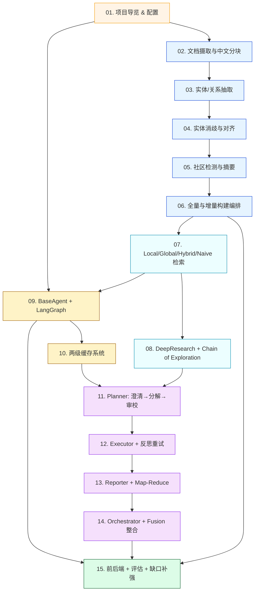

# Phase 2 · 学习路线规划（Learning Roadmap）

> 基于 Phase 1 侦察事实，按「GraphRAG 原理 ≡ LangGraph+多Agent 工程」双主线设计 **15 篇主线 + 第 16 篇缺口补强独立成篇 = 共 16 篇** MD。**不含 `training/grpo.ipynb`**（你已确认）。每篇都将围绕**真实代码路径与函数级 trace**展开，禁止臆测。

---

## 1. 总体学习顺序（设计哲学）

四个原则：
1. **从外到内，再从内到外**：先看入口（怎么跑起来），再钻核心（怎么实现），最后回到工程化（怎么部署/评估/扩展）。
2. **GraphRAG 与 Agent 双线并行，但「构建在前、检索在中、Agent 在后」**：因为没有图谱就没法做后面 6 篇。
3. **多 Agent 编排单独一段**：占整个学习量约 25%，与 GraphRAG 完整流水线并列。
4. **每篇都有 Hands-on**：能跑、能断点、能脏测。

学习路径分为五个 Part：

| Part | 内容 | 篇数 | 预估时长 |
|---|---|---|---|
| **Part 0** 入门导览 | 项目定位、技术栈、环境、配置体系 | 1 | 2 h |
| **Part 1** GraphRAG 图谱构建 | 摄取→抽取→消歧/对齐→社区→索引→增量 | 5 | 12 h |
| **Part 2** GraphRAG 检索 | Local/Global/Hybrid/Naive + DeepResearch + Chain of Exploration | 2 | 8 h |
| **Part 3** LangGraph & Agent 内核 | BaseAgent / 五种 Agent / 两级缓存 | 2 | 6 h |
| **Part 4** Plan-Execute-Report 多智能体 | Planner / Executor / Reporter / Orchestrator | 3 | 10 h |
| **Part 5** 工程化与评估 | 前后端 / 流式 / 评估 / 缺口补强 | 2 | 4 h |
| **合计** |  | **15** | **~42 h** |

---

## 2. 拆分方案（15 篇）

> 字数估算针对**正文**（不含代码块和 Mermaid），代码引用直接 `路径:行号`，每篇都强制有 Mermaid ≥ 1 张。

### Part 0：入门导览

#### 📄 01. 项目导览、技术栈与三层配置体系
- **覆盖文件**：`readme.md`, `CLAUDE.md`, `AGENTS.md`, `.env.example`, `requirements.txt`, `docker-compose.yaml`, `graphrag_agent/config/settings.py`, `graphrag_agent/models/get_models.py`, `assets/start.md`
- **核心问题**：项目能做什么 / 不能做什么；三层配置（`.env` → `settings.py` → `service config`）如何分工；如何在本地搭起环境
- **重点技术点**：Context Engineering（System Prompt 分层）
- **预计字数**：3500
- **Hands-on**：✅ Neo4j docker 启动、One-API 接入、跑 `models/get_models.py` 的 `__main__` 验证 LLM/embedding 连通
- **Mermaid**：项目整体架构图（含三层配置流向）

#### 📄 02. 文档摄取与中文分块流水线
- **覆盖文件**：`graphrag_agent/pipelines/ingestion/file_reader.py`, `text_chunker.py`, `document_processor.py`, `graphrag_agent/config/settings.py`（CHUNK_*参数）
- **核心问题**：8 种格式怎么解析；jieba 分词 + 句末检测的 Chunking 算法；`CHUNK_SIZE / OVERLAP / MAX_TEXT_LENGTH` 怎么调
- **重点技术点（A）**：Chunking 策略选型（Semantic vs Recursive Character vs Sentence-Window vs Parent-Document）
- **预计字数**：3500
- **Hands-on**：✅ 在 `files/` 放入一份 PDF + 一份脏数据（带特殊字符），用 `DocumentProcessor` 抓出来的 chunks 对比；调整 OVERLAP 观察重叠效果
- **Mermaid**：文件读取分发图 + 中文分块状态机

### Part 1：GraphRAG 图谱构建

#### 📄 03. LLM 实体/关系抽取与并发优化
- **覆盖文件**：`graphrag_agent/graph/extraction/entity_extractor.py`, `graph_writer.py`, `graph/core/`（retry、generate_hash）, `graphrag_agent/config/prompts/graph_prompts.py`, `config/settings.py`（entity_types/relationship_types/theme）
- **核心问题**：业务 schema 如何与 LLM Prompt 协同；本地 pickle 缓存 + `ThreadPoolExecutor` 并发架构；如何避免 LLM 抽取的格式漂移
- **重点技术点（A）**：Pre-Retrieval；（C）Function Calling vs 结构化输出（这里走的是 prompt + 分隔符的 fragile 路线）
- **预计字数**：4500
- **Hands-on**：✅ 修改 `settings.py` 的 `entity_types`，重跑抽取，观察 prompt 注入效果；故意把一段中文塞进英文 prompt，看抽取失败模式
- **Mermaid**：抽取流程 + 缓存命中/未命中时序图

#### 📄 04. 实体消歧（Disambiguation）与对齐（Alignment）
- **覆盖文件**：`graphrag_agent/graph/processing/entity_disambiguation.py`（字符串召回+向量重排+NIL检测）, `entity_alignment.py`（canonical_id 分组+冲突解决+合并）, `similar_entity.py`, `entity_quality.py`, `entity_merger.py`
- **核心问题**：mention → canonical 实体怎么映射；冲突解决三策略 `manual_first/auto_first/merge` 的取舍；为什么"优秀学生 vs 国家奖学金"会混（embedding 边界）
- **重点技术点（A）**：Rerank（这里是 vector_rerank 即 cosine，与 Cohere/BGE 的区别）；NIL/未登录词检测
- **预计字数**：5000
- **Hands-on**：✅ 在 Neo4j 中插入两个相似实体（`国家奖学金` / `国家励志奖学金`），跑消歧 → 对比 `DISAMBIG_STRING_THRESHOLD / DISAMBIG_VECTOR_THRESHOLD` 调整效果；引入一个完全陌生实体观察 NIL 触发
- **Mermaid**：消歧三段流程图 + 对齐冲突解决决策树

#### 📄 05. 社区检测与 LLM 摘要（GDS Leiden / SLLPA）
- **覆盖文件**：`graphrag_agent/community/detector/leiden.py` / `sllpa.py` / `base.py` / `projections.py`, `community/summary/leiden.py` / `sllpa.py`, `config/settings.py`（GDS_*参数）
- **核心问题**：Leiden 算法在 GDS 中的 Cypher 调用；按内存自适应的参数策略；社区摘要如何作为 Global Search 的"压缩上下文"
- **重点技术点（A）**：「Lost in the Middle」缓解（社区摘要是预压缩）；GraphRAG 关键差异化能力
- **预计字数**：4000
- **Hands-on**：✅ 在 Neo4j Bloom / Browser 中可视化检测前后的 `__Community__` 节点；切换 `GRAPH_COMMUNITY_ALGORITHM=sllpa` 对比社区数量变化
- **Mermaid**：社区检测时序图（GDS projection → algo → write back）

#### 📄 06. 全量构建与增量更新编排
- **覆盖文件**：`graphrag_agent/integrations/build/main.py`, `build_graph.py`, `build_index_and_community.py`, `build_chunk_index.py`, `incremental_update.py`, `incremental_graph_builder.py`, `incremental/`, `file_registry.json`, `graph/graph_consistency_validator.py`
- **核心问题**：三步构建为何必须严格顺序；`file_registry` 如何跟踪文件变化；冲突策略 `manual_first / auto_first / merge` 的现实场景
- **重点技术点（E）**：构建 pipeline 的可恢复性与一致性验证
- **预计字数**：3500
- **Hands-on**：✅ 跑一次 `--once`，删除 `files/` 里一个 PDF 再跑一次，对比 Neo4j 节点差异；故意构造冲突（同实体不同描述）触发 `manual_first` 流程
- **Mermaid**：构建 pipeline 总图 + 增量 daemon 状态机

### Part 2：GraphRAG 检索

#### 📄 07. 四种基础检索：Local / Global / Hybrid / Naive
- **覆盖文件**：`graphrag_agent/search/local_search.py`, `global_search.py`, `tool/local_search_tool.py`, `tool/global_search_tool.py`, `tool/hybrid_tool.py`, `tool/naive_search_tool.py`, `tool/base.py`, `tool_registry.py`, `search/retrieval_adapter.py`, `search/utils.py`, `config/settings.py`（SEARCH_/LOCAL_/GLOBAL_/HYBRID_/NAIVE_）
- **核心问题**：Local 用 Neo4jVector 检索 Entity + 一跳邻居 + 社区摘要；Global 用 Map-Reduce 对所有社区摘要并行打分；Hybrid 是 LightRAG 风格的双级；Naive 只走 chunk 向量；统一的 `RetrievalResult` 适配
- **重点技术点（A）**：Hybrid Search 的"项目实现 vs 业界 BM25+向量"对照；MMR vs Similarity 取舍
- **预计字数**：5000
- **Hands-on**：✅ 对同一个问题分别用 4 种 tool 调用，比对返回内容差异；调高 `LOCAL_SEARCH_TOP_ENTITIES / HYBRID_SEARCH_MAX_HOP` 观察召回扩张
- **Mermaid**：四种检索的对比矩阵 + Local Search 的 Cypher 检索图

#### 📄 08. DeepResearch / DeeperResearch：思考-搜索-推理 + Chain of Exploration
- **覆盖文件**：`graphrag_agent/search/tool/deep_research_tool.py`（1220 行）, `deeper_research_tool.py`（2134 行）, `chain_exploration_tool.py`, `hypothesis_tool.py`, `validation_tool.py`, `reasoning/thinking.py`, `reasoning/search.py`（DualPathSearcher/QueryGenerator）, `reasoning/chain_of_exploration.py`, `reasoning/community_enhance.py`, `reasoning/kg_builder.py`, `reasoning/evidence.py`, `reasoning/validator.py`, `reasoning/nlp.py`, `reasoning/prompts.py`, `config/prompts/reasoning_prompts.py`
- **核心问题**：多回合思考-搜索循环如何写；标准版 vs 增强版的差异（增强版多了社区感知、动态 KG、推理链分析、矛盾检测）；Chain of Exploration 的"在图上行走"如何实现；hypothesis_tool 与 HyDE 的关系
- **重点技术点（C）**：ReAct vs Plan-and-Execute vs Reflexion 的取舍；（A）HyDE / 假设生成
- **预计字数**：6000（按规则会拆成两小节)
- **Hands-on**：✅ 跑一次 `DeepResearchAgent.ask_with_thinking`，把 `show_thinking=True` 打印推理轨迹；用 `analyze_reasoning_chain` 看证据链；故意输入矛盾文档触发 `detect_contradictions`
- **Mermaid**：DeepResearch 多回合状态机 + Chain of Exploration 在图上跳跃的时序图

### Part 3：LangGraph & Agent 内核

#### 📄 09. BaseAgent + LangGraph StateGraph 与五种 Agent 对比
- **覆盖文件**：`graphrag_agent/agents/base.py`, `naive_rag_agent.py`, `graph_agent.py`, `hybrid_agent.py`, `deep_research_agent.py`, `fusion_agent.py`, `config/prompts/agent_prompts.py`, `config/settings.py`（AGENT_SETTINGS）
- **核心问题**：`StateGraph + ToolNode + tools_condition` 怎么组装；`_setup_graph` 的可重写点；条件边路由（`GraphAgent._grade_documents`）；`MemorySaver` 的使用边界
- **重点技术点（B）**：State / Cycles / Recursion / Conditional Edges / Tool 选择；（E）pseudo-stream vs token-stream 真相
- **预计字数**：5500
- **Hands-on**：✅ 在 `_agent_node` 打断点，看 `bind_tools` 后的 LLM 返回；调用 `self.graph.get_graph().draw_mermaid_png()` 导出真实 LangGraph 图；构造一个会触发死循环的工具 → 观察 recursion_limit 防护
- **Mermaid**：BaseAgent StateGraph 类图 + 五种 Agent 路由差异对比图

#### 📄 10. 两级智能缓存 + 向量相似匹配系统
- **覆盖文件**：`graphrag_agent/cache_manager/manager.py`, `model_cache.py`, `backends/`（memory/disk/hybrid/thread_safe）, `strategies/`（simple/context_aware/global_strategy）, `vector_similarity/`, `models/`（CacheItem）
- **核心问题**：为什么要做两级（session + global）？高质量缓存 fast-path 怎么判断？向量相似缓存的 FAISS 索引；缓存键策略的三种实现
- **重点技术点（E）**：成本与延迟（语义缓存=GPTCache 思路）；缓存失效与 quality 标记
- **预计字数**：4000
- **Hands-on**：✅ 连续问 3 个相似问题，观察 vector_hits 增长；调低 `CACHE_SIMILARITY_THRESHOLD` 看错配；用 `mark_answer_quality` 给一条负反馈，看下次还会不会命中
- **Mermaid**：缓存查询 5 段时序图（global → fast → standard → vector → miss）

### Part 4：Plan-Execute-Report 多智能体

#### 📄 11. Planner 三段式：澄清 → 任务分解 → 计划审校 → PlanSpec
- **覆盖文件**：`graphrag_agent/agents/multi_agent/planner/base_planner.py`, `clarifier.py`, `task_decomposer.py`, `plan_reviewer.py`, `core/plan_spec.py`（TaskGraph 拓扑 / `to_execution_signal`）, `core/state.py`（PlanContext）, `tools/json_parser.py`, `config/prompts/planner_prompts.py`
- **核心问题**：LLM-as-Planner 的 prompt 结构；任务依赖 DAG 的拓扑排序与循环检测；如何把 LLM 输出的"自由结构 JSON"硬转成 `PlanSpec`；澄清问答如何回写历史
- **重点技术点（C）**：Plan-and-Execute；（E）Output Parsing 错误处理（手写 `parse_json_text` 与 `OutputFixingParser` 的对比）
- **预计字数**：5000
- **Hands-on**：✅ 把 query 改成歧义问题，触发 Clarifier；手动构造一个有循环依赖的 TaskGraph，看 `validate_dependencies` 抛错；改 `MA_PLANNER_MAX_TASKS=3` 看任务分解上限效果
- **Mermaid**：Planner 三段流程 + PlanSpec 数据类图 + TaskGraph 拓扑排序示意

#### 📄 12. WorkerCoordinator + 三大 Executor + 反思重试 + 并发
- **覆盖文件**：`graphrag_agent/agents/multi_agent/executor/worker_coordinator.py`, `base_executor.py`, `retrieval_executor.py`, `research_executor.py`, `reflector.py`, `core/execution_record.py`, `core/retrieval_result.py`, `tools/evidence_tracker.py`, `config/prompts/executor_prompts.py`, `config/settings.py`（MA_WORKER_*, MA_REFLECTION_*）
- **核心问题**：根据 `task_type` 选 Executor 的注册机制；ThreadPoolExecutor 风格的并行调度 + 依赖检查；`ExecutionRecord` 中证据怎么写；反思失败 → 自动重试目标任务 → 再反思的循环
- **重点技术点（B）**：Parallelism / fan-out fan-in（这里是手写，不是 Send API）；（C）Reflexion / Self-Reflection；（E）Fallback / 多级降级
- **预计字数**：5500
- **Hands-on**：✅ 切 `MA_WORKER_EXECUTION_MODE=parallel`，跑一个 3 任务并行计划；强制让某个任务失败，观察 reflection 重试逻辑；打开 `state.execution_records` 看证据汇总
- **Mermaid**：WorkerCoordinator 调度状态机 + Reflection 重试循环时序图

#### 📄 13. Reporter：Outline + Map-Reduce + 一致性 + Reporter 级缓存
- **覆盖文件**：`graphrag_agent/agents/multi_agent/reporter/base_reporter.py`, `outline_builder.py`, `section_writer.py`, `consistency_checker.py`, `formatter.py`, `mapreduce/evidence_mapper.py`, `mapreduce/section_reducer.py`（tree/collapse/refine 三策略）, `mapreduce/report_assembler.py`, `config/prompts/reporter_prompts.py`, `config/settings.py`（MA_*_MAPREDUCE / MA_SECTION_*）
- **核心问题**：长文档报告什么时候触发 Map-Reduce（`MA_MAPREDUCE_THRESHOLD=20`）；三种 Reduce 策略的取舍；`evidence_fingerprint` + `report_id` 级缓存是怎么"分段复用"的；ConsistencyChecker 的二次验证
- **重点技术点（A）**：「Lost in the Middle」彻底解决方案；（E）报告级缓存优化；（B）Map-Reduce 模式实现
- **预计字数**：6000（必要时分两节）
- **Hands-on**：✅ 构造 25 条证据触发 Map-Reduce；切 `reduce_strategy=COLLAPSE` 看树形 vs 折叠的差异；改一个 section 的 evidence_id 列表，看缓存命中下降
- **Mermaid**：Reporter 整体流程 + Map-Reduce 树形折叠图

#### 📄 14. Orchestrator + LegacyFacade + FusionGraphRAGAgent 整合
- **覆盖文件**：`graphrag_agent/agents/multi_agent/orchestrator.py`, `integration/legacy_facade.py`, `integration/multi_agent_factory.py`, `agents/fusion_agent.py`（注意：绕过 LangGraph 的 `_GraphShim`）
- **核心问题**：Plan-Execute-Report 三段的指标与错误传播；Orchestrator 的状态机（completed/needs_clarification/failed/partial）；旧协调器 API 怎么兼容；FusionGraphRAGAgent 为什么不走 LangGraph
- **重点技术点（C）**：多 Agent 拓扑（Supervisor / Hierarchical）；（B）何时不该用 LangGraph
- **预计字数**：3500
- **Hands-on**：✅ 直接调用 `MultiAgentFacade.process_query` 看返回 payload 结构；构造 `assumptions` 列表传入，观察 Planner 走向；故意让 Planner 抛异常验证 Orchestrator 的 errors 链
- **Mermaid**：Orchestrator 主时序图（plan→execute→report 三段）+ 多智能体拓扑类图

### Part 5：工程化与评估

#### 📄 15. 服务端 + 前端 + 流式输出 + 评估系统
- **覆盖文件**：
  - **服务端**：`server/main.py`, `routers/chat.py`, `routers/source.py`, `routers/feedback.py`, `routers/knowledge_graph.py`, `services/agent_service.py`, `services/chat_service.py`, `services/kg_service.py`, `models/schemas.py`, `utils/performance.py`, `utils/concurrent.py`
  - **前端**：`frontend/app.py`, `components/chat.py`, `components/debug.py`, `components/sidebar.py`, `components/knowledge_graph/*`, `utils/api.py`, `utils/state.py`, `frontend_config/settings.py`
  - **评估**：`graphrag_agent/evaluation/test/evaluate_all_agents.py`, `evaluators/*`, `metrics/*`（answer/retrieval/graph/llm/deep_search 五大类）, `core/`, `preprocessing/`
- **核心问题**：① FastAPI 的 SSE 流式输出 ② AgentManager 的会话隔离 ③ Streamlit 调试面板的执行轨迹回显 ④ 评估的指标分类与共指标横向对比
- **重点技术点（E）**：可观测性 / 流式输出 / 测试 LLM-as-Judge
- **预计字数**：5000
- **Hands-on**：✅ 启动 FastAPI + Streamlit，开 debug 模式看执行轨迹；用 curl 调 `/chat/stream` 看 SSE 报文；跑一次 `evaluate_all_agents.py` 自带的 metrics，对比 Naive vs Fusion
- **Mermaid**：前后端整体调用链 + 评估系统类图

#### 📄 16. 生产化缺口补强建议（独立）
- **覆盖文件**（**这一篇大量基于"项目里没有"**，主要是给出落点）：`agents/base.py`、`search/tool/hybrid_tool.py`、`models/get_models.py`、`server/main.py`、`config/settings.py`
- **核心问题**：Phase 1 列出的 ❌ 缺失能力如何**最小入侵**地补强 —— BM25/Ensemble Retriever、Cohere/BGE Rerank、HyDE、`astream_events` 真流式、`with_fallbacks` 主备 LLM、`RateLimiter`、`OutputFixingParser`、LangSmith/Langfuse 全链路埋点、Prompt Injection 防御、Long-term Memory(PG/Redis)、Anthropic Prompt Cache 接入
- **重点技术点（E）**：可观测性 / Fallback / Output Parsing / 成本与延迟 / 安全 / Long-term Memory
- **预计字数**：5500
- **Hands-on**：✅ 三个最重要的 PR 级改造示例（带最小 diff）：(1) 在 `HybridSearchTool` 注入 BGE Reranker；(2) 在 `BaseAgent.ask_stream` 上接 `astream_events` 真流式 token；(3) 给 `get_llm_model` 加 `with_fallbacks` 主备模型
- **Mermaid**：缺口补强地图（用现有架构图标注每个 ❌ 点的最小改造位置）

---

## 3. 篇章依赖关系（Mermaid）

依赖说明：
- 实线箭头 = 「必须先读」
- 同 Part 内通常线性依赖
- 跨 Part 仅在概念前置时连一条最短路径（例如 09→15 让你读完 LangGraph 才看服务端的 streaming）

---

## 4. 学习里程碑

| 里程碑 | 完成条件 | 你应该能回答 |
|---|---|---|
| **M1：环境就绪** | 01 读完，能启动 Neo4j + One-API + LLM | "为什么 base_url 要走代理" |
| **M2：图谱跑通** | 06 读完，自己跑过一次 `build/main.py` 生成完整图谱 | "为什么 entity 索引必须在 chunk 索引之前" |
| **M3：检索掌握** | 08 读完，能解释 4 种检索 + DeepResearch | "Hybrid 与业界 BM25+Vector 的本质差异" |
| **M4：Agent 自如** | 10 读完，能用 LangGraph 自己改写一个 GraphAgent | "MemorySaver 为何不能用于生产" |
| **M5：多 Agent 通透** | 14 读完，能讲清 Plan-Execute-Report 全链路 | "为什么 Reporter 缓存要用 evidence_fingerprint" |
| **M6：工程化收尾** | 15 读完，知道这个项目的生产化缺口在哪 | "如果要加 BM25 + Reranker，最小入侵改动点在哪几个文件" |

---

## 5. 关键里程碑与本期 SLA

- **总耗时**：约 42 小时（按每天 2~3 小时计，**两周可完成**）
- **最关键的 3 篇**（如果时间极度有限，先读这三篇）：
  1. **📄 09**（BaseAgent + LangGraph）——所有 Agent 的基座
  2. **📄 07**（四种检索）——GraphRAG 落地的核心
  3. **📄 12**（Executor + 反思重试）——多 Agent 工程的精华

- **可选附录**（不在 15 篇内）：
  - `training/grpo.ipynb`（你已确认跳过）
  - DeepWiki / Zread 的辅助阅读（联网允许，我会在需要时引用其页面）

---

## 6. 输出顺序与节奏建议

**推荐节奏**：每写完 1 篇你确认 OK 后再开下一篇，避免一次性大批量难校对。可以按以下 3 批交付：

- **批次 A（基础）**：📄 01–06（图谱构建完整线）
- **批次 B（检索 + Agent）**：📄 07–10（GraphRAG 检索 + LangGraph 基础）
- **批次 C（多 Agent + 工程）**：📄 11–15（Plan-Execute-Report + 工程化）

或者你也可以让我一次性生成全部 15 篇（会比较长）。

---

## 7. 请确认或微调以下事项

1. **15 篇拆分** 是否接受？若要并 02/03、或拆 08 为两篇等，请直接告知。
2. **每篇字数 3000–6000** 我已按"内容密度匹配字数"分配，是否接受？
3. **交付批次**：A → B → C，还是 一次性 15 篇？
4. **Hands-on 风格**：是要求每篇都有"复现 + 脏数据测试"两种场景，还是允许某些纯讲解类（如 14 整合篇）只复现不脏测？
5. **「缺口补强」是否独立成篇**？目前并入 📄 15，如果你想单独成第 16 篇，可加。

确认后我即开始 Phase 3 逐篇产出。
