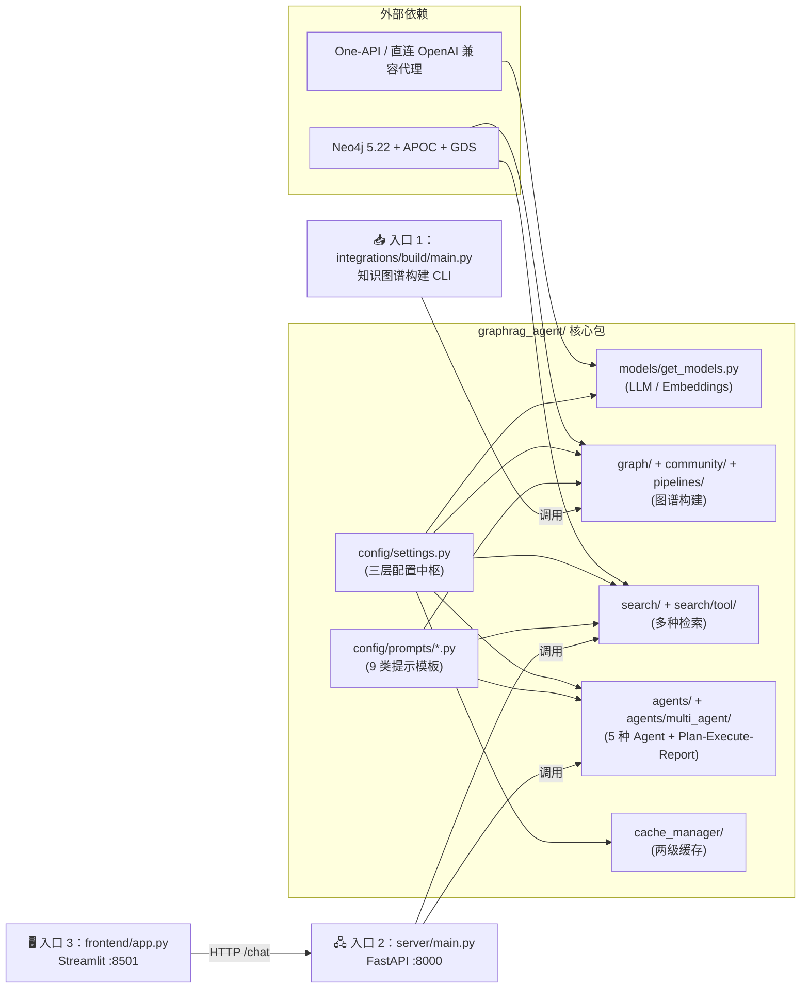
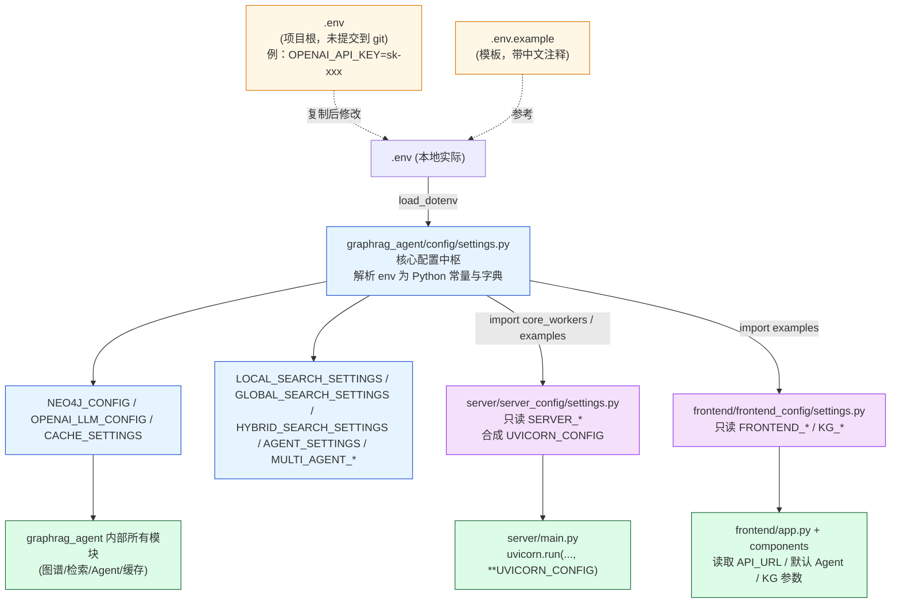

# 第 01 篇 · 项目导览、技术栈与三层配置体系

> 本系列共 16 篇，本文是**起点**：把项目最外层的「它能做什么」、「它由什么组成」、「它怎么读配置」三件事讲透，让你后续 15 篇都不会在「这个变量到底从哪里来」这种问题上卡壳。

---

## 1. 学习目标

读完本篇你应该能：

1. 用一句话讲清这个项目的定位、目标场景与目标用户。
2. 画出整体技术栈层次（语言 / 框架 / 模型 / 存储 / 服务）。
3. **看懂三层配置体系**：`.env` → `graphrag_agent/config/settings.py` → 各服务（`server_config/`、`frontend_config/`）的子配置；并能定位任意一个运行参数最终来自哪里。
4. 知道**三大入口**（图谱构建 / FastAPI 后端 / Streamlit 前端）启动顺序与依赖。
5. 识别出**配置陷阱**：项目自带的两处文档/默认值不一致（Python 版本、`CACHE_EMBEDDING_PROVIDER`），避免后续踩坑。

---

## 2. 前置知识

- 基本会用 Python 3.10+ 与 venv / conda。
- 知道 `dotenv` 是什么；理解环境变量优先级。
- 会用 docker compose 跑一个容器。
- 听过 LangChain / LangGraph / Neo4j / OpenAI 兼容协议（不必精通）。
- 若想跑通 Hands-on：需要一个能访问的 OpenAI 兼容代理（One-API / new-api / 直接 OpenAI 都可），可参考 `assets/start.md`。

---

## 3. 源码地图

本篇涉及的文件与关键对象：

| 文件 | 关键内容 | 行号锚点 |
|---|---|---|
| `readme.md` | 项目介绍、亮点、目录树 | `readme.md:1-200` |
| `CLAUDE.md` | 给 Claude Code 的项目说明，含构建命令、已知坑 | 项目根目录 |
| `AGENTS.md` | 仓库贡献规范（PEP 8、unittest、PR 模板） | `AGENTS.md:1-23` |
| `assets/start.md` | 必选 / 推荐 / 默认即可三档配置说明 | `assets/start.md:80-200` |
| `requirements.txt` | 运行时依赖 + 平台特定备注 | 全文件 |
| `pyproject.toml` | 仅声明 `name / version / requires-python`，无依赖 | `pyproject.toml:1-5` |
| `docker-compose.yaml` | 只跑 Neo4j（含 APOC + GDS 插件） | 全文件 |
| `.env.example` | 全部可调环境变量的中文注释清单 | 全文件 |
| `graphrag_agent/config/settings.py` | **核心配置中枢**，把 env 解析成 Python 常量与字典 | `config/settings.py:1-351` |
| `graphrag_agent/config/neo4jdb.py` | Neo4j 单例连接管理器 | `config/neo4jdb.py:8-129` |
| `graphrag_agent/models/get_models.py` | LLM / Embeddings / Streaming LLM 工厂 | `models/get_models.py:25-43` |
| `graphrag_agent/config/prompts/__init__.py` | 9 类提示模板的统一注册入口 | `config/prompts/__init__.py:1-161` |
| `server/server_config/settings.py` | 服务端读取 `SERVER_*` 配置 | `server/server_config/settings.py:1-46` |
| `frontend/frontend_config/settings.py` | 前端读取 `FRONTEND_*` / `KG_*` 配置 | `frontend/frontend_config/settings.py:1-73` |
| `graphrag_agent/integrations/build/main.py` | 知识图谱构建入口（CLI） | `integrations/build/main.py:55-61` |
| `server/main.py` | FastAPI 应用入口 | `server/main.py:1-33` |
| `frontend/app.py` | Streamlit 入口 | `frontend/app.py:1-47` |

---

## 4. 核心机制讲解

### 4.1 一句话定位

> **graph-rag-agent** = 用 LangGraph 把 GraphRAG（实体图 + 社区检测 + 多级检索）和 DeepSearch（多轮思考-搜索-推理）放进一个统一的 Agent 工程框架，并在最上层提供 Plan-Execute-Report 多智能体写长报告的能力；面向中文私域文档问答。

目标场景：私域知识库问答（默认主题「华东理工大学学生管理」，见 `config/settings.py:68-88`）。目标用户：① 学习 GraphRAG + Multi-Agent 的工程师，② 想用一个能跑的脚手架接入私域文档的研究者。

### 4.2 整体架构与三大入口



三大入口的启动顺序与依赖：

| 入口 | 文件 | 命令 | 必须先就绪的依赖 |
|---|---|---|---|
| **图谱构建** | `graphrag_agent/integrations/build/main.py:55-61` | `python graphrag_agent/integrations/build/main.py` | Neo4j、LLM、Embeddings、`files/` 目录有文档 |
| **FastAPI 后端** | `server/main.py:32-33` | `python server/main.py` 或 `uvicorn server.main:app` | Neo4j（已建好图谱）、LLM |
| **Streamlit 前端** | `frontend/app.py:45-47` | `streamlit run frontend/app.py` | FastAPI 后端已经在 `FRONTEND_API_URL` 上 |

注意：图谱**不构建也可以启动前后端**——只是 Agent 检索会返回空。日常学习推荐顺序：`docker compose up neo4j` → 配 `.env` → 跑 `build/main.py` → 起 server → 起 frontend。

### 4.3 技术栈分层

| 层 | 选型 | 文件证据 |
|---|---|---|
| 语言运行时 | Python（README 写 3.10，`pyproject.toml:5` 写 `>=3.11`，**两者不一致**，以 README 为准跑） | `pyproject.toml:1-5` |
| Agent 编排 | LangGraph 0.3.18 | `requirements.txt`、`graphrag_agent/agents/base.py:5-7` |
| LLM 客户端 | LangChain 0.3 + `ChatOpenAI` | `models/get_models.py:1-3` |
| 嵌入 | `OpenAIEmbeddings` + 可选 `sentence_transformers` 本地模型（仅用于缓存相似度） | `models/get_models.py:25-27`、`config/settings.py:172-182` |
| 图数据库 | Neo4j 5.22.0 + **APOC + GDS** 插件（社区检测必需） | `docker-compose.yaml` |
| 向量索引（主） | `Neo4jVector`（向量直接进 Neo4j，索引名 `vector`） | `config/settings.py:273`、`search/local_search.py:155-163` |
| 向量索引（缓存语义匹配） | `faiss-cpu` | `requirements.txt`、`cache_manager/vector_similarity/` |
| 监控 | LangSmith（**仅一处** `traceable` 装饰器） | `search/tool/local_search_tool.py:4`、`.env.example:188-199` |
| 后端 | FastAPI 0.115 + uvicorn 0.29 | `server/main.py:1-13` |
| 前端 | Streamlit 1.42 + pyvis（图谱可视化） | `frontend/app.py:1-9` |
| 中文 NLP | jieba 0.42 + hanlp 2.1 | `pipelines/ingestion/text_chunker.py:1-10` |
| 文档解析 | PyPDF2、python-docx、textract、lxml | `pipelines/ingestion/file_reader.py` |
| 终端美化 | rich 13.9 | 各 `build_*.py` |

**为什么选这些**：项目是「教学+研究」型，所以选了 **LangChain/LangGraph 这套主流栈** 让读者复用知识，存储选 **Neo4j + GDS** 是因为 GraphRAG 论文里的社区检测必须有 GDS（自己手写 Leiden 太费工），LLM 走 OpenAI 兼容协议是为了让所有非 OpenAI 模型（DeepSeek / Qwen / 国产代理）都能即插即用。

### 4.4 三层配置体系（本篇最重要的一节）

项目把所有可调参数收敛到三层，**层次清晰但容易看晕**。一图说清：



#### 第 1 层：`.env`

放在项目根目录，**不提交到 git**。`graphrag_agent/config/settings.py:8` 第一行就是 `load_dotenv()`，确保所有派生配置都能拿到环境变量。

`.env.example` 是模板，里面已经把每一项分了 12 个段（OpenAI、文本切分、Neo4j、缓存、搜索、Agent 调度、多智能体、Langsmith…），项目几百个旋钮全在里面。

#### 第 2 层：`graphrag_agent/config/settings.py`（核心中枢）

这个文件做三件事：

1. **环境变量 → Python 常量**：用 `_get_env_int / _get_env_float / _get_env_bool / _get_env_choice` 四个辅助函数把字符串解析成正确类型并校验（`settings.py:11-51`）。一旦类型错误立即抛 `ValueError` —— 比晚到运行时再崩溃友好得多。
2. **聚合成 config 字典**：把零散变量打包给下游用，比如：
   ```python
   # config/settings.py:208-214
   NEO4J_CONFIG = {
       "uri": NEO4J_URI,
       "username": NEO4J_USERNAME,
       "password": NEO4J_PASSWORD,
       "max_pool_size": NEO4J_MAX_POOL_SIZE,
       "refresh_schema": NEO4J_REFRESH_SCHEMA,
   }
   ```
   ```python
   # config/settings.py:293-306
   AGENT_SETTINGS = {
       "default_recursion_limit": _get_env_int("AGENT_RECURSION_LIMIT", 5) or 5,
       "chunk_size": _get_env_int("AGENT_CHUNK_SIZE", 4) or 4,
       "stream_flush_threshold": _get_env_int("AGENT_STREAM_FLUSH_THRESHOLD", 40) or 40,
       ...
   }
   ```
3. **固化业务 schema**：知识图谱主题、实体类型、关系类型这种**强业务**的东西不放 `.env`，直接写死在 `settings.py:63-88`：

   ```python
   # config/settings.py:68-88
   theme = "华东理工大学学生管理"
   entity_types = ["学生类型", "奖学金类型", "处分类型", "部门", "学生职责", "管理规定"]
   relationship_types = ["申请", "评选", "违纪", "资助", "申诉", "管理", "权利义务", "互斥"]
   ```

   **要换业务领域，改这里**——而不是 `.env`。这是项目的一个工程决策：「实体/关系类型 = 业务定义 = 应该和代码一起 review」。

#### 第 3 层：服务级子配置

`server/server_config/settings.py` 与 `frontend/frontend_config/settings.py` 只读它们自己关心的字段：

- 服务端 (`server/server_config/settings.py:29-46`)：监听地址、端口、reload、log_level、workers，打包成 `UVICORN_CONFIG`，供 `server/main.py:33` 一句 `uvicorn.run("main:app", **UVICORN_CONFIG)` 启动。
- 前端 (`frontend/frontend_config/settings.py:31-73`)：API_URL、默认 Agent、是否调试、图谱可视化的物理引擎参数。注意 `examples` 直接 `from graphrag_agent.config.settings import examples as eg` —— **前后端示例问题强制同源**，避免不一致。

这种"核心 settings 一份、服务级 settings 各读各的"的模式，比 LangChain 官方推荐的 `pydantic-settings BaseSettings` 简单粗暴，但**胜在你能用 grep 一眼看见所有变量从哪里来**。

### 4.5 模型工厂：`get_models.py` 的简洁哲学

```python
# graphrag_agent/models/get_models.py:25-32
def get_embeddings_model():
    config = {k: v for k, v in OPENAI_EMBEDDING_CONFIG.items() if v}
    return OpenAIEmbeddings(**config)


def get_llm_model():
    config = {k: v for k, v in OPENAI_LLM_CONFIG.items() if v is not None and v != ""}
    return ChatOpenAI(**config)
```

只有不到 10 行的核心代码却干了三件事：

1. **统一抽象成 OpenAI 协议**：任何模型只要兼容 OpenAI Chat Completions（如 DeepSeek、本地 vLLM、One-API 代理转发的国产模型），都能直接用。
2. **过滤空值**：避免 `model=None` 传进 SDK 触发奇怪报错。
3. **流式版本独立工厂** (`get_models.py:35-42`)：通过 `AsyncCallbackManager + AsyncIteratorCallbackHandler` 启用 streaming，但**注释里也直白告诉你「目前测试会报错」**——这暗示了项目的伪流式现状（详见第 09 篇 BaseAgent）。

### 4.6 Prompts：9 个分类、~2000 行模板

`config/prompts/__init__.py` 一次性导入并暴露 60+ 个模板常量，分 9 大类：

| 文件 | 行数 | 用途 |
|---|---|---|
| `graph_prompts.py` | 166 | 图谱构建（实体抽取、社区摘要、对齐） |
| `search_prompts.py` | 103 | 检索工具（Local/Global/Hybrid/Naive） |
| `agent_prompts.py` | 111 | 五种 Agent 的 prompt（含关键词提取、生成、Reduce） |
| `qa_prompts.py` | 175 | 问答阶段公共模板（`LC_SYSTEM_PROMPT` 等） |
| `reasoning_prompts.py` | 316 | DeepResearch 的多回合思考、假设生成、矛盾分析 |
| `planner_prompts.py` | 251 | 澄清 / 任务分解 / 计划审校 |
| `executor_prompts.py` | 238 | 任务执行 / 反思 / 重规划 |
| `reporter_prompts.py` | 421 | 纲要 / 写章节 / 一致性 / Map-Reduce |

集中管理的好处：**Prompt 等同于业务逻辑**——你能在不动代码的情况下，通过改模板调整 Agent 行为。在后续 11 / 12 / 13 篇里你会反复回到这些文件。

---

## 5. 重点技术点深挖

### 5.1 Context Engineering：系统提示词分层 (E)

这个项目的 Prompt 设计有一种**「分层注入」**的思路：

- 公共底层：`LC_SYSTEM_PROMPT` / `MAP_SYSTEM_PROMPT` / `REDUCE_SYSTEM_PROMPT`（qa_prompts.py），所有 Agent 共享。
- Agent 层：`GRAPH_AGENT_GENERATE_PROMPT` 等给具体 Agent 用。
- 子组件层：`CLARIFY_PROMPT` / `TASK_DECOMPOSE_PROMPT` / `OUTLINE_PROMPT` 给多智能体子组件。
- 检索层：`LOCAL_SEARCH_CONTEXT_PROMPT` / `HYBRID_TOOL_QUERY_PROMPT` 等给具体 tool。

注入时用 LangChain 的 `ChatPromptTemplate.from_messages([("system", ...), ("human", ...)])` 组合，参数通过 `.format()` 或链式 `prompt | llm` 注入。**没有显式的 prompt 压缩或动态优先级机制**，但通过 `MA_SECTION_MAX_CONTEXT_CHARS=800` 这种字段控制注入长度。

### 5.2 Service Layer 的"双重 dotenv 加载"

仔细看 `server/server_config/settings.py:7` 与 `frontend/frontend_config/settings.py:7`，**两个服务都自己又 `load_dotenv()` 了一次**。这是因为：

- 它们 import 了 `graphrag_agent.config.settings`（间接触发首次 load_dotenv）。
- 但**它们也 import 了自己 `os.getenv` 的字段**，所以为了在某些极端情况下（比如某模块改了 `os.environ`）保险，再 load 一次。

`load_dotenv` 默认**不覆盖已存在的环境变量**，所以重复调用是幂等的，没有副作用。但这点要记住：**如果你在 `.env` 外想用 `export` 临时覆盖，应该在 Python 进程外做**。

### 5.3 单例 Neo4j 连接管理器

```python
# graphrag_agent/config/neo4jdb.py:8-49
class DBConnectionManager:
    _instance = None
    def __new__(cls):
        if cls._instance is None:
            cls._instance = super().__new__(cls)
            cls._instance._initialized = False
        return cls._instance
    def __init__(self):
        if self._initialized:
            return
        ...
        self.driver = GraphDatabase.driver(self.neo4j_uri, ...)
        self.graph = Neo4jGraph(url=self.neo4j_uri, ...)
```

为什么用单例？Neo4j 官方驱动是线程安全的，但**频繁创建会导致连接耗尽**。项目把它做成进程级单例 + 内置 `session_pool` 复用 session，**所有模块共享同一个 `driver / graph`**。坏处：测试不容易隔离（要清掉单例）。

---

## 6. Hands-on：搭起来跑一遍最小回路

> **目标**：30 分钟内，从零到能调通 `models/get_models.py` 的 `__main__` 自测，并把 `config/settings.py` 的所有派生字典打印出来。**这一步不需要图谱**。

### 6.1 启动 Neo4j

```bash
cd graph-rag-agent/
docker compose up -d neo4j
# 等 10 秒
curl http://localhost:7474   # 看到 Neo4j Browser HTML 就 OK
```

打开 [http://localhost:7474](http://localhost:7474)，用 `neo4j / 12345678` 登录确认。`docker-compose.yaml` 已经预装 APOC + GDS。

### 6.2 写最小 `.env`

```bash
cp .env.example .env
```

只改这 5 行就够本篇 hands-on（其它默认即可）：

```env
OPENAI_API_KEY=sk-xxx                       # 用真实 key
OPENAI_BASE_URL=https://api.openai.com/v1   # 或 One-API 代理
OPENAI_EMBEDDINGS_MODEL=text-embedding-3-large
OPENAI_LLM_MODEL=gpt-4o-mini                # mini 节省学习成本
NEO4J_URI=neo4j://localhost:7687
NEO4J_USERNAME=neo4j
NEO4J_PASSWORD=12345678
```

### 6.3 装依赖

```bash
conda create -n graphrag python=3.10 -y
conda activate graphrag
pip install -r requirements.txt
pip install -e .   # 让 `graphrag_agent` 可以被 import
```

### 6.4 跑 `get_models.py` 自测

```bash
python graphrag_agent/models/get_models.py
```

`models/get_models.py:67-83` 的 `__main__` 段会：① 调用一次 LLM 问「你好」；② 取一次 embedding；③ 计算 token 数。如果第一步报 401，是 key 错；第二步报模型不存在，是 embedding 模型名字错；第三步报 cl100k_base 找不到，是 `TIKTOKEN_CACHE_DIR` 不可写——三种情况都很常见。

### 6.5 打印**派生配置**，确认链路

新建一个 `tmp_inspect_config.py`：

```python
from graphrag_agent.config import settings
import json
print(json.dumps({
    "NEO4J_CONFIG": settings.NEO4J_CONFIG,
    "OPENAI_LLM_CONFIG": settings.OPENAI_LLM_CONFIG,
    "AGENT_SETTINGS": settings.AGENT_SETTINGS,
    "CACHE_SETTINGS": {k: str(v) for k, v in settings.CACHE_SETTINGS.items()},
    "MULTI_AGENT_WORKER_EXECUTION_MODE": settings.MULTI_AGENT_WORKER_EXECUTION_MODE,
    "theme": settings.theme,
    "entity_types": settings.entity_types,
}, ensure_ascii=False, indent=2))
```

跑一下：你会看到自己改的 `.env` 数值已经渗透到所有派生字段。**这就是「能 grep 出来一切」哲学的胜利**。

### 6.6 Debug 提示

- **断点位置**：`config/settings.py:8 load_dotenv()` 之后立刻打断点，用 `print(os.environ.get("OPENAI_API_KEY"))` 确认环境是否注入。
- **常见错误现象**：
  - `ValueError: 环境变量 X 需要整数值，但当前为 ...`：你在 `.env` 里写了带空格的整数（如 `MAX_WORKERS = 4 `）—— `load_dotenv` 会保留尾部空格，`_get_env_int` 会报错。**修：值不要加空格**。
  - `tiktoken` 报 SSL 错：把 `OPENAI_BASE_URL` 改成走代理时，tiktoken 依然要回连 OpenAI 拿编码表，**最简方案**：先在能联网的机器把 `cl100k_base.tiktoken` 下载放进 `cache/tiktoken/`。
  - 启动前后端时报 `Module 'server' has no attribute 'routers'`：`server/main.py` 用的是**项目目录相对 import**（`from routers import api_router`），必须 `cd server && python main.py` 或 `uvicorn server.main:app --reload` 在项目根目录运行。

---

## 7. 思考题（连接生产环境）

1. **配置 vs 业务边界**：`entity_types / relationship_types` 写在 `settings.py` 而非 `.env`。如果你在生产里要支持多租户，每个租户有自己的 schema，应该如何重构？（提示：考虑 schema-per-tenant 的注入路径，对实体抽取 prompt 的影响）
2. **二级缓存目录策略**：当前 `CACHE_DIR=./cache` 是单目录。如果一台机器跑多个 GraphRAG 实例（不同业务），怎么避免缓存互相串？最小入侵的改法是什么？（提示：看 `cache_manager/manager.py:46-50` 接收 `cache_dir` 的方式）
3. **配置变更要不要重启**：项目所有配置在 `load_dotenv` 时一次读完。生产里如果想热更新 `MA_WORKER_MAX_CONCURRENCY` 而不重启服务，**最小代价的方案是什么**？（提示：可考虑给 `settings.py` 加一层 `lru_cache` 包裹的 getter，或换 pydantic-settings）

---

## 8. 延伸阅读

- LangChain 官方推荐的配置管理：[pydantic-settings BaseSettings](https://docs.pydantic.dev/latest/concepts/pydantic_settings/) —— 项目没用，但理解后你能看出 `settings.py` 现在的轻量级方案的取舍。
- OpenAI 兼容协议生态（One-API）：[songquanpeng/one-api](https://github.com/songquanpeng/one-api)
- Neo4j GDS 官方文档：[Graph Data Science](https://neo4j.com/docs/graph-data-science/current/) —— 后面第 05 篇社区检测会大量引用。
- GraphRAG 原始论文（微软）：[arXiv:2404.16130](https://arxiv.org/abs/2404.16130) —— 项目的图谱构建 + 社区摘要 + Local/Global Search 三块都来自此论文。
- DeepWiki 项目页（作者公开整理）：[deepwiki.com/1517005260/graph-rag-agent](https://deepwiki.com/1517005260/graph-rag-agent)

---

> ✅ 本篇结束。下一篇（**📄 02. 文档摄取与中文分块流水线**）会进入 GraphRAG 主线第一站：`pipelines/ingestion/` 的多格式解析 + jieba 句末检测的中文 Chunking 算法。
>
> 任何环节卡住，建议先回到本篇的「6.5 打印派生配置」确认配置链路。
