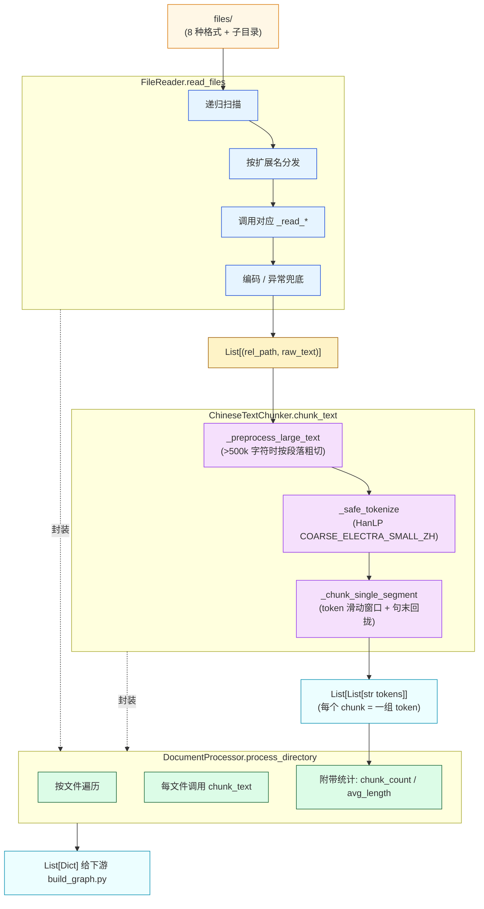
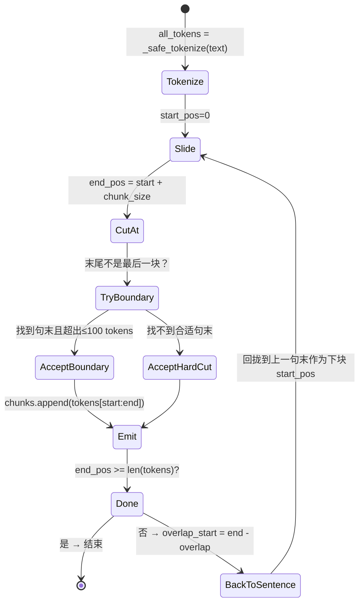

# 第 02 篇 · 文档摄取与中文分块流水线

> 本系列共 16 篇，本文是 **Part 1（GraphRAG 图谱构建）的第 1 站**：把 `pipelines/ingestion/` 这三个文件——`file_reader.py`（8 格式解析）、`text_chunker.py`（中文 token-级 chunking）、`document_processor.py`（整合层）——拆到能改、能调、能脏测。

---

## 1. 学习目标

读完本篇你应该能：

1. 讲清 8 种文件格式各自的解析路径与异常兜底策略，知道**为什么 `.doc` 要三级 fallback**。
2. 看懂中文分块算法的**两阶段流水线**：粗预切（按段落/句子）→ HanLP 分词 → 滑动窗口 + 句子边界回拢。
3. 知道项目里的 `chunk_size` 是 **token 数而非字符数**，理解 `chunk_size > overlap` 这个硬约束的含义。
4. 能在不动代码的前提下，通过 `.env` 调出适合 PDF 报告类 / 法律条文类 / 对话日志类 三种文本的分块策略。
5. 对照业界 4 种主流 Chunking 策略（Recursive Character / Semantic / Sentence-Window / Parent-Document），讲清本项目走的是哪一种、有什么取舍。

---

## 2. 前置知识

- 已读 **第 01 篇**：理解 `config/settings.py` 是配置中枢，`CHUNK_SIZE / CHUNK_OVERLAP / MAX_TEXT_LENGTH` 这几个常量从哪里来。
- 会用 `jieba` 或类似分词器做过中文 NLP，知道"分词后的 token 数与字符数不是一回事"。
- 听过 LangChain 的 `RecursiveCharacterTextSplitter` / LlamaIndex 的 `SentenceSplitter`（不会也无妨，本篇会对比）。

---

## 3. 源码地图

| 文件 | 关键类 / 函数 | 行号锚点 |
|---|---|---|
| `graphrag_agent/pipelines/ingestion/file_reader.py` | `FileReader.read_files / _read_pdf / _read_doc / _read_txt …` | `file_reader.py:14-431` |
| `graphrag_agent/pipelines/ingestion/text_chunker.py` | `ChineseTextChunker.chunk_text` 主入口、`_preprocess_large_text`、`_chunk_single_segment`、`_find_next_sentence_end` | `text_chunker.py:7-308` |
| `graphrag_agent/pipelines/ingestion/document_processor.py` | `DocumentProcessor.process_directory / get_file_stats` | `document_processor.py:9-189` |
| `graphrag_agent/config/settings.py` | `CHUNK_SIZE=500 / OVERLAP=100 / MAX_TEXT_LENGTH=500000 / FILES_DIR` | `config/settings.py:58-100` |
| `graphrag_agent/pipelines/ingestion/readme.md` | 作者视角的模块说明 | 全文件 |

下游使用方（本篇暂不展开，但读者要心里有数）：
- `graphrag_agent/integrations/build/build_graph.py:98` 在构建时实例化 `DocumentProcessor`，把 chunks 喂给实体抽取器。
- `graphrag_agent/integrations/build/incremental_update.py:19` 用 `DocumentProcessor` 检测增量文件。

---

## 4. 核心机制讲解

### 4.1 全景：从 `files/` 目录到 `List[Tuple[filename, content, chunks]]`



三层各司其职：

- **`FileReader`**：把任意格式压成字符串。它对外契约只有 `List[Tuple[str, str]]`（相对路径 + 文本）。
- **`ChineseTextChunker`**：把字符串切成 token 列表的列表。它对中文有强假设（HanLP），对外契约是 `List[List[str]]`。
- **`DocumentProcessor`**：把两者粘起来，并加上统计信息（`chunk_count`、`average_chunk_length`、`chunk_error`），是构建期与增量期共用的"读卡机"。

### 4.2 `FileReader`：8 格式 + 多重兜底

`FileReader.read_files` (`file_reader.py:36-79`) 的核心是一张分发表：

```python
# file_reader.py:47-57
supported_extensions = {
    '.txt':  self._read_txt,
    '.pdf':  self._read_pdf,
    '.md':   self._read_markdown,
    '.docx': self._read_docx,
    '.doc':  self._read_doc,
    '.csv':  self._read_csv,
    '.json': self._read_json,
    '.yaml': self._read_yaml,
    '.yml':  self._read_yaml,
}
```

值得展开的三类格式：

#### TXT / CSV 的「UTF-8 → chardet → GBK 兜底」三段式

```python
# file_reader.py:164-188（节选）
def _read_txt(self, file_path):
    try:
        with codecs.open(file_path, 'r', encoding='utf-8', errors='replace') as f:
            return f.read()
    except Exception:
        # 二次尝试：chardet 探测，失败兜底 gbk
        with open(file_path, 'rb') as f:
            raw_data = f.read(10240)
            try:
                import chardet
                result = chardet.detect(raw_data)
                encoding = result['encoding'] if result['encoding'] else 'gbk'
            except Exception:
                encoding = 'gbk'
        ...
```

**为什么 UTF-8 用 `errors='replace'` 但 GBK 不预先试**？因为中文项目 99% 是 UTF-8，先按主流编码读 + 容错策略足够。只有当 UTF-8 解码完全炸掉（`UnicodeDecodeError` 透到上层）才走 chardet，**两次 I/O 比每次都先 chardet 快得多**。

#### PDF 的「页粒度容错」

```python
# file_reader.py:190-207（节选）
for page_num in range(len(pdf_reader.pages)):
    try:
        page_text = page.extract_text() or ""
        text += page_text + "\n\n"
    except Exception as e:
        text += f"[第 {page_num+1} 页无法读取]\n\n"
```

**单页失败不杀整个 PDF**——这点对扫描件混排的中文 PDF（项目默认的《2023学生手册.pdf》就是这类）特别重要。**代价**：PyPDF2 不做 OCR，纯图片页会变成空字符串占位；表格也会被拍扁成乱序文本。**项目没有表格 / 图片识别能力**（Phase 1 已经标 ❌ 多模态 RAG）。

#### .doc 的「三级 fallback」

```python
# file_reader.py:231-295（节选）
def _read_doc(self, file_path):
    # 方法1: win32com (仅 Windows，最可靠)
    try:
        import win32com.client
        word = win32com.client.Dispatch("Word.Application")
        ...
    except ImportError:
        # 不是 Windows，跳过
    except Exception:
        # win32com 出错，继续
    
    # 方法2: textract (跨平台，依赖 antiword)
    try:
        import textract
        content = textract.process(file_path).decode('utf-8')
        if content and content.strip():
            return content
    except Exception:
        pass
    
    # 方法3: python-docx (兼容性差，部分场景可读)
    try:
        from docx import Document
        ...
    except Exception:
        pass
    
    return f"[警告: 无法读取.doc文件 {os.path.basename(file_path)}...]"
```

这种工程模式的潜台词是：「**.doc 是历史遗留格式，没有完美方案**」。Linux 用户必须 `apt-get install antiword`（`requirements.txt` 注释里有写），否则只能盼 python-docx 偶然能读。**生产建议**：在数据摄取前用 LibreOffice 批量转 .docx。

### 4.3 `ChineseTextChunker`：两阶段中文分块

这个 308 行的类有两个**容易被忽视的关键事实**：

- **`chunk_size = 500` 单位是 token，不是字符**。HanLP COARSE_ELECTRA_SMALL_ZH 是粗粒度分词，一个中文 token 大约对应 1.2 个汉字，所以 500 tokens ≈ 600 个汉字。
- **构造时即加载 HanLP 模型**（`text_chunker.py:25`），首次运行会下载 ~100MB 模型并缓存到 `~/.hanlp/`，**不要在构造时不必要的实例化**——后面会展示。

#### 4.3.1 第一阶段：粗预切（`_preprocess_large_text`）

为什么需要粗预切？因为 HanLP 对超长文本的分词速度是非线性下降的——超过 `MAX_TEXT_LENGTH=500000` 字符就**强制按段落切到 5 万 / 10 万这种段长**，再分别送进分词器。

```python
# text_chunker.py:43-102（核心逻辑）
def _preprocess_large_text(self, text):
    if len(text) <= self.max_text_length:
        return [text]                          # 短文本直接放行
    
    target_segment_size = min(self.max_text_length, max(10000, self.max_text_length // 2))
    
    paragraphs = text.split('\n\n')
    if len(paragraphs) < 5:                    # 段落太少，降级用 \n
        paragraphs = text.split('\n')
    
    # 贪心拼接段落，不超 target_segment_size
    ...
    
    # 如果单段就超 target_segment_size，调 _split_long_paragraph 按句号再切
```

预切器的优先级：`\n\n` > `\n` > `[。！？.!?]`（句末） > **固定长度暴切**（最差情况）。这是一个**「软回退」结构**——尽量保留语义边界，不行就退一档。

#### 4.3.2 第二阶段：token 级滑动窗口 + 句末回拢（`_chunk_single_segment`）

这是真正的"分块"，关键逻辑 30 行讲清：

```python
# text_chunker.py:211-266（节选 + 注释）
def _chunk_single_segment(self, text):
    all_tokens = self._safe_tokenize(text)     # HanLP 整段分词
    
    chunks = []
    start_pos = 0
    while start_pos < len(all_tokens):
        end_pos = min(start_pos + self.chunk_size, len(all_tokens))
        
        # 关键 1：尝试在句末（。！？）结束，允许超出 100 tokens
        if end_pos < len(all_tokens):
            sentence_end = self._find_next_sentence_end(all_tokens, end_pos)
            if sentence_end <= start_pos + self.chunk_size + 100:
                end_pos = sentence_end
        
        chunks.append(all_tokens[start_pos:end_pos])
        
        if end_pos >= len(all_tokens):
            break
        
        # 关键 2：下一块起点 = end_pos - overlap，再回拢到上一个句末
        overlap_start = max(start_pos, end_pos - self.overlap)
        next_sentence_start = self._find_previous_sentence_end(all_tokens, overlap_start)
        if next_sentence_start > start_pos and next_sentence_start < end_pos:
            start_pos = next_sentence_start
        else:
            start_pos = overlap_start
```

状态机表达如下：



**两个"宽限"设计**：

1. **`+100 tokens` 容差**（`text_chunker.py:240`）：允许 chunk 略微超出 chunk_size，让 chunk 在自然句末断开，避免硬切到句中。**含义**：实际 chunk 大小是 `[chunk_size, chunk_size+100]` 的浮动区间。
2. **回拢到 overlap 区间内的最近句末**（`text_chunker.py:254-258`）：保证下一块从**完整句子**开始，而不是从半句话开头。**含义**：实际重叠也是浮动的，可能比 `overlap` 多或少。

这两个设计让分块**对下游 LLM 友好**——抽取 prompt 拿到的从来都是完整句子，不会出现 "...同学因为旷课" 这样切成两半的尾巴。但代价是 chunk 大小不再严格，下游做 token 预算时要预留缓冲。

### 4.4 `DocumentProcessor`：薄薄一层组合

`DocumentProcessor.process_directory` (`document_processor.py:27-78`) 没什么复杂逻辑，就是把 `FileReader` 和 `ChineseTextChunker` 串起来，加一些统计字段：

```python
file_result = {
    "filepath": filepath,
    "filename": os.path.basename(filepath),
    "extension": file_ext,
    "content": content,
    "content_length": len(content),
    "chunks": chunks,
    "chunk_count": len(chunks),
    "chunk_lengths": [len(''.join(chunk)) for chunk in chunks],     # 每块的字符数
    "average_chunk_length": sum(chunk_lengths) / len(chunk_lengths),
}
```

**注意 `chunk_lengths` 算的是字符数**（`''.join(chunk)` 把 token list 拼回字符串再算长度）——这是把 token 单位的 chunk 转换给上层（如评估系统、前端）展示用的。下游消费 chunks 时，`chunks` 仍然是 `List[List[str]]` 形式。

---

## 5. 重点技术点深挖

### 5.1 Chunking 策略选型（A 类技术点）

| 策略 | 业界代表 | 本项目状态 | 适用场景 | 缺点 |
|---|---|---|---|---|
| **Fixed-Size** | 朴素按字符切 | ❌ 未使用 | 简单 demo | 切到句中导致语义破坏 |
| **Recursive Character** | LangChain `RecursiveCharacterTextSplitter` | 🟡 类似思路（按 `\n\n / \n / 句号` 递归回退） | 多数 RAG 场景 | 不理解语义，可能切散主题 |
| **Sentence-based** | 句号切分 + 滑动窗口 | ✅ **本项目的主算法**（token 级 + 句末回拢） | 中文长文、报告类 | 依赖标点准确性 |
| **Semantic** | LlamaIndex `SemanticSplitter`（基于 embedding 相似度切） | ❌ 未实现 | 主题切换密集的文档 | 慢 + 需要 embedding 调用 |
| **Sentence-Window** | LlamaIndex `SentenceWindowNodeParser` | ❌ 未实现 | 需要细粒度引用 | 单点检索后要展窗，索引大 |
| **Parent-Document** | LangChain `ParentDocumentRetriever` | ❌ 未实现 | 小块召回，大块生成 | 需要双索引 |

**本项目为什么选 Sentence-based + 滑动窗口 + 句末回拢**？

- 项目目标是**中文私域文档**（学生手册、管理规定）——这类文本**段落和句号结构强**，按句末分块极其符合自然语义。
- 不需要 Semantic Splitter 的 embedding 调用——**省钱**且**确定性强**（相同输入永远相同输出，利于增量更新和缓存）。
- 没用 Parent-Document 是因为**项目把"小块召回 + 大块上下文"的功能放到了 Local Search 的「相邻 chunk + 关系 + 社区摘要」组合里**（详见第 07 篇）——架构选择不同。

### 5.2 中文分词器的取舍：jieba vs HanLP

项目这里用的是 `hanlp.load(hanlp.pretrained.tok.COARSE_ELECTRA_SMALL_ZH)`（`text_chunker.py:25`）——**粗粒度 ELECTRA 模型**。对比：

- **jieba**：基于词典 + HMM，速度极快（~1M tokens/s），但**对未登录词、专业术语不友好**，比如"国家奖学金"可能被切成"国家/奖学金"——这是 GraphRAG 实体抽取阶段最不想看到的。
- **HanLP COARSE_ELECTRA_SMALL_ZH**：神经网络模型，慢（~50k tokens/s）但粗粒度切分**更倾向保留实体级长词**，对应"国家奖学金"通常保留为单 token。

**代价**：HanLP 模型 ~100MB，首次加载 5–10 秒。`ChineseTextChunker.__init__:25` 是同步加载，**第一次构造对象会卡一会**。如果你做单测频繁实例化，会很痛。**可优化点**：把 tokenizer 提到模块级单例。

### 5.3 项目里 `chunk_size` / `overlap` 的实际值

```python
# config/settings.py:98-100
CHUNK_SIZE       = _get_env_int("CHUNK_SIZE",     500) or 500
OVERLAP          = _get_env_int("CHUNK_OVERLAP",  100) or 100
MAX_TEXT_LENGTH  = _get_env_int("MAX_TEXT_LENGTH", 500000) or 500000
```

- `chunk_size=500`（token） ≈ 600 个汉字 ≈ 一段中等长度。
- `overlap=100`（token） ≈ 20% 重叠。这是个**经验值**——重叠太低会丢上下文，太高浪费 LLM token 预算。
- `chunk_size > overlap` 是硬约束（`text_chunker.py:19-20`），否则会进入死循环。

**调参建议**：

| 文档类型 | 建议 CHUNK_SIZE | 建议 OVERLAP | 原因 |
|---|---|---|---|
| 法律 / 制度类（句子长、条款独立） | 400-500 | 80-100 | 单条款语义自包含 |
| 故事 / 对话（句子短、上下文依赖强） | 200-300 | 80-120 | 提高重叠保留对话流 |
| 学术 / 报告（段落长、术语密集） | 600-800 | 150-200 | 容纳完整论证 |

---

## 6. Hands-on：脏数据 + 调参实验

**实验目标**：① 验证 8 格式解析；② 观察分块大小浮动；③ 调整 OVERLAP 对召回的影响。

> 跑这一节需要安装 `python -m pip install hanlp`，首次 `ChineseTextChunker()` 会下载模型，请耐心。

### 6.1 放入测试文件

在 `files/` 下新建一个测试目录，放 4 个文件：

```bash
mkdir -p files/test_chunking
cp files/2023学生手册.pdf files/test_chunking/         # PDF
cat > files/test_chunking/clean.txt <<'EOF'
华东理工大学学生申请国家奖学金需要满足以下条件。第一，本科生平均学分绩点不低于3.5。第二，所在年级综合排名前10%。第三，无任何违纪记录。本年度获得国家奖学金的学生将由学校在公示后报教育部备案。
EOF

# 故意构造一段超长无标点的脏数据
python -c "print('这是一段没有任何标点符号的中文文本' * 200)" > files/test_chunking/dirty_nopunc.txt

# 故意构造一段编码错乱
printf '\xc4\xe3\xba\xc3\xb5\xc4\xb6\xab\xb1\xb1\xb4\xf3\xd1\xa7' > files/test_chunking/dirty_gbk.txt
```

### 6.2 跑 `DocumentProcessor` 直接看分块

```python
# tmp_chunk_inspect.py
from graphrag_agent.pipelines.ingestion.document_processor import DocumentProcessor

proc = DocumentProcessor("./files/test_chunking")
results = proc.process_directory(recursive=True)

for r in results:
    print(f"\n=== {r['filepath']} ===")
    print(f"内容长度: {r['content_length']} 字符")
    if r.get("chunks"):
        print(f"分块数: {r['chunk_count']}")
        print(f"chunk_lengths: {r['chunk_lengths']}")
        print(f"平均块长: {r['average_chunk_length']:.0f}")
        if r['chunks']:
            print("第一个 chunk 的前 5 个 token:", r['chunks'][0][:5])
            print("第一个 chunk 的最后 5 个 token:", r['chunks'][0][-5:])
    else:
        print(f"分块失败: {r.get('chunk_error')}")
```

**预期观察**：

- `clean.txt`：chunk 数 = 1，因为文本不到 500 token。
- `dirty_nopunc.txt`：chunk 数较多，且每块末尾 token 不是 `。` —— `_find_next_sentence_end` 返回 `len(tokens)`，触发**硬切**（注意末尾 token 不会是标点）。
- `dirty_gbk.txt`：可能进入 `_read_txt` 的二次 chardet 兜底，最终读出乱码。GraphRAG 抽取阶段会得到一些"乱码实体"——验证了**FileReader 的容错只是"不崩溃"，不保证"内容正确"**。
- `2023学生手册.pdf`：观察 chunk_lengths 的分布是否落在 `[600, 720]` 区间（500 tokens + 0~100 容差，换成字符约 +20%）。

### 6.3 调参实验：把 `OVERLAP` 调到 0 看断裂

新建 `tmp_chunk_overlap.py`，**绕过环境变量直接传参**：

```python
from graphrag_agent.pipelines.ingestion.file_reader import FileReader
from graphrag_agent.pipelines.ingestion.text_chunker import ChineseTextChunker

text = open("files/test_chunking/clean.txt").read() * 30   # 拼成长文本

for overlap in [0, 50, 150]:
    chunker = ChineseTextChunker(chunk_size=200, overlap=overlap)
    chunks = chunker.chunk_text(text)
    print(f"\noverlap={overlap}: {len(chunks)} chunks")
    if len(chunks) >= 2:
        tail = ''.join(chunks[0][-5:])
        head = ''.join(chunks[1][:5])
        print(f"  chunk[0] 末尾 5 token: '{tail}'")
        print(f"  chunk[1] 开头 5 token: '{head}'")
        # overlap=0 时 head 通常和 tail 没关系；overlap=150 时 head 应该是 tail 之前的内容
```

**预期观察**：

- `overlap=0` 时相邻 chunk 的末/首句几乎无重叠；
- `overlap=150` 时 chunk[1] 开头会"回到" chunk[0] 中段的某句开头——这就是**「句末回拢」机制**的可见痕迹。

### 6.4 Debug 提示

- **断点位置 1**：`text_chunker.py:240`，看 `sentence_end - end_pos` 实际落差；如果 > 100 你会发现 `end_pos` 没有移到句末，触发硬切——这种情况在"长段落无标点"时频繁发生。
- **断点位置 2**：`text_chunker.py:254`，看 `next_sentence_start` 与 `overlap_start` 谁更接近 `start_pos`——能感性理解为什么 chunk 大小是浮动的。
- **错误现象**：`OSError: [E050] Can't find model 'hanlp'`，是 HanLP 模型未下载。手动 `python -c "import hanlp; hanlp.load(hanlp.pretrained.tok.COARSE_ELECTRA_SMALL_ZH)"` 强制下载。
- **错误现象**：`ValueError: chunk_size必须大于overlap`——你在 `.env` 里把 `CHUNK_OVERLAP` 设大了。

---

## 7. 思考题

1. **生产中 OCR 怎么办**：当前 `_read_pdf` 用 PyPDF2，扫描件 PDF 会读出空字符串。**最小入侵**地加上 OCR fallback 应该在哪一层？是 `FileReader._read_pdf` 内部还是 `DocumentProcessor` 之上？（提示：考虑配置开关与"提取 vs OCR" 的判定逻辑）
2. **chunk 大小的下游成本**：把 `CHUNK_SIZE` 从 500 调到 1500，会影响哪几条主流程？至少列出实体抽取、向量索引、Local Search、Reporter Map-Reduce 这 4 条链路的具体变化。
3. **多语种支持**：项目假设全是中文。如果要加入英文文档，`HanLP COARSE_ELECTRA_SMALL_ZH` 在英文上会怎样表现？最小改造方案是什么？（提示：考虑语种检测 + 分词器分发，或者直接换通用 Sentence Splitter）

---

## 8. 延伸阅读

- LangChain Chunking 实践综述：[How to split text by tokens](https://python.langchain.com/docs/how_to/split_by_token/)
- LlamaIndex Semantic Splitter 设计：[SemanticSplitterNodeParser](https://docs.llamaindex.ai/en/stable/api_reference/node_parsers/semantic_splitter/)
- HanLP COARSE_ELECTRA 的模型 card：[hankcs/electra-small-discriminator-chinese](https://github.com/hankcs/HanLP/blob/master/plugins/hanlp_demo/hanlp_demo/zh/tok_stl.py)
- 关于「Lost in the Middle」与 chunking 大小的研究：[Liu et al., 2023, arXiv:2307.03172](https://arxiv.org/abs/2307.03172) —— 提供了为什么 chunk 不能太大的实验依据。
- PyPDF2 与中文 PDF 的常见坑：[python-pdf-reading-best-practices](https://pypdf.readthedocs.io/en/latest/user/extract-text.html)

---

> ✅ 本篇结束。下一篇（**📄 03. LLM 实体/关系抽取与并发优化**）会把切好的 chunk 喂进 LLM，看 prompt 工程 + 本地缓存 + `ThreadPoolExecutor` 是怎么把抽取从「单线程跑两小时」做到「四线程跑半小时」的。
>
> 调参口诀：**法律条文紧一点（400/80），故事对话松一点（300/100），学术报告宽一点（800/200）**。
