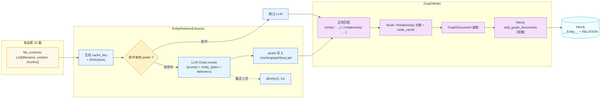

# 第 03 篇 · LLM 实体/关系抽取与并发优化

> 本系列共 16 篇，本文是 **Part 1（GraphRAG 图谱构建）的第 2 站**：把 `graph/extraction/` 拆透——`EntityRelationExtractor`（提示工程 + 本地缓存 + 三种并发模式）与 `GraphWriter`（正则解析 + 批量写 Neo4j）。这是整条 GraphRAG 流水线**最 LLM-密集、最容易踩坑**的一环。

---

## 1. 学习目标

读完本篇你应该能：

1. 看懂这套**「prompt + 自定义分隔符」**的抽取协议：为什么不用 JSON / function calling，而手写 `tuple_delimiter / record_delimiter` —— 取舍是什么。
2. 讲清三种并发模式（`process_chunks` per-chunk 并行 / `process_chunks_batch` 动态批 / `stream_process_large_files` 流式）的差异与适用场景。
3. 理解项目用 **`SHA1(text) → pickle`** 做的本地结果缓存：为什么是 chunk 级，为什么改 prompt 不会自动失效。
4. 识别**4 个生产级坑**：few-shot 示例与 entity_types 语种不一致 / chat_history 装饰品 / 批处理结果数错位 / 重试三次后吞掉错误。
5. 能在 `settings.py:68-88` 把 `entity_types / relationship_types / theme` 改成自己业务的 schema 并跑通。

---

## 2. 前置知识

- 已读 **第 02 篇**：知道 chunk 是 `List[List[str]]`（token list），`''.join(chunk)` 后才是 LLM 输入文本。
- 熟悉 LangChain 的 `ChatPromptTemplate / MessagesPlaceholder` 与 LCEL 链式语法 `prompt | llm`。
- 知道 `concurrent.futures.ThreadPoolExecutor` 的基本用法。
- 看过 GraphRAG 论文里"先抽实体、再抽关系、再生成描述"的三步法（不熟也无妨，本篇会用项目实现重新讲）。

---

## 3. 源码地图

| 文件 | 关键类 / 函数 | 行号锚点 |
|---|---|---|
| `graphrag_agent/graph/extraction/entity_extractor.py` | `EntityRelationExtractor` | `entity_extractor.py:16-473` |
|  | `_process_single_chunk`（核心 LLM 调用，带重试装饰器） | `entity_extractor.py:334-369` |
|  | `process_chunks`（并发模式 1：per-chunk） | `entity_extractor.py:145-218` |
|  | `process_chunks_batch`（并发模式 2：批） | `entity_extractor.py:220-318` |
|  | `stream_process_large_files`（并发模式 3：流式） | `entity_extractor.py:371-473` |
| `graphrag_agent/graph/extraction/graph_writer.py` | `GraphWriter.convert_to_graph_document`（正则解析） | `graph_writer.py:36-131` |
|  | `_batch_write_graph_documents` | `graph_writer.py:205-243` |
| `graphrag_agent/config/prompts/graph_prompts.py` | `system_template_build_graph` + 2 个 few-shot 示例 | `graph_prompts.py:7-85` |
|  | `human_template_build_graph` | `graph_prompts.py:87-95` |
| `graphrag_agent/graph/core/utils.py` | `retry / generate_hash` 装饰器 | `graph/core/utils.py:77-101, 24-34` |
| `graphrag_agent/config/settings.py` | `entity_types / relationship_types / theme` 业务 schema | `config/settings.py:63-94` |

调用方（下游）：`graphrag_agent/integrations/build/build_graph.py:102-110` 在 `_initialize_components` 中实例化 `EntityRelationExtractor`，然后在 `build_base_graph` 里调用 `process_chunks_batch` 主路径。

---

## 4. 核心机制讲解

### 4.1 整体：chunks → LLM → 文本 → 正则 → Neo4j



整条链路的关键是「文本 → 文本」的耦合：**Prompt 让 LLM 用特定分隔符产出文本，下游正则按相同分隔符还原**。一旦两边不一致，抽取就会大面积静默失败——这是本模块最需要警惕的脆弱点。

### 4.2 Prompt 协议：分隔符约定

抽取 prompt 长 84 行（`graph_prompts.py:7-85`），结构上分四段：

1. **目标说明**（`-目标-`）：识别给定类型的实体及其关系。
2. **步骤说明**（`-步骤-`）：列出实体抽取的字段、关系抽取的字段、统一用「中文输出」。
3. **格式约定**：用三个分隔符变量定义输出结构——

   ```python
   # entity_extractor.py:42-46
   self.tuple_delimiter = " : "       # 字段间
   self.record_delimiter = "\n"        # 记录间
   self.completion_delimiter = "\n\n"  # 整段结束
   ```

   输出 LLM 必须严格遵守，如：
   ```
   ("entity" : "国家奖学金" : "奖学金类型" : "国家级奖学金，每年评选一次")
   ("relationship" : "学生" : "国家奖学金" : "申请" : "符合条件的学生可申请国家奖学金" : 8)
   ```
4. **2 段 few-shot 示例**：来自 GraphRAG 论文，**英文小说场景**（Alex/Taylor 协作冒险 + 外星语言破译），用 `person / technology / mission / organization` 这些通用 entity 类型作 demo。

**为什么不用 JSON / function calling**？三个原因：

- **跨模型兼容**：项目要支持 DeepSeek、Qwen 等多家国产模型，它们的 JSON mode 实现良莠不齐。**纯文本 + 分隔符**对任何聊天模型都能用。
- **抗截断**：JSON 一旦在 `max_tokens` 边界被截断就是整段无效；而文本格式只损失最后一条记录。
- **few-shot 演示成本低**：把示例直接放 system prompt 里，不需要构造 `FewShotPromptTemplate`。

**代价**：

- 解析全靠正则，**任何 LLM 偶发性脱离格式（如把 `:` 换成 `：`，多打一个空格）都会丢实体**。
- 没有 Pydantic / `with_structured_output` 那种自动校验。
- 错误信息只能从结果数量推断（"应该 5 条，只解析出 3 条"）。

### 4.3 LLM 链的构造：一个被遗弃的 `chat_history`

```python
# entity_extractor.py:48-59
self.chat_prompt = ChatPromptTemplate.from_messages([
    system_message_prompt,
    MessagesPlaceholder("chat_history"),
    human_message_prompt
])
self.chain = self.chat_prompt | self.llm
```

注意 `MessagesPlaceholder("chat_history")` —— 看起来是预留多轮对话的位置。但翻遍整个仓库，`self.chat_history` 在 `__init__:41` 初始化为空 list 之后**就再也没被赋值过**（grep `chat_history` 仅在 prompt invoke 时传入空 list）。

这是典型的**「装饰品代码」**：作者保留了未来扩展点，但当前并没用到。**不要被它误导**——抽取每次都是无状态调用。

### 4.4 三种并发模式对比

| 模式 | 入口函数 | 调度单元 | 缓存粒度 | 容错策略 | 适用场景 |
|---|---|---|---|---|---|
| **per-chunk 并行** | `process_chunks` | 单 chunk | 单 chunk pkl | `@retry(3, 1s)` + 内层 3 次手动重试 | 中小文档集（默认主路径备选） |
| **动态批** | `process_chunks_batch` | `dynamic_batch_size` 个 chunk 拼成一次 LLM 调用 | 单 chunk pkl | 解析失败 → 退回 per-chunk | **生产主路径**（`build_graph.py` 默认调） |
| **流式** | `stream_process_large_files` | 单 chunk + 写入 Neo4j 实时 | 单 chunk pkl | 同 per-chunk | 单个超大文件（避免一次性载入） |

#### 模式 1：per-chunk 并行（`process_chunks`）

简单粗暴：每个 chunk 一次 LLM 调用，`ThreadPoolExecutor(max_workers=4)` 跑。

```python
# entity_extractor.py:171-176（节选）
with concurrent.futures.ThreadPoolExecutor(max_workers=self.max_workers) as executor:
    future_to_chunk = {
        executor.submit(self._process_single_chunk, ''.join(chunks[idx])): idx
        for idx in non_cached_indices
    }
```

亮点：**先用 `cached_results` 字典预过滤一遍**（`entity_extractor.py:165-167`），只对未命中的 chunks 创建任务。命中率高时几乎不打 LLM。

#### 模式 2：动态批（`process_chunks_batch`）—— 生产主路径

这是 `build_graph.py` 实际调用的版本。两个关键设计：

**(a) 按平均 chunk 长度算 batch 大小**：

```python
# entity_extractor.py:236-240
chunk_lengths = [len(''.join(chunk)) for chunk in chunks]
avg_chunk_size = sum(chunk_lengths) / len(chunk_lengths) if chunk_lengths else 0
dynamic_batch_size = max(1, min(self.batch_size, int(10000 / (avg_chunk_size + 1))))
```

**含义**：单次 LLM 输入控制在约 1 万字符以内。如果 chunk 平均 600 字符，一批就是 ~16 个 chunk；如果 chunk 平均 2000 字符，一批只有 5 个。**这其实是一种「自适应 token budget」**——比业界常见的固定 batch 智能。

**(b) 用 `\n----------...\n` 分隔多个 chunk，一次性塞给 LLM**：

```python
# entity_extractor.py:264
batch_text = f"\n{'-'*50}\n".join(batch_inputs)
```

LLM 必须用相同分隔符输出多组结果，解析时按分隔符切回：

```python
# entity_extractor.py:320-332
def _parse_batch_response(self, batch_content):
    parts = batch_content.split(f"\n{'-'*50}\n")
    return [part.strip() for part in parts]
```

**最大风险**：LLM 偶尔忘记复制分隔符 → `len(batch_results) != len(batch_chunks)` → 触发**退回单 chunk 模式**：

```python
# entity_extractor.py:281-293（节选）
if len(batch_results) != len(batch_chunks):
    batch_results = []
    for idx, chunk in enumerate(batch_chunks):
        cached_result = cached_batch_results[idx]
        if cached_result is not None:
            batch_results.append(cached_result)
        else:
            individual_result = self._process_single_chunk(''.join(chunk))
            batch_results.append(individual_result)
```

这种"批失败 → 退回单"的双层路径，是项目对 LLM 不稳定的一种保险——**但意味着批模式的实际 LLM 调用次数可能远高于理论值**，监控时要注意。

#### 模式 3：流式（`stream_process_large_files`）

单个超大文件，避免一次性把所有 chunks 载入内存。逐 chunk 抽取 → 立即写 Neo4j：

```python
# entity_extractor.py:413-471（精简后逻辑）
for chunk in text_chunks_iterator(file_path, chunk_size):
    chunks.append(chunk)
chunks_with_hash = structure_builder.create_relation_between_chunks(file_name, chunks)
with ThreadPoolExecutor(...) as executor:
    for chunk_data in chunks_with_hash:
        if cached:
            graph_writer.graph.add_graph_documents([graph_doc], baseEntityLabel=True, include_source=True)
        else:
            future = executor.submit(self._process_single_chunk, chunk_text)
        ...
```

这条路径在常规构建里**没被默认调用**，需要手动从 `build_graph.py` 之外起。

### 4.5 缓存：SHA1 + pickle，原始但有效

```python
# entity_extractor.py:101-117（节选）
def _save_to_cache(self, cache_key: str, result: str):
    cache_path = self._cache_path(cache_key)
    with open(cache_path, 'wb') as f:
        pickle.dump(result, f)

# graph/core/utils.py:24-34
def generate_hash(text: str) -> str:
    return hashlib.sha1(text.encode()).hexdigest()
```

每个 chunk 的 LLM 响应都会落地到 `./cache/graph/{sha1}.pkl`。

**关键性质**：

- **缓存键只依赖 chunk 文本**，不依赖 entity_types / prompt 模板。
  - **后果**：你改了 `settings.py:70` 的 `entity_types`，**老缓存依旧会被命中**，导致新 schema 无法生效。需要手动 `rm -rf cache/graph/` 才能重建。
- 每个文件就是一个 pickle，**没有索引文件**。命中检查 = `os.path.exists`。命中率统计在 `cache_hits / cache_misses`。
- pickle 反序列化的是字符串，**不是结构化数据**——这意味着解析阶段每次都要重跑正则。

**为什么不存 JSON 或 sqlite**？项目作者明显倾向「最小依赖」：pickle 是 stdlib，文件名直接是哈希，删除整目录就能重置。对学习项目很合适，对长期生产建议换成 `diskcache` 或 sqlite。

### 4.6 `GraphWriter`：正则解析与节点缓存

```python
# graph_writer.py:46-47
node_pattern = re.compile(r'\("entity" : "(.+?)" : "(.+?)" : "(.+?)"\)')
relationship_pattern = re.compile(r'\("relationship" : "(.+?)" : "(.+?)" : "(.+?)" : "(.+?)" : (.+?)\)')
```

这两个正则严格对应 prompt 里 `tuple_delimiter=" : "` 的输出格式。**任何 LLM 偏差**：

- 把 `:` 换成 `：`（中文冒号）→ 全丢
- 把 `"entity"` 写成 `'entity'` → 全丢
- 漏掉某个字段 → 该条丢

`GraphWriter` 还有一层 **`node_cache` 进程内缓存**（`graph_writer.py:32-33`），避免反复 `MERGE` 同一实体节点。

写库走 `langchain_neo4j` 的 `add_graph_documents`：

```python
# graph_writer.py:441-445（节选）
graph_writer.graph.add_graph_documents(
    [graph_document],
    baseEntityLabel=True,    # 所有 entity 节点都打上 __Entity__ 通用标签
    include_source=True       # 把 chunk 作为 source 节点关联起来
)
```

`baseEntityLabel=True` 在 Neo4j 里给每个实体节点都加 `__Entity__` 标签。**这一点是后续 Local Search 能跨类型搜索的基础**——所有实体都能被 `MATCH (e:__Entity__)` 命中。

---

## 5. 重点技术点深挖

### 5.1 Function Calling vs 结构化输出 vs 自定义分隔符（C 类技术点）

| 方案 | 可靠性 | 跨模型 | 解析成本 | 项目用了吗？ |
|---|---|---|---|---|
| **OpenAI Function Calling** | 高 | 仅 OpenAI / Anthropic / 兼容 | 极低（SDK 自动 parse） | ❌ |
| **JSON Mode** | 中（仍可能偏差） | 多数主流模型 | 低（`json.loads`） | ❌ |
| **LangChain `with_structured_output` + Pydantic** | 高（带校验） | 取决于底层模型 | 低 | ❌ |
| **`PydanticOutputParser` + `OutputFixingParser`** | 中 | 跨模型 | 中 | ❌ |
| **自定义分隔符 + 正则**（本项目） | 低 | 任何模型 | 低 | ✅ |

项目选了**最朴素的方案**。代价是抽取质量受 LLM 偶发输出格式影响。**升级建议**（不在本篇 hands-on，但放第 16 篇的「缺口补强」）：

```python
# 概念示例（非项目代码）：把 _process_single_chunk 升级为结构化输出
from pydantic import BaseModel
from typing import List

class Entity(BaseModel):
    name: str
    type: str
    description: str

class Relation(BaseModel):
    source: str
    target: str
    rel_type: str
    description: str
    strength: int

class ExtractedTuples(BaseModel):
    entities: List[Entity]
    relations: List[Relation]

structured_llm = self.llm.with_structured_output(ExtractedTuples)
result = structured_llm.invoke(prompt_text)   # 直接拿到 ExtractedTuples 对象，无需正则
```

### 5.2 业务 schema 注入：`{entity_types}` 的两面性

```python
# entity_extractor.py:42-46 + invoke
response = self.chain.invoke({
    "entity_types": self.entity_types,           # 来自 settings.py:70
    "relationship_types": self.relationship_types,
    "tuple_delimiter": ...,
    ...
})
```

`entity_types = ["学生类型", "奖学金类型", "处分类型", "部门", "学生职责", "管理规定"]`（`settings.py:70-77`）会被填进 prompt 的 `{entity_types}` 占位符。

**陷阱**：prompt 的 few-shot 示例里用的是英文 `person / technology / mission`（`graph_prompts.py:32-83`），与中文项目的实际类型**强烈不一致**。LLM 可能受 few-shot 影响倾向于输出英文类型——你打开 `cache/graph/` 里随便几个 pickle 看，偶尔能看到 `person` 类型混进去。

**修复建议**：把 `graph_prompts.py:30-84` 的 few-shot 例子换成中文学生管理场景的示例，能显著提升类型规范性。本篇 Hands-on 会让你亲眼验证。

### 5.3 重试装饰器与吞错

```python
# graph/core/utils.py:77-101
def retry(times: int = 3, exceptions: tuple = (Exception,), delay: float = 1.0):
    def decorator(func):
        def wrapper(*args, **kwargs):
            attempt = 0
            while attempt < times:
                try:
                    return func(*args, **kwargs)
                except exceptions as e:
                    attempt += 1
                    if attempt >= times:
                        raise
                    print(f"... 重试 ({attempt}/{times})")
                    time.sleep(delay)
        return wrapper
    return decorator
```

`_process_single_chunk` 装了 `@retry(3, 1s)`，配合 `process_chunks` 里的**第二层手动重试**（`entity_extractor.py:192-206`），实际是「外 3 × 内 3 = 9 次」重试。

**这设计有问题**：

- 出错原因可能是 prompt 太长、API 速率限制、网络 reset；**所有错误都被 catch-all `(Exception,)` 接住**，无差异化处理。
- 9 次重试之后还是失败的话，把 `cached_results[key] = ""` 当作"已处理"（`entity_extractor.py:205-206`），**静默丢数据**。

**生产建议**：拆分错误类型，速率限制走指数退避，格式错误走 `OutputFixingParser`，网络错误才走重试。

### 5.4 batch 模式的隐藏成本

模式 2 的"批失败退单"机制：

```
理论 LLM 调用次数 = chunks / dynamic_batch_size
实际 LLM 调用次数（最坏）= chunks / dynamic_batch_size + chunks  ← 退回单 chunk
```

当 LLM 经常输出格式漂移时，**批模式实际可能比 per-chunk 模式还慢**。这种行为很难从外部察觉，**强烈建议监控时打印 `_parse_batch_response` 的 parts 数与期望数的差异**。

---

## 6. Hands-on：改 schema、看缓存、触发回退

> 此 Hands-on 需要可用的 LLM API（如 OpenAI 或 One-API）。建议用 `gpt-4o-mini` / `deepseek-chat` 控制成本。**约消耗 50–100 次 LLM 调用**。

### 6.1 准备数据（只跑第 02 篇的 test 目录）

```bash
# 沿用第 02 篇的测试目录
ls files/test_chunking/
# clean.txt  dirty_nopunc.txt  dirty_gbk.txt
```

### 6.2 单步跑一次抽取，看缓存生成

新建 `tmp_extract_inspect.py`：

```python
from graphrag_agent.models.get_models import get_llm_model
from graphrag_agent.config.prompts import (
    system_template_build_graph,
    human_template_build_graph,
)
from graphrag_agent.config.settings import entity_types, relationship_types
from graphrag_agent.graph.extraction.entity_extractor import EntityRelationExtractor

llm = get_llm_model()
extractor = EntityRelationExtractor(
    llm=llm,
    system_template=system_template_build_graph,
    human_template=human_template_build_graph,
    entity_types=entity_types,
    relationship_types=relationship_types,
    cache_dir="./cache/graph_test",
    max_workers=2,
    batch_size=3,
)

text = open("files/test_chunking/clean.txt").read()
result = extractor._process_single_chunk(text)
print(result)
print("---")
print("cache hits/misses:", extractor.cache_hits, "/", extractor.cache_misses)
```

第一次跑会调 LLM，`misses=1`。重跑同一段 → `hits=1, misses=0`，且 `./cache/graph_test/` 下有一个 `*.pkl`。

### 6.3 故意改 entity_types，验证缓存"无感旁路"

```python
# 在同一脚本里再加一段
extractor_v2 = EntityRelationExtractor(
    llm=llm,
    system_template=system_template_build_graph,
    human_template=human_template_build_graph,
    entity_types=["人物", "事件", "地点"],          # ← 完全不同的 schema！
    relationship_types=["参与", "发生于"],
    cache_dir="./cache/graph_test",                  # ← 还是同一个目录
)
result_v2 = extractor_v2._process_single_chunk(text)
print("v2 result:", result_v2)
print("v2 hits/misses:", extractor_v2.cache_hits, "/", extractor_v2.cache_misses)
```

**预期观察**：v2 仍然命中缓存（`hits=1, misses=0`），返回的还是 v1 时代用旧 schema 抽取的结果。**这就证明了缓存键不带 schema 的副作用** —— 改 schema 后必须手动清缓存：

```bash
rm -rf ./cache/graph_test/
```

### 6.4 看正则解析的实际匹配

```python
import re
node_pattern = re.compile(r'\("entity" : "(.+?)" : "(.+?)" : "(.+?)"\)')
relationship_pattern = re.compile(r'\("relationship" : "(.+?)" : "(.+?)" : "(.+?)" : "(.+?)" : (.+?)\)')

print("nodes:", node_pattern.findall(result))
print("rels:", relationship_pattern.findall(result))
```

**预期观察**：能拿到结构化 tuple。**故意把 result 里的 `:` 替换成 `：`** 再跑，会发现 `findall` 返回空——亲身体验"分隔符敏感"的脆弱性。

### 6.5 触发 batch 退回 per-chunk

把 `process_chunks_batch` 在 batch 内强制让 LLM 输出错位（最简单：把第 264 行的分隔符在 prompt 里改成 LLM 易忽略的形式，比如改成单空格），然后跑一次完整文件，观察日志里出现 `批处理结果数量不匹配 ... 将单独处理每个chunk` 字样。

### 6.6 Debug 提示

- **断点位置 1**：`entity_extractor.py:354 self.chain.invoke(...)` 之前，打印 `input_text` 长度和前 200 字符——若文本过长（>4000 字符），考虑 chunk_size 是否太大。
- **断点位置 2**：`entity_extractor.py:282 if len(batch_results) != len(batch_chunks)`，看实际 LLM 返回 vs 期望——退回单 chunk 的频率是 batch 模式健康度的关键指标。
- **断点位置 3**：`graph_writer.py:51 node_pattern.findall(result)`，若拿到 0 个 node，逐字符对比 result 与正则期望——99% 是分隔符不一致。
- **常见错误**：`KeyError: 'entity_types'`——说明 prompt 模板里有占位符没被填，检查 invoke 字典是否覆盖了所有 `{...}`。
- **常见错误**：日志大量出现 `重试 (3/3)` —— 一般是 API 速率限制，调小 `MAX_WORKERS` 或加重试间隔。

---

## 7. 思考题

1. **结构化输出迁移**：把 `_process_single_chunk` 迁到 `with_structured_output(...)` + Pydantic 模型，性能（延迟、调用次数）会有什么变化？最大改造点是什么？（提示：考虑下游 `convert_to_graph_document` 的正则就不再需要了，但 `add_graph_documents` 的输入仍需 GraphDocument）
2. **多语种 / 跨业务 schema 缓存键**：当前缓存键只是 SHA1(text)，如果想让"同一段文本在不同 schema 下都缓存"，缓存键应该改成什么？（提示：`SHA1(text + entity_types_serialized + prompt_version)`）
3. **批失败的可观测性**：现在 batch 模式偶尔静默退回单 chunk。如果要在生产里加指标埋点，**最少需要新增哪 3 个 metric**？（提示：考虑 batch_failure_rate / avg_chunks_per_llm_call / fallback_latency_ratio）

---

## 8. 延伸阅读

- **GraphRAG 原始论文**：[arXiv:2404.16130](https://arxiv.org/abs/2404.16130) —— 项目的抽取 prompt 直接来自论文附录，对照阅读能看到取舍。
- LangChain 结构化输出最佳实践：[How to return structured data from a model](https://python.langchain.com/docs/how_to/structured_output/)
- LangChain `OutputFixingParser` / `RetryWithErrorOutputParser`：[Output parsers](https://python.langchain.com/docs/concepts/output_parsers/)
- 知识抽取领域：[REBEL: Relation Extraction By End-to-end Language generation](https://aclanthology.org/2021.findings-emnlp.204/) —— 一种端到端的关系抽取经典模型，对比 LLM-based 方法的取舍。
- 实战 prompt 优化：[OpenAI Cookbook · Knowledge graph extraction](https://cookbook.openai.com/examples/entity_extraction_for_long_documents)

---

> ✅ 本篇结束。下一篇（**📄 04. 实体消歧（Disambiguation）与对齐（Alignment）**）会处理抽取后的脏数据：同一实体多种名称、不同实体名字相近、跨 chunk 实体如何对齐到 canonical_id —— 项目里业界少见的开源实现。
>
> 调参口诀：**改 schema 必清缓存；batch 模式必看回退率；LLM 不稳定时正则永远是最后一道防线**。
