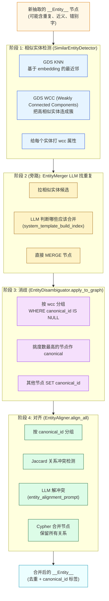
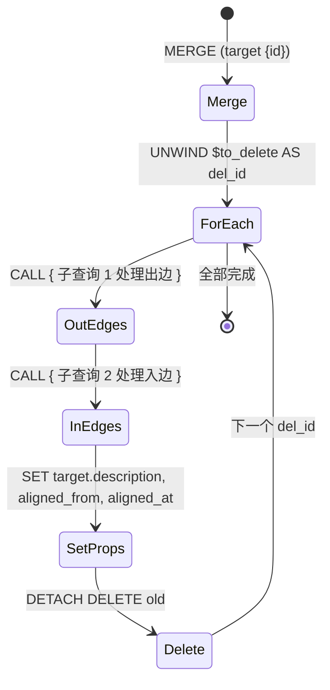

# 第 04 篇 · 实体消歧（Disambiguation）与对齐（Alignment）

> 本系列共 16 篇，本文是 **Part 1（GraphRAG 图谱构建）的第 3 站**：处理抽取后的"实体脏数据"——同一概念多种写法、不同概念名字相近、跨 chunk 实体如何挂到统一 canonical_id。这是项目里**业界少见的开源实现**，也是 GraphRAG 论文里语焉不详但落地必需的一环。

---

## 1. 学习目标

读完本篇你应该能：

1. 区分两个最容易混淆的概念：**消歧（Disambiguation）= 给实体打 canonical_id 标签** vs **对齐（Alignment）= 真正合并并保留所有关系**。
2. 看懂 `EntityDisambiguator` 的两个不同接口：经典 mention 消歧（外部输入）与 `apply_to_graph` 图内分组（生产主路径），知道**为什么主路径不调 LLM 也不算向量相似度**。
3. 讲清字符串召回 + 向量重排 + NIL 检测的三段式管道，以及 `combined_score = 0.4 * string + 0.6 * vector` 这个魔法权重的取舍。
4. 读懂 `merge_entities` 这个项目里**最复杂的 Cypher**（CALL 子查询 + APOC + 关系去重 + 双向边处理 + 属性合并 + DETACH DELETE）。
5. 解释为什么"国家奖学金 vs 优秀学生"这种**embedding 近似 + 语义截然不同**的情况会让消歧失败（readme 点名的缺陷）。

---

## 2. 前置知识

- 已读 **第 03 篇**：知道抽取阶段产出的是 `__Entity__` 节点，节点有 `id / description / embedding` 三个核心属性。
- 熟悉 Neo4j Cypher 基本语法（`MATCH / WHERE / WITH / UNWIND / MERGE / DETACH DELETE`）。
- 听过 Neo4j APOC（`apoc.text.levenshteinSimilarity`、`apoc.create.relationship`）和 GDS（`gds.wcc`、`gds.knn`）。
- 了解 Jaccard 相似度的定义：`|A ∩ B| / |A ∪ B|`。

---

## 3. 源码地图

| 文件 | 关键类 / 函数 | 行号锚点 |
|---|---|---|
| `graphrag_agent/graph/processing/entity_disambiguation.py` | `EntityDisambiguator.string_recall / vector_rerank / nil_detection / disambiguate`（经典 mention 消歧） | `entity_disambiguation.py:34-147` |
|  | `EntityDisambiguator.apply_to_graph`（生产主路径：基于 WCC 分组打 canonical_id） | `entity_disambiguation.py:158-276` |
| `graphrag_agent/graph/processing/entity_alignment.py` | `EntityAligner.group_by_canonical_id / detect_conflicts / resolve_conflict / merge_entities / align_all` | `entity_alignment.py:30-338` |
| `graphrag_agent/graph/processing/entity_quality.py` | `EntityQualityProcessor.process`（消歧 + 对齐两阶段整合入口） | `entity_quality.py:9-100` |
| `graphrag_agent/graph/processing/similar_entity.py` | `SimilarEntityDetector`（GDS KNN + WCC，**前置阶段**） | `similar_entity.py:34-460` |
| `graphrag_agent/graph/processing/entity_merger.py` | `EntityMerger`（旁路：LLM 直接找重复 + 合并） | `entity_merger.py:19-460` |
| `graphrag_agent/config/prompts/graph_prompts.py` | `entity_alignment_prompt` / `system_template_build_index` (LLM 找重复) | `graph_prompts.py:97-156` |
| `graphrag_agent/config/settings.py` | `DISAMBIG_*` / `ALIGNMENT_*` 阈值 | `config/settings.py:147-155` |

调用方：`graphrag_agent/integrations/build/build_index_and_community.py` 在 `process()` 里依次调用 `SimilarEntityDetector → EntityMerger → EntityQualityProcessor`（详见第 06 篇）。

---

## 4. 核心机制讲解

### 4.1 全局视角：四阶段流水线

实体质量提升是**四阶段串行**——而不是大家直觉的"两阶段"。这是本篇最容易绕晕的点：



**消歧 vs 对齐的本质区别**：

| 维度 | 消歧 (Stage 3) | 对齐 (Stage 4) |
|---|---|---|
| 操作 | 给节点**打标签** `canonical_id` | **物理删除**非 canonical 节点 |
| 节点数变化 | 不变 | 减少（删除非 canonical） |
| 关系迁移 | 不动 | 迁移到 canonical，去重 |
| 可逆性 | 可逆（清字段） | 不可逆（关系数据已合并） |
| 用到的 LLM | ❌（图主路径） | ✅（仅冲突时） |

这种**「先标记，再合并」**的设计有个好处：标记阶段完全可逆，方便审查；合并阶段才真正动数据。生产中如果想加人工审批，加在 Stage 3 与 Stage 4 之间是最好的切入点。

### 4.2 `EntityDisambiguator` 的"双重人格"

这是项目里**最容易看错的地方**：`EntityDisambiguator` 有两个完全不同的入口。

#### 入口 A：`disambiguate(mention)` —— 经典 mention 消歧

```python
# entity_disambiguation.py:116-147
def disambiguate(self, mention: str) -> Dict[str, Any]:
    candidates = self.string_recall(mention)      # 阶段 1
    if not candidates:
        return {'is_nil': True, ...}
    reranked = self.vector_rerank(mention, candidates)  # 阶段 2
    is_nil, canonical_id = self.nil_detection(mention, reranked)  # 阶段 3
    return {...}
```

接收**外部输入的 mention**（比如用户查询里的 "国奖"），返回**单个 canonical_id 或 NIL**。三阶段：

1. **字符串召回**（`string_recall:34-59`）：

   ```cypher
   MATCH (e:`__Entity__`)
   WHERE e.id IS NOT NULL
   WITH e, apoc.text.levenshteinSimilarity(toLower($mention), toLower(e.id)) AS similarity
   WHERE similarity >= 0.7   // DISAMBIG_STRING_THRESHOLD
   RETURN e.id, e.description, similarity
   ORDER BY similarity DESC LIMIT 5
   ```

   用 **APOC Levenshtein** 而不是数据库主语言的 SQL `LIKE`——前者计算的是真正的编辑距离（"国奖"→"国家奖学金"会有较高相似度），后者只是子串匹配。

2. **向量重排**（`vector_rerank:61-98`）：

   ```python
   combined_score = 0.4 * candidate['similarity'] + 0.6 * similarity
   ```

   **权重为什么是 4:6 而不是 5:5**？项目隐式承认了**向量比字符串更可信**，但字符串作为门槛过滤器（先字符相似才进入向量重排）保留了一定权重避免向量"无视字面"的误配（embedding 把"国家奖学金"和"国家助学金"映得近，但字符串还能区分）。

3. **NIL 检测**（`nil_detection:100-114`）：
   - `combined_score < 0.6` (`DISAMBIG_NIL_THRESHOLD`) → 视为未登录实体（NIL），不做映射。

**关键事实**：grep 整个项目，**这个 `disambiguate()` 接口几乎没在生产流程中被调用**——它是设计余量，给未来"用户查询前的 mention 归一化"留口子。生产主路径走的是入口 B。

#### 入口 B：`apply_to_graph()` —— 生产主路径

```python
# entity_disambiguation.py:177-247（核心循环）
while True:
    query = """
    MATCH (e:`__Entity__`)
    WHERE e.wcc IS NOT NULL 
      AND e.embedding IS NOT NULL
      AND e.canonical_id IS NULL          // 关键：未处理的
    WITH e.wcc AS community, collect(e) AS entities
    WHERE size(entities) >= 2             // 至少 2 个才需消歧
    WITH community, entities
    ORDER BY community
    LIMIT 500
    UNWIND entities AS entity
    WITH community, entity, COUNT { (entity)--() } AS degree
    WITH community, collect({id: entity.id, description: ..., degree: degree}) AS entity_info
    RETURN community, entity_info
    """
    
    groups = self.graph.query(query, params={'limit': 500})
    if not groups: break
    
    for group in groups:
        canonical = max(group['entity_info'], key=lambda x: x['degree'])
        canonical_id = canonical['id']
        other_ids = [e['id'] for e in entities if e['id'] != canonical_id]
        # SET canonical_id, disambiguated=true, disambiguated_at=datetime()
```

**有四个值得说的设计**：

1. **完全跳过 mention 三阶段管道**：因为 WCC 已经在上一步把高相似实体连成簇了，**簇内成员就是"应该合并的"** —— 不需要再算字符串/向量相似度。
2. **挑度数最高的作 canonical**：度数 = 关系数 + 入边数，**代表性最强**。这比"取第一个"或"按字典序"更鲁棒。
3. **无 SKIP 的分页策略**（`entity_disambiguation.py:177-247`）：

   每轮都从头查 `LIMIT 500`，靠 `WHERE canonical_id IS NULL` 排除已处理的。处理完一批，下一轮自动跳过它们——**结果集自动收缩**。

   **为什么不用 SKIP**？因为 `SKIP` 在分页过程中如果数据被修改（实体被合并）会跳过新插入的边界元素。这是**「self-draining queue」**模式，非常优雅。

4. **执行后有最终验证**（`entity_disambiguation.py:257-274`）：检查是否还有未处理的分组。生产稳定性的体现。

### 4.3 `EntityAligner.merge_entities`：项目最复杂的 Cypher

这段 70+ 行的 Cypher 是项目里最值得拆解的一段。完整代码在 `entity_alignment.py:178-254`，逻辑分 6 步：



**为什么用 `CALL { ... }` 子查询而不是直接写**？看注释：

```python
# entity_alignment.py:188-189
// 在子查询中处理出边（不影响主流程）
CALL { ... }
```

子查询的**关键性质**：内部的 `MATCH` 如果匹配不到任何边，**不会让外层流程提前结束**。如果直接写 `OPTIONAL MATCH (old)-[r_out]->(other) ...`，当 `old` 没有出边时，整个 `WITH` 链会带 NULL 走，后续 `SET / DELETE` 仍会执行；但**如果你想精确控制"边迁移与节点删除互不影响"**，CALL 子查询是最直观的工具。

**关系去重逻辑**（`entity_alignment.py:201-210`）：

```cypher
// 检查目标是否已有相同类型和属性的关系到该节点
OPTIONAL MATCH (target)-[existing]->(other)
WHERE type(existing) = rel_type

WITH old, target, rel_type, other, rel_props, 
     collect(properties(existing)) AS existing_props
// 只有当不存在完全相同的关系时才创建（基于类型和属性）
WHERE NOT rel_props IN existing_props

CALL apoc.create.relationship(target, rel_type, rel_props, other) 
YIELD rel
```

**精髓**：合并实体时**保留所有原始关系类型**（不是只用一个），但 `(type, properties)` 完全一致才视为重复。**例**：

- 原图：`(学生)-[申请]->(国奖)` 和 `(学生)-[申请]->(国奖_v2)`
- 合并后：`(学生)-[申请]->(国奖)` 只有一条
- 但若：`(学生)-[申请 {year:2023}]->(国奖)` 和 `(学生)-[申请 {year:2024}]->(国奖_v2)`
- 合并后：两条都保留，因为属性 `year` 不同

这种**关系级去重**是项目独立做的，langchain 的 `add_graph_documents` 不会自动处理。

### 4.4 Jaccard 冲突检测

```python
# entity_alignment.py:104-110
all_rel_types = [set(e['rel_types']) for e in entities if e['rel_types']]
intersection = set.intersection(*all_rel_types) if len(all_rel_types) > 1 else all_rel_types[0]
union = set.union(*all_rel_types)
jaccard = len(intersection) / len(union) if union else 0
has_conflict = jaccard < 0.5    # ALIGNMENT_CONFLICT_THRESHOLD
```

**思路**：如果同一 canonical_id 下两个实体的**关系类型集合差异太大**，可能是"假合并"——长得像但其实是不同实体。比如：

- 实体 A 有关系类型 `{申请, 评选}`（一个奖学金）
- 实体 B 有关系类型 `{违纪, 处分}`（一个处分类型）

`jaccard = 0 / 4 = 0 < 0.5` → 触发冲突 → LLM 介入决定。

**这个阈值 0.5 的取舍**：太低，明显不同的实体也被合并；太高，仅仅是描述角度不同的同一实体被误判为冲突。**项目默认 0.5 是相对宽松的设置**。

### 4.5 LLM 冲突解决的回退兜底

```python
# entity_alignment.py:139-151
try:
    response = self.llm.invoke(prompt)
    selected = response.content.strip()
    valid_ids = [e['entity_id'] for e in entities]
    if selected in valid_ids:
        return selected
except:
    pass

# 回退: 选择关系数最多的
return max(entities, key=lambda x: x['rel_count'])['entity_id']
```

`entity_alignment_prompt`（`graph_prompts.py:152-156`）是英文的：

```
Given these entities that should refer to the same concept:
{entity_desc}

Which entity ID best represents the canonical form? Reply with only the entity ID.
```

LLM 返回的字符串如果**不在合法 id 列表里**（典型情况：返回了带引号的 id、加了解释、或选错了），就走"关系数最多者优胜"的兜底。**这种 LLM-with-fallback** 模式在生产中比纯 LLM 路径稳定得多。

---

## 5. 重点技术点深挖

### 5.1 字符串召回 + 向量重排 vs Rerank 模型（A 类技术点）

这是项目里**仅有的"召回 + Rerank"**实现——但只用在实体消歧，不在主检索路径用。对比业界：

| 方案 | 实现 | 项目状态 |
|---|---|---|
| **字符串 + Levenshtein** | APOC `text.levenshteinSimilarity` | ✅ 召回阶段 |
| **向量 cosine** | 自己用 numpy 算 | ✅ 重排阶段 |
| **Cross-Encoder（BGE-Reranker, Cohere）** | HuggingFace 模型 | ❌ 未使用 |
| **LLM-as-Reranker** | 把候选丢给 LLM 排序 | 🟡 仅冲突时（不算 Rerank） |

**Cross-Encoder 的优势**：把 query 和 candidate 拼成一段文本送入分类模型，能感知细粒度差异（"国家奖学金 2024"和"国家奖学金 2023"）。项目用 `text-embedding-3-large` + cosine 是**bi-encoder**，对这种细差异不敏感。

**升级路线**（留给第 16 篇缺口补强）：在 `vector_rerank` 后插一层 BGE-Reranker：

```python
# 概念示例（非项目代码）
from FlagEmbedding import FlagReranker
reranker = FlagReranker('BAAI/bge-reranker-large')
pairs = [(mention, c['description']) for c in candidates]
scores = reranker.compute_score(pairs)
```

### 5.2 「国家奖学金 vs 优秀学生」的失败案例（项目自报缺陷）

readme 直接写明：

> 由于embedding相似度，"优秀学生"（honor title）可能与"国家奖学金"（scholarship）被混淆。

**为什么会发生**：

1. 两者都出现在「评优评先」语境，**embedding 上下文相似度高**。
2. 字符串编辑距离虽不高，但 `DISAMBIG_STRING_THRESHOLD=0.7` 不会召回它们（"优秀学生"和"国家奖学金"重叠字符少）。
3. 但**WCC 阶段如果它们都在同一篇文档的同一段被提及**，且 KNN 把它们连成边（embedding 邻近），就会被并入同一 WCC 簇。
4. Stage 3 给同簇打同 canonical_id → 错误标签。

**为什么 Stage 4 也救不回来**？因为它们的关系类型可能高度重叠：

- 国家奖学金：`{申请, 评选, 资助}`
- 优秀学生：`{申请, 评选}`
- Jaccard ≈ 0.67 > 0.5 → **不触发冲突** → 直接合并

**修复方向**：

1. **加入实体类型属性约束**：合并前必须 `entity_type` 相同。
2. **引入更细的关系类型 schema**：让"申请奖学金"和"评选称号"区分。
3. **WCC 阶段调高 KNN 阈值**：减少假相邻。

### 5.3 EntityMerger（旁路）vs EntityDisambiguator（主路径）

项目里还有一条**几乎平行**的路径——`EntityMerger`（`entity_merger.py`），它做的事和 EntityDisambiguator 的入口 A 重合：用 LLM 直接看一批候选并判断哪些是重复。

| 维度 | EntityMerger | EntityDisambiguator |
|---|---|---|
| 触发方式 | 接收 `SimilarEntityDetector.find_potential_duplicates` 输出 | 在 WCC 簇上扫描 |
| 判断方法 | LLM (`system_template_build_index`) | 度数最高 |
| 合并方式 | 直接 MERGE Cypher | 先标记，再由 EntityAligner 合并 |
| 在生产 pipeline 中 | 阶段 2 | 阶段 3 |

**两者为什么都存在**？历史演化：项目最早只有 EntityMerger，后来引入了更通用的 EntityDisambiguator + EntityAligner 双段式。**目前 pipeline 是两者都跑**（详见 `build_index_and_community.py`），算是双保险：LLM 找不到的，靠 WCC 度数策略补；WCC 漏掉的，靠 LLM 兜。

---

## 6. Hands-on：手动构造冲突，观察阈值与合并

> 此 Hands-on 假设你已经按第 03 篇构建了一个小图谱（至少有 5-10 个 entity 节点）。如果没有，可以先跑：
> ```bash
> python graphrag_agent/integrations/build/main.py
> ```
> （非常耗时，建议用 `files/test_chunking/clean.txt` 这种小文件）

### 6.1 手动插入 4 个测试实体，模拟"国奖 vs 优秀学生"

```python
# tmp_align_inspect.py
from graphrag_agent.config.neo4jdb import get_db_manager

graph = get_db_manager().graph

# 清理可能的残留
graph.query("MATCH (e:`__Entity__` {id: 'TEST_国奖'}) DETACH DELETE e")
graph.query("MATCH (e:`__Entity__` {id: 'TEST_国家奖学金'}) DETACH DELETE e")
graph.query("MATCH (e:`__Entity__` {id: 'TEST_优秀学生'}) DETACH DELETE e")
graph.query("MATCH (e:`__Entity__` {id: 'TEST_NIL_随便词'}) DETACH DELETE e")

# 插入 4 个同 WCC 的实体（手动设 wcc=999）
graph.query("""
CREATE (e1:`__Entity__` {id: 'TEST_国奖', description: '国家奖学金简称', wcc: 999, embedding: [0.1, 0.2, 0.3]}),
       (e2:`__Entity__` {id: 'TEST_国家奖学金', description: '国家级奖学金', wcc: 999, embedding: [0.1, 0.2, 0.3]}),
       (e3:`__Entity__` {id: 'TEST_优秀学生', description: '优秀学生荣誉称号', wcc: 999, embedding: [0.1, 0.2, 0.3]}),
       (e4:`__Entity__` {id: 'TEST_NIL_随便词', description: '完全无关的实体', wcc: 998, embedding: [0.9, 0.9, 0.9]})
""")
print("已插入 4 个测试实体")
```

### 6.2 跑入口 A（mention 消歧），看候选评分

```python
from graphrag_agent.graph.processing.entity_disambiguation import EntityDisambiguator

disambig = EntityDisambiguator()

for mention in ['国奖', '国家奖学金', '完全陌生的词']:
    result = disambig.disambiguate(mention)
    print(f"\n=== mention='{mention}' ===")
    print(f"  is_nil: {result['is_nil']}")
    print(f"  canonical_id: {result['canonical_id']}")
    for c in result['candidates']:
        print(f"  - {c['entity_id']}: string={c['similarity']:.2f} "
              f"vector={c.get('vector_similarity', 0):.2f} combined={c.get('combined_score', 0):.2f}")
```

**预期观察**：
- `国奖` → 召回 `TEST_国奖, TEST_国家奖学金`，前者字符相似度高（>0.7），后者要看 vector 助攻。
- `完全陌生的词` → 召回为空 → `is_nil=True`。

### 6.3 跑入口 B（apply_to_graph），看 canonical 选举

```python
# 接上一段
print("\n=== apply_to_graph ===")
disambig.stats = {'mentions_processed': 0, 'candidates_recalled': 0, 'nil_detected': 0, 'disambiguated': 0}
n = disambig.apply_to_graph()
print(f"更新了 {n} 个实体")

# 看 canonical_id 落在哪
result = graph.query("""
MATCH (e:`__Entity__`) WHERE e.id STARTS WITH 'TEST_'
RETURN e.id AS id, e.canonical_id AS canonical, e.disambiguated AS done
""")
for r in result:
    print(f"  {r['id']}: canonical={r['canonical']}, done={r['done']}")
```

**预期观察**：
- WCC=999 的三个实体（国奖、国家奖学金、优秀学生）会被分到同一组。
- **度数都是 0** 时，`max(...)` 在 Python 里是非确定的（取第一个）；如果你给某一个加几条关系再跑，能看到 canonical 落到关系最多者。

### 6.4 跑 EntityAligner，触发 Jaccard 冲突

```python
# 让 3 个实体有不同的关系类型集合
graph.query("""
MATCH (e:`__Entity__` {id: 'TEST_国家奖学金'})
WITH e
CREATE (e)-[:申请]->(:`__Entity__` {id: 'TEST_FAKE_申请人'})
CREATE (e)-[:评选]->(:`__Entity__` {id: 'TEST_FAKE_评选委员会'})
""")
graph.query("""
MATCH (e:`__Entity__` {id: 'TEST_优秀学生'})
CREATE (e)-[:申请]->(:`__Entity__` {id: 'TEST_FAKE_申请人2'})
""")
# 优秀学生只有 {申请}，奖学金有 {申请, 评选} → Jaccard = 1/2 = 0.5 → 触发冲突边界

from graphrag_agent.graph.processing.entity_alignment import EntityAligner

aligner = EntityAligner()
canonical_id = 'TEST_国家奖学金'   # 假设这是 apply_to_graph 选出来的
entity_ids = ['TEST_国奖', 'TEST_国家奖学金', 'TEST_优秀学生']

conflict = aligner.detect_conflicts(canonical_id, entity_ids)
print(f"冲突: {conflict['has_conflict']}, Jaccard: {conflict.get('jaccard_similarity', 0):.2f}")
if conflict['has_conflict']:
    keep_id = aligner.resolve_conflict(canonical_id, conflict)
    print(f"LLM 决定保留: {keep_id}")
```

### 6.5 看完整 merge Cypher 的副作用

```python
# 先确认有几个 __Entity__ 节点
count_before = graph.query("MATCH (e:`__Entity__`) WHERE e.id STARTS WITH 'TEST_' RETURN count(e) AS n")[0]['n']

# 执行合并
merged = aligner.merge_entities(canonical_id, entity_ids, keep_id='TEST_国家奖学金')
print(f"合并了 {merged} 个实体")

count_after = graph.query("MATCH (e:`__Entity__`) WHERE e.id STARTS WITH 'TEST_' RETURN count(e) AS n")[0]['n']
print(f"合并前 {count_before} 个 → 合并后 {count_after} 个")

# 查看 TEST_国家奖学金 的关系是否都迁移过来
rels = graph.query("""
MATCH (e:`__Entity__` {id: 'TEST_国家奖学金'})-[r]-(other)
RETURN type(r) AS rel_type, other.id AS other_id
""")
print("国家奖学金的所有关系:")
for r in rels:
    print(f"  -[{r['rel_type']}]- {r['other_id']}")

# 查看 aligned_from 属性
canonical_props = graph.query("""
MATCH (e:`__Entity__` {id: 'TEST_国家奖学金'})
RETURN e.aligned_from AS afrom, e.aligned_at AS at
""")
print(f"aligned_from: {canonical_props[0]['afrom']}")
```

### 6.6 清理测试数据

```python
graph.query("MATCH (e:`__Entity__`) WHERE e.id STARTS WITH 'TEST_' DETACH DELETE e")
```

### 6.7 Debug 提示

- **断点位置 1**：`entity_disambiguation.py:114 nil_detection`，看 `combined_score` 与 `DISAMBIG_NIL_THRESHOLD=0.6` 的关系。
- **断点位置 2**：`entity_alignment.py:110 jaccard`，看实际计算的 Jaccard 值——这是判断"是否触发 LLM 兜底"的唯一阈值。
- **断点位置 3**：`entity_alignment.py:209 CALL apoc.create.relationship(target, rel_type, rel_props, other)`，**直接在 Neo4j Browser 里跑这段 Cypher**，看 APOC 函数能不能用——很多 Neo4j 版本不带 APOC，会在这里崩。
- **常见错误**：`Neo.ClientError.Procedure.ProcedureNotFound: There is no procedure with the name apoc.text.levenshteinSimilarity`——你的 Neo4j 没装 APOC。`docker-compose.yaml` 里已经预装，**自行部署的需要 `NEO4J_PLUGINS='["apoc"]'`**。
- **常见错误**：`AttributeError: 'EntityDisambiguator' object has no attribute 'graph'`——`__init__` 报错被吞，检查 `connection_manager.get_connection()` 是否能拿到。

---

## 7. 思考题

1. **类型约束加固**：当前合并不看 `entity_type`。如果在 `apply_to_graph` 的 Cypher 里加 `AND e.entity_type = other.entity_type`，能解决"奖学金 vs 优秀学生"的混淆吗？最大代价是什么？（提示：考虑 LLM 抽取阶段类型字段的可靠性，以及"分类边界模糊的实体"会被拆碎）
2. **可逆性设计**：Stage 3 加了 `disambiguated_at` 时间戳，但 Stage 4 的 `DETACH DELETE` 不可逆。**如何在不破坏现有流程的前提下加"软删除"**？（提示：考虑加 `merged_to` 属性 + APOC 的 `apoc.refactor.copyNode`，再延迟物理删除）
3. **大规模数据下的性能**：当 `__Entity__` 节点数 > 10 万时，`apply_to_graph` 每轮 `LIMIT 500` 的策略会扫描多少次全表？性能瓶颈在哪？（提示：考虑给 wcc 加索引，或改用 `gds.beta.graph.project.cypher`）

---

## 8. 延伸阅读

- **APOC 完整文档**：[Neo4j APOC Documentation](https://neo4j.com/labs/apoc/current/)（`apoc.text.levenshteinSimilarity` / `apoc.create.relationship` / `apoc.refactor.mergeNodes`）
- **Entity Resolution 综述**：[A Survey of Blocking and Filtering Techniques for Entity Resolution](https://arxiv.org/abs/1905.06167) —— 项目的字符串召回属于"Blocking"，向量重排属于"Filtering"。
- **GDS WCC 算法**：[Neo4j GDS Weakly Connected Components](https://neo4j.com/docs/graph-data-science/current/algorithms/wcc/)
- **BGE-Reranker 模型**（升级建议）：[FlagEmbedding](https://github.com/FlagOpen/FlagEmbedding) —— 中文 Cross-Encoder 重排器。
- **实体合并的 Cypher 范式**：[Neo4j Cookbook: Merging duplicate nodes](https://neo4j.com/developer/kb/merging-duplicate-nodes/) —— 对比项目的 `merge_entities` 实现。

---

> ✅ 本篇结束。下一篇（**📄 05. 社区检测与 LLM 摘要**）会进入 GraphRAG 论文的标志性能力：用 GDS Leiden / SLLPA 算法在图上检测社区，然后用 LLM 生成结构化摘要供 Global Search 使用——**这是 GraphRAG 区别于传统向量 RAG 的核心**。
>
> 调参口诀：**消歧打标签，对齐才删边；Jaccard 看冲突，LLM 兜兜底**。
