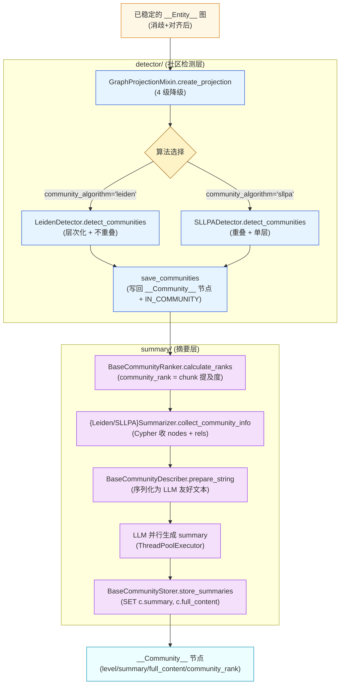
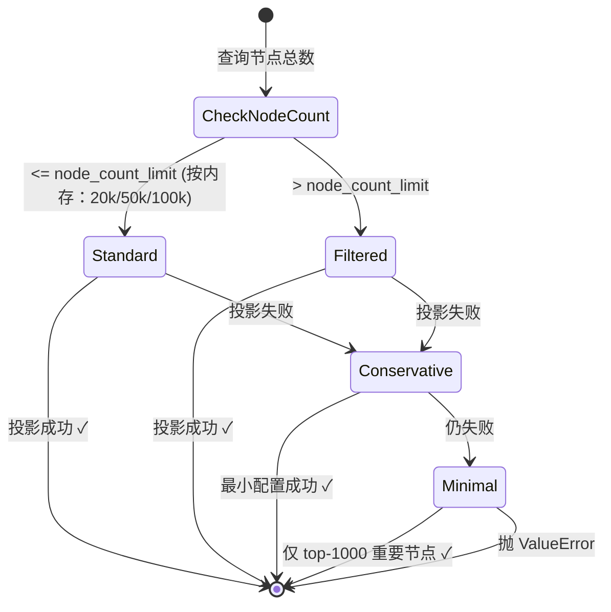

# 第 05 篇 · 社区检测与 LLM 摘要（GDS Leiden / SLLPA）

> 本系列共 16 篇，本文是 **Part 1（GraphRAG 图谱构建）的第 4 站**：把 `community/` 这个 GraphRAG 论文的标志性能力拆透——为什么图上要做社区检测、Leiden 与 SLLPA 各自适用什么场景、LLM 摘要怎么把社区压成一句话喂给 Global Search。
>
> **这是 GraphRAG 区别于传统向量 RAG 的核心差异化**。读完你会理解为什么向量 RAG 做不了"用 100 字总结这部 1000 页的小说"这类问题。

---

## 1. 学习目标

读完本篇你应该能：

1. 讲清为什么传统向量 RAG 无法回答**全图总结类问题**，社区摘要怎么解决。
2. 看懂 **GDS 图投影**的 4 级降级策略（标准 → 过滤 → 保守 → 最小化）以及内存自适应参数。
3. 区分 **Leiden（层次化 + 不重叠）** vs **SLLPA（重叠社区 + 单层级）**，能说出各自适合什么场景。
4. 读懂 `community_rank` 的计算逻辑（基于 chunk 提及度的 PageRank-like 权重）以及它在 Local/Global Search 中的作用。
5. 解释 `__Community__` 节点的层级结构 `id = '{level}-{community_id}'` 编码，以及 IN_COMMUNITY 关系的链式构建。

---

## 2. 前置知识

- 已读 **第 03、04 篇**：知道 `__Entity__` 节点的形成与对齐已完成，进入"图结构稳定期"。
- 知道**社区检测**的基本概念：把图划分为模块度（modularity）高的子图。
- 听过 **Leiden 算法**（Louvain 的改进版，保证子图连通性）和 **SLLPA**（Speaker-Listener Label Propagation Algorithm，允许节点属于多个社区）。
- 了解 LangChain 的 `prompt | llm | StrOutputParser` 链式语法。
- 熟悉 Neo4j GDS 的 `gds.graph.project / gds.leiden.write / gds.sllpa.write` 接口。

---

## 3. 源码地图

| 文件 | 关键类 / 函数 | 行号锚点 |
|---|---|---|
| `graphrag_agent/community/detector/base.py` | `BaseCommunityDetector.process`（三阶段编排：投影 → 检测 → 保存） | `detector/base.py:12-137` |
| `graphrag_agent/community/detector/projections.py` | `GraphProjectionMixin`（4 级投影降级） | `detector/projections.py:3-161` |
| `graphrag_agent/community/detector/leiden.py` | `LeidenDetector.detect_communities / save_communities`（层次化） | `detector/leiden.py:7-144` |
| `graphrag_agent/community/detector/sllpa.py` | `SLLPADetector.detect_communities / save_communities`（重叠） | `detector/sllpa.py:7-152` |
| `graphrag_agent/community/summary/base.py` | `BaseSummarizer / BaseCommunityRanker / BaseCommunityStorer` | `summary/base.py:13-296` |
| `graphrag_agent/community/summary/leiden.py` | `LeidenSummarizer.collect_community_info`（Cypher 提取 nodes+rels） | `summary/leiden.py:7-177` |
| `graphrag_agent/community/summary/sllpa.py` | `SLLPASummarizer.collect_community_info` | `summary/sllpa.py:7-150` |
| `graphrag_agent/config/prompts/graph_prompts.py` | `COMMUNITY_SUMMARY_PROMPT` / `community_template` | `graph_prompts.py:141-150` |
| `graphrag_agent/config/settings.py` | `community_algorithm / GDS_*` 配置 | `settings.py:91-143` |

调用方：`graphrag_agent/integrations/build/build_index_and_community.py`（第 06 篇会详讲）按 `community_algorithm` 在 `LeidenDetector` 和 `SLLPADetector` 之间二选一。

---

## 4. 核心机制讲解

### 4.1 为什么需要社区检测？

GraphRAG 论文里有个经典问题：「请总结《战争与和平》的主要冲突」。

- **传统向量 RAG** 怎么做：把 query 转成向量，召回最相似的 5 个 chunk → 喂给 LLM。
- **问题**：top-5 chunk 只能覆盖少数场景，**全文宏观结构丢失**。即便是 `top-k=50`，LLM 的上下文窗口也撑不住，且大部分 chunk 间冗余。

GraphRAG 的解法分两步：

1. **离线构建**：抽实体 → 建图 → **检测社区** → **LLM 为每个社区生成一段摘要**。
2. **在线检索**：宏观问题用 Global Search 遍历**社区摘要**（数量少、信息密度高），微观问题用 Local Search 取实体 + 邻居 + 所在社区摘要。

**社区摘要 = 整本书的"章节大纲"**。这就是为什么本模块是 GraphRAG 的灵魂。

### 4.2 整体流水线



### 4.3 GDS 图投影的 4 级降级

直接看 `projections.py:6-40`：

```python
def create_projection(self):
    node_count = self._get_node_count()
    if node_count > self.node_count_limit:
        return self._create_filtered_projection(node_count)
    
    try:
        self.G, result = self.gds.graph.project(
            self.projection_name,
            "__Entity__",
            {
                "_ALL_": {
                    "type": "*",
                    "orientation": "UNDIRECTED",
                    "properties": {"weight": {"property": "*", "aggregation": "COUNT"}},
                }
            },
        )
        return self.G, result
    except Exception as e:
        return self._create_conservative_projection()
```

**4 级降级状态机**：



每层的差异：

| 层 | 配置 | 节点数 | 关系 | 触发条件 |
|---|---|---|---|---|
| **Standard** | `node="*", weight=COUNT` | 全量 | 全量带权重 | 节点 ≤ 限制 |
| **Filtered** | 按度数 top-N | `node_count_limit` | 全量 | 节点 > 限制 |
| **Conservative** | 最小化 `"*"` | 全量 | 全量无权重 | Standard 失败 |
| **Minimal** | top-1000 度数节点 | 1000 | 全量 | 所有上述都失败 |

**为什么做四级降级**？GDS 投影会一次性把图载入内存。在小内存机器或异常大图上，**直接调 `project` 经常 OOM**。这种**"主路径 + 三层兜底"**模式比抛异常给用户友好得多。

#### 内存自适应参数

```python
# detector/base.py:43-52
if memory_gb > 32:
    self.node_count_limit = 100000
    self.timeout_seconds = 600
elif memory_gb > 16:
    self.node_count_limit = 50000
    self.timeout_seconds = 300
else:
    self.node_count_limit = 20000
    self.timeout_seconds = 180
```

**根据机器物理内存自动调整**，这种把"运维参数"内化到代码的做法在学习项目中很罕见。生产中更常见的是把这些做成可配置常量；本项目作者选择了"零运维"路线。

### 4.4 Leiden vs SLLPA：两种算法的本质差异

#### Leiden：层次化 + 不重叠

```python
# detector/leiden.py:23-29
result = self.gds.leiden.write(
    self.G,
    writeProperty="communities",                    # ← 注意：复数 + 数组
    includeIntermediateCommunities=True,            # ← 关键：保留每一层
    relationshipWeightProperty="weight",
    **self._get_optimized_leiden_params()
)
```

`writeProperty="communities"` 是个**数组**，每个 entity 会有 `[level0_community_id, level1_community_id, ...]`，**包含每一层的归属**。

保存时按层级建 `__Community__` 节点（`leiden.py:102-138`）：

```cypher
// 基础层 (level=0)
MATCH (e:`__Entity__`) WHERE e.communities IS NOT NULL AND size(e.communities) > 0
WITH collect({entityId: id(e), community: e.communities[0]}) AS data
UNWIND data AS item
MERGE (c:`__Community__` {id: '0-' + toString(item.community)})
ON CREATE SET c.level = 0
MERGE (e)-[:IN_COMMUNITY]->(c)

// 高层 (level≥1)：构建社区之间的层级关系
MATCH (e:`__Entity__`) WHERE e.communities IS NOT NULL AND size(e.communities) > 1
UNWIND range(1, size(communities) - 1) AS index
MERGE (current:`__Community__` {id: toString(index) + '-' + toString(current_community)})
MATCH (previous:`__Community__` {id: toString(index-1) + '-' + toString(previous_community)})
MERGE (previous)-[:IN_COMMUNITY]->(current)
```

**id 编码 `"{level}-{community_id}"`** 是一个聪明的做法：同一个数字 community_id 在不同 level 是不同节点，靠前缀区分。**这是 GraphRAG 多层级摘要的基础**。

#### SLLPA：重叠社区 + 单层

```python
# detector/sllpa.py:19-23
result = self.gds.sllpa.write(
    self.G,
    writeProperty="communityIds",                   # ← 注意：也是数组，但含义不同！
    **self._get_optimized_sllpa_params()
)
```

`writeProperty="communityIds"` 同样是数组，但**每个元素是该节点同时归属的不同社区**——一个实体可以"既属于学生事务社区，又属于奖学金社区"。

保存时只有 level=0（`sllpa.py:106-110`）：

```cypher
UNWIND e.communityIds AS community_id
MERGE (c:`__Community__` {id: '0-' + toString(community_id)})
ON CREATE SET c.level = 0, c.algorithm = 'SLLPA'
MERGE (e)-[:IN_COMMUNITY]->(c)
```

**没有 level≥1 的层级**——SLLPA 本身不产生层次结构。

#### 两者怎么选？

| 维度 | Leiden | SLLPA |
|---|---|---|
| 算法性质 | Louvain 改进版，保证连通性 | Label Propagation 变体 |
| 社区归属 | 互斥（一节点一社区） | 重叠（一节点可多社区） |
| 层次结构 | ✅ 多层（`communities[]`） | ❌ 单层 |
| 适合场景 | 主题清晰、结构稳定的图 | 主题交叉、节点跨界的图 |
| GDS 调用 | `gds.leiden.write` | `gds.sllpa.write` |
| 项目默认 | ✅ `community_algorithm='leiden'` | 可切换 |

**默认选 Leiden 的合理性**：

- 学生管理类文档主题相对正交（奖学金/处分/请假 各成体系）。
- 层次化让 Global Search 可以**先看 top-level 再下钻**，效率更高。
- Louvain/Leiden 是社区检测的"工业标准"，文献丰富。

**SLLPA 的兜底**：项目里 SLLPA 失败时**会切回 Leiden**（README 提到，代码层面是 `build_index_and_community.py` 做 try/except 切换）——这是一种"算法级 fallback"。

### 4.5 LLM 摘要：从图结构到自然语言

#### 4.5.1 收信息：Cypher 拉 nodes + rels

```cypher
// summary/leiden.py:33-72
MATCH (c:`__Community__` {level: 0})
WITH c ORDER BY CASE WHEN c.community_rank IS NULL THEN 0 ELSE c.community_rank END DESC
LIMIT 200

MATCH (c)<-[:IN_COMMUNITY]-(e:__Entity__)
WITH c, collect(e) as nodes
WHERE size(nodes) > 1

CALL {
    WITH nodes
    MATCH (n1:__Entity__) WHERE n1 IN nodes
    MATCH (n2:__Entity__) WHERE n2 IN nodes AND id(n1) < id(n2)
    MATCH (n1)-[r]->(n2)
    RETURN collect(distinct r) as relationships
}

RETURN c.id AS communityId,
       [n in nodes | {id: n.id, description: n.description, type: ...}] AS nodes,
       [r in relationships | {start: ..., type: type(r), end: ..., description: r.description}] AS rels
```

**几个值得注意的点**：

1. **`ORDER BY community_rank DESC` + `LIMIT 200`**：只对"重要的"社区生成摘要。**200 是硬上限**，超过的社区不会有 summary（即使存在 `__Community__` 节点）。这是为了控制 LLM 调用成本。
2. **`id(n1) < id(n2)` 避免重复关系**：图是有向的，但摘要需要的是"两个实体之间有什么关系"，无需重复列出 (A→B) 和 (B→A) 的两种视角。
3. **`size(nodes) > 1` 过滤孤立社区**：单节点的"社区"没意义，跳过。

#### 4.5.2 序列化：图结构 → 文本

```python
# summary/base.py:17-46
@staticmethod
def prepare_string(data: Dict) -> str:
    nodes_str = "Nodes are:\n"
    for node in data.get('nodes', []):
        nodes_str += f"id: {node['id']}, type: {node['type']}, description: {node['description']}\n"

    rels_str = "Relationships are:\n"
    for rel in data.get('rels', []):
        rels_str += f"({rel['start']})-[:{rel['type']}]->({rel['end']}), description: {rel['description']}\n"

    return nodes_str + "\n" + rels_str
```

最终格式像这样：

```
Nodes are:
id: 国家奖学金, type: 奖学金类型, description: 国家级奖学金，每年评选一次
id: 学生, type: 学生类型, description: 在校本科生
id: 教育部, type: 部门, description: 国家奖学金的最终备案单位

Relationships are:
(学生)-[:申请]->(国家奖学金), description: 符合条件的学生可申请
(国家奖学金)-[:管理]->(教育部), description: 由教育部备案
```

**为什么不直接传 JSON**？LLM 对**结构化自然语言**比 JSON 理解更稳定——尤其用于摘要这类生成任务。

#### 4.5.3 摘要 prompt 与 LLM 调用

```python
# summary/base.py:157-167
community_prompt = ChatPromptTemplate.from_messages([
    ("system", COMMUNITY_SUMMARY_PROMPT),   # "给定一个输入三元组，生成信息摘要。没有序言。"
    ("human", "{community_info}"),
])
self.community_chain = community_prompt | self.llm | StrOutputParser()
```

`COMMUNITY_SUMMARY_PROMPT` 只有一行（`graph_prompts.py:148-150`），相当极简。**摘要质量主要靠 LLM 自身的概括能力**，不靠 prompt 复杂度。

#### 4.5.4 并行处理

```python
# summary/base.py:226-251
with concurrent.futures.ThreadPoolExecutor(max_workers=workers) as executor:
    future_to_community = {
        executor.submit(self._process_single_community, info): i 
        for i, info in enumerate(community_info)
    }
    for future in concurrent.futures.as_completed(future_to_community):
        summaries.append(future.result())
```

`workers = min(MAX_WORKERS, max(1, len(community_info) // 2))` —— 不超过社区数的一半，**避免对小图谱过度并发**。

### 4.6 community_rank：基于 chunk 提及度的权重

```cypher
// summary/base.py:62-67
MATCH (c:`__Community__`)<-[:IN_COMMUNITY*]-(:`__Entity__`)<-[:MENTIONS]-(d:`__Chunk__`)
WITH c, count(distinct d) AS rank
SET c.community_rank = rank
```

**含义**：社区中实体被多少不同 chunk 提及，就有多少分。提及越多 → 在原文中越"重要" → 优先生成摘要、优先在 Local/Global Search 中被选中。

**为什么用 `[:IN_COMMUNITY*]` 变长路径**？因为 Leiden 是层次化的，`(entity)-[:IN_COMMUNITY]->(c0)-[:IN_COMMUNITY]->(c1)`，高层社区的 rank 也要算上低层实体的提及。

**fallback**（`summary/base.py:74-83`）：若复杂 Cypher 失败，退化为 `count(distinct entity)`（直接看社区实体数）。

---

## 5. 重点技术点深挖

### 5.1 GraphRAG 关键差异化能力（A 类技术点）

| 能力 | 向量 RAG | GraphRAG |
|---|---|---|
| **微观问答**（"国家奖学金的申请条件？"） | ✅ chunk 召回 | ✅ entity + 邻居 + chunk |
| **关系推理**（"奖学金 A 和 B 互斥吗？"） | ❌ 散落 chunk 难以串联 | ✅ 直接看 entity 间关系 |
| **宏观总结**（"学校的学生管理体系？"） | ❌ top-k chunk 覆盖率低 | ✅ Map-Reduce 遍历社区摘要 |
| **跨文档关联**（"这个规定和哪些处分挂钩？"） | ❌ 跨 chunk 关系需 LLM 推断 | ✅ 图上直接 traverse |

社区摘要是 **GraphRAG 应对宏观问题的杀手锏**——其他三项靠图结构本身就行，但宏观问题离开"压缩"就完全没法做。**理解了这点，你就理解了为什么微软原论文要单独 dedicate 一节讲社区**。

### 5.2 「Lost in the Middle」问题的预压缩解（A 类技术点）

> Liu et al. 2023 [arXiv:2307.03172](https://arxiv.org/abs/2307.03172) 发现 LLM 对长上下文中间部分的注意力显著下降。

**项目应对方式**：

1. **预生成摘要**：在离线阶段把社区压成单段摘要，**让在线检索拿到的就是已经压缩过的高密度信息**。
2. **层级聚合**：Leiden 多层社区 → 上层摘要又是下层摘要的进一步压缩。
3. **Map-Reduce**（详见第 07/13 篇）：Global Search 把社区摘要按批 Map 后再 Reduce，避免一次塞太多。

这种**"预压缩 + 多级聚合"**思路在 LangChain 里对应 `MapReduceDocumentsChain`，但 GraphRAG 把压缩单位从"按段切"换成了**"按社区聚类"**——后者更符合内容语义边界。

### 5.3 投影的「降级链」工程实践

`GraphProjectionMixin._create_filtered_projection` (`projections.py:49-98`) 的设计有个有意思的细节：当节点数超限时，**优先保留度数最高的 N 个节点**：

```cypher
MATCH (e:__Entity__)-[r]-()
WITH e, count(r) AS rel_count
ORDER BY rel_count DESC
LIMIT toInteger($limit)
RETURN collect(id(e)) AS important_nodes
```

**意图**：高度数节点 = 在图中占核心位置的实体（hub），即使丢弃边缘节点，社区结构的主要骨架仍然能保留。

**代价**：被丢弃的边缘实体永远不会出现在任何 `__Community__` 里——Global Search 会"看不见"它们。**这是一个明确的精度 vs 性能权衡**。

### 5.4 Leiden 参数自适应内存

```python
# detector/leiden.py:67-89
def _get_optimized_leiden_params(self):
    if self.memory_mb > 32 * 1024:
        return {'gamma': 1.0, 'tolerance': 0.0001, 'maxLevels': 10, 'concurrency': GDS_CONCURRENCY}
    elif self.memory_mb > 16 * 1024:
        return {'gamma': 1.0, 'tolerance': 0.0005, 'maxLevels': 5, 'concurrency': max(1, GDS_CONCURRENCY - 1)}
    else:
        return {'gamma': 0.8, 'tolerance': 0.001, 'maxLevels': 3, 'concurrency': max(1, GDS_CONCURRENCY // 2)}
```

三档参数的含义：

- **`gamma`**（resolution）：越大 → 社区粒度越细（社区数多但小）。小内存机器降到 0.8，**让社区更粗大**减少计算量。
- **`tolerance`**：收敛容忍度。小内存允许更早停止迭代。
- **`maxLevels`**：层数。小内存只算 3 层，大机器可以 10 层。
- **`concurrency`**：并发度对应 CPU 核。

**值得借鉴的工程模式**：算法级别的参数也按硬件能力分档，而不是硬编码——比单纯的"超时退出"友好得多。

---

## 6. Hands-on：手动跑一次社区检测 + 摘要

> 此 Hands-on 假设你已经按第 03、04 篇构建了一个小图谱（至少 20 个 entity 节点 + 关系）。

### 6.1 看现有图的统计

```python
# tmp_community_inspect.py
from graphrag_agent.config.neo4jdb import get_db_manager

graph = get_db_manager().graph
stats = graph.query("""
MATCH (e:`__Entity__`)
WITH count(e) AS entity_count
MATCH ()-[r]->()
RETURN entity_count, count(r) AS rel_count
""")
print(stats)

# 看是否有 __Community__ 节点
existing = graph.query("MATCH (c:`__Community__`) RETURN count(c) AS n")
print(f"已存在 __Community__ 节点: {existing[0]['n']}")
```

### 6.2 单独跑 LeidenDetector

```python
from graphdatascience import GraphDataScience
from graphrag_agent.config.settings import NEO4J_CONFIG
from graphrag_agent.community.detector.leiden import LeidenDetector

gds = GraphDataScience(NEO4J_CONFIG['uri'], auth=(NEO4J_CONFIG['username'], NEO4J_CONFIG['password']))
detector = LeidenDetector(gds=gds, graph=graph)

result = detector.process()
print("\n=== Leiden 结果 ===")
print(f"状态: {result['status']}")
print(f"性能: {result.get('performance')}")
print(f"详情: {result.get('details')}")
```

**预期观察**：

- 投影成功后会输出节点 + 关系数。
- `detection_result` 含 `communityCount, modularity, ranLevels`。
- modularity > 0.3 算质量可接受，< 0.1 说明社区结构不明显（数据太分散）。

### 6.3 看新生成的 `__Community__` 节点

```python
communities = graph.query("""
MATCH (c:`__Community__`)
RETURN c.id AS id, c.level AS level, c.community_rank AS rank
ORDER BY c.level, c.id LIMIT 20
""")
print("\n前 20 个 __Community__ 节点:")
for c in communities:
    print(f"  {c['id']} (level={c['level']}, rank={c['rank']})")
```

**预期观察**：`id` 形如 `'0-12', '1-3', '2-1'`，体现层级编码。

### 6.4 触发摘要生成（**会调用 LLM**）

```python
from graphrag_agent.community.summary.leiden import LeidenSummarizer

summarizer = LeidenSummarizer(graph=graph)
summaries = summarizer.process_communities()

print(f"\n生成了 {len(summaries)} 条摘要")
for s in summaries[:3]:
    print(f"\n--- Community {s['community']} ---")
    print(f"summary: {s['summary'][:200]}...")
    print(f"full_content 长度: {len(s['full_content'])} 字符")
```

**LLM 调用次数 = 进入摘要队列的社区数**，至多 200（来自 `LIMIT 200`）。建议先小规模验证一遍。

### 6.5 对比 SLLPA 的结果

切换 `community_algorithm='sllpa'`（直接传给 `SLLPADetector`，不必改 env）：

```python
# 清理旧的 __Community__
graph.query("MATCH (c:`__Community__`) DETACH DELETE c")

from graphrag_agent.community.detector.sllpa import SLLPADetector

sllpa = SLLPADetector(gds=gds, graph=graph)
result_sllpa = sllpa.process()
print("\n=== SLLPA 结果 ===")
print(f"社区数: {result_sllpa['details']['detection'].get('communityCount')}")
print(f"迭代数: {result_sllpa['details']['detection'].get('iterations')}")

# 看是否有节点属于多个社区
multi = graph.query("""
MATCH (e:`__Entity__`) WHERE e.communityIds IS NOT NULL
WITH e, size(e.communityIds) AS k WHERE k > 1
RETURN count(e) AS multi_membership, max(k) AS max_k
""")
print(f"重叠归属: {multi}")
```

**预期观察**：

- SLLPA 通常社区数比 Leiden 多（粒度更细）。
- `multi_membership > 0` 证明出现节点跨社区现象。

### 6.6 触发投影降级

构造 25k+ 实体的极端场景几乎不可能在 hands-on 范围内做。**最简方法**：手动调低 `node_count_limit`，强制走 filtered 路径：

```python
detector_small = LeidenDetector(gds=gds, graph=graph)
detector_small.node_count_limit = 5   # 故意调到 5
# 然后 detector_small.process() 会走 _create_filtered_projection
```

观察日志：`节点数量(XX)超过限制(5)`、`创建过滤后的投影...`、`过滤投影创建成功: 5 节点`。

### 6.7 Debug 提示

- **断点位置 1**：`projections.py:24 self.gds.graph.project(...)`，看 GDS 实际投影结果。失败时会看到具体 GDS 错误码。
- **断点位置 2**：`leiden.py:23 gds.leiden.write(...)`，看 `_get_optimized_leiden_params` 返回的参数。
- **断点位置 3**：`summary/base.py:268 self.community_chain.invoke(...)`，看 LLM 实际输入文本长度（如果某个社区有 100 个节点，文本会非常长）。
- **常见错误**：`GraphAlreadyExists` 或 `MemoryRequirement` 超限——重启 Neo4j 或调小 `GDS_MEMORY_LIMIT`。
- **常见错误**：`Procedure call inside a procedure that has restricted access`——`apoc.*` 没在 `NEO4J_dbms_security_procedures_unrestricted` 里放行。`docker-compose.yaml` 已配，自建环境需注意。

---

## 7. 思考题

1. **算法选型决策树**：你接到一个新业务（医疗文献），其中"疾病-药物"图谱里同一种药可治多种疾病。该选 Leiden 还是 SLLPA？为什么？（提示：考虑节点跨社区的语义意义）
2. **摘要质量提升**：当前 `COMMUNITY_SUMMARY_PROMPT` 只有一行。如果想让摘要包含"该社区涉及的核心问题、主要参与方、关键约束"三个固定要素，最小改动是什么？会有什么副作用？（提示：考虑结构化输出 + 摘要长度增加 + LLM 成本）
3. **增量更新难题**：新加入一个文档导致新增 20 个实体。重新跑整个社区检测开销大。如何**局部更新**社区结构？（提示：考虑 GDS 的 incremental flag、影响范围限制到新节点的 N 跳邻居）

---

## 8. 延伸阅读

- **GraphRAG 原论文**：[arXiv:2404.16130](https://arxiv.org/abs/2404.16130) —— 第 3 节专讲社区检测与摘要。
- **Leiden 算法原文**：[From Louvain to Leiden: guaranteeing well-connected communities](https://arxiv.org/abs/1810.08473)
- **SLLPA 算法**：[An Algorithm for Detecting Overlapping Communities](https://arxiv.org/abs/1109.5720)
- **Neo4j GDS 社区检测官方文档**：[Community detection algorithms](https://neo4j.com/docs/graph-data-science/current/algorithms/community/)
- **「Lost in the Middle」**：[Liu et al. 2023, arXiv:2307.03172](https://arxiv.org/abs/2307.03172) —— 为什么需要预压缩。
- 微软官方实现（GraphRAG library）：[microsoft/graphrag](https://github.com/microsoft/graphrag) —— 对比本项目的开源实现思路。

---

> ✅ 本篇结束。下一篇（**📄 06. 全量与增量构建编排**）会把前面 4 篇拼起来——三步主流水线 `KnowledgeGraphBuilder → IndexCommunityBuilder → ChunkIndexBuilder` 的顺序约束、`file_registry.json` 跟踪文件变更、增量更新的 `daemon` 模式与冲突解决策略。
>
> 调参口诀：**Leiden 看层级，SLLPA 看重叠；投影先降级，rank 看提及；摘要看 prompt，并行看资源**。
