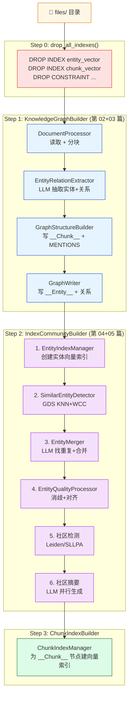
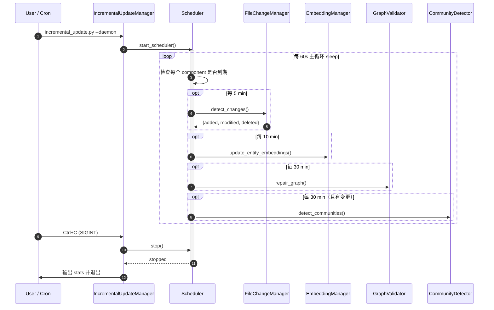

# 第 06 篇 · 全量构建与增量更新编排

> 本系列共 16 篇，本文是 **Part 1（GraphRAG 图谱构建）的收官篇**：把前 4 篇的所有子模块串成一条完整流水线——`integrations/build/main.py` 的全量构建三段式，以及 `incremental_update.py` 的增量更新多任务调度器。
>
> 这一篇没有新算法，但**编排顺序的强约束**、**文件级哈希追踪**、**手动编辑保护**和**daemon 多任务调度**是任何想把项目推到生产的人必须吃透的工程问题。

---

## 1. 学习目标

读完本篇你应该能：

1. 默写出全量构建的**三步主流水线**及为什么顺序不可变——尤其是"Chunk 索引必须在实体索引之后"的原因。
2. 看懂 `IndexCommunityBuilder` 内部的**六阶段子流水线**（索引 → 相似实体 → 合并 → 消歧对齐 → 社区 → 摘要），并把它和前 4 篇的源码对应起来。
3. 解释 `file_registry.json` 的 **SHA256 哈希追踪机制** 是如何识别 added / modified / deleted 三种变更的。
4. 讲清增量更新的 6 步 `run_once` 流程，知道**为什么社区检测要放到最后且条件触发**。
5. 区分三种 CLI 运行模式（`--once` / `--daemon` / 交互），并理解 `IncrementalUpdateScheduler` 的多任务异步间隔设计。
6. 在生产场景下，给出"加入手动编辑保护、避免增量更新覆盖手工修复"的最小配置。

---

## 2. 前置知识

- 已读 **第 02、03、04、05 篇**：知道摄取、抽取、消歧/对齐、社区检测各自做什么。
- 熟悉 Neo4j 的索引概念（向量索引 / 约束索引 / 标签索引）。
- 听过文件级哈希（SHA256）做增量同步的常见模式（Git 也是这种思路）。
- 知道 Linux signal（`SIGINT / SIGTERM`）和守护进程的基础概念。

---

## 3. 源码地图

| 文件 | 关键类 / 函数 | 行号锚点 |
|---|---|---|
| `graphrag_agent/integrations/build/main.py` | `KnowledgeGraphProcessor.process_all`（全量入口） | `build/main.py:10-58` |
| `graphrag_agent/integrations/build/build_graph.py` | `KnowledgeGraphBuilder._initialize_components / build_base_graph` | `build/build_graph.py:36-415` |
| `graphrag_agent/integrations/build/build_index_and_community.py` | `IndexCommunityBuilder.build_index_and_communities`（6 阶段子流水线） | `build_index_and_community.py:26-325` |
| `graphrag_agent/integrations/build/build_chunk_index.py` | `ChunkIndexBuilder.build_chunk_index`（Chunk 向量索引） | `build_chunk_index.py:18-200` |
| `graphrag_agent/integrations/build/incremental_update.py` | `IncrementalUpdateManager.run_once / start_scheduler / main()` | `incremental_update.py:19-559` |
| `graphrag_agent/integrations/build/incremental_graph_builder.py` | `IncrementalGraphUpdater.detect_changes / process_new_files / process_deleted_files` | `incremental_graph_builder.py:23-900` |
| `graphrag_agent/integrations/build/incremental/file_change_manager.py` | `FileChangeManager.detect_changes`（SHA256 + 注册表） | `incremental/file_change_manager.py:11-190` |
| `graphrag_agent/integrations/build/incremental/incremental_update_scheduler.py` | `IncrementalUpdateScheduler`（多任务调度） | 全文件 |
| `graphrag_agent/integrations/build/incremental/manual_edit_manager.py` | `ManualEditManager.detect_manual_edits / preserve_manual_edits` | 全文件 |
| `graphrag_agent/graph/graph_consistency_validator.py` | `GraphConsistencyValidator.repair_graph` | 全文件 |
| `graphrag_agent/config/settings.py` | `FILE_REGISTRY_PATH / FILES_DIR / conflict_strategy` | `settings.py:57-92` |

---

## 4. 核心机制讲解

### 4.1 全量构建：三步主流水线 + 强顺序约束

`graphrag_agent/integrations/build/main.py:20-58`：

```python
def process_all(self):
    # 0. 清除所有旧索引（防止索引冲突）
    connection_manager.drop_all_indexes()

    # 1. 构建基础图谱
    graph_builder = KnowledgeGraphBuilder()
    graph_builder.process()

    # 2. 构建实体索引和社区
    index_builder = IndexCommunityBuilder()
    index_builder.process()

    # 3. 构建 Chunk 索引
    chunk_index_builder = ChunkIndexBuilder()
    chunk_index_builder.process()
```

**为什么这个顺序不能换**？



**顺序强约束的三条根本原因**：

1. **Step 0 必须在第一步**：Neo4j 索引一旦创建，**重新插入数据会触发增量索引重建**，速度慢且容易崩溃。先 drop 再建是干净的做法。`drop_all_indexes` 在 `connection_manager` 里调（**第 01 篇** 已经讲过它是单例）。

2. **Step 1 必须先于 Step 2**：Step 2 第一步就是 `create_entity_index()`——为 `__Entity__` 节点的 `embedding` 属性建向量索引。**没有 Step 1 写入的 entity 节点，索引无内容可建**。

3. **Step 3 必须最后**：CLAUDE.md 里点名这个坑——`ChunkIndexBuilder` 为 `__Chunk__` 节点建向量索引。这一步**必须等 Step 2 的实体合并完成**，否则 chunk 跟实体的 `MENTIONS` 关系会指向被删除的旧实体。这是文档中明确的**"Entity index must exist before chunk index"**约束。

### 4.2 `IndexCommunityBuilder` 内部 6 阶段子流水线

这是项目最厚重的一段（`build_index_and_community.py:140-292`），把前 4 篇的所有子组件按顺序串起来：

```mermaid
flowchart LR
    A["上一步：图节点已写入"]:::input
    
    A --> P1["阶段 1<br/>EntityIndexManager.create_entity_index<br/>为 __Entity__.embedding 建向量索引"]:::p1
    P1 --> P2["阶段 2<br/>SimilarEntityDetector.process_entities<br/>GDS KNN + WCC → wcc 属性"]:::p2
    P2 --> P3["阶段 3<br/>EntityMerger.process_duplicates<br/>LLM 二次判断 + 合并旁路"]:::p3
    P3 --> P4["阶段 4<br/>EntityQualityProcessor.process<br/>= Disambiguator + Aligner"]:::p4
    P4 --> P5["阶段 5<br/>CommunityDetectorFactory.create<br/>+ detector.process"]:::p5
    P5 --> P6["阶段 6<br/>CommunitySummarizerFactory<br/>+ summarizer.process_communities"]:::p6
    P6 --> END["输出：__Community__.summary"]:::out
    
    classDef input fill:#fff7e6,stroke:#d97706
    classDef p1 fill:#e6f4ff,stroke:#1d4ed8
    classDef p2 fill:#fef3c7,stroke:#a16207
    classDef p3 fill:#fee2e2,stroke:#dc2626
    classDef p4 fill:#f5e0fc,stroke:#9333ea
    classDef p5 fill:#ecfeff,stroke:#0891b2
    classDef p6 fill:#dcfce7,stroke:#166534
    classDef out fill:#fff7e6,stroke:#d97706
```



每阶段对应前面章节：

| 阶段 | 子组件 | 对应章节 | 性能瓶颈 |
|---|---|---|---|
| 1 | `EntityIndexManager` | 本篇略提，详见 settings | 嵌入计算（OpenAI 调用） |
| 2 | `SimilarEntityDetector` | 第 04 篇 4.1 节 | GDS KNN（O(n²) 投影） |
| 3 | `EntityMerger` | 第 04 篇 5.3 节 | LLM 调用次数 |
| 4 | `EntityQualityProcessor` | 第 04 篇 4.1 节 | Cypher 多次扫表 |
| 5 | `CommunityDetector` | 第 05 篇 4.4 节 | GDS Leiden（迭代次数） |
| 6 | `CommunitySummarizer` | 第 05 篇 4.5 节 | LLM 调用（并发上限） |

**性能数据**（`build_index_and_community.py:280-285` 末尾的统计表）：作者在代码里印了一张性能占比表。**典型分布**：阶段 6 占 40-60%（LLM 慢）、阶段 2 占 15-25%（GDS 慢）、其余加起来 15-25%。

**关键设计**：每个阶段都用 `time.time()` 计时，结果存到 `performance_stats` 字典，最后用 `rich.Table` 输出。**这种"内置性能可观测"**是把训练有素的 SRE 心智写进了代码。

### 4.3 全量构建的"原子性"幻觉

注意 `process_all` **没有任何回滚**：如果 Step 2 阶段 5 失败，前面写入的实体节点、向量索引都会留在 Neo4j 里。**再次跑 `process_all`** 会再次 drop_all_indexes → 重写所有节点——**数据会被覆盖**，但 LLM 抽取缓存（`./cache/graph/` 里的 pkl，见**第 03 篇 4.5 节**）会被复用。

这种"全量重建 + 缓存复用"模式有两个**正向后果**：

- 抽取阶段缓存命中率高，**重跑成本几乎只剩图算法和 LLM 摘要**。
- 不需要复杂的事务管理。

和两个**负向后果**：

- 没法做"只重跑社区检测"——你想换 Leiden 为 SLLPA，必须从 Step 1 跑起。
- 失败后无法精确恢复到某个阶段。

### 4.4 增量更新：`IncrementalUpdateManager`

增量更新的核心入口在 `incremental_update.py:355-409`：

```python
def run_once(self):
    # 1. 检测文件变更
    changes = self.detect_file_changes()
    
    # 2. 更新实体 Embedding（新增/修改的实体）
    entity_updates = self.update_entity_embeddings()
    
    # 3. 更新 Chunk Embedding
    chunk_updates = self.update_chunk_embeddings()
    
    # 4. 验证图谱一致性（删除文件时尤其重要）
    consistency_check = self.verify_graph_consistency()
    
    # 5. 同步手动编辑（仅当有文件变更时）
    if changes.get("added") or changes.get("modified"):
        edit_sync = self.sync_manual_edits(...)
    
    # 6. 执行社区检测（仅当有变更时）
    if changes.get("added") or changes.get("modified") or changes.get("deleted"):
        community_detection = self.detect_communities()
```

**关键设计 1：先 embedding 再一致性检查**。如果先做 consistency_check，可能会把"刚加的新实体但还没生成 embedding"的节点误判为脏数据。**顺序保证了一致性检查时所有应有的 embedding 都已就位**。

**关键设计 2：条件触发的社区检测**。社区检测是最贵的一步（GDS + LLM），**只在文件确实有变更时跑**。如果只是 daemon 在轮询、没有真实变更，跳过。

### 4.5 文件变更追踪：SHA256 + JSON 注册表

`file_change_manager.py:109-139` 是整个增量机制的基石：

```python
def detect_changes(self):
    current_files = self._scan_current_files()  # 遍历 files/，算 SHA256
    
    added_files = []
    modified_files = []
    deleted_files = []
    
    # 新增 + 修改
    for file_path, file_info in current_files.items():
        if file_path not in self.registry:
            added_files.append(file_path)
        elif file_info["hash"] != self.registry[file_path]["hash"]:
            modified_files.append(file_path)
    
    # 删除
    for file_path in self.registry:
        if file_path not in current_files:
            deleted_files.append(file_path)
    
    return {"added": added_files, "modified": modified_files, "deleted": deleted_files}
```

`file_registry.json` 的结构（位于项目根 `FILE_REGISTRY_PATH`）：

```json
{
  "2023学生手册.pdf": {
    "hash": "9f8e7d6c...",
    "size": 1234567,
    "last_modified": 1715000000.123,
    "last_scanned": 1715100000.456,
    "processing_history": [
      {"timestamp": "2026-05-10T10:30:00", "entities": 142, "chunks": 89}
    ],
    "last_processed": "2026-05-10T10:30:00"
  },
  ...
}
```

**关键性质**：

- 哈希算的是**整个文件内容**（4KB 块流式计算），不是文件名或 mtime——避免 touch 文件触发误报。
- `processing_history` 是一个增长列表，**永不裁剪**，可以查到这个文件历史上每次被处理的统计。
- 注册表落地到磁盘（`json.dump`），重启 daemon 后能恢复。

**生产建议**：不要手动改 `file_registry.json`，CLAUDE.md 也明确说"do not manually edit"。如果想强制重建某文件，**删除注册表中该项**即可触发 added 路径。

### 4.6 增量调度器：多任务异步间隔

`main()` 在 `incremental_update.py:478-502` 把每种任务的间隔做成了 CLI 参数：

```python
config = {
    "file_change_threshold":          args.interval,          # 默认 300s（5 分钟）
    "entity_embedding_threshold":     args.interval * 2,      # 默认 600s（10 分钟）
    "chunk_embedding_threshold":      args.interval * 2,      # 默认 600s
    "graph_consistency_threshold":    args.interval * 6,      # 默认 1800s（30 分钟）
    "community_detection_threshold":  args.community_interval, # 默认 1800s
    "manual_edit_check_threshold":    args.manual_check_interval, # 默认 900s（15 分钟）
}
```

每种任务**独立计时、独立触发**——`IncrementalUpdateScheduler` 内部为每个 component 维护一个"上次执行时间"，当 `now - last_run > threshold` 时调度。

**为什么用阶梯式间隔**？

- 文件变更要**频繁检测**（5 分钟）—— 这是最廉价的操作。
- Embedding 与文件变更耦合，**节奏减半**（10 分钟）—— 给变更累积一波再统一处理。
- 一致性验证不必频繁（30 分钟）—— 多数情况下图自洽。
- 社区检测最贵，**和一致性同节奏**（30 分钟）。
- 手动编辑检查介于中间（15 分钟）—— 在 Neo4j Browser 改图的人需要尽快感知，但不必比文件还频繁。



### 4.7 手动编辑保护：`ManualEditManager`

CLAUDE.md 和实际代码（`manual_edit_manager.py`）都强调一个生产场景：**运维在 Neo4j Browser 里手动改了某个实体的描述**，下次增量更新跑 LLM 抽取时**不能覆盖这个手工修复**。

`incremental_update.py:307-353` 的 `check_manual_edits` 流程：

1. **检测**：扫 `__Entity__` 节点，找有 `manual_edited=true` 或 `last_manual_edit_time` 属性的节点。
2. **保护**：在变更文件列表里识别"会影响这些手工实体的"chunk，**预先备份手工字段**。
3. **更新**：让 IncrementalGraphUpdater 跑，但跑完之后**恢复手工字段**。

这是 `ManualEditManager.preserve_manual_edits` 的核心契约——**配合 `conflict_strategy` 设置使用**：

| `conflict_strategy` | 行为 |
|---|---|
| `manual_first` (默认) | 冲突时保留手工编辑，**LLM 抽取结果被丢弃** |
| `auto_first` | 冲突时用 LLM 抽取覆盖手工编辑 |
| `merge` | 尝试合并两者（实际是 LLM 二次判断） |

**生产强烈建议保持 `manual_first`** —— 运维 SRE 心血不能被自动化跑路。

### 4.8 三种 CLI 模式

```bash
# 模式 1：跑一次退出
python graphrag_agent/integrations/build/incremental_update.py --once

# 模式 2：守护进程（最常用）
python graphrag_agent/integrations/build/incremental_update.py --daemon --interval 300

# 模式 3：交互模式（调试用）
python graphrag_agent/integrations/build/incremental_update.py
>>> stats     # 查看统计
>>> run       # 手动触发一次
>>> exit      # 退出
```

**优雅退出**（`incremental_update.py:457-473`）：注册了 `SIGINT / SIGTERM`，收到信号后会：

1. 调 `stop_scheduler` 让当前任务跑完。
2. 打印 `stats`。
3. `exit(0)` 干净退出。

**这是生产级 daemon 的基础卫生**——不做这一步，docker stop 杀掉的 daemon 可能在 Neo4j 里留下半完成的事务。

---

## 5. 重点技术点深挖

### 5.1 构建管道的「可恢复性」（E 类技术点）

项目当前**没有真正的可恢复性**——如果阶段 5 失败，再跑 `process_all` 等于从头来。**升级思路**（不是项目当前实现）：

| 方案 | 实现成本 | 价值 |
|---|---|---|
| **每阶段加 checkpoint 文件** | 低 | 重跑时跳过已完成阶段 |
| **每阶段事务化** | 中 | Neo4j 支持，但 GDS 算法不支持 |
| **拆分为独立 pipeline 步骤**（如 Airflow） | 高 | 适合生产，本项目可能过重 |
| **GraphRAG 论文里的 incremental rebuild** | 中 | 项目已经有，详见 `IncrementalGraphUpdater` |

`incremental_graph_builder.py` 的 `process_incremental_update` 实际上**已经实现了「按需更新」**：它只重写新增/修改的 chunks 对应的实体子图，**不动其他部分**。但仅限于增量场景，全量构建依然是"all-or-nothing"。

### 5.2 文件哈希追踪 vs Git-style 三方合并（A/E 类）

项目的 `FileChangeManager` 是**单向哈希追踪**——只能识别"文件变了"，不能识别"文件具体哪部分变了"。对比业界：

- **Git-style 三方合并**：原文件、新文件、当前图状态做 diff，能定位"只删除了第 3 章"这种细粒度变化。**项目没实现**。
- **`unstructured-io` / `LlamaParse` 的语义级 diff**：把文件解析为结构化对象再 diff。**项目没用**。
- **当前实现**：变更文件 = 重新抽取整个文件的所有 chunks。**最差情况**：一个 1000 页 PDF 改了一个字也要全部重跑。

**何时这种"粗粒度"是合理的**？

- 文档数量 < 1000，每篇 < 100 页。
- LLM 抽取已经被本地缓存（**第 03 篇 4.5 节**）覆盖大部分文本——实际 LLM 调用次数远低于直觉。

### 5.3 多任务调度器的「错峰」设计（B/E 类）

`IncrementalUpdateScheduler` 没用 `asyncio` 或 `celery` ——而是用 `schedule` 库（`requirements.txt` 里的 `schedule==1.2.2`）做简单的"按间隔触发"。

**为什么不用 asyncio**？

- 内部所有任务都是同步的（LLM 调用、Cypher 查询）——asyncio 不会带来并发收益。
- `schedule` 库代码简单，没有事件循环复杂性，**debug 容易**。

**主循环就是简单的 sleep + 检查**（`incremental_update.py:520-526`）：

```python
if args.daemon:
    while True:
        time.sleep(60)  # 60s 主循环，调度器在另一线程跑
```

这种"够用就好"的工程取舍在学习项目里很合适，生产场景换 celery / airflow / k8s cronjob 都可以。

---

## 6. Hands-on：跑一次完整构建 + 一次增量更新

### 6.1 准备小数据集

```bash
mkdir -p files/test_build
cat > files/test_build/policy_v1.txt <<'EOF'
华东理工大学学生申请国家奖学金需要满足三个条件：
第一，本科生平均学分绩点不低于 3.5。
第二，所在年级综合排名前 10%。
第三，无任何违纪记录。
本年度国家奖学金由学校公示后报教育部备案。
EOF
```

### 6.2 跑全量构建

```bash
# 注意：会清掉所有现有图！如果已有数据请先备份
python graphrag_agent/integrations/build/main.py
```

**预期输出**（节选）：

```
步骤 0: 清除所有旧索引
步骤 1: 构建基础图谱
  初始化组件...
  ...实体抽取并行处理: 4 线程
步骤 2: 构建实体索引和社区
  系统信息: CPU核心数 8, 内存 16.0GB
  阶段 1: 索引创建...
  阶段 2: 相似实体检测...
  阶段 3: 实体合并...
  阶段 4: 实体消歧和对齐...
  阶段 5: 社区检测...
  阶段 6: 社区摘要...
  性能统计摘要 (table)
步骤 3: 构建 Chunk 索引
```

如果你已经按第 03 篇做过缓存，会看到 `缓存命中率: 100%`，可以在不消耗 LLM 的情况下重跑。

### 6.3 看 file_registry.json

```bash
cat file_registry.json | python -m json.tool | head -30
```

**预期**：每个文件一个 entry，含 hash、size、last_modified、last_scanned、processing_history。

### 6.4 模拟变更：修改一个文件

```bash
cat >> files/test_build/policy_v1.txt <<'EOF'

补充条款：从 2026 年起，研究生申请国家奖学金需额外满足学术发表条件。
EOF
```

### 6.5 跑增量更新

```bash
python graphrag_agent/integrations/build/incremental_update.py --once
```

**预期观察**：

- `检测到 1 个文件变更：新增: 0, 修改: 1, 删除: 0`。
- 只跑修改文件相关的实体抽取、embedding 更新、社区检测。
- 与 6.2 相比耗时大幅缩短。

### 6.6 模拟删除

```bash
rm files/test_build/policy_v1.txt
python graphrag_agent/integrations/build/incremental_update.py --once
```

**预期观察**：

- `检测到 1 个文件变更：删除: 1`。
- 触发 `verify_graph_consistency` —— 修复孤立节点。
- Neo4j 中相关 chunk / entity 被删除。

### 6.7 daemon 模式短暂跑一下

```bash
# 缩短间隔加速演示
python graphrag_agent/integrations/build/incremental_update.py --daemon \
  --interval 30 --community-interval 60 --manual-check-interval 30 &
DAEMON_PID=$!
sleep 90      # 等两轮触发
kill -TERM $DAEMON_PID    # 优雅退出
```

**预期观察**：

- 看到调度器初始化输出。
- 30 秒后第一次 file_change 检测。
- 60 秒后社区检测（如有变更）。
- Ctrl+C / kill -TERM 后看到统计信息并干净退出。

### 6.8 模拟手动编辑保护

在 Neo4j Browser 跑：

```cypher
MATCH (e:`__Entity__` {id: '国家奖学金'})
SET e.description = '由教育部主管的最高级别奖学金（手工修订）',
    e.manual_edited = true,
    e.last_manual_edit_time = datetime()
RETURN e
```

然后修改 `policy_v1.txt` 重新跑 `--once`。**预期**：`国家奖学金` 实体的 `description` 不会被新 LLM 抽取覆盖（前提是 `conflict_strategy=manual_first`）。

### 6.9 Debug 提示

- **断点位置 1**：`incremental_update.py:80 self.updater.detect_changes()`，看 changes dict 的实际内容——如果出乎意料，检查 `file_registry.json` 是否过期。
- **断点位置 2**：`build/main.py:30 drop_all_indexes()`，**这是最危险的一步**，会清掉所有索引和 `__Community__` 节点。生产环境一定要确认这是预期的。
- **断点位置 3**：`build_index_and_community.py:242 community_results = detector.process()`，看社区检测的状态。如果失败，看是 GDS 还是 OOM。
- **常见错误**：`FileChangeManager 报错 "无法加载文件注册表"`——大概率是 `FILE_REGISTRY_PATH` 写权限问题或 JSON 格式损坏。删除 `file_registry.json` 会重建。
- **常见错误**：daemon 退出后再次启动报 `Neo4j connection in use`——前一个进程没干净退出，Neo4j 连接池没释放。等 1 分钟（连接超时）或重启 Neo4j。

---

## 7. 思考题

1. **断点续跑设计**：当前 `process_all` 在阶段 5 失败后，下次必须从 Step 1 重跑。**如何只用 5 行代码加一个 "已完成阶段" checkpoint 文件**，让重跑能跳过已完成的步骤？（提示：在每阶段开始前检查 `cache/build_progress.json`）
2. **增量同步的极限**：当前哈希追踪是文件级的。**如果文档是结构化的 markdown，能否做到"只重跑修改的章节对应的实体抽取"**？最大改造点在哪？（提示：考虑用 markdown 解析器切章，每章独立哈希）
3. **多机部署**：把 daemon 部署到 5 台机器，每台监控不同的 `files/` 子目录。**怎么避免它们同时跑社区检测**（这会争抢 GDS 内存）？（提示：考虑 Redis 分布式锁 / 单点社区检测 worker）

---

## 8. 延伸阅读

- **Git 的文件级差量算法**：[Pro Git §10.2 The Git Object Database](https://git-scm.com/book/en/v2/Git-Internals-Git-Objects)
- **schedule 库文档**：[dbader/schedule](https://github.com/dbader/schedule) —— 项目用的简单定时任务库。
- **微软官方 GraphRAG library 的 build pipeline**：[microsoft/graphrag · Index Engine](https://github.com/microsoft/graphrag/tree/main/graphrag/index) —— 工业级实现，对比本项目的简化版。
- **Airflow + Neo4j 集成模式**：[Apache Airflow Neo4j Provider](https://airflow.apache.org/docs/apache-airflow-providers-neo4j/stable/index.html) —— 想把项目升级到生产可考虑的方向。
- **LangChain Document Loaders 的增量摄取**：[How to load documents incrementally](https://python.langchain.com/docs/integrations/document_loaders/) —— 与本项目的对比。

---

> ✅ 本篇结束。**Part 1（GraphRAG 图谱构建）全部完成**——你已经能讲清从一份 PDF 到一张可查询的 Neo4j 图的完整路径。接下来 **Part 2（GraphRAG 检索）** 第 07 篇会讲：Local / Global / Hybrid / Naive 四种检索如何在已经建好的图上取信息。
>
> 调参口诀：**先 drop 再建；entity 索引在 chunk 索引前；增量先嵌入再一致性；手动编辑保护用 manual_first**。
