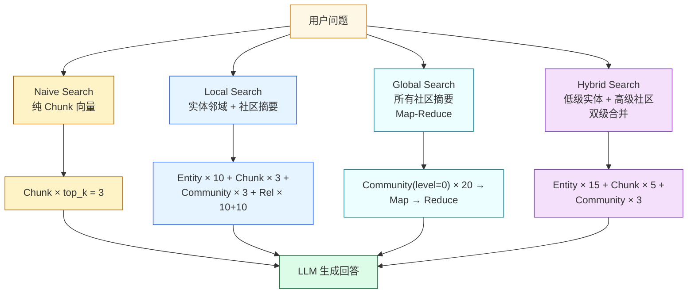
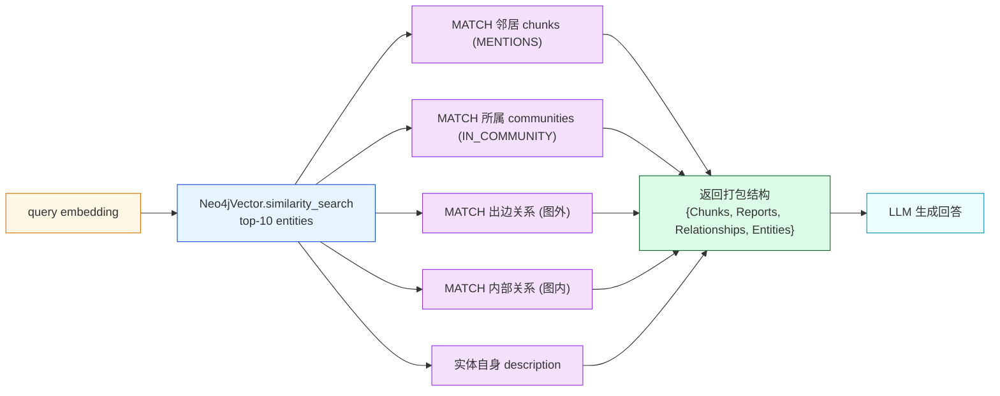
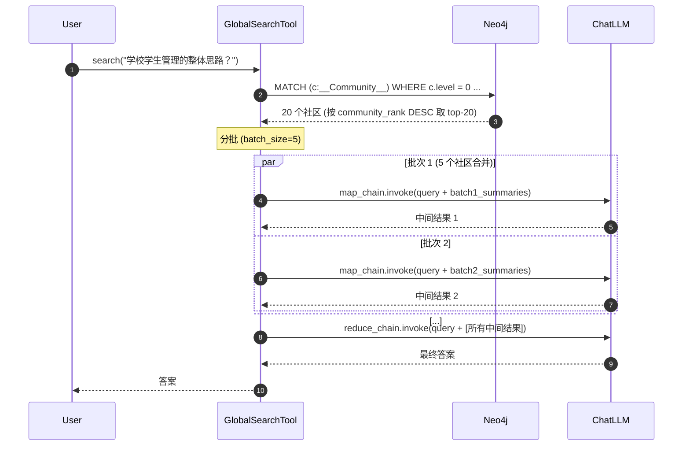

# 第 07 篇 · 四种基础检索：Naive / Local / Global / Hybrid

> 本系列共 16 篇，本文是 **Part 2（GraphRAG 检索）的第 1 站**：把项目里**四种基础检索工具**横向拆透——Naive（纯向量）、Local（实体邻域）、Global（社区 Map-Reduce）、Hybrid（双级合并）。
>
> 这是图谱构建完成后第一次"用起来"的环节。能不能把图用出 GraphRAG 论文里描述的"宏观+微观双覆盖"，全靠这四种检索的取舍。

---

## 1. 学习目标

读完本篇你应该能：

1. 对照矩阵讲清四种工具在 **检索单位 / 是否用图 / LLM 调用次数 / 适合问题** 上的差异。
2. 看懂 Local Search 的核心 Cypher：一条 30 行查询如何同时把"实体邻居 + 文本块 + 社区摘要 + 内外关系"打包返回。
3. 区分 Global Search 内置的 Map-Reduce 与 Reporter 阶段的 Map-Reduce（第 13 篇）——同名概念，不同层。
4. 读懂 Hybrid 的**双级关键词**机制：`low_level_keywords` 触发实体级检索，`high_level_keywords` 触发社区级检索，最后合并喂给同一 LLM。
5. 知道 `BaseSearchTool` 的三个通用能力（`vector_search` / `text_search` / `semantic_search`）和**为什么向量搜索失败要 fallback 到文本搜索**。
6. 解释为什么 `HybridSearchTool.get_global_tool()` 返回的实际是同一个 tool 的"只走 high-level"模式——一种巧妙的接口复用。

---

## 2. 前置知识

- 已读 **Part 1 全部 5 篇**：知道 `__Entity__ / __Chunk__ / __Community__` 三类节点和它们之间的关系结构。
- 知道 Neo4j 5.x 的 `db.index.vector.queryNodes(indexName, k, embedding)` 接口。
- 熟悉 LangChain `prompt | llm | StrOutputParser` 链式语法。
- 听过 Map-Reduce 思想，知道"按批 Map 出中间结果，再 Reduce 合并"的范式。

---

## 3. 源码地图

| 文件 | 关键类 / 函数 | 行号锚点 |
|---|---|---|
| `graphrag_agent/search/tool/base.py` | `BaseSearchTool.vector_search / text_search / semantic_search` | `tool/base.py:14-288` |
| `graphrag_agent/search/local_search.py` | `LocalSearch.retrieval_query`（核心 Cypher） | `search/local_search.py:86-138` |
| `graphrag_agent/search/tool/local_search_tool.py` | `LocalSearchTool.structured_search / search` | `tool/local_search_tool.py:155-226` |
| `graphrag_agent/search/global_search.py` | `GlobalSearch._process_communities / _reduce_results` | `search/global_search.py:14-138` |
| `graphrag_agent/search/tool/global_search_tool.py` | `GlobalSearchTool._get_community_data / _process_communities` | `tool/global_search_tool.py:25-340` |
| `graphrag_agent/search/tool/hybrid_tool.py` | `HybridSearchTool.{structured_search, _retrieve_low_level_content, _retrieve_high_level_content, get_global_tool}` | `tool/hybrid_tool.py:30-661` |
| `graphrag_agent/search/tool/naive_search_tool.py` | `NaiveSearchTool.search`（纯向量） | `tool/naive_search_tool.py:14-200` |
| `graphrag_agent/search/tool_registry.py` | `TOOL_REGISTRY` 工厂注册表 | `tool_registry.py:20-34` |
| `graphrag_agent/search/retrieval_adapter.py` | `create_retrieval_result / results_from_*`（统一证据） | 全文件 |
| `graphrag_agent/config/prompts/search_prompts.py` | 7 个搜索 prompt 模板 | 全文件 |
| `graphrag_agent/config/settings.py` | `LOCAL_/GLOBAL_/HYBRID_SEARCH_SETTINGS` | `settings.py:253-289` |

---

## 4. 核心机制讲解

### 4.1 四种工具横向矩阵



四工具速查表：

| 工具 | 检索单位 | 是否用图结构 | LLM 调用次数 | 典型耗时 | 适合问题 |
|---|---|---|---|---|---|
| **Naive** | Chunk 向量 | ❌ 完全不用 | 1 (生成) | 1-2s | "申请国奖需要满足什么条件？"（事实型） |
| **Local** | Entity + 邻居 + Chunk + 社区摘要 | ✅ 重度依赖 | 2 (关键词+生成) | 3-5s | "国奖和优秀学生有什么联系？"（关系推理） |
| **Global** | 所有 `__Community__` (level=0) 摘要 | ✅ 仅用社区层 | N+1 (Map×N + Reduce) | 10-30s | "学校学生管理的整体框架是什么？"（宏观综合） |
| **Hybrid** | Entity + Chunk + Community 全部 | ✅ 重度依赖 | 2-3 (关键词+生成) | 4-8s | "评优的全流程？包含哪些利益方？"（混合型） |

`settings.py:253-289` 的所有 `LOCAL_SEARCH_TOP_*` / `GLOBAL_SEARCH_*` / `HYBRID_SEARCH_*` 都是这张表里的具体数字。

### 4.2 BaseSearchTool 的三件通用兵器

```python
# tool/base.py:110-149（节选）
def vector_search(self, query, limit=None):
    query_embedding = self.embeddings.embed_query(query)
    cypher = """
    CALL db.index.vector.queryNodes('vector', $limit, $embedding)
    YIELD node, score
    RETURN node.id AS id, score
    ORDER BY score DESC
    """
    results = self.db_query(cypher, {"embedding": query_embedding, "limit": limit})
    if not results.empty:
        return results['id'].tolist()
    return []
```

**Neo4j 5.x 原生向量索引调用**——这是项目向量检索的底层接口。注意 `'vector'` 是索引名（`config/settings.py:273 LOCAL_SEARCH_INDEX_NAME`），如果重命名会全局崩塌。

`text_search`（`tool/base.py:151-184`）和 `semantic_search`（`tool/base.py:186-215`）是两个备胎：

- **`text_search`**：纯 `CONTAINS` 模糊匹配，在向量搜索失败时兜底。
- **`semantic_search`**：从一组实体里按 embedding 相似度排序，**输入已有实体列表**（不查 Neo4j），是给 hybrid 那种"先查到一批，再排序"用的。

`vector_search` 失败自动 fallback 到 `text_search`（**`tool/base.py:147-149`**）—— **这是项目的一种隐式 SLA**：哪怕 embedding 服务挂了，搜索功能还能勉强工作。

### 4.3 Naive Search：最简检索，没用图

```python
# tool/naive_search_tool.py:80-198（精简版）
def search(self, query_input):
    query = query_input["query"] if isinstance(query_input, dict) else str(query_input)
    
    # 1. 生成 query embedding
    query_embedding = self.embeddings.embed_query(query)
    
    # 2. 取所有有 embedding 的 chunk，候选集 100 个
    chunks_with_embedding = self.graph.query("""
    MATCH (c:__Chunk__)
    WHERE c.embedding IS NOT NULL
    RETURN c.id AS id, c.text AS text, c.embedding AS embedding
    LIMIT 100
    """)
    
    # 3. 用 VectorUtils.rank_by_similarity 排序，取 top_k
    scored_chunks = VectorUtils.rank_by_similarity(
        query_embedding, chunks_with_embedding, "embedding", self.top_k
    )
    results = scored_chunks[:self.top_k]
    
    # 4. 格式化 + LLM 生成
    context = "\n\n---\n\n".join(f"Chunk ID: {c['id']}\n{c['text']}" for c in results)
    answer = self.query_chain.invoke({"query": query, "context": context, "response_type": ...})
    return answer
```

**值得注意的两点**：

1. **取 100 个候选再 top_3**：候选集靠 `LIMIT 100` 硬截断，**没用 Neo4j 向量索引！** 而是把 100 条全量拉到 Python 端再算相似度。**含义**：当 chunk 总数 > 100，**部分文档永远不会被检索到**。这是项目里一个明显的设计缺陷——可以改为先用 `db.index.vector.queryNodes` 做 IVF 召回，再 Python 端二次重排。
2. **`NAIVE_SEARCH_TOP_K=3`**：只取 3 个 chunk。比业界常见的 5-10 偏少，**适合短答案场景**，长答案场景需要调高。

### 4.4 Local Search：一条 Cypher 把图打包

`LocalSearch.retrieval_query`（`search/local_search.py:86-138`）是项目里最值得逐行精读的一条 Cypher。

```cypher
// 注意：这条 Cypher 是接在 Neo4jVector 向量召回之后的
// Neo4jVector 先用 query 的 embedding 找到 top_k entities，结果绑定到 'node'
WITH collect(node) as nodes

WITH 
collect {                              // ① 取实体被提及的 chunk
    UNWIND nodes as n
    MATCH (n)<-[:MENTIONS]-(c:__Chunk__)
    WITH distinct c, count(distinct n) as freq
    RETURN {id:c.id, text: c.text} AS chunkText
    ORDER BY freq DESC
    LIMIT $topChunks                   // 3
} AS text_mapping,

collect {                              // ② 取实体所属的社区摘要
    UNWIND nodes as n
    MATCH (n)-[:IN_COMMUNITY]->(c:__Community__)
    WITH distinct c, c.community_rank as rank, c.weight AS weight
    RETURN c.summary 
    ORDER BY rank, weight DESC
    LIMIT $topCommunities              // 3
} AS report_mapping,

collect {                              // ③ 取从实体外延出去的关系（"图外关系"）
    UNWIND nodes as n
    MATCH (n)-[r]-(m:__Entity__) 
    WHERE NOT m IN nodes
    RETURN r.description AS descriptionText
    ORDER BY r.weight DESC 
    LIMIT $topOutsideRels              // 10
} as outsideRels,

collect {                              // ④ 取召回实体之间的关系（"图内关系"）
    UNWIND nodes as n
    MATCH (n)-[r]-(m:__Entity__) 
    WHERE m IN nodes
    RETURN r.description AS descriptionText
    ORDER BY r.weight DESC 
    LIMIT $topInsideRels               // 10
} as insideRels,

collect {                              // ⑤ 取召回实体本身的描述
    UNWIND nodes as n
    RETURN n.description AS descriptionText
} as entities

RETURN {
    Chunks: text_mapping, 
    Reports: report_mapping, 
    Relationships: outsideRels + insideRels, 
    Entities: entities
} AS text, 1.0 AS score, {} AS metadata
```

**5 个并行 `collect {}` 子查询**一次性把 5 类信息打包成单条结果。这种**"一次 Cypher，全维度信息"**模式有三个好处：

1. **网络往返只一次**：避免对每个实体多次查询数据库。
2. **依赖关系隐式表达**：所有信息都是基于"召回的 top_k entities"展开的，逻辑紧凑。
3. **结果一致性**：如果分多次查，可能中间被增量更新打断。



`LocalSearchTool` 在外层包装了一层 **LangChain 的 RAG chain**（`tool/local_search_tool.py:42-75`）：

```python
self.history_aware_retriever = create_history_aware_retriever(self.llm, self.retriever, contextualize_q_prompt)
self.question_answer_chain = create_stuff_documents_chain(self.llm, lc_prompt_with_history)
self.rag_chain = create_retrieval_chain(self.history_aware_retriever, self.question_answer_chain)
```

**这是项目里唯一用了 LangChain 内置 RAG chain 的工具**——其他三个都是手写 prompt | llm。这种"用 LangChain 内置组件"的做法支持多轮对话历史（`MessagesPlaceholder("chat_history")`）但目前 `chat_history` 永远是空（与第 03 篇发现的 `EntityRelationExtractor.chat_history` 同样是装饰品）。

### 4.5 Global Search：Map-Reduce 范式

```python
# search/global_search.py:120-138（精简版）
def search(self, query, level):
    communities = self._get_community_data(level)       # 拉某层所有社区
    intermediate_results = self._process_communities(query, communities)  # Map
    return self._reduce_results(query, intermediate_results)              # Reduce
```



**两段式 LLM 调用**：

- **Map 阶段**（`global_search.py:61-91`）：对每个社区（或一批社区）跑一次 `MAP_SYSTEM_PROMPT + GLOBAL_SEARCH_MAP_PROMPT`，让 LLM 提取"这个社区对回答 query 有用的部分"。
- **Reduce 阶段**（`global_search.py:93-118`）：把所有 Map 结果汇总，跑一次 `REDUCE_SYSTEM_PROMPT + GLOBAL_SEARCH_REDUCE_PROMPT`，让 LLM 生成最终答案。

**性能特点**：

- LLM 调用次数 = `ceil(社区数 / batch_size) + 1`。`GLOBAL_SEARCH_BATCH_SIZE=5`、`LIMIT 20` 意味着 ~5 次 Map + 1 次 Reduce = **~6 次 LLM 调用**。
- 单次响应时间 = max(Map 调用时间) + Reduce 时间 ≈ 10-30s（即使并行）。
- **代价高**，所以只在"宏观综合"问题上启用。

### 4.6 Hybrid Search：双级合并 = Local + Global 的精简版

`HybridSearchTool.structured_search`（`tool/hybrid_tool.py:522-606`）逻辑：

```python
def structured_search(self, query_input):
    # 1. 关键词分两级
    keywords = self.extract_keywords(query)
    low_keywords = keywords.get("low_level", [])
    high_keywords = keywords.get("high_level", [])
    
    # 2. 低级检索（entity + chunk + 关系）
    low_level_content, low_evidence = self._retrieve_low_level_content(query, low_keywords)
    
    # 3. 高级检索（社区摘要）
    high_level_content, high_evidence = self._retrieve_high_level_content(query, high_keywords)
    
    # 4. LLM 一次性生成
    answer = self.query_chain.invoke({
        "query": query,
        "low_level": low_level_content,
        "high_level": high_level_content,
        "response_type": response_type
    })
    return {...}
```

**与 Local Search 的差异**：

| 维度 | Local Search | Hybrid Search |
|---|---|---|
| 召回入口 | 向量召回 entity | **关键词召回 entity + 向量兜底** |
| 关系召回 | Cypher 一次性 5 个 collect | 拆成 3 次独立 Cypher (entity / rel / chunk) |
| 社区使用 | top-3 社区摘要 | 关键词过滤的 top-3 社区摘要 |
| LLM 提示 | `LOCAL_SEARCH_CONTEXT_PROMPT` | `HYBRID_TOOL_QUERY_PROMPT`（分 low/high 两段） |

**`HybridSearchTool` 内含一个巧妙复用**：`get_global_tool()`（`tool/hybrid_tool.py:620-661`）返回的不是 `GlobalSearchTool`，而是**同一个 HybridSearchTool 的"只用 high-level"模式**——把 `low_level_keywords=[]` 强制清空，让 `_retrieve_low_level_content` 走"无关键词分支"返回少量结果。

这种"一个 tool 两副面孔"的做法**减少了组件重复**，但读代码时容易看错——以为是真的全局搜索，实际上是 hybrid 的子模式。

### 4.7 统一证据格式：`RetrievalResult`

所有 `structured_search` 都返回一个统一结构：

```python
# 来自 retrieval_adapter.py 的 results_to_payload
{
    "query": "...",
    "answer": "...",            # LLM 生成的回答
    "retrieval_results": [      # 标准化的证据列表
        {
            "result_id": "...",
            "granularity": "Chunk" / "Entity" / "DO",   # DO = document/community
            "evidence": "...",   # 原文片段
            "source": "local_search",
            "metadata": {
                "source_id": "...",
                "source_type": "chunk" / "entity" / "community",
                "confidence": 0.7,
                ...
            },
            "score": 0.7
        },
        ...
    ]
}
```

**这是多智能体管线的"通用货币"**——Reporter（第 13 篇）会消费这个结构去生成长报告，所以四个工具都必须输出统一格式。`retrieval_adapter.py` 的 `results_from_entities / results_from_relationships / results_from_documents` 帮你做这件事。

---

## 5. 重点技术点深挖

### 5.1 Hybrid Search vs 业界 BM25+Vector 的本质差异（A 类技术点）

业界主流 Hybrid Retriever（如 LangChain `EnsembleRetriever`）：

- **稀疏召回（BM25）**：基于词频做 lexical 匹配。
- **稠密召回（向量）**：基于 embedding 做 semantic 匹配。
- **融合**：用 Reciprocal Rank Fusion (RRF) 或线性加权。

**项目的 Hybrid 完全不同**：

- **低级**：Entity-Level 的图检索（不是 BM25！实际上是 Cypher CONTAINS + 向量 fallback）。
- **高级**：Community-Level 的语义检索。
- **融合**：直接拼接成两段 prompt，让 LLM 自己合并。

**对照**：

| 维度 | 业界 Hybrid | 本项目 Hybrid |
|---|---|---|
| 名字相同 | ✅ Hybrid Search | ✅ HybridSearchTool |
| 召回单元 | Chunk / Doc | Entity + Community |
| 是否用 BM25 | ✅ | ❌（用 Cypher CONTAINS） |
| 融合方式 | RRF / 加权 | Prompt 拼接 |
| 适合场景 | 通用 RAG | GraphRAG（有图结构） |

**严格来说**，项目的"Hybrid"应叫 **"Dual-level GraphRAG Search"** 更准确。但项目复用了业界术语，**学习时不要混淆**。

### 5.2 MMR vs Similarity：项目的取舍（A 类技术点）

项目**全程用 cosine similarity**，**没用 MMR（Maximal Marginal Relevance）**。

- **Similarity-only 的缺点**：top-k 结果可能高度冗余。
- **MMR 的好处**：在保证相关性的同时最大化结果多样性。

**项目为什么不用 MMR**？

- **图结构本身就提供了多样性**：Local Search 一条 Cypher 返回 entity + chunk + community + relationships，**结构上已经强制多样**。
- **MMR 需要额外的 lambda 调参**，增加复杂度。

但 **Naive Search 没图结构**，**这里 MMR 应该最有价值**——`NaiveSearchTool` 用了 cosine 直接 top-3 可能完全冗余。**升级建议**（不在项目）：

```python
# 概念示例，非项目代码
from langchain_community.retrievers import BM25Retriever
mmr_results = vector_store.max_marginal_relevance_search(query, k=3, fetch_k=20, lambda_mult=0.5)
```

### 5.3 关键词缓存：双层结构（E 类技术点）

四个工具都有 `extract_keywords` 方法，且**都在 LLM 调用前缓存关键词**：

```python
# tool/local_search_tool.py:96-122（节选）
cached_keywords = self.cache_manager.get(f"keywords:{query}")
if cached_keywords:
    return cached_keywords

result = self.keyword_chain.invoke({"query": query})
keywords = json.loads(result)
self.cache_manager.set(f"keywords:{query}", keywords)
```

这是一个**「分离的预热缓存」**：

- 首次 query 关键词提取要调 LLM。
- 后续相同 query（或在 vector_similarity 阈值内的相似 query）直接复用关键词。

**对成本的影响**：项目主路径每次查询有 2 次 LLM 调用（关键词 + 生成），关键词缓存可以让"复访问"降到 1 次。

### 5.4 接口复用的"陷阱"：`get_global_tool` 不返 Global Search

`HybridSearchTool.get_global_tool()`（`tool/hybrid_tool.py:620-661`）这段值得专门提：

```python
def get_global_tool(self) -> BaseTool:
    class GlobalSearchTool(BaseTool):           # ← 类名是 GlobalSearchTool！
        name : str = "global_retriever"
        description : str = gl_description
        
        def _run(self_tool, query):
            # ... 转换关键词
            query = {
                "query": str(query),
                "high_level_keywords": keywords.get("high_level", []),
                "low_level_keywords": []        # ← 关键：强制清空
            }
            return self.search(query)            # ← 调的还是 HybridSearchTool.search
    
    return GlobalSearchTool()
```

**这导致一个观察盲区**：在 `HybridAgent` 里看到 `self.search_tool.get_global_tool()`（`agents/hybrid_agent.py:35`），**很容易以为它会触发 `search/global_search.py` 的真正 Map-Reduce**——实际上没有，它只是 Hybrid 的 high-level-only 模式。

如果你想用真正的 Global Search Map-Reduce，要去 `agents/graph_agent.py:32`（`GlobalSearchTool` 的真正实例化）或在 multi_agent 里通过 `task_type="global_search"` 触发（第 11 篇）。

---

## 6. Hands-on：四种工具直接对比

> 此 Hands-on 假设你已构建好图谱（第 06 篇）。如果没有，**Local 与 Global 会返回空**——但你仍能跑 Naive 验证 chunk 检索。

### 6.1 写一个对比脚本

```python
# tmp_search_compare.py
import time
from graphrag_agent.search.tool.naive_search_tool import NaiveSearchTool
from graphrag_agent.search.tool.local_search_tool import LocalSearchTool
from graphrag_agent.search.tool.global_search_tool import GlobalSearchTool
from graphrag_agent.search.tool.hybrid_tool import HybridSearchTool

tools = {
    "Naive":  NaiveSearchTool(),
    "Local":  LocalSearchTool(),
    "Global": GlobalSearchTool(),
    "Hybrid": HybridSearchTool(),
}

queries = [
    "申请国家奖学金的具体条件是什么？",      # 事实型
    "国家奖学金和优秀学生有什么关系？",         # 关系推理
    "学校学生管理的整体思路是什么？",            # 宏观综合
]

for q in queries:
    print(f"\n{'='*70}\n查询：{q}\n{'='*70}")
    for name, tool in tools.items():
        t0 = time.time()
        try:
            ans = tool.search(q)
        except Exception as e:
            ans = f"[ERROR] {e}"
        elapsed = time.time() - t0
        # 只打印前 200 字符 + 耗时
        print(f"\n[{name}] ({elapsed:.2f}s):")
        print(ans[:200] + ("..." if len(ans) > 200 else ""))
```

**预期观察**：

| 查询 | 最适合的工具 | 不适合的工具表现 |
|---|---|---|
| 事实型（"申请条件"） | Naive、Local 都能用 | Global 会"绕大圈"返回宏观叙述 |
| 关系推理（"国奖 vs 优秀学生"） | Local / Hybrid | Naive 召回的 chunks 可能不包含关系信息 |
| 宏观综合（"整体思路"） | Global / Hybrid | Naive top-3 chunks 覆盖率不够 |

### 6.2 看 Local Search 的中间打包结构

```python
# tmp_local_inspect.py
from graphrag_agent.config.neo4jdb import get_db_manager
from graphrag_agent.search.local_search import LocalSearch
from graphrag_agent.models.get_models import get_llm_model, get_embeddings_model

ls = LocalSearch(get_llm_model(), get_embeddings_model())

# 直接调底层 Cypher（绕过 LLM）
from langchain_community.vectorstores import Neo4jVector
vector_store = Neo4jVector.from_existing_index(
    ls.embeddings,
    url=ls.neo4j_uri, username=ls.neo4j_username, password=ls.neo4j_password,
    index_name=ls.index_name,
    retrieval_query=ls.retrieval_query
)
docs = vector_store.similarity_search(
    "国家奖学金", k=5,
    params={"topChunks": 3, "topCommunities": 3, "topOutsideRels": 5, "topInsideRels": 5}
)
print(f"召回 {len(docs)} 个 Document，结构如下：")
for d in docs[:1]:
    print(d.page_content[:500])
    print("---metadata---", d.metadata)
```

**预期观察**：`page_content` 是一个被序列化的字典，含 `Chunks / Reports / Relationships / Entities` 四个键——这就是项目里 LangChain 把 Cypher 返回的 dict 当成单个 Document 的 page_content 的做法。

### 6.3 看 Global Search 的 Map-Reduce 节奏

```python
# tmp_global_inspect.py
from graphrag_agent.search.tool.global_search_tool import GlobalSearchTool

gs = GlobalSearchTool(level=0)
# 故意把 batch_size 调小，能看到更细粒度的 Map 阶段
gs_settings = type(gs).__name__  # 不要修改 settings，仅观察
# 设置环境变量临时调小：export GLOBAL_SEARCH_BATCH_SIZE=2 再启动 python

# 直接看 _get_community_data 取了多少社区
comms = gs._get_community_data()
print(f"取到 {len(comms)} 个社区")
for c in comms[:3]:
    print(c['output']['communityId'], c['output']['full_content'][:100])

# 跑一次完整 search
ans = gs.search("学校学生管理的整体框架")
print(ans[:500])
```

**预期观察**：日志里能看到"正在处理社区数据"逐条输出（Map 阶段），最后才是 Reduce。注意 `tqdm` 进度条。

### 6.4 验证 Hybrid 双级关键词的差异

```python
# tmp_hybrid_levels.py
from graphrag_agent.search.tool.hybrid_tool import HybridSearchTool

ht = HybridSearchTool()

# 关键词提取看看效果
kw = ht.extract_keywords("国家奖学金的申请流程是什么？")
print(f"low_level:  {kw['low_level']}")
print(f"high_level: {kw['high_level']}")

# 只用 low_level
r_low = ht.structured_search({"query": "国家奖学金的申请流程？", "low_level_keywords": kw['low_level'], "high_level_keywords": []})
print("\n--- low only ---")
print(r_low['low_level_content'][:300])
print("[high 应为空]:", r_low['high_level_content'])

# 只用 high_level
r_high = ht.structured_search({"query": "国家奖学金的申请流程？", "low_level_keywords": [], "high_level_keywords": kw['high_level']})
print("\n--- high only ---")
print("[low 应为空]:", r_high['low_level_content'])
print(r_high['high_level_content'][:300])
```

**预期观察**：low_level 部分主要是具体实体描述，high_level 部分主要是社区摘要。两者在内容粒度和抽象度上明显不同。

### 6.5 Debug 提示

- **断点位置 1**：`local_search.py:140 vector_store.similarity_search(...)`，看 Neo4jVector 返回的 docs 结构。
- **断点位置 2**：`global_search_tool.py:160 self.graph.query(cypher_query, params=params)`，看关键词过滤后剩多少社区。
- **断点位置 3**：`hybrid_tool.py:559 high_level_content, high_evidence = ...`，看高/低级两路内容差异。
- **常见错误 1**：Local Search 返回"未找到相关信息"——大概率是 entity 向量索引名不对（检查 `LOCAL_SEARCH_INDEX_NAME='vector'`）。
- **常见错误 2**：Global Search 返回空——`__Community__` 节点不存在或 `community_rank` 全为 NULL。回到第 05 篇重跑社区检测。
- **常见错误 3**：Naive Search 返回"没有找到与...相关的信息"——`__Chunk__.embedding` 为空。检查 ChunkIndexBuilder 是否成功跑过（第 06 篇）。

---

## 7. 思考题

1. **取消 100 条候选硬截断**：`NaiveSearchTool.search` 用 `LIMIT 100` 拉候选再 Python 排序。当 chunk 总数为 50 万时怎么改？最小入侵改造是什么？（提示：把 `LIMIT 100` 换成 `CALL db.index.vector.queryNodes('chunk_vector', $top_k * 5, $embedding)`）
2. **MMR 引入实验**：你想在 `NaiveSearchTool` 里加 MMR 重排（lambda=0.5）。最大改造点在哪几行？会影响多少 LLM 调用？（提示：候选集要扩大到 20+，再用 MMR 选 3）
3. **Hybrid 与 Local 何时差异最大**：在什么类型的问题上，Hybrid 比 Local 表现明显更好？反之呢？（提示：Hybrid 强在"宏微观结合"的中等复杂度问题；Local 强在"已知实体的关系探索"）

---

## 8. 延伸阅读

- **GraphRAG 论文 Local & Global Search**：[arXiv:2404.16130 第 4 节](https://arxiv.org/abs/2404.16130)
- **LightRAG**（项目 Hybrid 的灵感来源）：[arXiv:2410.05779](https://arxiv.org/abs/2410.05779) —— 双级检索的原始论文。
- **Neo4j Vector Index 官方文档**：[Vector indexes](https://neo4j.com/docs/cypher-manual/current/indexes/semantic-indexes/vector-indexes/) —— `db.index.vector.queryNodes` 接口详解。
- **LangChain `EnsembleRetriever` 与 Reciprocal Rank Fusion**：[Ensemble Retriever](https://python.langchain.com/docs/how_to/ensemble_retriever/) —— 业界 Hybrid 的标准实现。
- **MMR 论文**：[Carbonell & Goldstein 1998](https://www.cs.cmu.edu/~jgc/publication/The_Use_MMR_Diversity_Based_LTMIR_1998.pdf) —— 多样性重排的经典。
- **Liu et al. "Lost in the Middle"**：[arXiv:2307.03172](https://arxiv.org/abs/2307.03172) —— 为什么 top-k 不能太多。

---

> ✅ 本篇结束。下一篇（**📄 08. DeepResearch + Chain of Exploration**）会进入项目检索能力的高级形态：**多轮思考-搜索-推理**的迭代式工具、Chain of Exploration 在图上的多步漫游、假设生成与矛盾检测——3000+ 行代码的"核反应堆"。
>
> 调参口诀：**事实问题走 Naive；关系推理走 Local；宏观综合走 Global；不确定走 Hybrid**。
