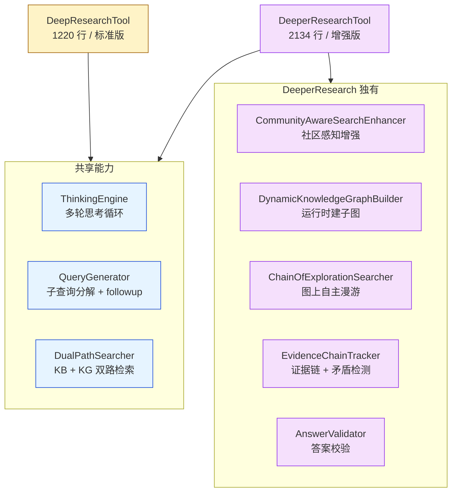
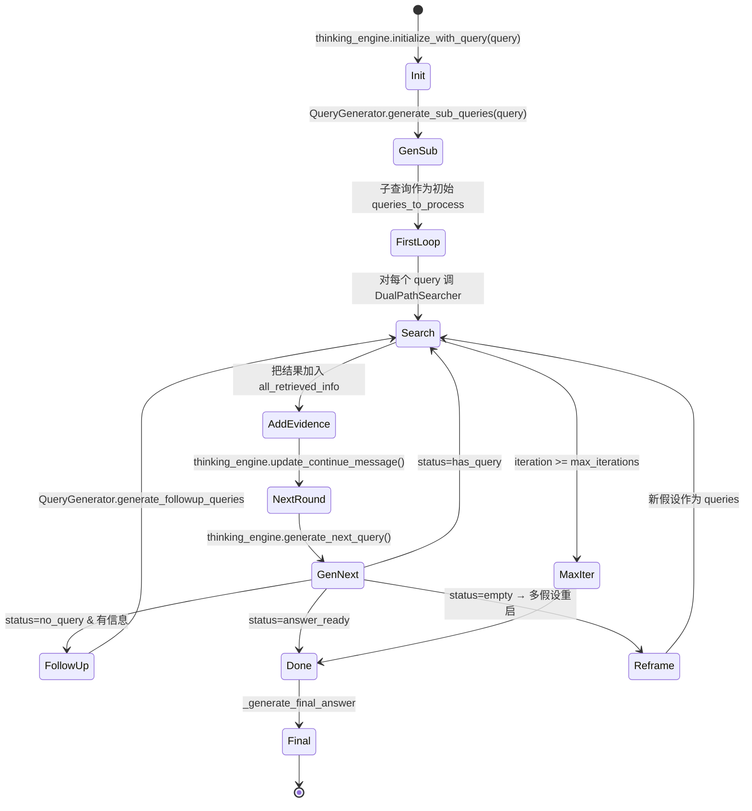
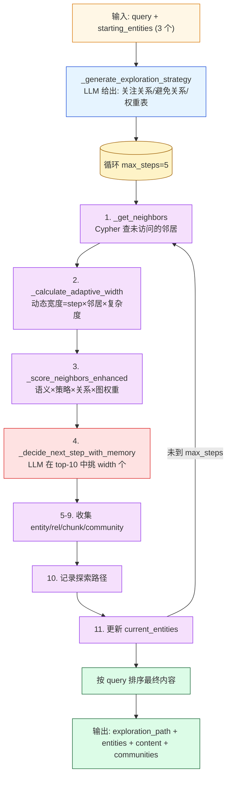

# 第 08 篇 · DeepResearch + Chain of Exploration

> 本系列共 16 篇，本文是 **Part 2（GraphRAG 检索）的收官篇**：把项目里**最厚重的两个文件**——`deep_research_tool.py`（1220 行）和 `deeper_research_tool.py`（2134 行）——加上配套的 `reasoning/` 子包 8 个模块，一次性拆透。
>
> 这一篇覆盖项目最复杂的功能：**多轮思考-搜索-推理迭代、图上 Chain of Exploration 自主漫游、假设生成-验证-反事实分析、动态 KG 构建、证据链追踪、矛盾检测**。读完后你能讲清"为什么 GraphRAG + Agent 推理是 RAG 的下一代形态"。

---

## 1. 学习目标

读完本篇你应该能：

1. 区分两个并存工具：**`DeepResearchTool`（标准版）** vs **`DeeperResearchTool`（增强版）**——后者多了哪 4 项能力？为什么不直接合并？
2. 看懂**多轮思考-搜索循环**的状态机：`generate_initial_thinking → 子查询分解 → 搜索 → 结果整合 → generate_next_query → ...`，知道每个状态的退出条件。
3. 解释 **`ThinkingEngine` 的推理树（reasoning_tree）+ 分支机制**——`branch_reasoning / counter_factual_analysis / merge_branches` 怎么把思考过程做成 Git-like 的可分支结构。
4. 读懂 **`ChainOfExplorationSearcher` 的图上漫游算法**：动态宽度控制 + LLM 决策下一跳 + 探索记忆——这是项目里最像 AlphaGo MCTS 的部分。
5. 知道 **`EvidenceChainTracker`** 怎么追踪「哪个推理步骤用了哪段证据」，以及它怎么实现"矛盾检测"（数值矛盾 + 语义矛盾）。
6. 识别项目实现的 **HyDE / 假设生成 / Step-back / 反事实分析** 四种高级推理模式，分别落在哪个文件。

---

## 2. 前置知识

- 已读 **第 07 篇**：知道 Local/Global/Hybrid/Naive 四种基础检索如何调用。
- 听过 ReAct (Yao et al. 2022) 与 Reflexion (Shinn et al. 2023) 的核心思路。
- 熟悉 LangChain `BaseTool` 子类化模式。
- 听过 MCTS（蒙特卡洛树搜索）的"扩展-评估-回溯"框架（非必需，但能帮你理解 Chain of Exploration）。

---

## 3. 源码地图

| 文件 | 关键类 / 函数 | 行号锚点 |
|---|---|---|
| `graphrag_agent/search/tool/deep_research_tool.py` | `DeepResearchTool.thinking`（多轮思考主循环） | `deep_research_tool.py:433-660` |
|  | `DeepResearchTool.thinking_stream`（流式版） | `deep_research_tool.py:769-1057` |
|  | `_create_kb_retrieval_func / _create_kg_retrieval_func`（知识库 / 知识图谱双路） | `deep_research_tool.py:178-355` |
|  | `get_tool / get_thinking_tool / get_thinking_stream_tool`（三种工具变体） | `deep_research_tool.py:734-1219` |
| `graphrag_agent/search/tool/deeper_research_tool.py` | `DeeperResearchTool.__init__`（加载 5 个增强组件） | `deeper_research_tool.py:48-137` |
|  | `DeeperResearchTool.thinking`（增强版 + 假设+矛盾检测） | `deeper_research_tool.py:156-994` |
|  | `get_exploration_tool / get_reasoning_analysis_tool` | `deeper_research_tool.py:1132-1197` |
| `graphrag_agent/search/tool/reasoning/thinking.py` | `ThinkingEngine`（推理树 + 假设验证 + 反事实） | `reasoning/thinking.py:26-762` |
| `graphrag_agent/search/tool/reasoning/chain_of_exploration.py` | `ChainOfExplorationSearcher.explore`（图上漫游） | `reasoning/chain_of_exploration.py:9-807` |
| `graphrag_agent/search/tool/reasoning/search.py` | `DualPathSearcher`（KB + KG 双路）/ `QueryGenerator` | `reasoning/search.py:9-300` |
| `graphrag_agent/search/tool/reasoning/community_enhance.py` | `CommunityAwareSearchEnhancer`（社区感知） | `reasoning/community_enhance.py:8-300` |
| `graphrag_agent/search/tool/reasoning/kg_builder.py` | `DynamicKnowledgeGraphBuilder`（运行时建子图） | `reasoning/kg_builder.py:6-300` |
| `graphrag_agent/search/tool/reasoning/evidence.py` | `EvidenceChainTracker.detect_contradictions` | `reasoning/evidence.py:7-600` |
| `graphrag_agent/search/tool/reasoning/validator.py` | `AnswerValidator.validate`（关键词覆盖度兜底） | `reasoning/validator.py:3-160` |
| `graphrag_agent/search/tool/chain_exploration_tool.py` | `ChainOfExplorationTool`（LangChain Tool 包装） | 全文件 |
| `graphrag_agent/search/tool/hypothesis_tool.py` | `HypothesisGeneratorTool` | 全文件 |
| `graphrag_agent/search/tool/validation_tool.py` | `AnswerValidationTool` | 全文件 |
| `graphrag_agent/config/prompts/reasoning_prompts.py` | 18 个推理 prompt（含 `BEGIN_SEARCH_QUERY`/`HYPOTHESIS_*`/`COUNTERFACTUAL_*`） | `reasoning_prompts.py` 316 行 |

---

## 4. 核心机制讲解

### 4.1 双工具关系：DeepResearch vs DeeperResearch



**为什么两个工具并存而不合并**？

- **DeepResearch** 是项目早期版本，对应 GraphRAG 论文的"baseline 多轮检索"。
- **DeeperResearch** 是后期产物，加入了 5 个工程化能力。
- 项目保留 baseline 是为了**对照实验**（评测时能看到"加入 Chain of Exploration 提升多少"）。
- `DeepResearchAgent.__init__:37-67`（**第 09 篇** 会展开）通过 `use_deeper_tool=True/False` 切换。

**含义**：学习时**重点看 DeeperResearchTool**，DeepResearchTool 是它的精简前身。

### 4.2 多轮思考-搜索循环主状态机

`DeepResearchTool.thinking` (`deep_research_tool.py:433-660`) 是最核心的循环。状态机表达：



**几个值得拆解的细节**：

#### 4.2.1 `status` 五态机制（`thinking_engine.generate_next_query`）

```python
# reasoning/thinking.py:576-630（节选）
def generate_next_query(self):
    msg = self.llm.invoke([SystemMessage(content=REASON_PROMPT)] + self.msg_history)
    query_think = msg.content
    
    queries = self.extract_queries(query_think)   # 提取 <|begin_search_query|>...<|end_search_query|>
    
    if not queries:
        if "**回答**" in query_think or "足够的信息" in query_think:
            return {"status": "answer_ready", ...}
        return {"status": "no_query", ...}
    
    return {"status": "has_query", "queries": queries}
```

**5 种状态各自走不同分支**（在 `deep_research_tool.py:495-540`）：

| status | 含义 | 处理 |
|---|---|---|
| `has_query` | 正常生成了新查询 | 继续搜索 |
| `answer_ready` | LLM 自认已有足够信息 | 直接 break 进生成最终答案 |
| `no_query` | LLM 没出查询但也没说"够了" | 继续等下一轮 |
| `empty` | LLM 返回了空内容 | **多假设重启**（生成多个新方向） |
| `error` | LLM 调用失败 | 终止 |

这种 **"自然语言信号 → 受控状态"** 的设计是 ReAct 模式的典型范式。

#### 4.2.2 自定义"控制 Token"

`reasoning_prompts.py` 定义了 4 个标记常量：

```python
BEGIN_SEARCH_QUERY = "<|begin_search_query|>"
END_SEARCH_QUERY = "<|end_search_query|>"
BEGIN_SEARCH_RESULT = "<|begin_search_result|>"
END_SEARCH_RESULT = "<|end_search_result|>"
```

**用途**：LLM 在思考过程中产出 `<|begin_search_query|> 国家奖学金的具体条件 <|end_search_query|>` 这样的子句，下游用 `extract_between()` 正则提取。

**为什么用这种「类 HTML」标记**？

- LLM 对长 token 序列识别稳定，比 JSON 结构化输出更鲁棒。
- 易于在思考链中"夹带搜索请求"——同一段 LLM 输出可以混合推理文本和搜索意图。
- 缺点：解析依赖正则，**多余空格 / 中文括号都可能让标记错位**。

#### 4.2.3 推理历史的"截断保留"

```python
# reasoning/thinking.py:673-723
def prepare_truncated_reasoning(self):
    if len(steps) <= 5:
        return all_steps          # 全保留
    
    important_steps = [
        (0, steps[0]),             # 第一步永远保留
        *[(i, steps[i]) for i in range(max(1, len(steps)-4), len(steps))],  # 最后 4 步
        *[(i, s) for i, s in enumerate(steps[1:-4]) if BEGIN_SEARCH_QUERY in s or BEGIN_SEARCH_RESULT in s]
    ]
    # 中间用 "..." 表示省略
```

**"开头 + 结尾 + 含查询/结果的中间步骤"** 三段保留策略——这是为了在长推理链下不被 LLM 上下文窗口炸掉。项目里**没有用 LangChain 的 `ConversationSummaryMemory`**，而是手动控制——更精确但也更脆弱。

### 4.3 ThinkingEngine 的「分支推理树」

`reasoning/thinking.py:26-762` 的 `ThinkingEngine` 实现了一个 **Git-like 的推理分支**结构：

```python
self.reasoning_tree = {
    "main": [step1, step2, ...],
    "counter_factual_1234": [step1, step2, alt_step3, ...],
    ...
}
self.current_branch = "main"
```

API 三件套：

- **`branch_reasoning(branch_name, base_branch)`**：从某条已有分支创建新分支，复制其所有步骤。
- **`switch_branch(branch_name)`**：切换当前活动分支。
- **`merge_branches(source, target)`**：合并两条分支，把 source 独有的步骤追加到 target。

最有意思的应用是 **`counter_factual_analysis`**（`thinking.py:460-501`）：

```python
def counter_factual_analysis(self, hypothesis):
    branch_name = f"counter_factual_{int(time.time())}"
    self.branch_reasoning(branch_name)             # 新建反事实分支
    self.add_reasoning_step(f"反事实假设: {hypothesis}")
    
    counter_analysis = self.llm.invoke(COUNTERFACTUAL_ANALYSIS_PROMPT.format(...))
    comparison = self.llm.invoke(COUNTERFACTUAL_COMPARISON_PROMPT.format(...))
    
    self.switch_branch("main")                       # 回到主分支
    self.add_reasoning_step(f"反事实分析总结: 如果 {hypothesis}, 那么 {结论}")
```

**含义**：项目支持 **"在不污染主推理链的前提下尝试不同假设"**——这是相比 ReAct 更高级的能力，对应 **Reflexion (Shinn 2023) + Tree-of-Thoughts (Yao 2024) 的混合体**。

注意：grep 整个项目，`counter_factual_analysis` 在 `DeeperResearchTool.thinking` 内**没有被显式调用** —— 它是一个**预留的高级接口**，等待 Agent 层显式触发。

### 4.4 Chain of Exploration：图上 MCTS-Like 漫游

`ChainOfExplorationSearcher.explore` (`reasoning/chain_of_exploration.py:33-172`) 是项目的"招牌算法"。**11 步循环**：



#### 4.4.1 动态宽度控制（避免指数爆炸）

```python
# reasoning/chain_of_exploration.py:238-264
def _calculate_adaptive_width(self, step, query, neighbors, base_width=3):
    step_factor      = max(0.5, 1.0 - step * 0.2)   # 每步衰减 20%
    neighbor_factor  = min(1.5, len(neighbors) / 10)
    complexity_factor = self._estimate_query_complexity(query)  # 0.5-1.5
    
    adjusted_width = int(base_width * step_factor * neighbor_factor * complexity_factor)
    return max(1, min(5, adjusted_width))           # 钳制 [1, 5]
```

**含义**：

- 第 0 步：宽度 ≈ 3-5
- 第 4 步：宽度 ≈ 1-2

这种**衰减式宽度**避免了"5 步 × 5 宽度 = 探索 3125 个节点"的指数爆炸。**与 MCTS 的渐进剪枝思想一致**。

#### 4.4.2 四级评分加权

```python
# reasoning/chain_of_exploration.py:401
final_score = similarity * strategy_score * relation_weight * graph_weight
```

四个因子各自的来源：

| 因子 | 来源 | 范围 |
|---|---|---|
| `similarity` | 邻居 description vs query 的 cosine | 0-1 |
| `strategy_score` | 命中 focus_relations +0.5、focus_entity_types +0.3、avoid_relations -0.5 | 0.5-1.8 |
| `relation_weight` | LLM 给定的关系类型权重 | 0-1 |
| `graph_weight` | Neo4j 中 `r.weight` 字段 | ≥0 |

**乘性而非加性**：任何一个因子为 0 都会让节点被强排除（"avoid 关系"会显著降分）。

#### 4.4.3 探索记忆 + LLM 决策

```python
# reasoning/chain_of_exploration.py:455-553（精简）
memory_key = f"{query}_{','.join(sorted(current_entities))}"
if memory_key in self.exploration_memory and remembered["step"] == current_step:
    return remembered["entities"], remembered["reasoning"]   # 命中缓存

prompt = f"""... 当前实体: {current_entities}, 下面是评分 top-10 邻居:
1. {neighbor['id']} (得分: {neighbor['final_score']:.2f})
   - 描述: {neighbor['description']}
   - 关系: {neighbor['relation_type']}
请选择最多 {width} 个最有价值的实体..."""

response = self.llm.invoke(prompt)
# 正则解析 "实体: [...]" "推理: ..."
```

**两点价值**：

- **LLM 看完候选列表再决策**——比纯算法选择更"语义感知"。
- **记忆机制**：相同 `(query, current_entities, step)` 缓存复用——同一会话中重复探索同一子图免费。

### 4.5 reasoning/ 子包 8 模块全景

| 模块 | 核心类 | 一句话职责 |
|---|---|---|
| `thinking.py` | `ThinkingEngine` | 推理树 + 假设生成验证 + 反事实分析 |
| `chain_of_exploration.py` | `ChainOfExplorationSearcher` | 图上自主多步漫游 |
| `search.py` | `DualPathSearcher / QueryGenerator` | KB+KG 双路检索 / 子查询分解 + followup |
| `community_enhance.py` | `CommunityAwareSearchEnhancer` | 用社区摘要丰富搜索上下文 |
| `kg_builder.py` | `DynamicKnowledgeGraphBuilder` | 运行时从 chunk 临时抽实体建子图 |
| `evidence.py` | `EvidenceChainTracker` | 证据链追踪 + 矛盾检测 + 引用生成 |
| `validator.py` | `AnswerValidator` | 答案 vs query 关键词覆盖度兜底 |
| `nlp.py` | `extract_between` 等 | 字符串提取工具 |
| `prompts.py` | 局部 prompt 常量 | 模块级 prompt |

**值得专门提**的两个：

#### 4.5.1 `EvidenceChainTracker`：证据链 + 矛盾检测

```python
# reasoning/evidence.py（核心 API）
tracker = EvidenceChainTracker()
qid = tracker.start_new_query(query, keywords)
sid = tracker.add_reasoning_step(qid, "我猜国奖要求 GPA ≥ 3.5")
eid = tracker.add_evidence(sid, "学生手册第 12 页：要求 GPA ≥ 3.5", source="chunk_42")

# 矛盾检测
contradictions = tracker.detect_contradictions([eid1, eid2])
```

`detect_contradictions` (`reasoning/evidence.py:229-407`) 同时跑两类检测：

- **数值矛盾**：`_extract_numbers_with_context` 用正则 `r'(\d+\.?\d*)'` 抓数字 + 周围 30 字符上下文，对比两段证据中同一概念的数值是否冲突（如 GPA 3.5 vs 3.0）。
- **语义矛盾**：`_detect_semantic_contradiction` 让 LLM 二次判断两段证据是否构成"非此即彼"的语义对立。

**这是项目里少见的"事实校验"机制**——但代码相对实验性，生产中要谨慎依赖。

#### 4.5.2 `DynamicKnowledgeGraphBuilder`：运行时建图

```python
# reasoning/kg_builder.py:27-200
def build_query_graph(self, query, max_depth=2):
    # 1. 取 query 相关的 entity
    starting_entities = self._extract_starting_entities(query)
    # 2. 在主图上深度漫游 max_depth 跳
    subgraph = self._explore_graph(starting_entities, 0, max_depth)
    # 3. 返回这个子图作为"专为本 query 构造的局部图"
    return subgraph
```

**用途**：在 `DeeperResearchTool` 内部，给当前 query 临时构造一张更聚焦的"工作子图"，避免在全图上检索。**类似 GraphRAG 论文中的"local context graph"**。

### 4.6 三种工具变体的差异

`DeepResearchTool` 通过 `get_tool / get_thinking_tool / get_thinking_stream_tool` 返回三个不同的 LangChain Tool，**它们对外行为完全不同**：

| 方法 | 返回工具的 `_run` 行为 | 适用场景 |
|---|---|---|
| `get_tool()` | 调 `self.search(query)` → 直接返回最终答案字符串 | 普通 RAG 调用 |
| `get_thinking_tool()` | 调 `self.thinking(query)` → 返回 dict（含 thinking + answer + ...） | 调试 / 展示思考过程 |
| `get_thinking_stream_tool()` | 调 `self.thinking_stream(query)` → 异步生成器逐步 yield 思考片段 | 前端实时流式显示 |

**DeeperResearchTool** 在此基础上额外提供：

- `get_exploration_tool()` → 调 `ChainOfExplorationSearcher.explore`，**纯图漫游不调主思考链**。
- `get_reasoning_analysis_tool()` → 给定 query_id 返回该查询的推理链分析（调 `EvidenceChainTracker.get_reasoning_chain`）。

---

## 5. 重点技术点深挖

### 5.1 ReAct / Plan-and-Execute / Reflexion 在项目中的对应（C 类技术点）

| 推理模式 | 项目对应 | 关键文件 |
|---|---|---|
| **ReAct** (Yao 2022) | DeepResearch 的"思考-搜索"循环 | `thinking.py:576 generate_next_query` |
| **Plan-and-Execute** (Wang 2023) | Multi-Agent 的 Planner-Executor | `agents/multi_agent/`（**第 11/12 篇**） |
| **Reflexion** (Shinn 2023) | DeeperResearch 的"验证-更新"循环 + ReflectionExecutor | `thinking.py:266 update_thinking_based_on_verification`、`executor/reflector.py` |
| **Tree-of-Thoughts** (Yao 2024) | ThinkingEngine 的分支推理 + counter_factual | `thinking.py:377-501` |
| **HyDE** (Gao 2022) | `generate_hypotheses` 假设生成 | `thinking.py:71-158`、`hypothesis_tool.py` |

**项目混用了多种推理模式**，DeeperResearchTool 内部一次完整 `thinking()` 调用可能同时触发 ReAct（搜索循环）+ Reflexion（假设验证）+ Tree-of-Thoughts（分支推理）。这种"组合推理"比单一模式覆盖面更广。

### 5.2 HyDE 与项目假设生成的差异（A 类技术点）

**经典 HyDE (Hypothetical Document Embeddings)**：

1. LLM 生成 1 篇"假设答案"。
2. 对假设答案取 embedding。
3. 用这个 embedding 检索（而非 query embedding）。

**项目的 `generate_hypotheses`**（`thinking.py:71-107`）：

1. LLM 生成多个"假设方向"（含 reasoning）。
2. **直接用这些假设的文本作为搜索 query**，**不取 embedding**。
3. 每个假设逐个验证。

**对比**：

- HyDE 是检索阶段的 query rewrite，单次调用。
- 项目实现是**生成式探索**，多次调用 + 验证 + 树结构存储。
- 严格说项目不算 HyDE，更像 **"多假设并发搜索 + 后验过滤"**。

### 5.3 思考过程可视化（项目亮点）

项目能把整个推理链转成 Markdown 或 dict 输出给前端展示：

```python
# reasoning/thinking.py:725-740
def get_full_thinking(self):
    thinking = "<think>\n"
    for step in self.all_reasoning_steps:
        clean_step = self.remove_query_tags(step)
        clean_step = self.remove_result_tags(clean_step)
        thinking += clean_step + "\n\n"
    thinking += "</think>"
    return thinking
```

`<think>...</think>` 是项目自创的 wrapper。前端（`frontend/components/debug.py`，**第 15 篇**会讲）会识别这个标签，把思考过程渲染成可折叠的"AI 思考步骤"面板。

**这是项目相对其他开源 GraphRAG 实现的差异化卖点**——即便答案错误，**用户能看到 AI 走了哪些弯路**，这极大提升了系统的"心智可解释性"。

### 5.4 `DualPathSearcher`：KB + KG 双路

```python
# reasoning/search.py 9-200（核心逻辑）
class DualPathSearcher:
    def search(self, query):
        kb_results = self.kb_retrieval_func(query)   # 来自 _create_kb_retrieval_func
        kg_results = self.kg_retrieval_func(query)   # 来自 _create_kg_retrieval_func
        merged = self._merge_and_rank(kb_results, kg_results)
        return merged
```

- **KB 路**：直接对 chunk 做向量检索（类似 Naive Search）。
- **KG 路**：实体邻域 + 关系 + 社区摘要（类似 Local Search）。
- **合并**：根据相关性 + 召回多样性融合。

这是项目里"内部用的 Hybrid"，与第 07 篇的 `HybridSearchTool` 不完全等同——后者是给 Agent 当 tool 用的，前者是 DeepResearch 内部的检索抽象。

---

## 6. Hands-on：跑一次完整 DeepResearch

> 此 Hands-on 假设已构建图谱 + 社区摘要（第 06 篇）。**会消耗较多 LLM 调用**（10-30 次），建议用便宜模型如 `gpt-4o-mini` / `deepseek-chat`。

### 6.1 标准版 DeepResearch 调用

```python
# tmp_deep_research.py
from graphrag_agent.search.tool.deep_research_tool import DeepResearchTool

tool = DeepResearchTool()

# 用 thinking 方法看完整推理过程
result = tool.thinking("国家奖学金和优秀学生评选有什么具体差异？")
print("=== 最终答案 ===")
print(result.get("answer", "")[:500])
print("\n=== 思考过程片段 ===")
thinking = result.get("thinking", "")
print(thinking[:1000] + "..." if len(thinking) > 1000 else thinking)
print("\n=== 检索到的信息数 ===")
print(f"all_retrieved_info: {len(result.get('all_retrieved_info', []))} 条")
```

**预期观察**：

- 日志里会看到"开始第 1 轮迭代"、"生成了 N 个初始子查询"、"AI 认为已有足够信息"。
- `thinking` 字段包含 `<think>...</think>` 包裹的整段推理。
- 迭代次数通常 2-4 次（受 `max_iterations` 限制）。

### 6.2 增强版 DeeperResearch + Chain of Exploration

```python
# tmp_deeper_research.py
from graphrag_agent.search.tool.deeper_research_tool import DeeperResearchTool

tool = DeeperResearchTool()

# 用 thinking 跑增强版完整流程
result = tool.thinking("学校的处分制度和奖励制度有什么逻辑关系？")
print("=== 答案 ===")
print(result.get("answer", "")[:500])

# 单独调用 exploration_tool
exploration = tool.get_exploration_tool()
explore_result = exploration._run({
    "query": "国家奖学金",
    "entities": ["国家奖学金", "学生", "教育部"]
})
print("\n=== Chain of Exploration 路径 ===")
for step in explore_result.get("exploration_path", []):
    print(f"  step {step['step']}: {step['node_id']} ({step['action']}) - {step['reasoning'][:60]}")
```

**预期观察**：

- `exploration_path` 中能看到从起始实体逐步漫游到的实体，每步有 LLM 的 `reasoning`。
- 步数受 `max_steps=5` 限制。
- 漫游过程对应 4.4 节图示的 11 步循环。

### 6.3 看证据链与矛盾检测

```python
# tmp_evidence_chain.py
from graphrag_agent.search.tool.reasoning.evidence import EvidenceChainTracker

tracker = EvidenceChainTracker()
qid = tracker.start_new_query("国家奖学金的 GPA 要求", {"high_level": ["奖学金"], "low_level": ["GPA"]})

sid = tracker.add_reasoning_step(qid, "查找 GPA 要求")
e1 = tracker.add_evidence(sid, "文件 A：要求 GPA ≥ 3.5", source="doc_A", confidence=0.9)
e2 = tracker.add_evidence(sid, "文件 B：要求 GPA ≥ 3.0", source="doc_B", confidence=0.8)

# 触发矛盾检测
contradictions = tracker.detect_contradictions([e1, e2])
print(contradictions)
```

**预期观察**：返回 `{"contradictions": [...]}` 列表，包含数值矛盾（3.5 vs 3.0）的具体信息。

### 6.4 看 ThinkingEngine 推理树

```python
# tmp_thinking_tree.py
from graphrag_agent.models.get_models import get_llm_model
from graphrag_agent.search.tool.reasoning.thinking import ThinkingEngine

engine = ThinkingEngine(get_llm_model())
engine.initialize_with_query("奖学金评选标准如何制定？")

# 触发完整深度思考流程
result = engine.think_deeper("奖学金评选标准如何制定？")
print(result[:500])

# 看推理树
print("\n=== 推理树分支 ===")
for branch, steps in engine.reasoning_tree.items():
    print(f"分支: {branch}, 步骤数: {len(steps)}")

# 触发反事实分析（会自动新建分支）
engine.counter_factual_analysis("如果学校只看 GPA 不看德育")
print("\n=== 反事实分析后的分支 ===")
for branch in engine.reasoning_tree.keys():
    print(f"  - {branch}")
```

**预期观察**：

- 主分支 `main` 包含初步思考 + 假设生成 + 验证 + 更新思考。
- 反事实分析后会多出 `counter_factual_<timestamp>` 分支。

### 6.5 Debug 提示

- **断点位置 1**：`deep_research_tool.py:495 result = self.thinking_engine.generate_next_query()`，看 `result["status"]` 的实际取值——这是迭代循环的核心调度点。
- **断点位置 2**：`reasoning/chain_of_exploration.py:111 next_entities, reasoning = self._decide_next_step_with_memory(...)`，看 LLM 实际挑了哪些节点。
- **断点位置 3**：`reasoning/thinking.py:584 formatted_messages = [SystemMessage(...)] + self.msg_history`，看完整的对话历史长度——超过 LLM 上下文窗口会触发 `prepare_truncated_reasoning`。
- **常见错误 1**：`KeyError: 'queries'`——通常是 LLM 输出格式不规范，`extract_between` 没能提取出 `<|begin_search_query|>` 标记之间的内容。检查 prompt 是否被正确遵守。
- **常见错误 2**：Chain of Exploration 探索 0 步就结束——`starting_entities` 在图中不存在。检查实体名是否完全匹配。

---

## 7. 思考题

1. **真流式（token 级）改造**：当前 `thinking_stream` 是"按思考步骤"流式（粗粒度）。如何改成 LLM token 级流式？最大改造点是什么？（提示：用 `astream_events` v2 + `<|begin_search_query|>` 标记检测）
2. **可观测性：推理可视化**：你想在前端把 ThinkingEngine 的 `reasoning_tree` 渲染成可交互的图（节点 = 推理步骤、边 = 分支关系）。最小数据 API 接口应该返回什么？（提示：考虑 `D3.js` 的 tree layout 数据格式）
3. **矛盾检测的工程化**：`detect_contradictions` 当前用 LLM + 正则混合。如何升级到生产可用？（提示：考虑 `nli` 模型 entailment 判断、阈值化置信度）

---

## 8. 延伸阅读

- **GraphRAG 原论文（DRIFT Search 部分）**：[arXiv:2404.16130](https://arxiv.org/abs/2404.16130)
- **ReAct 论文**：[Yao et al. 2022, arXiv:2210.03629](https://arxiv.org/abs/2210.03629)
- **Reflexion 论文**：[Shinn et al. 2023, arXiv:2303.11366](https://arxiv.org/abs/2303.11366)
- **Tree-of-Thoughts 论文**：[Yao et al. 2024, arXiv:2305.10601](https://arxiv.org/abs/2305.10601)
- **HyDE 论文**：[Gao et al. 2022, arXiv:2212.10496](https://arxiv.org/abs/2212.10496)
- **微软 GraphRAG DRIFT Search 实现**：[graphrag/query/structured_search/drift_search](https://github.com/microsoft/graphrag/tree/main/graphrag/query/structured_search/drift_search) —— 对照本项目的实现。
- **Wikipedia · MCTS**：[Monte Carlo tree search](https://en.wikipedia.org/wiki/Monte_Carlo_tree_search) —— 理解 Chain of Exploration 的 inspiration。

---

> ✅ 本篇结束。**Part 2（GraphRAG 检索）全部完成**——你已经能讲清从"四种基础工具"到"3000 行多轮推理引擎"的完整能力光谱。
>
> 接下来 **Part 3（LangGraph & Agent 内核）** 第 09 篇会回到工程视角：BaseAgent 怎么用 LangGraph 把这些检索工具串成可循环、可路由的 Agent 流程。
>
> 调参口诀：**普通问题走 DeepResearch；复杂关系走 DeeperResearch；纯图漫游用 exploration_tool；前端展示用 stream_tool**。
