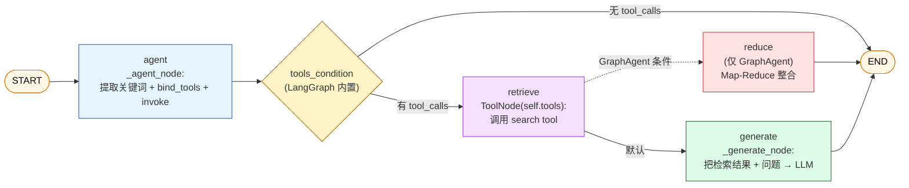
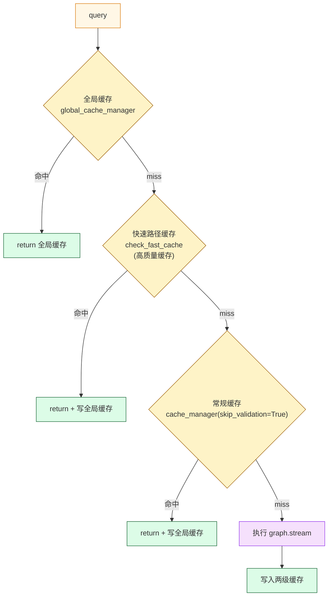

# 第 09 篇 · BaseAgent + LangGraph StateGraph 与五种 Agent 对比

> 本系列共 16 篇，本文是 **Part 3（LangGraph & Agent 内核）的第 1 站**，也是**最关键的 3 篇之一**（罗盘篇）：把项目的"五种 Agent + LangGraph 编排骨架 + 两级缓存"一次性串起来，让你能在任何一个 Agent 上自由地加节点、改路由、做扩展。
>
> 读完本篇你才真正理解：**为什么前面 8 篇做的所有检索能力，到了 Agent 层才变得"可用"**。

---

## 1. 学习目标

读完本篇你应该能：

1. 画出 `BaseAgent._setup_graph` 构建的标准 5 节点 LangGraph：`START → agent → tools_condition → retrieve → generate → END`。
2. 知道五种 Agent 在三件事上的差异：**装什么工具 / 怎么路由 / 怎么生成回答**——并能在源码里立刻定位每种 Agent 的对应函数。
3. 看懂 `FusionGraphRAGAgent` 的"_GraphShim 绕道"：它**完全不走 LangGraph**，为什么这是有意为之？
4. 理解 `ask / ask_with_trace / ask_stream` 三种调用入口的差异，以及每个入口里的"三级缓存路径"（全局缓存 → 快速路径缓存 → 常规缓存）。
5. 解释 `MemorySaver` + `recursion_limit=5` 这两个 LangGraph 关键参数的取舍——为什么项目不持久化 checkpoint？
6. 识别项目里"伪流式"的真相：`_stream_process` 是先全量生成再切句，**没用 `astream_events`**。

---

## 2. 前置知识

- 已读 **第 07、08 篇**：知道四种基础检索 + DeepResearch 的内部结构。
- 已读 **第 01 篇**：知道两级缓存（session-aware + global）的基本概念。
- 熟悉 LangGraph 基本术语：`StateGraph` / `TypedDict` / `ToolNode` / `tools_condition` / `MemorySaver`。
- 知道 LangChain 的 `llm.bind_tools(tools)` 接口（让 LLM 在生成时输出工具调用 JSON）。

---

## 3. 源码地图

| 文件 | 关键类 / 函数 | 行号锚点 |
|---|---|---|
| `graphrag_agent/agents/base.py` | `BaseAgent.__init__`（构造缓存 + 工具 + 图） | `agents/base.py:21-74` |
|  | `_setup_graph`（构建 LangGraph） | `agents/base.py:81-113` |
|  | `_agent_node`（关键词提取 + bind_tools） | `agents/base.py:192-219` |
|  | `ask` / `ask_with_trace` / `ask_stream`（三种入口） | `agents/base.py:350-649` |
|  | `_check_all_caches`（三级缓存检查） | `agents/base.py:292-348` |
| `graphrag_agent/agents/naive_rag_agent.py` | 最简 ReAct Agent | `naive_rag_agent.py:14-167` |
| `graphrag_agent/agents/graph_agent.py` | GraphAgent + 条件路由（local vs global → reduce） | `graph_agent.py:26-528` |
| `graphrag_agent/agents/hybrid_agent.py` | HybridAgent | `hybrid_agent.py:18-...` |
| `graphrag_agent/agents/deep_research_agent.py` | DeepResearchAgent + 探索/矛盾检测扩展接口 | `deep_research_agent.py:21-628` |
| `graphrag_agent/agents/fusion_agent.py` | FusionGraphRAGAgent + `_GraphShim` 绕道 | `fusion_agent.py:24-92` |
| `graphrag_agent/config/prompts/agent_prompts.py` | 8 个 Agent 级 prompt | `agent_prompts.py` 全文件 |
| `graphrag_agent/config/settings.py` | `AGENT_SETTINGS`（recursion_limit / chunk_size / flush_threshold） | `settings.py:293-306` |

---

## 4. 核心机制讲解

### 4.1 BaseAgent 的 5 节点 StateGraph

`BaseAgent._setup_graph` (`agents/base.py:81-113`) 是所有 Agent 的骨架：

```python
class AgentState(TypedDict):
    messages: Annotated[Sequence[BaseMessage], add_messages]

workflow = StateGraph(AgentState)
workflow.add_node("agent",    self._agent_node)
workflow.add_node("retrieve", ToolNode(self.tools))
workflow.add_node("generate", self._generate_node)

workflow.add_edge(START, "agent")
workflow.add_conditional_edges(
    "agent", tools_condition,
    {"tools": "retrieve", END: END},
)
self._add_retrieval_edges(workflow)             # ← 子类自定义
workflow.add_edge("generate", END)
self.graph = workflow.compile(checkpointer=self.memory)
```

可视化：



**3 个内置组件、2 个抽象点**：

| 角色 | 来源 | 子类是否覆盖 |
|---|---|---|
| `agent` 节点 | `BaseAgent._agent_node`（关键词提取 + `bind_tools`） | ❌ 通用 |
| `retrieve` 节点 | LangGraph 内置 `ToolNode(self.tools)` | ❌ 通用 |
| `tools_condition` | LangGraph 内置（看消息里有没有 tool_calls） | ❌ 通用 |
| `_setup_tools()` | **抽象方法** | ✅ 每个 Agent 必填 |
| `_add_retrieval_edges(workflow)` | **抽象方法** | ✅ 每个 Agent 必填 |
| `_generate_node()` | **抽象方法** | ✅ 每个 Agent 必填 |
| `_extract_keywords()` | **抽象方法** | ✅ 每个 Agent 必填 |

**这种"骨架 + 钩子"模式**让"加一个新 Agent"几乎只需要：

```python
class MyAgent(BaseAgent):
    def _setup_tools(self):
        return [MyTool()]
    def _add_retrieval_edges(self, wf):
        wf.add_edge("retrieve", "generate")
    def _extract_keywords(self, q):
        return {"low_level": [], "high_level": []}
    def _generate_node(self, state):
        return {"messages": [AIMessage(content=...)]}
```

不到 20 行就能挂入项目主流程。

### 4.2 `_agent_node`：关键词增强 + bind_tools

```python
# agents/base.py:192-219
def _agent_node(self, state):
    messages = state["messages"]
    if len(messages) > 0 and isinstance(messages[-1], HumanMessage):
        query = messages[-1].content
        keywords = self._extract_keywords(query)
        if keywords:
            enhanced_message = HumanMessage(
                content=query,
                additional_kwargs={"keywords": keywords}
            )
            messages = messages[:-1] + [enhanced_message]
    
    model = self.llm.bind_tools(self.tools)
    response = model.invoke(messages)
    return {"messages": [response]}
```

两个关键操作：

1. **关键词增强**：先抽取 query 关键词，**附加到 message 的 `additional_kwargs`** 上——下游 `_grade_documents`（GraphAgent）会拿来用。
2. **`bind_tools(self.tools)`**：把工具的 JSON schema 拼到 LLM 调用里——LLM 决定**是否**调工具以及调哪个。

**`tools_condition` 内置逻辑**（LangGraph 自带）：检查最新消息有没有 `tool_calls` 字段。有 → 走 `retrieve`，没有 → 走 END。这是 LangGraph 最标准的"ReAct"模式。

### 4.3 五种 Agent 横向对比

| Agent | `_setup_tools` 返回 | `_add_retrieval_edges` | LangGraph 路由形态 | 适合问题 |
|---|---|---|---|---|
| **NaiveRagAgent** (`naive_rag_agent.py:14`) | `[NaiveSearchTool.get_tool()]` | `wf.add_edge("retrieve","generate")` | 单线 retrieve→generate | 简单事实 |
| **GraphAgent** (`graph_agent.py:26`) | `[LocalSearchTool.get_tool(), GlobalSearchTool.search]` | 添加 `reduce` 节点 + `add_conditional_edges("retrieve", _grade_documents, {"generate","reduce"})` | **两条分支**：local→generate / global→reduce | 关系推理 + 宏观综合 |
| **HybridAgent** (`hybrid_agent.py:18`) | `[HybridSearchTool.get_tool(), HybridSearchTool.get_global_tool()]` | `wf.add_edge("retrieve","generate")` | 单线 retrieve→generate（双工具由 LLM 选） | 混合型 |
| **DeepResearchAgent** (`deep_research_agent.py:21`) | `[research_tool.get_tool/_thinking_tool/_stream_tool]`（最多 4 个） | `wf.add_edge("retrieve","generate")` | 单线 retrieve→generate（**底层是 DeepResearchTool.thinking() 多轮循环**） | 复杂深度问题 |
| **FusionGraphRAGAgent** (`fusion_agent.py:24`) | ❌ 不重写 | ❌ 不重写 | **完全绕过 LangGraph**（`_GraphShim` 空壳） | 长文档生成 |

**最值得专门讲的两条**：

#### 4.3.1 GraphAgent 的双分支路由

`graph_agent.py:47-63` 的 `_add_retrieval_edges`：

```python
def _add_retrieval_edges(self, workflow):
    workflow.add_node("reduce", self._reduce_node)
    
    workflow.add_conditional_edges(
        "retrieve",
        self._grade_documents,
        {
            "generate": "generate", 
            "reduce": "reduce"
        }
    )
    workflow.add_edge("reduce", END)
```

`_grade_documents` (`graph_agent.py:112-169`) 看刚执行的工具调用名字：

```python
tool_calls = retrieve_message.additional_kwargs.get("tool_calls", [])
if tool_calls and tool_calls[0]["function"]["name"] == "global_retriever":
    return "reduce"
return "generate"
```

**`global_retriever`** 工具会触发 GraphRAG 论文里的 Map-Reduce 模式（**第 07 篇 4.5 节**），需要二次"reduce"汇总；`local_search_tool` 的结果已经够直接生成。

这是项目里**唯一基于"工具类型"做路由**的 Agent。

#### 4.3.2 FusionGraphRAGAgent 的"_GraphShim"

```python
# agents/fusion_agent.py:24-37
class FusionGraphRAGAgent:        # ← 注意：不继承 BaseAgent！
    def __init__(self, cache_dir="./cache/fusion_graphrag"):
        self.multi_agent = MultiAgentFacade()
        self.memory = _MemoryShim()    # 空壳
        self.graph = _GraphShim()      # 空壳
        ...
```

`_GraphShim / _MemoryShim` 是两个空对象：

```python
# agents/fusion_agent.py:10-21
class _MemoryShim:
    def get(self, _config):
        return {"channel_values": {"messages": []}}

class _GraphShim:
    def update_state(self, *_, **__):
        return None
```

**为什么这么设计**？

- 上层 `server/services/agent_service.py` 把所有 Agent 当成"鸭子类型"——必须有 `memory.get(config)["channel_values"]["messages"]` 和 `graph.update_state(...)` 接口。
- FusionGraphRAGAgent 内部走的是完全不同的 Plan-Execute-Report 流程（**第 11/12/13 篇**会详讲），**LangGraph 帮不上忙**——多智能体编排本身就是手写的状态机。
- 用 shim 让接口兼容，避免在 `agent_service.py` 加特判分支。

**含义**：

- 教学价值：**告诉你 LangGraph 不是 silver bullet**，复杂多智能体可以手写。
- 工程教训：用"假对象兼容旧接口"是合法的、有时是最优的——但要给后人留好注释，否则容易看错。

### 4.4 `ask` 入口的三级缓存路径

`BaseAgent.ask` (`agents/base.py:459-515`) 的核心逻辑：

```python
def ask(self, query, thread_id="default", recursion_limit=None):
    safe_query = query.strip()
    cached_result = self._check_all_caches(safe_query, thread_id)
    if cached_result:
        return cached_result
    
    config = {"configurable": {"thread_id": thread_id, "recursion_limit": recursion_value}}
    inputs = {"messages": [HumanMessage(content=query)]}
    for output in self.graph.stream(inputs, config=config):
        pass
    chat_history = self.memory.get(config)["channel_values"]["messages"]
    answer = chat_history[-1].content
    
    if answer and len(answer) > 10:
        self.cache_manager.set(safe_query, answer, thread_id=thread_id)
        self.global_cache_manager.set(safe_query, answer)
    return answer
```

`_check_all_caches` (`agents/base.py:292-348`) 是项目最有意思的缓存调度：



**三级有什么差异**？

| 层 | 命中条件 | 是否做答案验证 | 命中后副作用 |
|---|---|---|---|
| **全局缓存** | 跨会话相同 query | 否（已是 verified） | 直接返回 |
| **快速路径** | 命中 + `is_high_quality=True` | 否（已被标记高质量） | **回写到全局缓存** |
| **常规缓存** | 命中（任何质量） | `skip_validation=True` 跳过 | **回写到全局缓存** |

**核心设计意图**：

- 用过的高质量答案**自动晋升到全局缓存**，让所有会话受益。
- "高质量"标记由 `mark_answer_quality` 显式打（**第 10 篇** 详讲）。
- 三级机制让"命中率最大化"——任何一层命中都能省掉一次 graph.stream 调用（数十次 LLM）。

### 4.5 `ask_with_trace`：执行轨迹回溯

`ask_with_trace` (`agents/base.py:350-457`) 是 `ask` 的调试版：

```python
self.execution_log = []          # 重置日志
# ... 走相同的三级缓存路径
for output in self.graph.stream(inputs, config=config):
    pprint.pprint(f"Output from node '{list(output.keys())[0]}'")
    # 节点级日志写到 stdout

chat_history = self.memory.get(config)["channel_values"]["messages"]
answer = chat_history[-1].content
return {"answer": answer, "execution_log": self.execution_log}
```

**`execution_log` 是哪里来的**？看 `_log_execution` (`agents/base.py:172-179`)：每个 Agent 子类在 `_generate_node / _reduce_node / _grade_documents` 等关键节点都会调 `self._log_execution(node_name, input, output)` 写入。

**前端调试模式**（**第 15 篇**会详讲）就靠这个日志渲染"执行轨迹"面板。

### 4.6 `ask_stream`：伪流式真相

`ask_stream` (`agents/base.py:517-649`) 的核心：

```python
async def ask_stream(self, query, ...):
    # 三级缓存检查（命中后按句子切分 yield）...
    
    async for chunk in self._stream_process(inputs, config):
        yield chunk
        answer += chunk
    
    if answer and len(answer) > 10:
        self.cache_manager.set(safe_query, answer, thread_id=thread_id)
        self.global_cache_manager.set(safe_query, answer)
```

`_stream_process` 默认实现 (`agents/base.py:115-164`)：

```python
result = await self._generate_node_async(state)   # ← 先全量生成
if "messages" in result and result["messages"]:
    content = result["messages"][0].content
    chunks = re.split(r'([.!?。！？]\s*)', content)
    for i in range(0, len(chunks)):
        buffer += chunks[i]
        if (i % 2 == 1) or len(buffer) >= self.stream_flush_threshold:
            yield buffer
            buffer = ""
            await asyncio.sleep(0.01)
```

**真相**：**完整答案先生成完毕**，再按中英文句末标点切分，逐句 yield。**这是项目自承的"伪流式"**（CLAUDE.md 明确说明）。

**为什么不用 LangGraph 的 `astream_events`**？

- 当时 LangChain 版本（0.3.21）的 streaming 在 `bind_tools` + `ToolNode` 链路上有兼容问题。
- 项目作者优先保证功能 robustness，把 streaming 留作可视化糖衣。

**升级路径**（**第 16 篇 缺口补强** 会详讲）：用 `self.graph.astream_events(...,  version="v2")` 收集 `on_chat_model_stream` 事件，按 token 流。

### 4.7 `MemorySaver`：内存级 checkpointer

```python
# agents/base.py:41
self.memory = MemorySaver()
self.graph = workflow.compile(checkpointer=self.memory)
```

**LangGraph 的 `checkpointer` 是什么**？

- 每次 `graph.stream` 完成后，把整个 state 持久化到 checkpointer。
- 用 `thread_id` 区分不同会话，可以**恢复历史对话**。
- `update_state` 可以"手动回退到某一步"。

**`MemorySaver` 是内存版**：进程一重启就丢光。**项目没用 PG/SQLite 版**（如 `from langgraph.checkpoint.postgres import PostgresSaver`）。

**含义**：

- ✅ 单进程内 `thread_id` 路由有效——同一会话能看到上一轮的消息。
- ❌ 重启后所有会话历史丢失。
- ❌ 多 worker 部署时各 worker 独立 memory——`AgentManager` (**第 15 篇**) 把会话粘到特定 Agent 实例上才能正确路由。

这是项目"教学优先"的妥协。生产建议换 PostgresSaver。

### 4.8 `recursion_limit=5` 的现实含义

```python
# config/settings.py:294
"default_recursion_limit": _get_env_int("AGENT_RECURSION_LIMIT", 5) or 5
```

LangGraph 用 `recursion_limit` 防止循环无限：图执行的"步数"超过这个值会抛 `GraphRecursionError`。

**5 步够不够**？走一遍最复杂的 GraphAgent 路径：

1. START → agent
2. agent → retrieve (tools_condition)
3. retrieve → reduce (条件路由)
4. reduce → END

总共 4 步。**5 是个紧凑但够用的设定**。如果你写了会循环回 agent 的 Agent（如 ReAct 多轮），可能不够，需要在 `ask()` 调用时显式传更大值。

---

## 5. 重点技术点深挖

### 5.1 LangGraph State 管理：可循环 vs LCEL 不可循环（B 类技术点）

LangGraph 最大的特征是**支持循环**：

```mermaid
flowchart LR
    A[agent] --> B{tools_condition}
    B -->|tools| C[retrieve]
    C --> A          %% 可以再回到 agent（多轮 ReAct）
    C --> D[generate]
    B -->|END| E((END))
    D --> E
```

而 LCEL（LangChain Expression Language）的 `prompt | llm | parser` **只能单向**。所以项目要实现"多轮思考-搜索"必须用 LangGraph 而非 LCEL。

**项目实际有循环吗**？看 BaseAgent 的图——**retrieve → generate → END**，没有回环。**真正的循环在 DeepResearchTool.thinking() 内部**，那是 Python while 循环，不是 LangGraph 循环。

**含义**：项目用 LangGraph 主要图取了"State 管理"和"可视化"的好处，**没真正用循环能力**。

### 5.2 Conditional Edges 的两种用法（B 类技术点）

项目里有两种条件边：

| 用法 | 例子 | 路由判断依据 |
|---|---|---|
| **基于消息 tool_calls** | `BaseAgent` 用 `tools_condition` | `messages[-1].tool_calls` 是否非空 |
| **基于工具名** | `GraphAgent._grade_documents` | 看 `tool_calls[0].function.name` |

**对比 LangGraph 官方推荐**：

- LangGraph 0.3+ 推荐用 `Command(goto="...")` 语法做路由（更现代）。
- 项目还在用 `add_conditional_edges` 字典风格，**老式但稳定**。

### 5.3 Pseudo-Stream vs Token-Stream（E 类技术点）

业界对流式输出有三种粒度：

| 粒度 | 实现方式 | 项目用了吗 |
|---|---|---|
| **段落级** | 全量生成 + 按句切分 | ✅ 当前实现 |
| **Token 级** | `astream_events` v2 | ❌ 未用 |
| **混合粒度** | Token + 重要事件（如 tool_calls）合并 | ❌ 未用 |

**当前段落级流式的问题**：

- 用户感知到"延迟"是全量生成时间（几秒到几十秒）。
- 一旦开始 yield 又过快——用户看到的是"突然刷屏"。

升级到 token 级可以让"第一个字 200ms 出现，后面以阅读速度滚动"——这是 ChatGPT 类产品的标准体验。

### 5.4 Tool Selection：当工具 < 10 个时的简化（C 类技术点）

业界讨论"Tool Selection > 50 个"时需要 RAG over Tools。项目里：

- `TOOL_REGISTRY` 6 个 + `EXTRA_TOOL_FACTORIES` 3 个 = **9 个工具** (`search/tool_registry.py`)。
- 每个 Agent 实际只用 1-4 个工具。
- **直接 `bind_tools` 全部塞给 LLM**——LLM 完全有能力一次看完 4 个工具的 schema 并正确选择。

**当工具数量增长时怎么办**（不在项目范围内，但值得思考）：

```python
# 概念示例
relevant_tools = retrieve_tools_by_embedding(query, all_tools, top_k=4)
agent_with_subset = llm.bind_tools(relevant_tools)
```

把工具描述也做成向量索引，按 query 检索 top-k 工具再 bind。

---

## 6. Hands-on：导出 LangGraph 真图 + 五种 Agent 对照

### 6.1 用 LangGraph 内置 API 导出 Agent 真图

```python
# tmp_agent_graph_dump.py
from graphrag_agent.agents.naive_rag_agent import NaiveRagAgent
from graphrag_agent.agents.graph_agent import GraphAgent
from graphrag_agent.agents.hybrid_agent import HybridAgent

agents = {
    "Naive":  NaiveRagAgent(),
    "Graph":  GraphAgent(),
    "Hybrid": HybridAgent(),
}

for name, agent in agents.items():
    print(f"\n=== {name} Agent ===")
    # 文本表示
    print(agent.graph.get_graph().draw_mermaid())
    
    # 导出 PNG（需要 graphviz）
    try:
        png_bytes = agent.graph.get_graph().draw_mermaid_png()
        with open(f"agent_graph_{name}.png", "wb") as f:
            f.write(png_bytes)
        print(f"  -> 已保存 agent_graph_{name}.png")
    except Exception as e:
        print(f"  PNG 失败（缺 graphviz？）: {e}")
```

**预期观察**：每种 Agent 的 mermaid 文本不同，GraphAgent 会比其他多一个 `reduce` 节点。

### 6.2 对比五种 Agent 同一问题的差异

```python
# tmp_agent_compare.py
import time
from graphrag_agent.agents.naive_rag_agent import NaiveRagAgent
from graphrag_agent.agents.graph_agent import GraphAgent
from graphrag_agent.agents.hybrid_agent import HybridAgent
from graphrag_agent.agents.deep_research_agent import DeepResearchAgent
from graphrag_agent.agents.fusion_agent import FusionGraphRAGAgent

agents = {
    "Naive":   NaiveRagAgent(),
    "Graph":   GraphAgent(),
    "Hybrid":  HybridAgent(),
    # "Deep":    DeepResearchAgent(use_deeper_tool=False),  # 较慢
    # "Fusion":  FusionGraphRAGAgent(),                     # 最慢
}

query = "国家奖学金的具体申请条件是什么？"
for name, agent in agents.items():
    t0 = time.time()
    answer = agent.ask(query, thread_id="test")
    elapsed = time.time() - t0
    print(f"\n[{name}] ({elapsed:.2f}s)")
    print(answer[:300] + ("..." if len(answer) > 300 else ""))
    agent.close()
```

**预期观察**：

- Naive 通常最快（1-2s）。
- Hybrid 比 Naive 慢但内容更丰富。
- Graph 会触发条件路由——同一查询可能走 local 或 global 分支。

### 6.3 触发 GraphAgent 的 reduce 路径

```python
# tmp_graph_agent_reduce.py
from graphrag_agent.agents.graph_agent import GraphAgent

ga = GraphAgent()
# 宏观问题更可能让 LLM 选 global_retriever 工具
answer = ga.ask_with_trace("学校学生管理的整体框架与原则是什么？")

print("=== 答案 ===")
print(answer["answer"][:500])

print("\n=== 执行日志（看是否经过 reduce 节点）===")
for log in answer["execution_log"]:
    print(f"  {log['node']}: {str(log.get('output', ''))[:80]}")
```

**预期观察**：`execution_log` 里会看到 `extract_keywords / agent / grade_documents / reduce` 顺序，证明走了 reduce 分支。

### 6.4 看三级缓存如何工作

```python
# tmp_cache_hits.py
from graphrag_agent.agents.naive_rag_agent import NaiveRagAgent

agent = NaiveRagAgent()
query = "申请国家奖学金的具体条件"

print("-- 第 1 次（应该走 graph.stream） --")
t0 = time.time(); ans1 = agent.ask(query, thread_id="user1"); print(f"  耗时: {time.time()-t0:.2f}s")

print("-- 第 2 次（同 query 同 thread）--")
t0 = time.time(); ans2 = agent.ask(query, thread_id="user1"); print(f"  耗时: {time.time()-t0:.2f}s")

print("-- 第 3 次（同 query 不同 thread）--")
t0 = time.time(); ans3 = agent.ask(query, thread_id="user2"); print(f"  耗时: {time.time()-t0:.2f}s")

# 看缓存指标
print("\n性能指标:", agent.performance_metrics)
```

**预期观察**：

- 第 1 次：1-3s。
- 第 2 次：毫秒级（session 缓存命中）。
- 第 3 次：毫秒级（**global 缓存跨 thread 命中**）。

### 6.5 Debug 提示

- **断点位置 1**：`agents/base.py:215 model = self.llm.bind_tools(self.tools)`，看 `self.tools` 的实际 schema。
- **断点位置 2**：`agents/base.py:421 for output in self.graph.stream(inputs, config=config)`，看每个节点的输出。
- **断点位置 3**：`agents/graph_agent.py:115 tool_calls = retrieve_message.additional_kwargs.get("tool_calls", [])`，看路由判断的输入。
- **常见错误**：`GraphRecursionError`——你的 Agent 加了循环但 `recursion_limit=5` 不够。在 `ask()` 调用时传 `recursion_limit=20` 或调高 `AGENT_RECURSION_LIMIT` 环境变量。
- **常见错误**：`KeyError: 'channel_values'`——`memory.get(config)` 时 `config` 缺 `thread_id`。检查传入的 config 字典。

---

## 7. 思考题

1. **写一个 Reflexion Agent**：继承 BaseAgent，加一个 `reflect` 节点：generate → reflect（评估答案质量）→ if 不满意 → agent（重新检索），形成循环。最大改造点是什么？
2. **MemorySaver → PostgresSaver 迁移**：把 `MemorySaver` 换成 LangGraph 官方的 `PostgresSaver`（需要 PG 连接），让重启后会话历史不丢。最少需要改几行代码？（提示：考虑 `BaseAgent.__init__` 加可选参数 `checkpointer`）
3. **FusionGraphRAGAgent 重构机会**：当前用 `_GraphShim` 兼容旧接口。如果允许重构 `agent_service.py`，**怎么去掉 shim**？利弊各是什么？

---

## 8. 延伸阅读

- **LangGraph 官方教程 · Build a Tool-Calling Agent**：[langchain-ai/langgraph · Quickstart](https://langchain-ai.github.io/langgraph/tutorials/introduction/)
- **LangGraph 状态机模式**：[Build a chat bot with conditional logic](https://langchain-ai.github.io/langgraph/tutorials/chatbot/) —— `tools_condition` 与 `add_conditional_edges` 的官方用法。
- **MemorySaver vs PostgresSaver vs SqliteSaver**：[langgraph.checkpoint package](https://langchain-ai.github.io/langgraph/concepts/persistence/)
- **astream_events v2 详解**：[Streaming Events](https://langchain-ai.github.io/langgraph/how-tos/stream-tokens/) —— 真 token 级流式的官方实现。
- **ReAct 在 LangGraph 中的标准实现**：[create_react_agent 源码](https://github.com/langchain-ai/langgraph/blob/main/libs/langgraph/langgraph/prebuilt/chat_agent_executor.py) —— 对比本项目自写实现的差异。

---

> ✅ 本篇结束。下一篇（**📄 10. 两级智能缓存 + 向量相似匹配**）会拆透 `cache_manager/` 全模块——为什么项目能在重复 query 下做到毫秒级响应，以及 GPTCache 风格的向量相似缓存是怎么"模糊命中"语义相近问题的。
>
> 调参口诀：**简单问题用 Naive；关系推理用 Graph；混合问题用 Hybrid；深度问题用 DeepResearch；长文档用 Fusion**。
