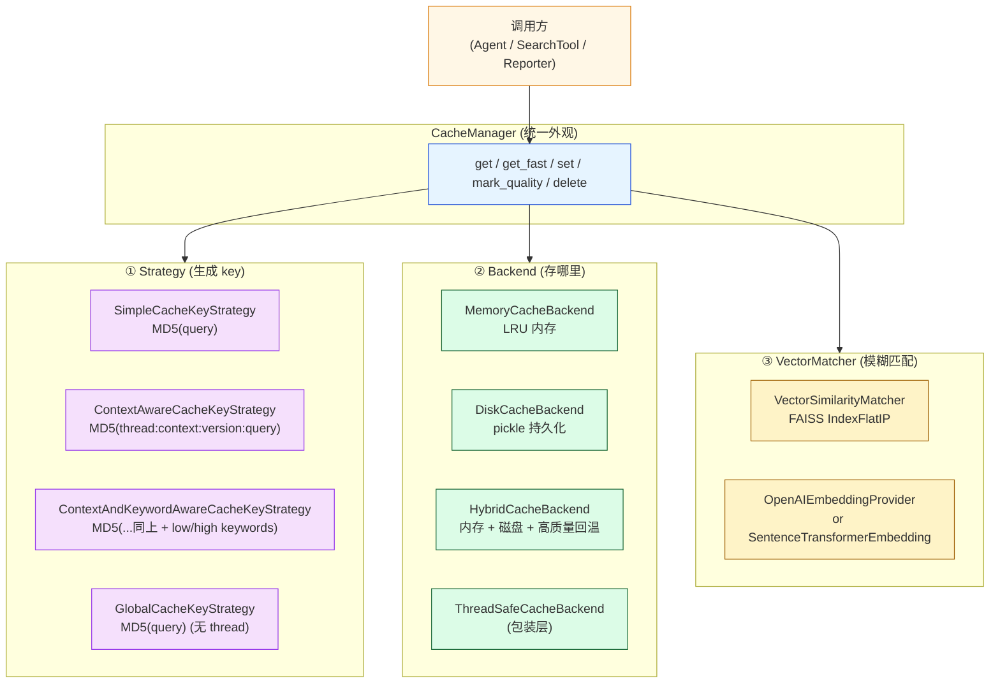
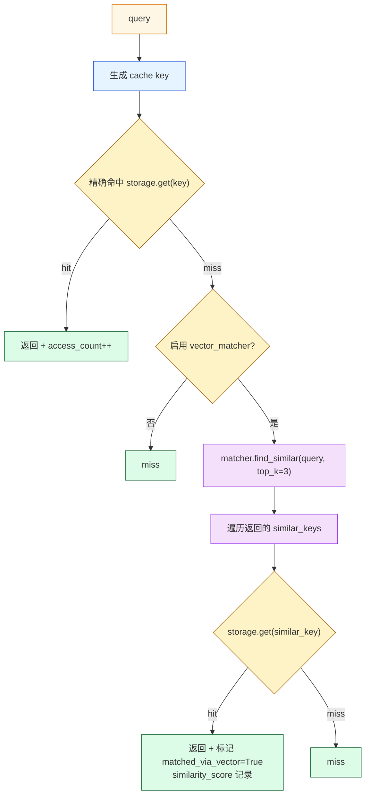
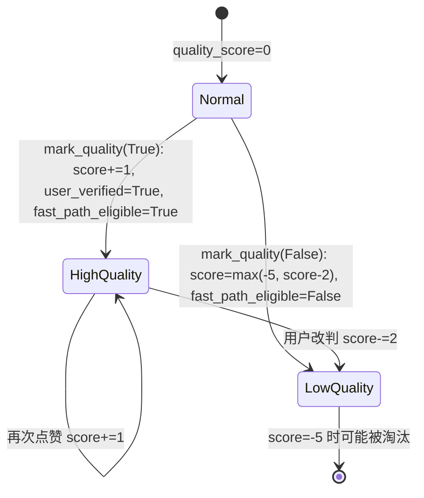
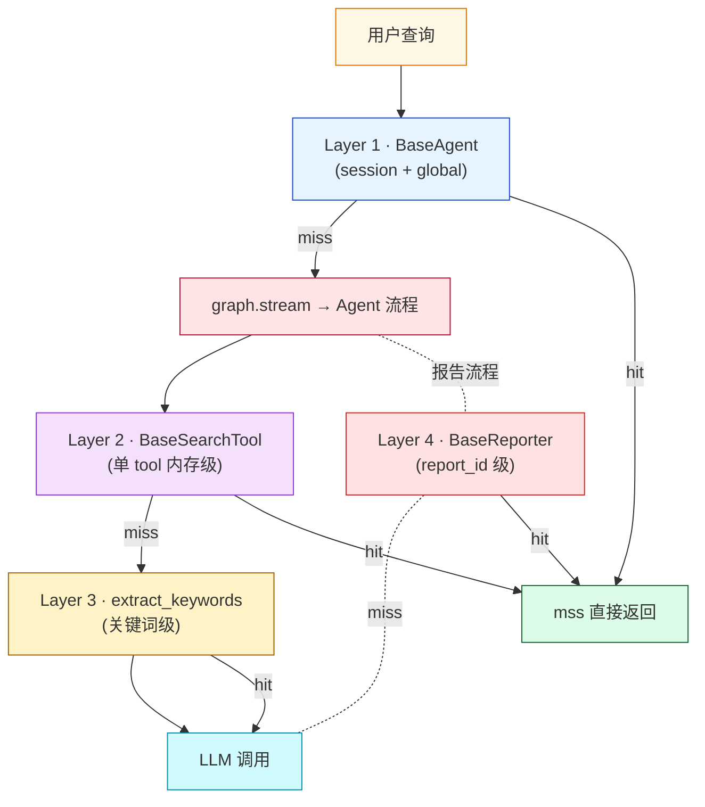

# 第 10 篇 · 两级智能缓存 + 向量相似匹配

> 本系列共 16 篇，本文是 **Part 3（LangGraph & Agent 内核）的第 2 站**：把 `cache_manager/` 一整个子包讲透——为什么项目在重复 query 下做到毫秒级响应、为什么"几乎相同的问题"也能命中缓存（GPTCache 风格的语义缓存）、为什么"用户点了赞"的答案下次能跳过验证直接返回。
>
> 这一篇的内容**不直接影响功能**，但**决定了项目的成本与延迟**。生产环境如果想把 LLM 调用从平均 5s 降到 200ms，靠的就是这套缓存。

---

## 1. 学习目标

读完本篇你应该能：

1. 画出 `CacheManager` 三件套架构：**Strategy（怎么生成 key）+ Backend（存哪里）+ VectorMatcher（模糊匹配）**。
2. 区分四种 Key Strategy 的差异：Simple / ContextAware / ContextAndKeywordAware / Global，知道每种适合什么场景。
3. 看懂 **`HybridCacheBackend` 的二级存储**：内存命中、磁盘命中 + 高质量回温到内存。
4. 理解 **FAISS `IndexFlatIP`** 在归一化向量上做内积 = cosine 相似度的等价性，知道为什么"语义近似查询"也能命中缓存。
5. 解释 `CacheItem.is_high_quality()` 的三种判定，以及 `mark_quality(True/False)` 怎么影响后续路由。
6. 在项目里找出**四处使用缓存**的层级（Agent 级、Search Tool 级、Search Tool 内关键词级、Reporter 级），知道每一处缓存什么。

---

## 2. 前置知识

- 已读 **第 09 篇**：知道 BaseAgent 内有 `cache_manager`（session）和 `global_cache_manager`（跨会话）。
- 熟悉 FAISS 基础概念（`IndexFlatIP / IndexFlatL2 / IVF / HNSW`）。
- 听过 GPTCache（[zilliztech/GPTCache](https://github.com/zilliztech/GPTCache)）—— 业界经典的 LLM 语义缓存库。
- 知道 LRU、TTL 这些缓存淘汰术语。

---

## 3. 源码地图

| 文件 | 关键类 / 函数 | 行号锚点 |
|---|---|---|
| `graphrag_agent/cache_manager/manager.py` | `CacheManager`（统一外观） | `cache_manager/manager.py:13-395` |
|  | `get / get_fast / set / mark_quality`（核心 API） | `manager.py:129-293` |
| `graphrag_agent/cache_manager/models/cache_item.py` | `CacheItem`（content + metadata + 序列化） | `cache_item.py:6-157` |
| `graphrag_agent/cache_manager/strategies/simple.py` | `SimpleCacheKeyStrategy`（纯 MD5） | 全文件 |
| `graphrag_agent/cache_manager/strategies/context_aware.py` | `ContextAwareCacheKeyStrategy / ContextAndKeywordAwareCacheKeyStrategy` | `context_aware.py:5-112` |
| `graphrag_agent/cache_manager/strategies/global_strategy.py` | `GlobalCacheKeyStrategy`（跨会话） | 全文件 |
| `graphrag_agent/cache_manager/backends/memory.py` | `MemoryCacheBackend`（LRU） | 全文件 |
| `graphrag_agent/cache_manager/backends/disk.py` | `DiskCacheBackend`（pickle 持久化） | `backends/disk.py:10-282` |
| `graphrag_agent/cache_manager/backends/hybrid.py` | `HybridCacheBackend`（内存 + 磁盘） | `backends/hybrid.py:7-73` |
| `graphrag_agent/cache_manager/backends/thread_safe.py` | `ThreadSafeCacheBackend`（RLock 包装） | 全文件 |
| `graphrag_agent/cache_manager/vector_similarity/matcher.py` | `VectorSimilarityMatcher`（FAISS 索引） | `matcher.py:11-225` |
| `graphrag_agent/cache_manager/vector_similarity/embeddings.py` | `OpenAIEmbeddingProvider / SentenceTransformerEmbedding` | `embeddings.py:15-140` |
| `graphrag_agent/cache_manager/model_cache.py` | 预加载 SentenceTransformer 模型 | `model_cache.py:1-78` |
| `graphrag_agent/config/settings.py` | `CACHE_SETTINGS` 字典 + 各种 CACHE_* | `settings.py:184-198` |

调用方（全项目缓存使用点）：

| 调用方 | 实例化位置 | 缓存对象 |
|---|---|---|
| `BaseAgent.cache_manager` | `agents/base.py:45-54` | 完整 Q&A（session 级） |
| `BaseAgent.global_cache_manager` | `agents/base.py:57-66` | 完整 Q&A（跨会话） |
| `BaseSearchTool.cache_manager` | `search/tool/base.py:33-39` | 检索 + 关键词（内存级） |
| `BaseReporter._cache_manager` | `agents/multi_agent/reporter/base_reporter.py:130` | 整份长报告 |

---

## 4. 核心机制讲解

### 4.1 三件套组合架构



**`CacheManager.__init__`** (`manager.py:16-100`) 实际就是组装这三件套：

```python
self.key_strategy = key_strategy or SimpleCacheKeyStrategy()
self.storage = ThreadSafeCacheBackend(backend) if thread_safe else backend
self.vector_matcher = VectorSimilarityMatcher(...) if enable_vector_similarity else None
```

**这种组合而非继承的设计**让"换一个组件"非常便宜——比如用 Redis 实现 `CacheStorageBackend` 接口就能改成分布式缓存，不动 CacheManager 主流程。

### 4.2 四种 Key Strategy 对比

| Strategy | 生成 key 的输入 | 隔离粒度 | 项目使用方 |
|---|---|---|---|
| **Simple** (`simple.py`) | `MD5(query)` | 全局 | （内部默认值） |
| **ContextAware** (`context_aware.py:5`) | `MD5(thread:context:version:query)` | 按 thread_id + 最近 N 轮历史 | `BaseAgent.cache_manager` |
| **ContextAndKeywordAware** (`context_aware.py:54`) | `MD5(thread:query:ctx:version:low_kw:high_kw)` | 上 + 双级关键词 | `BaseSearchTool.cache_manager` |
| **Global** (`global_strategy.py`) | `MD5(query)` | 全局（同 Simple） | `BaseAgent.global_cache_manager` |

**关键差异**：ContextAware **同一 thread 在不同对话历史下生成不同 key**——即使同一 query。这避免了"前文聊银行卡密码、后问『密码是多少』"这种危险场景的缓存串用。

**version 字段的作用**：

```python
# strategies/context_aware.py:32-33
def update_history(self, query, thread_id="default", max_history=10):
    self.conversation_history[thread_id].append(query)
    self.history_versions[thread_id] += 1
```

每次新查询都让 version 自增，让"同 thread 同 query"在不同时间点也有不同 key——**防止"前 5 轮的缓存意外命中第 10 轮的问题"**。

### 4.3 HybridCacheBackend：内存 + 磁盘 + 高质量回温

```python
# backends/hybrid.py:19-45
def get(self, key):
    value = self.memory_cache.get(key)              # ① 先查内存
    if value is not None:
        self.memory_hits += 1
        return value
    
    value = self.disk_cache.get(key)                # ② 再查磁盘
    if value is not None:
        self.disk_hits += 1
        # ③ 检查质量，高质量项加入内存（"温热回流"）
        if isinstance(value, dict) and "metadata" in value:
            is_high_quality = value["metadata"].get("user_verified", False) or \
                              value["metadata"].get("fast_path_eligible", False)
            if is_high_quality:
                self.memory_cache.set(key, value)
        return value
    
    self.misses += 1
    return None
```

**「磁盘命中 → 高质量项自动回流到内存」**是这个 backend 的核心创新：

- 普通缓存只有"内存→磁盘"单向降级。
- 项目额外加了"磁盘→内存"反向回温——**被高质量标记的项**会被回升到热区，下次访问免去磁盘 IO。

这种设计与操作系统的"页缓存 + 工作集"思想一致：**热数据要留在 L1，冷数据可以下沉到 L2**。

### 4.4 `VectorSimilarityMatcher`：FAISS IndexFlatIP

最核心的"GPTCache 风格语义缓存"在 `matcher.py:33-35`：

```python
self.dimension = self.embedding_provider.get_dimension()
self.index = faiss.IndexFlatIP(self.dimension)
```

**`IndexFlatIP` 是什么**？

- `IP` = Inner Product（内积）。
- 当向量**已经 L2 归一化**时，内积 = cosine 相似度（项目在 `embeddings.py:66-67` 显式做了归一化）。
- `Flat` = 暴力线性扫描，不做近似——准确但 O(n) 慢。

**项目为什么选 Flat 而不是 IVF/HNSW**？

- `max_vectors=10000`（`settings.py:197`），10k 向量在 1024 维下扫一遍约 10ms——完全够用。
- IVF/HNSW 需要训练阶段和参数调优，**复杂度不值得**。
- Flat 永远准确，不会因为索引参数错误漏召回。

#### 查询流程

```python
# matcher.py:78-107
def find_similar(self, query, context_info=None, top_k=5):
    query_embedding = self.embedding_provider.encode(query)        # 1. 编码
    scores, indices = self.index.search(query_embedding, top_k*2)  # 2. FAISS 取 top_2k
    
    results = []
    for score, idx in zip(scores[0], indices[0]):
        cache_key = self.index_to_key[idx]
        if self._context_matches(context_info, self.key_to_context.get(cache_key, {})):  # 3. 上下文校验
            if score >= self.similarity_threshold:                                       # 4. 阈值过滤
                results.append((cache_key, float(score)))
    return results[:top_k]
```

四步关键检查：

1. FAISS 暴力扫描得相似度 top_2k。
2. 按 `context_info`（`thread_id`）过滤——避免跨会话误匹配。
3. 阈值 `CACHE_SIMILARITY_THRESHOLD=0.9` 过滤——**接近这个值才视为"同义查询"**。
4. 取 top_k 返回。

`CacheManager.get` (`manager.py:129-183`) 调用 `find_similar` 的位置：**精确匹配失败之后**作为"模糊降级"。



### 4.5 `CacheItem`：元数据驱动的质量管理

```python
# models/cache_item.py:14-35（默认元数据）
defaults = {
    "created_at": time.time(),
    "quality_score": 0,
    "user_verified": False,
    "access_count": 0,
    "fast_path_eligible": False,
    "last_accessed": None,
    "similarity_score": None,
    "matched_via_vector": False,
    "original_query": None
}
```

每个缓存项都带这一组元数据。**4 个最重要字段**：

| 字段 | 作用 | 变更入口 |
|---|---|---|
| `quality_score` | 累积质量分（点赞 +1，点踩 -2，下限 -5） | `mark_quality` |
| `user_verified` | 用户已确认正确 | `mark_quality(True)` 时设 |
| `fast_path_eligible` | 可走快速路径（跳过验证） | 高质量自动晋升 |
| `access_count` | 命中次数 | `update_access_stats` 每次自增 |

**`is_high_quality` 三态判定**（`cache_item.py:41-45`）：

```python
def is_high_quality(self):
    return (self.metadata.get("user_verified", False) or 
            self.metadata.get("quality_score", 0) > 2 or
            self.metadata.get("fast_path_eligible", False))
```

任何一个为真就算高质量。**意味着只要 3 次点赞**（`quality_score > 2`）就能晋升。

**`mark_quality` 升降逻辑**（`cache_item.py:47-57`）：



**用户反馈如何接入**？看 `agents/base.py:651-670 mark_answer_quality` —— 这是给 `server/routers/feedback.py`（前端点赞按钮）调用的 API。

### 4.6 `get` vs `get_fast`：两种命中模式

`get` (`manager.py:129-183`)：**两层兜底**

```python
def get(self, query, skip_validation=False, **kwargs):
    # 1. 精确 key 匹配
    cached_data = self.storage.get(key)
    if cached_data is not None:
        return CacheItem.from_any(cached_data).get_content()
    
    # 2. 向量相似度匹配
    if self.enable_vector_similarity and self.vector_matcher:
        similar_keys = self.vector_matcher.find_similar(query, context_info, top_k=3)
        for similar_key, similarity_score in similar_keys:
            cached_data = self.storage.get(similar_key)
            if cached_data is not None:
                return CacheItem.from_any(cached_data).get_content()
    return None
```

`get_fast` (`manager.py:185-228`)：**只命中高质量**

```python
def get_fast(self, query, **kwargs):
    cached_data = self.storage.get(key)
    if cached_data is not None:
        cache_item = CacheItem.from_any(cached_data)
        if cache_item.is_high_quality():        # ← 只走高质量
            return cache_item.get_content()
    # 同样有向量降级，但也只接受高质量
```

**含义**：

- `BaseAgent.ask` 的"快速路径"（**第 09 篇 4.4 节**）就是调 `get_fast`——**只有被反复验证过的答案才能命中**。
- `BaseAgent.ask` 的"常规缓存"调 `get(skip_validation=True)`——验证步骤跳过但任何质量都接受。

**两条路并存，让"高质量优先 + 兜底兼容"成为可能**。

### 4.7 Embedding Provider 的单例设计

```python
# vector_similarity/embeddings.py:32-41
class OpenAIEmbeddingProvider(EmbeddingProvider):
    _instance = None
    _lock = threading.Lock()
    
    def __new__(cls):
        with cls._lock:
            if cls._instance is None:
                cls._instance = super().__new__(cls)
                cls._instance._initialized = False
            return cls._instance
```

**单例 + 锁**：避免每个 Agent / SearchTool 都创建独立的 embedding 客户端。

**SentenceTransformer 的多模型单例**（`embeddings.py:80-92`）：

```python
class SentenceTransformerEmbedding(EmbeddingProvider):
    _instances = {}    # 按模型名做字典
    
    def __new__(cls, model_name='all-MiniLM-L6-v2', cache_dir=None):
        with cls._lock:
            if model_name not in cls._instances:
                cls._instances[model_name] = super().__new__(cls)
                cls._instances[model_name]._initialized = False
            return cls._instances[model_name]
```

**按模型名各自单例**——切换模型时不会冲突。这是 GPTCache 也用的标准模式。

### 4.8 全项目四处缓存层级



| 层 | 实例 | 粒度 | 持久化 |
|---|---|---|---|
| **Agent session** | `BaseAgent.cache_manager` | 单会话完整 Q&A | ✅ HybridCacheBackend（`./cache/{agent}/`） |
| **Agent global** | `BaseAgent.global_cache_manager` | 跨会话完整 Q&A | ✅ HybridCacheBackend（`./cache/{agent}/global/`） |
| **Tool 级** | `BaseSearchTool.cache_manager` | 单工具的检索 + 关键词 | ❌ MemoryCacheBackend（仅内存） |
| **Reporter 级** | `BaseReporter._cache_manager` | 整份长报告（按 `report_id + evidence_fingerprint`） | ✅（注入的 cache_manager） |

**为什么 Tool 级只用内存**？检索结果重用率低于完整问答，落盘 IO 收益不大；且 Agent 重启时旧检索结果未必有效（图可能已变）。

---

## 5. 重点技术点深挖

### 5.1 项目 vs GPTCache 的差异（E 类技术点）

| 维度 | GPTCache | 本项目 |
|---|---|---|
| 名字 | Cache for LLM | CacheManager |
| 缓存粒度 | 单次 LLM 请求 | 单次 Q&A（整套 Agent 流程） |
| 向量索引 | FAISS / Milvus / 自家 vector_base | FAISS IndexFlatIP（写死） |
| 评估器 | 多种 evaluator（SearchDistance / OnnxModelEvaluator） | 简单的 `_default_validation`（关键词覆盖度） |
| 质量反馈 | ❌ 无 | ✅ `mark_quality` + `quality_score` |
| 上下文感知 | ❌ 默认全局 | ✅ ContextAwareCacheKeyStrategy |

**项目的差异化优势**：

- **上下文感知 key**：能在多轮对话中区分"同字面不同语义"。
- **质量反馈循环**：用户点赞后高质量缓存自动晋升。

**项目的劣势**：

- 评估器太简单——`_default_validation` 只看关键词覆盖度，不像 GPTCache 用语义模型评估。
- 向量索引固定 FAISS Flat，超大规模会慢。

### 5.2 缓存与可观测性（E 类技术点）

`CacheManager.performance_metrics` 字段（`manager.py:96-100`）：

```python
self.performance_metrics = {
    'exact_hits': 0,       # 精确匹配命中次数
    'vector_hits': 0,      # 向量匹配命中次数
    'misses': 0,
    'total_queries': 0
}
```

`get_metrics()` 还会计算派生指标：

```python
metrics['exact_hit_rate'] = exact_hits / total_queries
metrics['vector_hit_rate'] = vector_hits / total_queries
metrics['total_hit_rate'] = (exact_hits + vector_hits) / total_queries
metrics['miss_rate'] = misses / total_queries
```

**生产监控建议**：

- `exact_hit_rate` < 5% → 业务有大量长尾 query，考虑提高 vector 命中阈值。
- `vector_hit_rate` > 30% → 业务问题集中度高，向量缓存价值大。
- `total_hit_rate` < 20% → 缓存几乎没用，检查 key 策略是否过于严格。

### 5.3 缓存键陷阱：版本号自增风暴（E 类技术点）

ContextAware 策略的 `update_history`（`context_aware.py:32-33`）每次新查询都让 version 自增。**含义**：同 thread 下相同 query 的 key 在不同时刻不同——**绝对不会命中自己**。

```python
# 时刻 1：query="国奖条件", version=1, key=hash("...|v1|国奖条件") = abc
# 时刻 2（之后又问别的）：version=5
# 时刻 3：再问 query="国奖条件", version=5, key=hash("...|v5|国奖条件") = xyz
```

**这是 bug 还是 feature**？

- **Feature** 的角度：避免"前文做了 5 轮陌生对话后，第 6 轮的'国奖条件'语义已变"。
- **Bug** 的角度：极大降低同 query 在 session 内的复用率。

**项目的实际命中靠**：

- ① **全局缓存（无 version）** 兜底——跨 thread 命中。
- ② **向量相似度** —— 即使 key 不同也能模糊命中。

**两层组合让"看似 session 缓存失效"实际不影响体验**。

### 4 在 `manager.py:253-257` 你能看到精妙的"延迟更新"：

```python
def _update_strategy_history(self, query, **kwargs):
    if isinstance(self.key_strategy, (ContextAwareCacheKeyStrategy, ...)):
        thread_id = kwargs.get("thread_id", "default")
        self.key_strategy.update_history(query, thread_id)
```

**只在 `set` 时**调用 `update_history`——`get` 时不更新版本。**含义**：你查询时 version 还是上一轮的，能命中上一轮存的 key；下次 set 才推进版本。

### 5.4 模型缓存：`MODEL_CACHE_DIR` 的妙用（E 类技术点）

`embeddings.py:101-109`：

```python
if cache_dir is None:
    cache_dir = MODEL_CACHE_DIR        # ./cache/model
cache_path = Path(cache_dir)
cache_path.mkdir(parents=True, exist_ok=True)
self.model = SentenceTransformer(model_name, cache_folder=str(cache_path))
```

**SentenceTransformer 默认会从 HuggingFace Hub 下载模型**——首次需要联网且 100MB+。`cache_folder` 让模型落地到项目本地 `./cache/model/`：

- 重启服务不需要重新下载。
- 多个 SentenceTransformerEmbedding 实例共享同一份模型文件。
- 离线部署只要预热一次。

`model_cache.py:46-49`：

```python
def preload_cache_embedding_model():
    if CACHE_EMBEDDING_PROVIDER == 'openai':
        return
    model_name = CACHE_SENTENCE_TRANSFORMER_MODEL
    preload_sentence_transformer_models([model_name])
```

**这是一个"启动期预热"hook**——可以在服务启动脚本里调用，让首次请求不卡在模型下载上。

---

## 6. Hands-on：触发各层缓存 + 看命中率

### 6.1 准备：清掉测试目录

```bash
rm -rf ./cache/test_cache
```

### 6.2 直接用 CacheManager（最底层）

```python
# tmp_cache_basics.py
from graphrag_agent.cache_manager.manager import CacheManager
from graphrag_agent.cache_manager.strategies import ContextAwareCacheKeyStrategy
from graphrag_agent.cache_manager.backends import HybridCacheBackend

mgr = CacheManager(
    key_strategy=ContextAwareCacheKeyStrategy(),
    storage_backend=HybridCacheBackend(cache_dir="./cache/test_cache", memory_max_size=100, disk_max_size=500),
    cache_dir="./cache/test_cache",
    enable_vector_similarity=True,
    similarity_threshold=0.85
)

mgr.set("国家奖学金的申请条件是什么？", "条件 A、B、C ...", thread_id="user1")

# 1. 精确命中
v1 = mgr.get("国家奖学金的申请条件是什么？", thread_id="user1")
print(f"精确命中: {v1[:30] if v1 else 'miss'}")

# 2. 模糊命中（同义改写）
v2 = mgr.get("国奖申请要满足哪些条件？", thread_id="user1")
print(f"模糊命中: {v2[:30] if v2 else 'miss'}")

# 3. 跨 thread（应该 miss，因为 ContextAware 隔离 thread）
v3 = mgr.get("国家奖学金的申请条件是什么？", thread_id="user2")
print(f"跨 thread: {v3[:30] if v3 else 'miss'}")

print("\n指标:", mgr.get_metrics())
```

**预期观察**：

- `v1` 精确命中。
- `v2` 在 similarity_threshold=0.85 下大概率向量命中（"国奖" 与"国家奖学金"语义近）——`vector_hits +=1`。
- `v3` 跨 thread 会 miss，因为 ContextAware 策略把 thread_id 编进 key。

### 6.3 看 CacheItem 的质量管理

```python
# tmp_cache_quality.py
from graphrag_agent.cache_manager.manager import CacheManager

mgr = CacheManager(cache_dir="./cache/test_quality", memory_only=True)

mgr.set("Q1", "A1")
print("初次 is_high_quality:", mgr.storage.get(mgr._get_consistent_key("Q1")))

# 点赞 3 次
for _ in range(3):
    mgr.mark_quality("Q1", is_positive=True)

# 再看
import json
print("\n点赞 3 次后:")
print(json.dumps(mgr.storage.get(mgr._get_consistent_key("Q1")), indent=2, ensure_ascii=False))

# 点踩
mgr.mark_quality("Q1", is_positive=False)
print("\n点踩后:")
print(json.dumps(mgr.storage.get(mgr._get_consistent_key("Q1")), indent=2, ensure_ascii=False))
```

**预期观察**：

- 初次：quality_score=0、user_verified=False。
- 点赞 3 次后：quality_score=3、user_verified=True、fast_path_eligible=True。
- 点踩：score-=2 变 1，fast_path_eligible=False。

### 6.4 验证两级缓存的"高质量回温"

```python
# tmp_hybrid_warmup.py
from graphrag_agent.cache_manager.manager import CacheManager
from graphrag_agent.cache_manager.backends import HybridCacheBackend

backend = HybridCacheBackend(cache_dir="./cache/test_warmup", memory_max_size=2, disk_max_size=100)
mgr = CacheManager(storage_backend=backend, cache_dir="./cache/test_warmup", memory_only=False)

# 写入 5 个项，前 2 个标记高质量
for i in range(5):
    mgr.set(f"Q{i}", f"A{i}")
    if i < 2:
        for _ in range(3):
            mgr.mark_quality(f"Q{i}", is_positive=True)

# 内存只能存 2 个，会因 LRU 把 Q0/Q1 挤出去
print("内存中:", list(backend.memory_cache.cache.keys()))
print("磁盘中:", "已落盘所有 5 个")

# 读高质量项 Q0，应该触发回温
val = mgr.get("Q0")
print(f"\n读 Q0 后，内存:", list(backend.memory_cache.cache.keys()))
print(f"memory_hits: {backend.memory_hits}, disk_hits: {backend.disk_hits}")
```

**预期观察**：第二次读 Q0 时，因为 Q0 被标记高质量，从磁盘命中后**自动回温到内存**——内存中 Q0 重新出现。

### 6.5 端到端：BaseAgent 三级缓存

```python
# tmp_agent_three_levels.py
import time
from graphrag_agent.agents.naive_rag_agent import NaiveRagAgent

agent = NaiveRagAgent()

# 1. 冷启动
t0 = time.time(); a1 = agent.ask("国家奖学金的申请条件", "thr1"); print(f"冷启动: {time.time()-t0:.2f}s")

# 2. 标记高质量
agent.mark_answer_quality("国家奖学金的申请条件", is_positive=True, thread_id="thr1")
agent.mark_answer_quality("国家奖学金的申请条件", is_positive=True, thread_id="thr1")
agent.mark_answer_quality("国家奖学金的申请条件", is_positive=True, thread_id="thr1")

# 3. 同 thread 重问 → fast path
t0 = time.time(); a2 = agent.ask("国家奖学金的申请条件", "thr1"); print(f"fast cache: {time.time()-t0:.2f}s")

# 4. 跨 thread 重问 → global cache
t0 = time.time(); a3 = agent.ask("国家奖学金的申请条件", "thr2"); print(f"global cache: {time.time()-t0:.2f}s")

# 5. 改写问法 → vector match
t0 = time.time(); a4 = agent.ask("国奖怎么申请？", "thr2"); print(f"vector match: {time.time()-t0:.2f}s")
```

**预期观察**：步骤 2-5 都应该是毫秒级（< 100ms），与冷启动几秒形成强对比。

### 6.6 Debug 提示

- **断点位置 1**：`manager.py:138 cached_data = self.storage.get(key)`，看 storage 实际返回什么。
- **断点位置 2**：`matcher.py:90 scores, indices = self.index.search(...)`，看 FAISS 实际返回的相似度分数。
- **断点位置 3**：`cache_item.py:41 is_high_quality`，看 quality_score 与 user_verified 实际值。
- **常见错误 1**：`AttributeError: 'NoneType' object has no attribute 'find_similar'`——`enable_vector_similarity=False` 但代码尝试调向量匹配。检查 CACHE_ENABLE_VECTOR_SIMILARITY 环境变量。
- **常见错误 2**：FAISS dimension 不匹配——切换了 embedding 模型（如 OpenAI 1536 → MiniLM 384）但旧索引还在。删除 `cache/vector_index.faiss` 与 `cache/vector_index.pkl` 重建。

---

## 7. 思考题

1. **缓存预热脚本**：项目首次启动时 hit_rate 必然为 0。如何写一个"用历史日志重放 query 来预热缓存"的脚本？最大改造点在哪？（提示：考虑把历史 Q&A 直接 `mgr.set` 进去，跳过 LLM 调用）
2. **Redis 后端**：把 `MemoryCacheBackend` 改成 Redis 实现以支持多进程共享缓存。最小改动是什么？（提示：实现 `CacheStorageBackend` 接口的 5 个方法 + Redis 序列化）
3. **TTL 过期机制**：当前缓存没有过期时间——`disambiguate` 改了 schema 后旧缓存仍然命中。如何在不破坏现有 API 的前提下加 TTL？（提示：在 `CacheItem.is_expired(max_age)` 已有接口，但 `CacheManager.get` 没调它）

---

## 8. 延伸阅读

- **GPTCache 项目**：[zilliztech/GPTCache](https://github.com/zilliztech/GPTCache) —— 业界经典 LLM 语义缓存，对比本项目实现。
- **FAISS 索引选择指南**：[Faiss · Choosing an index](https://github.com/facebookresearch/faiss/wiki/Guidelines-to-choose-an-index)
- **Anthropic Prompt Caching**：[Prompt caching](https://docs.anthropic.com/en/docs/build-with-claude/prompt-caching) —— 厂商提供的 prompt 级缓存，**与项目语义缓存正交，可叠加使用**。
- **SentenceTransformer 模型管理**：[sentence-transformers documentation](https://www.sbert.net/docs/sentence_transformer/usage/usage.html) —— 单例 + cache_folder 模式。
- **LRU vs LFU 缓存淘汰策略**：[Caching algorithms](https://en.wikipedia.org/wiki/Cache_replacement_policies)
- **DeepSeek Prompt Caching**：[DeepSeek API · Caching](https://api-docs.deepseek.com/news/news0802) —— 国产 LLM 内置的 prompt cache，需要项目主动适配。

---

> ✅ 本篇结束。**Part 3（LangGraph & Agent 内核）2 篇全部完成**——你已经能讲清 BaseAgent 的可循环 StateGraph + 两级智能缓存的完整工程组合。
>
> 接下来 **Part 4（Plan-Execute-Report 多智能体）** 第 11 篇会切换到项目的"皇冠"模块：Planner 三段式（澄清 → 任务分解 → 计划审校）如何把一个含糊的用户 query 变成可执行的 TaskGraph DAG。
>
> 调参口诀：**精确不中找模糊；高质量项要回温；同质量分要点赞；版本变了别懵圈**。
