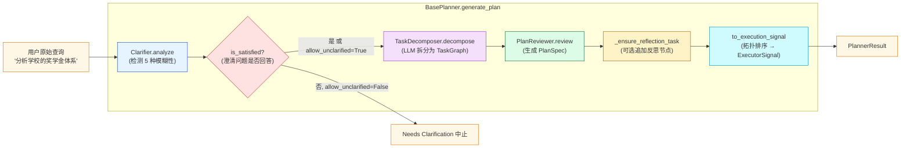
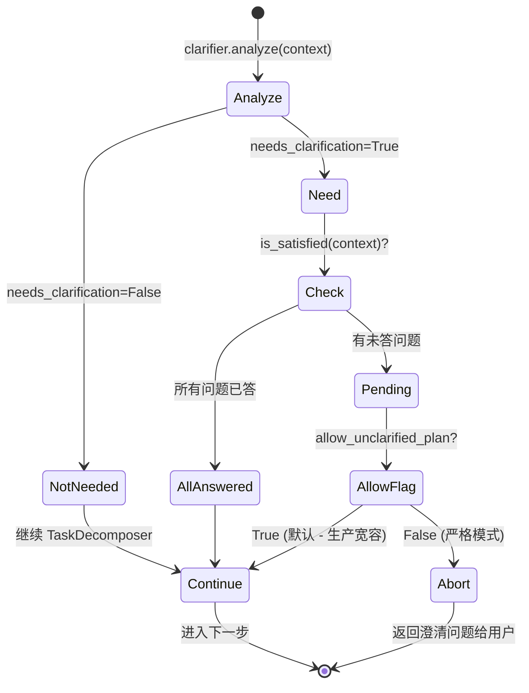

# 第 11 篇 · Planner 三段式：澄清 → 任务分解 → 计划审校 → PlanSpec

> 本系列共 16 篇，本文是 **Part 4（Plan-Execute-Report 多智能体）的第 1 站**，也是项目"皇冠模块"的起点：把含糊的用户 query 一步步**结构化**成一份可执行、可验证、可分支的 `PlanSpec`。
>
> 这一篇覆盖的是**LLM-as-Planner**的工程化落地：从"模型说什么就用什么"升级到"模型说的+硬约束清洗+回退兜底"——只有这样才能让多智能体的下游真的可调度。

---

## 1. 学习目标

读完本篇你应该能：

1. 画出 Planner 三段流水线：`Clarifier → TaskDecomposer → PlanReviewer`，并知道每段的输入/输出契约（`PlanContext / TaskGraph / PlanSpec`）。
2. 看懂 `Clarifier` 如何识别 5 种模糊性（领域 / 时间 / 粒度 / 实体 / 意图），以及"澄清未满足时是否继续"的策略。
3. 解释 `TaskDecomposer` 把 LLM 自由 JSON 转成结构化 `TaskGraph` 的**三层清洗策略**（补默认 / 规范类型 / 依赖列表化）。
4. 区分 **DAG（有向无环图）拓扑排序** 与项目的 `topological_sort` 实现，知道为什么 `execution_sequence` 也按优先级排。
5. 读懂 `PlanReviewer` 的"二次校验+回退"机制：LLM 重写的 task_graph 不合法时怎么 fallback。
6. 解释 `_ensure_reflection_task`：项目如何在不破坏 LLM 输出的前提下"自动追加反思节点"。
7. 知道 `parse_json_text` 三段式 JSON 提取的工程价值——以及它解决的"LLM 输出多余的 markdown 围栏"问题。

---

## 2. 前置知识

- 已读 **第 09、10 篇**：知道 BaseAgent 和缓存系统。
- 读过 **第 01 篇侦察报告** 第 4 节：知道 Plan-Execute-Report 在 `MultiAgentOrchestrator` 中的位置。
- 知道 DAG（有向无环图）+ Kahn 拓扑排序算法的基础。
- 熟悉 Pydantic v2 的 `BaseModel / Field / model_validator`。

---

## 3. 源码地图

| 文件 | 关键类 / 函数 | 行号锚点 |
|---|---|---|
| `graphrag_agent/agents/multi_agent/planner/base_planner.py` | `BasePlanner.generate_plan`（编排三段） | `planner/base_planner.py:127-189` |
|  | `_ensure_reflection_task`（自动追加反思节点） | `base_planner.py:191-226` |
|  | `_ensure_plan_context / _record_clarification` | `base_planner.py:228-262` |
| `graphrag_agent/agents/multi_agent/planner/clarifier.py` | `Clarifier.analyze`（5 种模糊性识别） | `planner/clarifier.py:53-104` |
|  | `ClarificationResult.is_satisfied` | `clarifier.py:30-50` |
| `graphrag_agent/agents/multi_agent/planner/task_decomposer.py` | `TaskDecomposer.decompose / _build_task_graph` | `planner/task_decomposer.py:36-137` |
| `graphrag_agent/agents/multi_agent/planner/plan_reviewer.py` | `PlanReviewer.review / _resolve_task_graph` | `planner/plan_reviewer.py:49-163` |
| `graphrag_agent/agents/multi_agent/core/plan_spec.py` | `PlanSpec / TaskGraph / TaskNode / PlanExecutionSignal` | `core/plan_spec.py:14-419` |
|  | `TaskGraph.validate_dependencies / get_ready_tasks / topological_sort` | `plan_spec.py:140-262` |
|  | `PlanSpec.to_execution_signal`（输出 Executor 信号） | `plan_spec.py:393-406` |
| `graphrag_agent/agents/multi_agent/core/state.py` | `PlanContext / PlanExecuteState` | `core/state.py:18-268` |
| `graphrag_agent/agents/multi_agent/tools/json_parser.py` | `parse_json_text / extract_json_text` | `tools/json_parser.py:1-39` |
| `graphrag_agent/config/prompts/planner_prompts.py` | `CLARIFY_PROMPT / TASK_DECOMPOSE_PROMPT / PLAN_REVIEW_PROMPT` | 全文件 251 行 |
| `graphrag_agent/config/settings.py` | `MULTI_AGENT_PLANNER_MAX_TASKS / MULTI_AGENT_ALLOW_UNCLARIFIED_PLAN / MULTI_AGENT_DEFAULT_DOMAIN` | `settings.py:310-312` |

---

## 4. 核心机制讲解

### 4.1 三段式流水线全景



`BasePlanner.generate_plan` (`planner/base_planner.py:127-189`) 的关键逻辑：

```python
def generate_plan(self, state, *, assumptions=None):
    context = self._ensure_plan_context(state)
    
    # Step 1: 澄清
    clarification = self._clarifier.analyze(context)
    self._record_clarification(context, clarification)
    
    if not clarification.is_satisfied(context) and not self.config.allow_unclarified_plan:
        return PlannerResult(plan_spec=None, clarification=clarification, ...)
    
    # Step 2: 任务分解
    refined_query = context.refined_query or context.original_query
    task_decomposition = self._task_decomposer.decompose(refined_query)
    
    # Step 3: 计划审校
    review_outcome = self._plan_reviewer.review(...)
    plan_spec = review_outcome.plan_spec
    self._ensure_reflection_task(plan_spec)
    
    state.plan = plan_spec
    executor_signal = plan_spec.to_execution_signal()
    return PlannerResult(plan_spec=plan_spec, ..., executor_signal=executor_signal)
```

**4 件事**：

1. 把 query 跑过澄清器。
2. 澄清不满足时**两种行为可选**：默认 `allow_unclarified_plan=True` → 继续（生产友好）；否则 → 中止返回澄清问题（严格模式）。
3. 跑分解、审校，得到 PlanSpec。
4. 自动追加反思节点 + 转换为 ExecutorSignal。

### 4.2 Step 1：Clarifier 与 5 种模糊性

`Clarifier.analyze` (`planner/clarifier.py:70-90`) 流程：

```python
def analyze(self, context):
    prompt = CLARIFY_PROMPT.format(
        query=context.refined_query or context.original_query,
        domain=context.domain_context or self._default_domain,
    )
    response = self._invoke_llm(prompt)
    parsed = self._parse_response(response)
    return ClarificationResult(**parsed, raw_response=response)
```

**`CLARIFY_PROMPT`** 让 LLM 在以下 5 种模糊性中识别：

| 模糊类型 | 例子 | 澄清问题示例 |
|---|---|---|
| **领域范围** | "悟空的对手" | "您是想了解《悟空传》还是西游记原著？" |
| **时间范围** | "学生违纪情况" | "您指的是哪个学年？" |
| **粒度** | "奖学金的所有信息" | "您要总览还是具体细节？" |
| **实体歧义** | "张三的学籍" | "张三对应学号是？" |
| **意图** | "处分制度" | "您想知道'是什么'、'为什么'还是'如何申诉'？" |

`ClarificationResult.is_satisfied` 的判定（`clarifier.py:30-50`）：

```python
def is_satisfied(self, context):
    if not self.needs_clarification:
        return True
    answered_questions = {
        item.get("question"): item.get("answer")
        for item in context.clarification_history
        if item.get("question")
    }
    for question in self.questions:
        if not answered_questions.get(question):
            return False
    return True
```

**所有问题都得在 `clarification_history` 里找到非空回答**，否则不算满足。这是与用户多轮交互的接口。



### 4.3 Step 2：TaskDecomposer 与三层清洗

`TaskDecomposer.decompose` (`task_decomposer.py:50-74`) 直接调 LLM 让其输出 JSON。**关键在于 `_build_task_graph` 的清洗** (`task_decomposer.py:89-137`)。

#### 4.3.1 9 种合法任务类型

`plan_spec.py:14-24`：

```python
TASK_TYPE_CHOICES = (
    "local_search",        # 实体邻域检索（第 07 篇）
    "global_search",       # 社区 Map-Reduce（第 07 篇）
    "hybrid_search",       # 双级合并（第 07 篇）
    "naive_search",        # 纯 chunk 向量（第 07 篇）
    "deep_research",       # 多轮思考（第 08 篇）
    "deeper_research",     # 增强版（第 08 篇）
    "chain_exploration",   # 图上漫游（第 08 篇）
    "reflection",          # 反思校验（第 12 篇）
    "custom",              # 自定义/降级
)
```

**LLM 输出的 task_type 必须落在这 9 个之内**。

#### 4.3.2 三层清洗策略

```python
# task_decomposer.py:101-126（精简）
for raw in nodes_data:
    node_dict = dict(raw)
    
    # ① 规范化任务类型：不认识的统一映射为 custom，原值保留到 parameters
    task_type = node_dict.get("task_type", "custom")
    if task_type not in _ALLOWED_TASK_TYPES:
        original_type = task_type
        task_type = "custom"
        node_dict.setdefault("parameters", {})["original_task_type"] = original_type
    node_dict["task_type"] = task_type
    
    # ② 补全必备字段（LLM 经常漏的）
    node_dict.setdefault("priority", 2)
    node_dict.setdefault("estimated_tokens", 500)
    node_dict.setdefault("depends_on", [])
    node_dict.setdefault("entities", [])
    node_dict.setdefault("parameters", {})
    node_dict.setdefault("status", "pending")
    
    # ③ 依赖字段强制列表化（LLM 偶尔输出字符串）
    depends_on = node_dict.get("depends_on")
    if isinstance(depends_on, str):
        node_dict["depends_on"] = [dep.strip() for dep in depends_on.split(",") if dep.strip()]
    elif depends_on is None:
        node_dict["depends_on"] = []
    
    sanitized_nodes.append(TaskNode(**node_dict))
```

**清洗的工程价值**：

| 清洗策略 | 解决的常见 LLM 异常 |
|---|---|
| **规范化任务类型** | LLM 输出 `"vector_search"` / `"web_search"` 等不存在类型 → 映射 custom + 记录 |
| **补全必备字段** | LLM 漏掉 `priority / depends_on / parameters` → 用默认值兜底 |
| **依赖字段列表化** | LLM 输出 `"task_001,task_002"` 字符串 → 拆成列表 |

这种**"接受 LLM 噪声、保留原始信息、严格 Pydantic 校验"**三层组合是项目里最值得借鉴的工程模式之一。

#### 4.3.3 验证依赖（环检测）

`task_decomposer.py:136`：清洗后立刻调 `task_graph.validate_dependencies()`。这个方法 (`plan_spec.py:140-184`) 做两件事：

1. **检查依赖的任务 ID 是否存在**。
2. **检查是否有循环依赖**（DFS + rec_stack）。

任一失败抛 `ValueError`，让上层 Planner 决定是否重新生成或转人工。

### 4.4 Step 3：PlanReviewer 与"二次校验+回退"

`PlanReviewer.review` (`plan_reviewer.py:60-130`) 把任务图二次喂给 LLM，让其生成完整的 `PlanSpec`：

```python
def review(self, *, original_query, refined_query, task_graph, assumptions, ...):
    task_graph_json = json.dumps(task_graph.to_dict(), ensure_ascii=False, indent=2)
    prompt = PLAN_REVIEW_PROMPT.format(query=..., task_graph=task_graph_json, ...)
    response = self._invoke_llm(prompt)
    parsed = self._parse_response(response)
    
    problem_statement = parsed.get("problem_statement") or {}
    acceptance_data = parsed.get("acceptance_criteria") or {}
    validation_data = parsed.get("validation_results") or {}
    
    reviewed_task_graph = self._resolve_task_graph(parsed.get("task_graph"), task_graph)
    
    plan_spec = PlanSpec(
        problem_statement=ProblemStatement(**problem_statement),
        assumptions=assumptions,
        task_graph=reviewed_task_graph,
        acceptance_criteria=AcceptanceCriteria(**acceptance_data) if acceptance_data else AcceptanceCriteria(),
        status="draft",
    )
    
    try:
        plan_spec.validate()
    except ValueError as exc:
        validation.is_valid = False
        validation.issues.append(str(exc))
```

**`_resolve_task_graph` 的回退策略** (`plan_reviewer.py:146-163`)：

```python
def _resolve_task_graph(self, maybe_task_graph, original_graph):
    if not maybe_task_graph:
        return original_graph
    try:
        resolved_graph = TaskGraph.from_dict(maybe_task_graph)
        resolved_graph.validate_dependencies()
        return resolved_graph
    except Exception as exc:
        _LOGGER.warning("LLM返回的task_graph无效，使用原始图")
        return original_graph
```

**三段决策**：

1. LLM **没**重写 task_graph → 用 TaskDecomposer 的原图。
2. LLM **重写了**且**通过依赖校验** → 用 LLM 重写后的图。
3. LLM 重写了但**校验失败** → 退回原图，记一条 warning。

**这是 LLM 输出的"宽容失败"模式**：相信 LLM 但不依赖其正确性。生产中只用这种模式才安全。

### 4.5 `_ensure_reflection_task`：自动追加反思节点

`base_planner.py:191-226` 的关键逻辑：

```python
def _ensure_reflection_task(self, plan_spec):
    if not MULTI_AGENT_REFLECTION_ALLOW_RETRY:
        return
    if any(node.task_type == "reflection" for node in task_graph.nodes):
        return                                       # 已有反思节点
    
    # 找出所有"叶子节点"（没有被其他节点依赖的）
    sink_ids = {node.task_id for node in task_graph.nodes}
    for node in task_graph.nodes:
        for dep in node.depends_on:
            sink_ids.discard(dep)
    
    depends_on = [task_id for task_id in sink_ids if task_id]
    if not depends_on and task_graph.nodes:
        depends_on = [task_graph.nodes[-1].task_id]
    
    reflection_node = TaskNode(
        task_id=f"task_reflection_{uuid.uuid4().hex[:6]}",
        task_type="reflection",
        description="复核整体答案并提出改进建议",
        priority=3,
        depends_on=depends_on,
    )
    task_graph.nodes.append(reflection_node)
    try:
        task_graph.validate_dependencies()
    except ValueError as exc:
        task_graph.nodes.pop()                       # 加错了立刻回滚
```

**亮点**：

- **自动定位叶子节点**：用集合差集找出"没被任何人依赖"的任务。
- **追加 reflection 节点依赖所有叶子**：保证它在所有任务之后执行。
- **加完立刻验证依赖**——失败回滚，保护原图。

**`MULTI_AGENT_REFLECTION_ALLOW_RETRY` 默认 False**（见 `settings.py:336`），所以**默认不追加反思节点**。生产里想开启可以 `MA_REFLECTION_ALLOW_RETRY=true`。

### 4.6 `TaskGraph` 的核心算法

#### 4.6.1 环检测：`validate_dependencies` (`plan_spec.py:140-184`)

经典 DFS + rec_stack：

```python
def has_cycle(task_id):
    visited.add(task_id)
    rec_stack.add(task_id)
    for dep_id in current_node.depends_on:
        if dep_id not in visited:
            if has_cycle(dep_id):
                return True
        elif dep_id in rec_stack:
            return True
    rec_stack.remove(task_id)
    return False
```

**时间复杂度** O(V + E)。

#### 4.6.2 拓扑排序：`topological_sort` (`plan_spec.py:227-262`)

Kahn 算法 + 优先级排序：

```python
in_degree = {node.task_id: 0 for node in self.nodes}
for node in self.nodes:
    for dep_id in node.depends_on:
        adjacency[dep_id].append(node.task_id)
        in_degree[node.task_id] += 1

queue = deque(sorted(
    (task_map[tid] for tid, deg in in_degree.items() if deg == 0),
    key=lambda x: (x.priority, x.task_id),         # 按优先级 + ID 稳定排序
))

ordered_nodes = []
while queue:
    current = queue.popleft()
    ordered_nodes.append(current)
    for neighbor_id in adjacency.get(current.task_id, []):
        in_degree[neighbor_id] -= 1
        if in_degree[neighbor_id] == 0:
            queue.append(task_map[neighbor_id])
    queue = deque(sorted(list(queue), key=lambda x: (x.priority, x.task_id)))   # 每次插入后重排
```

**项目的小创新**：每次从入度为 0 的候选里**按 priority 排序选择**——这是 Kahn 算法的扩展。**含义**：

- 多个并行就绪的任务里，优先级 1（基础性）的先执行。
- `execution_sequence` 出来的不只是合法拓扑序，**还是"业务最优"序**。

### 4.7 `PlanContext`：状态承载体

```python
# core/state.py:18-49
class PlanContext(BaseModel):
    original_query: str
    refined_query: Optional[str]
    clarification_history: List[Dict[str, str]]    # [{"question":..., "answer":...}]
    user_preferences: Dict[str, Any]
    domain_context: Optional[str]
    created_at: datetime
```

**作用**：

- 在多轮澄清过程中保留状态——`is_satisfied` 看 `clarification_history` 判断"用户答了没"。
- 跨轮迭代时 `refined_query` 替代 `original_query` 作为分解输入。
- `user_preferences` 给 PlanReviewer 用（如 "intent"）。

`base_planner._record_clarification` (`base_planner.py:243-262`) 是写入这个状态的唯一入口：

```python
def _record_clarification(self, context, clarification):
    if not clarification.questions:
        return
    existing = {entry.get("question") for entry in context.clarification_history}
    for question in clarification.questions:
        if question in existing:
            continue
        context.clarification_history.append({
            "question": question,
            "answer": None,                        # 等待用户回答
            "asked_at": timestamp,
        })
    if clarification.ambiguity_types:
        context.user_preferences.setdefault("ambiguity_types", clarification.ambiguity_types)
```

**写入但不阻塞**——只是记录"有这些问题"，**实际是否阻塞看 `allow_unclarified_plan`**。

### 4.8 JSON 解析：三段式提取

```python
# tools/json_parser.py:6-26
_CODE_BLOCK_RE = re.compile(r"```(?:json)?\s*(.*?)```", re.DOTALL | re.IGNORECASE)

def extract_json_text(text):
    cleaned = text.strip()
    if not cleaned:
        raise ValueError("空响应，无法提取JSON")
    
    # 1️⃣ 优先：markdown 代码围栏
    fenced = _CODE_BLOCK_RE.search(cleaned)
    if fenced:
        candidate = fenced.group(1).strip()
        if candidate:
            return candidate
    
    # 2️⃣ 兜底：找第一个 { 和最后一个 }
    start = cleaned.find("{")
    end = cleaned.rfind("}")
    if start == -1 or end == -1 or end <= start:
        raise ValueError("未找到JSON结构")
    return cleaned[start : end + 1]
```

**应对 LLM 输出的 3 种格式**：

- `"```json\n{...}\n```"`（标准）
- `"```\n{...}\n```"`（懒人版）
- `"...解释...\n{...}\n...感想..."`（叙述性 + JSON 夹带）

**第 1 段优先以保证遇到 markdown 时正确提取，第 2 段兜底裸 JSON**。

---

## 5. 重点技术点深挖

### 5.1 LLM-as-Planner vs 业界 Plan-and-Execute（C 类技术点）

| 对比维度 | LangChain `plan-and-execute` (Wang 2023) | 本项目 BasePlanner |
|---|---|---|
| Planner 角色 | LLM 拆解为线性步骤 | LLM 拆解为 DAG（有依赖） |
| 任务类型约束 | 自由文本（执行时再决定 tool） | **9 种白名单 + custom 兜底** |
| 数据契约 | List[str] | `TaskGraph + TaskNode`（Pydantic） |
| 澄清能力 | ❌ 无 | ✅ Clarifier 5 类模糊性 |
| 二次审校 | ❌ 无 | ✅ PlanReviewer |
| 自动反思 | ❌ 无 | ✅ `_ensure_reflection_task` |

**项目的设计胜在「契约 + 兜底」**：每一步 LLM 都允许产生格式偏差，但下一步会清洗、校验、回退。**生产可用度**显著高于 LangChain 官方 plan-and-execute（学术 demo）。

### 5.2 Output Parsing 错误处理（E 类技术点）

LangChain 提供了 `OutputFixingParser` 和 `RetryWithErrorOutputParser`，**项目都没用**。

| 方案 | 优势 | 劣势 |
|---|---|---|
| **LangChain `OutputFixingParser`** | 让另一个 LLM 修复解析错误 | 多一次 LLM 调用（慢+贵） |
| **项目 `parse_json_text`** | 不调 LLM，纯正则 | 解析失败直接抛错 |
| **项目的 `_build_task_graph` 三层清洗** | 在 Pydantic 校验前先清洗 | 仍需在 Planner 层 catch ValueError |

**项目选择**：宁可让 LLM 多输出几个标准例子（看 `TASK_DECOMPOSE_PROMPT` 的两个示例），也不靠运行时 LLM 修复——**成本和延迟更可控**。

### 5.3 DAG 执行顺序的两种解读（B 类技术点）

`PlanExecutionSignal.execution_sequence` 是拓扑排序的输出。但执行时怎么用？

- **`sequential` 模式**：按 `execution_sequence` 顺序执行，每完成一个进下一个。
- **`parallel` 模式**：按 `execution_sequence` 顺序**尝试调度**，但只要依赖满足就并发执行（**第 12 篇**会详讲 `WorkerCoordinator._execute_parallel`）。

**`adaptive` 模式**（在 prompt 里出现但实际未实现）：项目把它**降级为 sequential**（`WorkerCoordinator._resolve_execution_mode:106-114`）——这是个 known limitation。

### 5.4 `to_execution_signal` 的解耦价值

```python
# plan_spec.py:393-406
def to_execution_signal(self):
    ordered_nodes = self.task_graph.topological_sort()
    return PlanExecutionSignal(
        plan_id=self.plan_id,
        version=self.version,
        execution_mode=self.task_graph.execution_mode,
        tasks=[node.model_dump() for node in self.task_graph.nodes],
        execution_sequence=[node.task_id for node in ordered_nodes],
        assumptions=self.assumptions,
        acceptance_criteria=self.acceptance_criteria.model_dump(),
    )
```

**为什么不直接把 `PlanSpec` 传给 Executor**？

- `PlanSpec` 包含**生成时的丰富信息**（problem_statement、created_at、版本管理）。
- `PlanExecutionSignal` 是**执行时的最小必要**——节省序列化成本，方便跨进程传递。
- 解耦：以后 PlanSpec 加字段不影响 Executor。

**这是项目里"两层数据模型"的典型应用**：上层富，下层精——后续 ExecutionRecord 也是同样思路（**第 12 篇**）。

---

## 6. Hands-on：跑一次完整 Planner

### 6.1 最小调用：跑通三段流水线

```python
# tmp_planner_basic.py
from graphrag_agent.agents.multi_agent.planner.base_planner import BasePlanner
from graphrag_agent.agents.multi_agent.core.state import PlanExecuteState

planner = BasePlanner()

state = PlanExecuteState(input="分析国家奖学金和优秀学生评选的关系")
result = planner.generate_plan(state)

print("=== 澄清 ===")
print(f"needs_clarification: {result.clarification.needs_clarification}")
print(f"questions: {result.clarification.questions}")

if result.plan_spec:
    print("\n=== PlanSpec ===")
    print(f"plan_id: {result.plan_spec.plan_id}")
    print(f"任务数: {len(result.plan_spec.task_graph.nodes)}")
    for node in result.plan_spec.task_graph.nodes:
        print(f"  - {node.task_id} | {node.task_type} | priority={node.priority} | depends={node.depends_on}")
        print(f"    desc: {node.description}")
    
    print("\n=== ExecutorSignal ===")
    sig = result.executor_signal
    print(f"execution_mode: {sig.execution_mode}")
    print(f"execution_sequence: {sig.execution_sequence}")
```

**预期观察**：

- `task_graph.nodes` 通常 2-5 个任务，每个有合法的 task_type、priority、depends_on。
- `execution_sequence` 是 task_id 列表，**保证依赖完成后才出现**。

### 6.2 触发澄清

```python
# tmp_planner_clarify.py
from graphrag_agent.agents.multi_agent.planner.clarifier import Clarifier
from graphrag_agent.agents.multi_agent.core.state import PlanContext

clarifier = Clarifier(default_domain="学生管理")

# 故意写一个模糊查询
ctx = PlanContext(original_query="他什么时候被处分？")
result = clarifier.analyze(ctx)

print(f"needs_clarification: {result.needs_clarification}")
print(f"ambiguity_types: {result.ambiguity_types}")
print("questions:")
for q in result.questions:
    print(f"  - {q}")
```

**预期观察**：5 类模糊性中"实体歧义"（他是谁）+ "时间范围"（哪段时间）+ "意图"（你想知道什么）至少触发其一。

### 6.3 故意构造循环依赖看校验

```python
# tmp_planner_cycle.py
from graphrag_agent.agents.multi_agent.core.plan_spec import TaskGraph, TaskNode

nodes = [
    TaskNode(task_id="A", task_type="local_search", description="...", depends_on=["B"]),
    TaskNode(task_id="B", task_type="local_search", description="...", depends_on=["C"]),
    TaskNode(task_id="C", task_type="local_search", description="...", depends_on=["A"]),  # 循环！
]
tg = TaskGraph(nodes=nodes)
try:
    tg.validate_dependencies()
except ValueError as e:
    print(f"捕获预期错误: {e}")

# 试试拓扑排序
try:
    tg.topological_sort()
except ValueError as e:
    print(f"拓扑排序也捕获: {e}")
```

**预期观察**：两个方法都抛 `任务图中存在循环依赖` 或类似错误。

### 6.4 看任务类型规范化

```python
# tmp_planner_sanitize.py
from graphrag_agent.agents.multi_agent.planner.task_decomposer import TaskDecomposer

td = TaskDecomposer(max_tasks=3)

# 模拟一段 LLM 返回（含非法 task_type）
fake_response = '''
```json
{
  "nodes": [
    {"task_id": "task_001", "task_type": "web_search", "description": "去网上搜", "depends_on": []},
    {"task_id": "task_002", "task_type": "local_search", "description": "图谱检索", "depends_on": "task_001"}
  ],
  "execution_mode": "sequential"
}
```
'''
parsed = td._parse_response(fake_response)
tg = td._build_task_graph(parsed)

for node in tg.nodes:
    print(f"{node.task_id} | type={node.task_type} | depends_on={node.depends_on}")
    if "original_task_type" in node.parameters:
        print(f"   ↑ 原始类型: {node.parameters['original_task_type']}")
```

**预期观察**：

- `task_001` 的 `task_type` 被改为 `custom`，`parameters.original_task_type='web_search'`。
- `task_002` 的 `depends_on="task_001"` 字符串被拆为 `["task_001"]` 列表。

### 6.5 触发 `_ensure_reflection_task`

```python
# tmp_planner_reflection.py
import os
os.environ["MA_REFLECTION_ALLOW_RETRY"] = "true"   # 开启反思

# 必须在 import 前设置
from graphrag_agent.agents.multi_agent.planner.base_planner import BasePlanner
from graphrag_agent.agents.multi_agent.core.state import PlanExecuteState
from importlib import reload
import graphrag_agent.config.settings as cfg
reload(cfg)

planner = BasePlanner()
state = PlanExecuteState(input="分析奖学金体系")
result = planner.generate_plan(state)

if result.plan_spec:
    print("任务列表（看是否有 reflection）：")
    for n in result.plan_spec.task_graph.nodes:
        marker = " ← REFLECTION ✓" if n.task_type == "reflection" else ""
        print(f"  - {n.task_id} | {n.task_type}{marker}")
```

**预期观察**：最末尾会出现一个 `reflection` 类型节点，依赖所有"叶子节点"。

### 6.6 Debug 提示

- **断点位置 1**：`base_planner.py:147 clarification = self._clarifier.analyze(context)`，看澄清结果。
- **断点位置 2**：`task_decomposer.py:67 parsed = self._parse_response(response)`，看 LLM 实际输出的 JSON。
- **断点位置 3**：`plan_reviewer.py:158 resolved_graph = TaskGraph.from_dict(maybe_task_graph)`，看 LLM 重写的 task_graph 是否合法。
- **常见错误 1**：`无法解析任务分解输出为有效JSON`——LLM 输出格式漂移。检查 `TASK_DECOMPOSE_PROMPT` 的 few-shot 是否被遵守。
- **常见错误 2**：`任务图中存在循环依赖`——LLM 编织出 A→B→A 这种依赖。当前没有自动修复，建议加 prompt 引导。

---

## 7. 思考题

1. **澄清问题的多轮交互**：当前 `allow_unclarified_plan=True` 默认放过未澄清——但如果你想做"必须等用户回答才继续"的严格模式，**前端怎么把用户回答塞回 `clarification_history`**？最小 API 改造点是什么？（提示：`POST /plan/clarify` 端点 + `state.plan_context.clarification_history.append(...)`）
2. **JSON Schema 强约束**：当前 `_build_task_graph` 用 Pydantic 校验。如果改成 **LLM `with_structured_output(TaskGraph)`** 让 LLM 端就保证结构，**会失去什么**？（提示：考虑跨模型兼容性 + 异常恢复弹性）
3. **DAG 可视化**：把 `task_graph` 输出为 Mermaid 字符串供前端渲染。**最简的 Python 函数怎么写**？（提示：遍历 nodes 输出 `A --> B` 行）

---

## 8. 延伸阅读

- **Plan-and-Execute 论文**：[Wang et al. 2023, arXiv:2305.04091](https://arxiv.org/abs/2305.04091) —— 项目 Planner 的灵感源。
- **LangChain plan-and-execute 示例**：[langgraph plan-and-execute tutorial](https://langchain-ai.github.io/langgraph/tutorials/plan-and-execute/plan-and-execute/) —— 官方实现，对比项目工程化版本。
- **Pydantic v2 文档**：[docs.pydantic.dev/2.x](https://docs.pydantic.dev/latest/) —— `BaseModel / Field / model_validator` 用法。
- **Kahn 拓扑排序算法**：[Wikipedia · Topological sorting](https://en.wikipedia.org/wiki/Topological_sorting)
- **LangChain OutputFixingParser vs RetryWithErrorOutputParser**：[How to fix parser errors](https://python.langchain.com/docs/how_to/output_parser_fixing/) —— 项目没用，但可作为升级方向。
- **AutoGPT 任务分解机制对比**：[Significant-Gravitas/AutoGPT](https://github.com/Significant-Gravitas/AutoGPT) —— 另一种 LLM-as-Planner 实现。

---

> ✅ 本篇结束。下一篇（**📄 12. WorkerCoordinator + Executor + 反思重试 + 并发**）会拆透 PlanSpec **怎么真的被执行**——三种 Executor（Retrieval / Research / Reflection）的调度、依赖检查、并行控制，以及反思失败时的目标任务重试循环。
>
> 调参口诀：**澄清五类要分清；清洗三层保兼容；环检测 + 拓扑排都不能省；LLM 重写要回退**。
