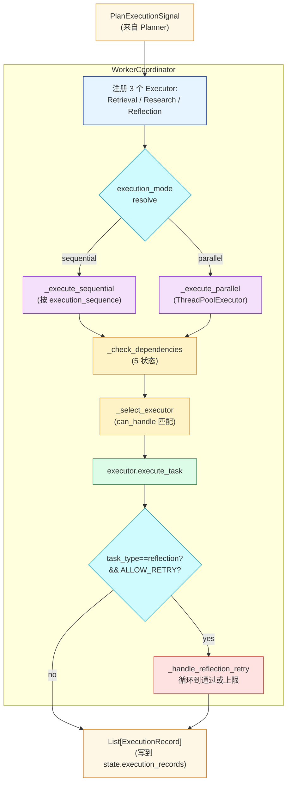
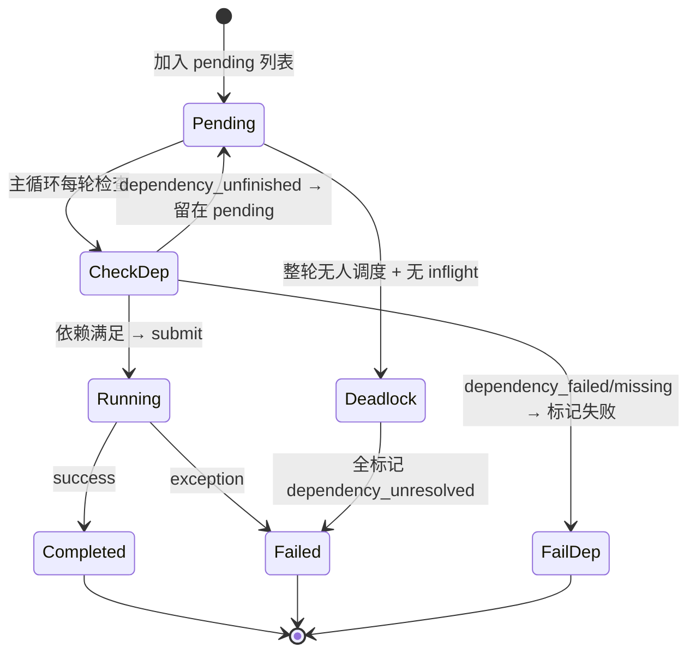
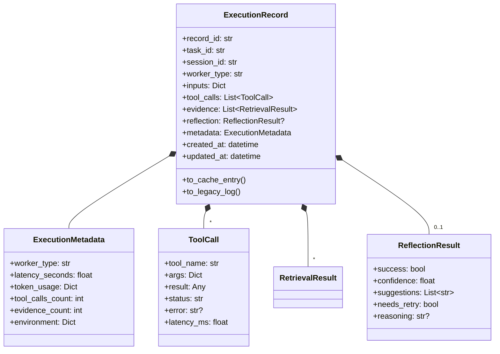
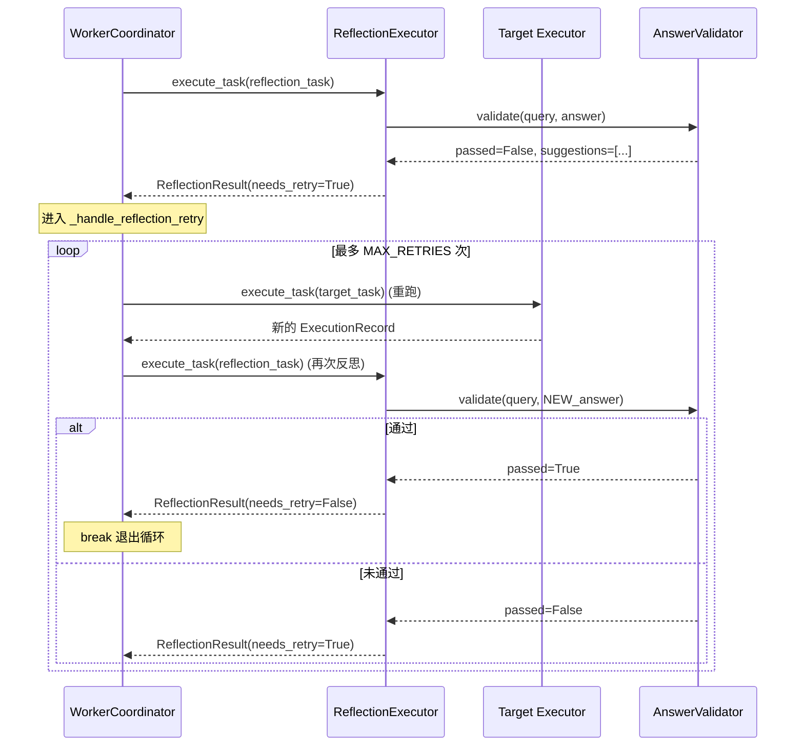

# 第 12 篇 · WorkerCoordinator + Executor + 反思重试 + 并发

> 本系列共 16 篇，本文是 **Part 4（Plan-Execute-Report 多智能体）的第 2 站**：把第 11 篇产出的 `PlanSpec` **真正"跑起来"** —— 三种 Executor（Retrieval / Research / Reflection）的调度、依赖检查、并行控制、证据追踪、反思失败后的目标任务自动重试。
>
> 这一篇是项目里**并发与状态管理最复杂的一段**——4 个状态机 + 5 种依赖状态 + 反思重试循环。读完后你会理解为什么 LangGraph 在多智能体编排场景**并非必需**，手写状态机也能做到工程级稳健。

---

## 1. 学习目标

读完本篇你应该能：

1. 画出 `WorkerCoordinator.execute_plan` 的调度流程，区分 sequential 与 parallel 两种模式的差异。
2. 看懂 `_check_dependencies` 的 **5 种依赖状态**（none / dependency_failed / dependency_missing / dependency_unfinished / ready）以及每种状态对应的处理路径。
3. 区分三种 Executor 的职责：`RetrievalExecutor`（5 种 search 任务）/ `ResearchExecutor`（DeepResearch）/ `ReflectionExecutor`（答案验证）。
4. 读懂 `ExecutionRecord / ReflectionResult / ExecutionMetadata` 三层数据模型的层次关系——这是多 Agent 的"通用收据"。
5. 解释 `_handle_reflection_retry` 的循环逻辑：反思失败 → 重跑目标任务 → 再次反思 → 直到通过或达到重试上限。
6. 理解 `EvidenceTracker` 如何在多个执行器之间共享证据并自动去重 + 高分优先。
7. 识别并行调度的**死锁防护**：循环结束时还有 pending 但没有调度成功的任务会被标记为 `dependency_unresolved`。

---

## 2. 前置知识

- 已读 **第 11 篇**：知道 `PlanSpec / TaskGraph / PlanExecutionSignal` 的结构。
- 已读 **第 07、08 篇**：知道四种检索 + DeepResearch 工具如何调用。
- 熟悉 Python `concurrent.futures.ThreadPoolExecutor` 与 `wait(..., return_when=FIRST_COMPLETED)`。
- 知道经典的"生产者-消费者"调度模式。

---

## 3. 源码地图

| 文件 | 关键类 / 函数 | 行号锚点 |
|---|---|---|
| `graphrag_agent/agents/multi_agent/executor/base_executor.py` | `BaseExecutor`（抽象）/ `TaskExecutionResult` / `ExecutorConfig` | `executor/base_executor.py:14-89` |
|  | `build_default_inputs`（统一输入构造） | `base_executor.py:69-88` |
| `graphrag_agent/agents/multi_agent/executor/worker_coordinator.py` | `WorkerCoordinator.execute_plan / _execute_sequential / _execute_parallel` | `executor/worker_coordinator.py:36-256` |
|  | `_check_dependencies`（5 状态） | `worker_coordinator.py:400-465` |
|  | `_execute_single_task / _select_executor / _create_failure_record` | `worker_coordinator.py:258-398` |
|  | `_handle_reflection_retry` | `worker_coordinator.py:467-564` |
| `graphrag_agent/agents/multi_agent/executor/retrieval_executor.py` | `RetrievalExecutor.execute_task / _invoke_tool / _extract_evidence` | `executor/retrieval_executor.py:36-299` |
| `graphrag_agent/agents/multi_agent/executor/research_executor.py` | `ResearchExecutor.execute_task / _wrap_research_output / _extract_reference_ids` | `executor/research_executor.py:37-341` |
| `graphrag_agent/agents/multi_agent/executor/reflector.py` | `ReflectionExecutor.execute_task / _resolve_query_answer / _build_reference_keywords` | `executor/reflector.py:30-629` |
| `graphrag_agent/agents/multi_agent/core/execution_record.py` | `ToolCall / ReflectionResult / ExecutionMetadata / ExecutionRecord` | `core/execution_record.py:14-240` |
| `graphrag_agent/agents/multi_agent/core/retrieval_result.py` | `RetrievalResult` / `RetrievalMetadata` | `core/retrieval_result.py:40-217` |
| `graphrag_agent/agents/multi_agent/tools/evidence_tracker.py` | `EvidenceTracker.register / lookup / resolve` + `get_evidence_tracker` | `tools/evidence_tracker.py:13-99` |
| `graphrag_agent/search/tool/validation_tool.py` | `AnswerValidationTool.validate` | 全文件 |
| `graphrag_agent/config/settings.py` | `MA_WORKER_*` / `MA_REFLECTION_*` | `settings.py:335-348` |
| `graphrag_agent/config/prompts/executor_prompts.py` | `EXECUTE_PROMPT / REFLECT_PROMPT / REPLAN_PROMPT` | 全文件 238 行 |

---

## 4. 核心机制讲解

### 4.1 全景：从 ExecutorSignal 到 ExecutionRecord



主入口 `execute_plan` (`worker_coordinator.py:77-101`)：

```python
def execute_plan(self, state, signal):
    task_map = self._prepare_tasks(signal)
    if state.plan is not None:
        state.plan.status = "executing"
    
    effective_mode = self._resolve_execution_mode(signal.execution_mode)
    if effective_mode == "parallel":
        results = self._execute_parallel(state, signal, task_map)
    else:
        results = self._execute_sequential(state, signal, task_map)
    
    # 更新 plan 总状态
    if state.plan is not None:
        node_status = [node.status for node in state.plan.task_graph.nodes]
        if all(status == "completed" for status in node_status):
            state.plan.status = "completed"
        elif any(status == "failed" for status in node_status):
            state.plan.status = "failed"
    return results
```

**3 件事**：① 准备任务映射 ② 选模式跑调度 ③ 汇总 plan 整体状态。

### 4.2 `BaseExecutor` 抽象：1 个方法 + 1 个判定

```python
# executor/base_executor.py:40-88
class BaseExecutor(ABC):
    worker_type: str = "base_executor"
    
    @abstractmethod
    def can_handle(self, task_type: str) -> bool:
        """判定能否处理"""
    
    @abstractmethod
    def execute_task(self, task, state, signal) -> TaskExecutionResult:
        """执行任务"""
    
    def build_default_inputs(self, task: TaskNode) -> Dict[str, Any]:
        """统一构造工具输入：query/entities/parameters 三件套"""
        parameters = copy.deepcopy(task.parameters or {})
        query = parameters.get("query") or task.description
        payload = {"query": query}
        if task.entities:
            payload.setdefault("entities", task.entities)
            payload.setdefault("start_entities", task.entities)
        payload.update(parameters)
        return payload
```

**两个抽象方法 + 一个共享工具**。这是项目里"抽象基类的最小化设计"——子类只关心"我能处理什么"和"我怎么处理"，输入构造交给基类。

`build_default_inputs` 的优先级：

1. `task.parameters['query']` > `task.description` —— prompt 显式优先于描述。
2. `task.entities` 同时填充 `entities` 和 `start_entities`（chain_exploration 用 start_entities）。
3. `parameters` 中其他字段最后 update，**可以覆盖前面**。

**这种"层叠覆盖"让 Planner 输出和工具调用契约解耦**。

### 4.3 三种 Executor 的职责分工

| Executor | 处理的 task_type | 工具来源 | 关键差异 |
|---|---|---|---|
| **RetrievalExecutor** | `local_search`、`global_search`、`hybrid_search`、`naive_search`、`chain_exploration` | `TOOL_REGISTRY` + `EXTRA_TOOL_FACTORIES` | 优先调 `structured_search`，没有就调 `search` |
| **ResearchExecutor** | `deep_research`、`deeper_research` | `TOOL_REGISTRY` 中两个 DeepResearch 工具 | 调 `search`（返回字典）→ 包装成 RetrievalResult + 引用解析 |
| **ReflectionExecutor** | `reflection` | `AnswerValidationTool` | 不调外部搜索工具，**对已有 task 的答案做验证** |

#### 4.3.1 `RetrievalExecutor._invoke_tool`：多策略调用

```python
# retrieval_executor.py:147-171
def _invoke_tool(self, tool, task_type, payload):
    if hasattr(tool, "structured_search"):
        return tool.structured_search(payload)
    if hasattr(tool, "search"):
        result = tool.search(payload)
        if isinstance(result, dict):
            return result
        return {"answer": result, "retrieval_results": []}
    if task_type == "chain_exploration" and hasattr(tool, "explore"):
        return tool.explore(
            query=payload.get("query"),
            start_entities=payload.get("start_entities") or payload.get("entities"),
            ...
        )
    raise ValueError(f"任务类型 {task_type} 未提供可用的执行方法")
```

**三层 fallback**：

- 优先 `structured_search`（返回标准化 dict 含 `retrieval_results`）。
- 退化到 `search`（字符串答案，包装成 dict）。
- 特例 `chain_exploration` 调 `explore(...)`（**第 08 篇** 介绍过）。

#### 4.3.2 `ResearchExecutor._wrap_research_output`：引用 ID 解析

```python
# research_executor.py:141-190（精简）
def _wrap_research_output(self, state, task, tool_name, result_payload):
    answer_text = self._extract_answer_text(result_payload)
    reference_ids = self._extract_reference_ids(result_payload, answer_text)
    
    # 把 DeepResearch 的整段答案包装成 1 个 RetrievalResult
    result = RetrievalResult(
        granularity="DO",
        evidence=answer_text or "（深度研究未返回结构化文本...）",
        metadata=RetrievalMetadata(
            source_id=f"{task.task_id}:{tool_name}",
            confidence=0.65,
            extra={"references": reference_ids}
        ),
        source=tool_name,
        score=0.65,
    )
    evidence = [result]
    
    # 解析答案中的证据引用，关联到 state 里已有的 RetrievalResult
    reference_results = self._resolve_reference_evidence(state, reference_ids)
    if reference_results:
        evidence.extend(reference_results)
    return evidence, answer_text, reference_ids
```

**`_extract_reference_ids` 的 3 个解析点** (`research_executor.py:252-293`)：

```python
# 1. 从 dict 的 reference / references 字段
reference_payload = result_payload.get("reference") or result_payload.get("references")

# 2. 从答案文本中找 {"Chunks": [...]} 结构
chunk_matches = re.findall(r"Chunks'\s*:\s*\[([^\]]+)\]", answer_text)

# 3. 从答案文本中找 [证据ID:xxx] 标签
id_matches = re.findall(r"\[证据ID[:：]\s*([A-Za-z0-9\-]+)\]", answer_text)
```

**意图**：DeepResearch 的答案是自由文本，里面**嵌入了证据 ID 引用**（如 `[证据ID:chunk_42]`）。ResearchExecutor 把这些 ID 提取出来 → 查回 state 中已存在的 RetrievalResult → 把它们一起作为本次任务的 evidence。**这样 Reporter（第 13 篇）才能正确做引用脚注**。

### 4.4 调度模式：Sequential vs Parallel

#### 4.4.1 Sequential（默认）

```python
# worker_coordinator.py:127-148
def _execute_sequential(self, state, signal, task_map):
    results = []
    sequence = signal.execution_sequence or list(task_map.keys())
    for task_id in sequence:
        task = task_map.get(task_id)
        if task is None:
            continue
        self._execute_single_task(
            state=state, signal=signal, task=task,
            task_map=task_map, results=results,
            skip_dependency_check=False,
        )
    return results
```

**按 Planner 的拓扑序逐个执行**——简单可靠。

#### 4.4.2 Parallel：状态机调度

```python
# worker_coordinator.py:150-256（精简）
def _execute_parallel(self, state, signal, task_map):
    pending = [...]                                # 所有待执行
    inflight = {}                                  # future → task_id
    task_status = {task_id: "pending" for task_id in pending}
    
    with ThreadPoolExecutor(max_workers=max_workers) as executor:
        while pending or inflight:
            scheduled_this_round = False
            
            # 1️⃣ 尝试调度 pending
            for task_id in list(pending):
                if len(inflight) >= max_workers:
                    break
                
                dependency_ok, dependency_error, failure_reason = self._check_dependencies(task, state)
                if dependency_ok:
                    future = executor.submit(self._execute_single_task, ...)
                    inflight[future] = task_id
                    task_status[task_id] = "running"
                    pending.remove(task_id)
                    scheduled_this_round = True
                
                elif failure_reason in {"dependency_failed", "dependency_missing"}:
                    # 依赖永远不会满足 → 直接标记失败
                    failure_record = self._create_failure_record(...)
                    results.append(failure_record)
                    pending.remove(task_id)
                    scheduled_this_round = True
                # dependency_unfinished → 等下一轮
            
            # 2️⃣ 等待至少一个 inflight 完成
            if inflight:
                done, _ = wait(inflight.keys(), return_when=FIRST_COMPLETED)
                for future in done:
                    task_id = inflight.pop(future)
                    success, _ = future.result()
                    task_status[task_id] = "completed" if success else "failed"
                    scheduled_this_round = True
                continue
            
            # 3️⃣ 死锁防护：本轮一个都没调度
            if not scheduled_this_round:
                if pending:
                    # 把所有 pending 标记为依赖无法解析
                    for task_id in list(pending):
                        failure_record = self._create_failure_record(
                            state, task, "任务依赖未解析或存在循环依赖",
                            failure_reason="dependency_unresolved",
                        )
                        ...
                    pending.clear()
                break
```

**这是项目里最复杂的并发调度**。3 个循环角色：



**死锁防护**（`worker_coordinator.py:241-254`）：当本轮**所有 pending 都被 dependency_unfinished 卡住、且 inflight 为空**时，意味着没有任何 future 能推进——这是循环依赖或前置任务全失败的兆头。直接把所有 pending 标记为 `dependency_unresolved` 失败。

**`max_workers`** 来自 `MULTI_AGENT_WORKER_MAX_CONCURRENCY`（默认 = `MAX_WORKERS=4`）。

### 4.5 `_check_dependencies`：5 种依赖状态

```python
# worker_coordinator.py:400-465（精简）
def _check_dependencies(self, task, state):
    if not task.depends_on:
        return True, None, "none"
    
    status_map = {node.task_id: node.status for node in state.plan.task_graph.nodes}
    completed_ids = set(state.execution_context.completed_task_ids)
    
    failed_dependencies = []
    pending_dependencies = []
    missing_dependencies = []
    
    for dep_id in task.depends_on:
        status = status_map.get(dep_id)
        if status == "failed":
            failed_dependencies.append(dep_id)
        elif status == "completed" or dep_id in completed_ids:
            continue
        elif status is None:
            missing_dependencies.append(dep_id)
        else:
            pending_dependencies.append(dep_id)
    
    if failed_dependencies:
        return False, f"依赖任务失败: ...", "dependency_failed"
    if missing_dependencies:
        return False, f"依赖任务缺失: ...", "dependency_missing"
    if pending_dependencies:
        return False, f"依赖任务未完成: ...", "dependency_unfinished"
    
    return True, None, "ready"
```

5 种状态对照表：

| 状态 | 含义 | 调度器响应 |
|---|---|---|
| `none` | 无依赖 | 立即执行 |
| `ready` | 依赖全部完成 | 立即执行 |
| `dependency_unfinished` | 依赖在 pending/running | **等待**下一轮 |
| `dependency_missing` | 依赖任务 ID 在 plan 中不存在 | **直接失败**（Planner 出了 bug） |
| `dependency_failed` | 依赖任务已经失败 | **直接失败**（传递性） |

**3 种"立刻失败"vs"等待"的区分**很重要：

- 临时性问题（unfinished）→ 等
- 结构性问题（missing / failed）→ 不可能等到，直接失败

这避免了"傻傻等到死锁"的情况。

### 4.6 数据契约：`ExecutionRecord` 三层模型



**5 个角色**：

- `ExecutionRecord` —— 任务级"收据"，唯一 `record_id`，绑 `task_id`。
- `ToolCall` —— 单次工具调用，记录参数 + 返回 + 延迟 + 错误。
- `ReflectionResult` —— 反思结果，含 `needs_retry` 是反思重试循环的核心信号。
- `ExecutionMetadata` —— 性能 + 环境元数据。
- `evidence` 列表 —— 标准化的 `RetrievalResult`，Reporter 直接消费。

**`to_legacy_log`** (`execution_record.py:200-215`) 把 ExecutionRecord 转成旧版 `BaseAgent.execution_log` 格式——这是为了让 `server/services/agent_service.py` 的"轨迹回显"功能能消费 multi_agent 的输出。这种**向下兼容设计**让 FusionGraphRAGAgent 平滑切换。

### 4.7 `ReflectionExecutor`：项目里最聪明的 executor

`ReflectionExecutor.execute_task` (`reflector.py:49-208`) 的核心 5 步：

1. **解析 query/answer/target_task_id**：从 task.parameters 或 state.execution_context.intermediate_results 找到要校验的目标任务的答案。
2. **构建参考关键词**：从已有证据、目标任务 query、用户输入推导出验证用的关键词集合。
3. **调用 `AnswerValidationTool.validate(query, answer, reference_keywords)`**：返回 `passed` + 各项细分检查。
4. **生成建议**：未通过的验证项 → 关键词差距分析 → suggestions 列表。
5. **构造 `ReflectionResult`** + 调度器后续读 `needs_retry` 字段。

```python
# reflector.py:171-177
reflection = ReflectionResult(
    success=validation_passed,
    confidence=0.85 if validation_passed else 0.4,
    suggestions=suggestions if not validation_passed else [],
    needs_retry=not validation_passed,
    reasoning=reflection_reason,
)
```

**`needs_retry` 是整个重试循环的钥匙** —— 下游 `_handle_reflection_retry` 看这个字段决定是否重新跑 target_task。

### 4.8 `_handle_reflection_retry`：自动重试循环

```python
# worker_coordinator.py:467-563（精简）
def _handle_reflection_retry(self, *, task, initial_result, state, signal, task_map, executor, results):
    reflection = initial_result.record.reflection
    if reflection is None or not reflection.needs_retry:
        return None
    
    target_task_id = initial_result.record.metadata.environment.get("target_task_id")
    if not target_task_id:
        return None
    
    retry_counts = state.execution_context.reflection_retry_counts
    final_result = None
    
    while (reflection.needs_retry 
           and retry_counts.get(target_task_id, 0) < MULTI_AGENT_REFLECTION_MAX_RETRIES):
        retry_counts[target_task_id] = retry_counts.get(target_task_id, 0) + 1
        
        target_task = task_map.get(target_task_id)
        target_executor = self._select_executor(target_task.task_type)
        
        # 重新执行目标任务
        retry_result = target_executor.execute_task(target_task, state, signal)
        results.append(retry_result.record)
        
        if not retry_result.success:
            break
        
        # 再次反思
        updated_result = executor.execute_task(task, state, signal)
        results.append(updated_result.record)
        final_result = updated_result
        reflection = updated_result.record.reflection
    
    return final_result
```

时序图：



**关键设计点**：

- **每次重试都新建一个 ExecutionRecord** 追加到 results——历史完整可追溯。
- **retry_counts 按 target_task_id 计数**——同一目标任务最多 N 次。
- **target_task 失败时立刻退出**——避免无意义的反复反思。
- **MULTI_AGENT_REFLECTION_ALLOW_RETRY** 默认 False（`settings.py:336`），生产开启用 `MA_REFLECTION_ALLOW_RETRY=true`。

### 4.9 `EvidenceTracker`：跨 executor 的证据中枢

```python
# tools/evidence_tracker.py:21-52
def register(self, entries):
    canonical = []
    for item in entries:
        key = self._make_key(item)            # source_id:granularity
        stored = self.registry["by_key"].get(key)
        if stored is None:
            self.registry["by_key"][key] = {"result": item, "occurrences": 1}
            self.registry["by_id"][item.result_id] = {"key": key, "result": item}
            canonical.append(item)
            continue
        
        stored_result = stored["result"]
        stored["occurrences"] += 1
        
        if item.score > stored_result.score:   # 高分覆盖低分
            stored["result"] = item
            # 同步更新所有指向同一 source 的引用
            for rid, meta in list(self.registry["by_id"].items()):
                if meta.get("key") == key:
                    meta["result"] = item
            canonical.append(item)
        else:
            canonical.append(stored_result)
    return canonical
```

**3 个特性**：

1. **双向索引**：`by_key`（source_id:granularity 去重）+ `by_id`（result_id 快速查找）。
2. **高分覆盖**：同一 source 不同次召回，保留 score 最大者。
3. **占用次数统计**：`occurrences` 字段方便后续做"被引用次数"排序（Reporter 用）。

`get_evidence_tracker` (`tools/evidence_tracker.py:85-96`) 是**惰性单例 + 状态外置**：

```python
def get_evidence_tracker(state):
    registry = state.execution_context.evidence_registry.setdefault("tracker", {})
    tracker = registry.get("_instance")
    if not isinstance(tracker, EvidenceTracker):
        tracker_state = registry.get("state")
        tracker = EvidenceTracker(tracker_state)
        registry["_instance"] = tracker
        registry["state"] = tracker.registry
    return tracker
```

**Tracker 的状态被存进 `state.execution_context.evidence_registry`**——这让 tracker 可以**跨进程序列化**（state 可以 pickle 后传给其他进程），只要重新调 `get_evidence_tracker(state)` 就能还原。这是一种"对象 + 状态分离"的高级模式。

### 4.10 `_create_failure_record`：失败的统一记账

无论哪种失败模式（依赖未满足、executor 不存在、任务异常），都通过同一函数生成失败记录（`worker_coordinator.py:352-398`）：

```python
def _create_failure_record(self, state, task, error, *, failure_reason="unknown"):
    metadata = ExecutionMetadata(
        worker_type="worker_coordinator",
        latency_seconds=0.0,
        tool_calls_count=0,
        evidence_count=0,
        environment={"reason": failure_reason},
    )
    record = ExecutionRecord(
        task_id=task.task_id,
        session_id=state.session_id,
        worker_type="worker_coordinator",
        inputs={"task": task.model_dump()},
        tool_calls=[],
        evidence=[],
        metadata=metadata,
    )
    if state.execution_context is not None:
        state.execution_context.errors.append({
            "task_id": task.task_id,
            "error": error,
            "worker_type": "worker_coordinator",
            "reason": failure_reason,
        })
    state.execution_records.append(record)
    if state.plan is not None:
        state.plan.update_task_status(task.task_id, "failed")
    return record
```

**统一失败记录的工程价值**：

- Reporter / 前端能用同一套数据模型展示成功 + 失败。
- `failure_reason` 字段（`dependency_failed / executor_not_found / execution_exception / ...`）让运维快速定位问题类型。

---

## 5. 重点技术点深挖

### 5.1 Parallelism：Send API vs ThreadPoolExecutor（B 类技术点）

业界 LangGraph 推荐的并行方式：

```python
# 概念示例（非项目代码）
from langgraph.types import Send

def planner_node(state):
    return [Send("worker", {"task": t}) for t in state["tasks"]]

graph.add_node("planner", planner_node)
graph.add_node("worker", worker_fn)
graph.add_conditional_edges("planner", lambda _: "worker")
```

**`Send` API 让 LangGraph 自动 fan-out**，等所有完成再 fan-in。

**项目为什么不用 Send 而用 ThreadPoolExecutor**？

| 维度 | LangGraph Send | 项目 ThreadPoolExecutor |
|---|---|---|
| 节点级别 | LangGraph 图节点 | 普通 Python 函数 |
| 状态合并 | LangGraph 自动 | 手动 `state.execution_records.append` |
| 依赖检查 | 隐式（由图边表达） | 显式 `_check_dependencies` |
| 死锁防护 | 由 recursion_limit | 手写循环退出 |
| 重试逻辑 | 需图改造（add cycle） | `_handle_reflection_retry` 直接写 while |

**项目选 ThreadPoolExecutor 的合理性**：

- 反思重试涉及"重跑某个特定任务"——LangGraph 的 Send 没法精准表达。
- 死锁防护、状态机精度更高。
- 这是**手写状态机比框架更胜的场景**。

### 5.2 Reflexion 模式实现（C 类技术点）

Reflexion（Shinn 2023）核心思想：**LLM 评估自己的输出 → 不满意则改进 → 形成自我提升循环**。

项目实现层次：

| 层 | 实现位置 |
|---|---|
| **反思评估** | `ReflectionExecutor.execute_task` + `AnswerValidationTool.validate` |
| **改进建议** | `ReflectionResult.suggestions` |
| **重试循环** | `WorkerCoordinator._handle_reflection_retry` |
| **重试上限** | `MULTI_AGENT_REFLECTION_MAX_RETRIES=1`（默认值低，生产可调高） |

**与论文 Reflexion 的差异**：

- 论文：用 LLM 作为评估者（self-critique）。
- 项目：用 `AnswerValidationTool`（关键词覆盖度 + 自定义规则）做**轻量级评估**——避免再次 LLM 调用。

**`AnswerValidationTool` 的实现**（`search/tool/validation_tool.py` + `search/tool/reasoning/validator.py`）：

- 关键词覆盖度（answer 中含 query 关键词的比例）。
- 长度阈值（answer 不能太短）。
- 错误模式（不能含"抱歉"、"无法回答"等）。

**升级方向**：用 LLM-as-Judge 替换 `AnswerValidationTool`——但成本会显著上升。

### 5.3 Fallback / 多级降级（E 类技术点）

项目里 Fallback 在 4 个层级：

| 层 | Fallback 策略 | 触发条件 |
|---|---|---|
| **执行模式** | adaptive → sequential | `_resolve_execution_mode` 不识别 adaptive |
| **工具调用** | structured_search → search → explore | RetrievalExecutor 三层探查 |
| **依赖失败** | 不重试，立即标记 failed 并继续其他 | `dependency_failed` |
| **反思失败** | 重试 N 次后接受现状 | `MULTI_AGENT_REFLECTION_MAX_RETRIES` 达到 |

**核心原则**：**任何一个任务的失败都不应该让整个 plan 崩溃**——即使最后只有部分任务完成，Reporter 也能基于已收集的 evidence 写出报告。

### 5.4 状态共享：`state` 作为传染媒介（B 类技术点）

`PlanExecuteState` 在多个 Executor 之间**显式传递**，是状态共享的唯一通道。**没用单例、没用全局变量**：

```python
# 所有 executor 调用都传 state
def execute_task(self, task, state, signal):
    ...
    state.execution_records.append(record)
    state.execution_context.completed_task_ids.append(task.task_id)
    state.execution_context.intermediate_results[task.task_id] = {...}
```

这种**"显式状态传递"**的好处：

- 测试时容易构造一个干净的 state，模拟某个执行点。
- 多线程下 state 是局部对象（虽然内部成员可能并发写——见下文）。
- 容易序列化（pickle）跨进程传递。

**线程安全问题**：`_execute_parallel` 里多个 future 同时往 `state.execution_records.append` / `state.execution_context.completed_task_ids.append` 写——**Python 的 list.append 是线程安全的 GIL 保护**，所以不会崩溃，但顺序非确定。生产中如果做精确审计，**Reporter 端要按 timestamp 重排**。

---

## 6. Hands-on：跑一次完整 Plan-Execute 流程

### 6.1 完整端到端跑通

```python
# tmp_executor_e2e.py
from graphrag_agent.agents.multi_agent.planner.base_planner import BasePlanner
from graphrag_agent.agents.multi_agent.executor.worker_coordinator import WorkerCoordinator
from graphrag_agent.agents.multi_agent.core.state import PlanExecuteState

planner = BasePlanner()
worker = WorkerCoordinator()

state = PlanExecuteState(input="分析国家奖学金的申请流程")
plan_result = planner.generate_plan(state)
print(f"计划生成: {len(plan_result.plan_spec.task_graph.nodes) if plan_result.plan_spec else 0} 个任务")

records = worker.execute_plan(state, plan_result.executor_signal)

print(f"\n=== 执行结果: {len(records)} 条记录 ===")
for r in records:
    status = "✓" if not r.tool_calls or all(c.status == "success" for c in r.tool_calls) else "✗"
    print(f"  {status} {r.task_id} | {r.worker_type} | evidence={len(r.evidence)} | latency={r.metadata.latency_seconds:.2f}s")
    if r.tool_calls and r.tool_calls[0].error:
        print(f"     ERROR: {r.tool_calls[0].error[:100]}")

print(f"\n=== Plan 最终状态: {state.plan.status} ===")
```

### 6.2 切换 sequential / parallel 看时间差

```python
# tmp_executor_modes.py
import os, time
from graphrag_agent.agents.multi_agent.executor.worker_coordinator import WorkerCoordinator
# ... 准备 plan_result（同上）

for mode in ["sequential", "parallel"]:
    os.environ["MA_WORKER_EXECUTION_MODE"] = mode
    
    # 必须重新构造（settings 是 import 时读的）
    from importlib import reload
    import graphrag_agent.config.settings as cfg
    reload(cfg)
    
    worker = WorkerCoordinator(execution_mode=mode)
    
    # 重置 state
    state.execution_records = []
    state.execution_context.completed_task_ids = []
    
    t0 = time.time()
    records = worker.execute_plan(state, plan_result.executor_signal)
    elapsed = time.time() - t0
    print(f"{mode}: {len(records)} 任务 / {elapsed:.2f}s")
```

**预期观察**：并行模式比串行快 ≈ N×（N 是并行度，受 max_workers 限制）。**如果任务之间强依赖（链状），两种模式速度相同**——没有可并行空间。

### 6.3 触发依赖失败的传染

```python
# tmp_executor_dependency_fail.py
from graphrag_agent.agents.multi_agent.core.plan_spec import (
    PlanSpec, ProblemStatement, TaskGraph, TaskNode, AcceptanceCriteria
)
from graphrag_agent.agents.multi_agent.executor.worker_coordinator import WorkerCoordinator
from graphrag_agent.agents.multi_agent.core.state import PlanExecuteState

# 手工构造一个 plan：A 故意失败，B 依赖 A
nodes = [
    TaskNode(task_id="A", task_type="local_search",
             description="不存在的内容", parameters={"query": "ZZZZZZ_NEVER_EXISTS"}),
    TaskNode(task_id="B", task_type="local_search",
             description="依赖 A", depends_on=["A"]),
]
plan = PlanSpec(
    problem_statement=ProblemStatement(original_query="test"),
    task_graph=TaskGraph(nodes=nodes),
    acceptance_criteria=AcceptanceCriteria(),
)
state = PlanExecuteState(input="test")
state.plan = plan
signal = plan.to_execution_signal()

worker = WorkerCoordinator(execution_mode="parallel")
records = worker.execute_plan(state, signal)

for r in records:
    print(f"{r.task_id} | reason={r.metadata.environment.get('reason', '-')}")
    if r.task_id == "B":
        # 看 errors 列表
        for err in state.execution_context.errors:
            if err["task_id"] == "B":
                print(f"  错误详情: {err}")
```

**预期观察**：B 不会执行（即使 A 成功，因为 query 是无意义字符串），如果 A 失败 → B 直接 dependency_failed。

### 6.4 看 EvidenceTracker 的去重

```python
# tmp_evidence_tracker.py
from graphrag_agent.agents.multi_agent.core.state import PlanExecuteState
from graphrag_agent.agents.multi_agent.core.retrieval_result import RetrievalResult, RetrievalMetadata
from graphrag_agent.agents.multi_agent.tools.evidence_tracker import get_evidence_tracker

state = PlanExecuteState(input="test")
tracker = get_evidence_tracker(state)

# 同 source 不同 score 的两次召回
r1 = RetrievalResult(
    granularity="Chunk", evidence="text v1",
    metadata=RetrievalMetadata(source_id="chunk_42", source_type="chunk"),
    source="local_search", score=0.5
)
r2 = RetrievalResult(
    granularity="Chunk", evidence="text v2 (better)",
    metadata=RetrievalMetadata(source_id="chunk_42", source_type="chunk"),
    source="hybrid_search", score=0.8
)
r3 = RetrievalResult(
    granularity="Chunk", evidence="another chunk",
    metadata=RetrievalMetadata(source_id="chunk_99", source_type="chunk"),
    source="local_search", score=0.6
)

tracker.register([r1])
print(f"After r1: {len(tracker.all_results())} 个")

tracker.register([r2])  # 同 source 高分 → 覆盖
print(f"After r2: {len(tracker.all_results())} 个（仍然是 1，但内容更新为 v2）")
print(f"  evidence: {tracker.all_results()[0].evidence}")

tracker.register([r3])  # 不同 source → 新增
print(f"After r3: {len(tracker.all_results())} 个")

# 查询统计
state_dict = state.execution_context.evidence_registry["tracker"]["state"]
for key, info in state_dict["by_key"].items():
    print(f"  {key}: occurrences={info['occurrences']}, score={info['result'].score}")
```

**预期观察**：

- r1 后 1 个证据。
- r2 register 后仍 1 个，但 evidence 是 "text v2 (better)"、score 0.8、occurrences=2。
- r3 后 2 个证据。

### 6.5 开启反思重试看循环

```python
# tmp_reflection_retry.py
import os
os.environ["MA_REFLECTION_ALLOW_RETRY"] = "true"
os.environ["MA_REFLECTION_MAX_RETRIES"] = "2"

from importlib import reload
import graphrag_agent.config.settings as cfg
reload(cfg)

from graphrag_agent.agents.multi_agent.planner.base_planner import BasePlanner
from graphrag_agent.agents.multi_agent.executor.worker_coordinator import WorkerCoordinator
from graphrag_agent.agents.multi_agent.core.state import PlanExecuteState

planner = BasePlanner()
worker = WorkerCoordinator()

state = PlanExecuteState(input="分析一个非常模糊的问题")  # 故意模糊让反思可能失败
plan_result = planner.generate_plan(state)

# 看是否自动追加了 reflection 节点
reflection_nodes = [n for n in plan_result.plan_spec.task_graph.nodes if n.task_type == "reflection"]
print(f"反思节点: {len(reflection_nodes)} 个")

records = worker.execute_plan(state, plan_result.executor_signal)

# 看 reflection_retry_counts
retry_counts = state.execution_context.reflection_retry_counts
print(f"\n反思重试次数:")
for tid, count in retry_counts.items():
    print(f"  target_task={tid}: 重试 {count} 次")

# 看 records 中的 reflection
for r in records:
    if r.reflection:
        print(f"\n{r.task_id} reflection: success={r.reflection.success}, "
              f"confidence={r.reflection.confidence}, suggestions={r.reflection.suggestions[:2]}")
```

**预期观察**：

- 计划里追加了 reflection 节点。
- 如果反思未通过会触发重跑——你能在 records 中看到同一 task_id 出现多次。
- `reflection_retry_counts` 显示每个目标任务被重试了几次。

### 6.6 Debug 提示

- **断点位置 1**：`worker_coordinator.py:184 future = executor.submit(...)`，看哪些任务并行提交。
- **断点位置 2**：`worker_coordinator.py:401 _check_dependencies`，看依赖状态判定的具体路径。
- **断点位置 3**：`reflector.py:171 reflection = ReflectionResult(...)`，看 needs_retry 何时被置为 True。
- **断点位置 4**：`worker_coordinator.py:500 retry_result = target_executor.execute_task(target_task, state, signal)`，看重试目标任务的过程。
- **常见错误 1**：`未找到任务类型 X 对应的执行器`——TaskDecomposer 输出了未注册类型。检查 `task.parameters.original_task_type` 是不是被映射到 custom。
- **常见错误 2**：`max_parallel_workers 必须大于等于 1`——`MA_WORKER_MAX_CONCURRENCY` 设成了 0。
- **常见错误 3**：parallel 模式下结果顺序乱——`execution_records` 是按完成顺序追加的，**要稳定输出要排序**：`sorted(records, key=lambda r: r.created_at)`。

---

## 7. 思考题

1. **加一个新 Executor 类型**：你想加个 `web_search` 任务类型 + 对应的 `WebSearchExecutor`，最小改造涉及哪几个文件？（提示：`plan_spec.py:14 TASK_TYPE_CHOICES`、`worker_coordinator.py:51 默认 executor 列表`、新 Executor 类）
2. **依赖图的关键路径分析**：当前 sequential 按拓扑序执行，但有些任务是关键路径（决定总耗时）。**如何在 plan 阶段标记关键路径**，并让 parallel 模式优先调度它们？（提示：考虑 DAG 的最长路径算法）
3. **LLM-as-Judge 升级 ReflectionExecutor**：把 `AnswerValidationTool` 替换为 LLM-as-Judge。**会增加多少 LLM 调用**？最大改造点是什么？（提示：考虑置信度阈值 + 缓存）

---

## 8. 延伸阅读

- **Reflexion 论文**：[Shinn et al. 2023, arXiv:2303.11366](https://arxiv.org/abs/2303.11366)
- **LangGraph Send API**：[Distributed processing with Send](https://langchain-ai.github.io/langgraph/how-tos/map-reduce/)
- **Python concurrent.futures 官方文档**：[concurrent.futures](https://docs.python.org/3/library/concurrent.futures.html) —— ThreadPoolExecutor + wait API 的标准用法。
- **DAG 关键路径算法**：[Critical Path Method (CPM)](https://en.wikipedia.org/wiki/Critical_path_method) —— 项目管理中的最长路径算法。
- **AutoGen Multi-Agent**：[microsoft/autogen](https://github.com/microsoft/autogen) —— 微软的多智能体框架，提供另一种调度模式参考。
- **Python GIL 与 list 线程安全**：[GIL FAQ](https://wiki.python.org/moin/GlobalInterpreterLock) —— 为什么 list.append 在多线程下不会崩溃。

---

> ✅ 本篇结束。下一篇（**📄 13. Reporter + Map-Reduce + 一致性 + Reporter 级缓存**）会进入最后一段：把所有 ExecutionRecord 中的 evidence 整合成一份**带引用、可校验、可缓存**的长文档报告——3 种 Reduce 策略 + 节级缓存 + 一致性检查的完整工程实践。
>
> 调参口诀：**5 种依赖状态分清；高分证据自动覆盖；反思失败可重试；并行死锁要防护**。
