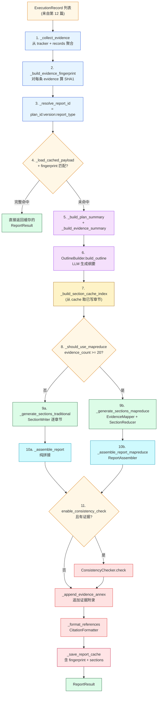
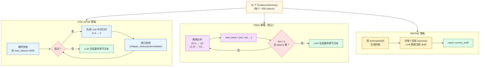
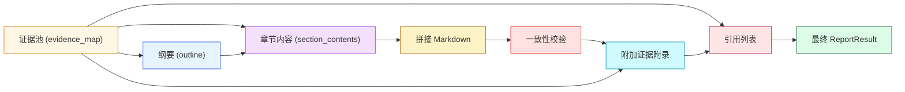
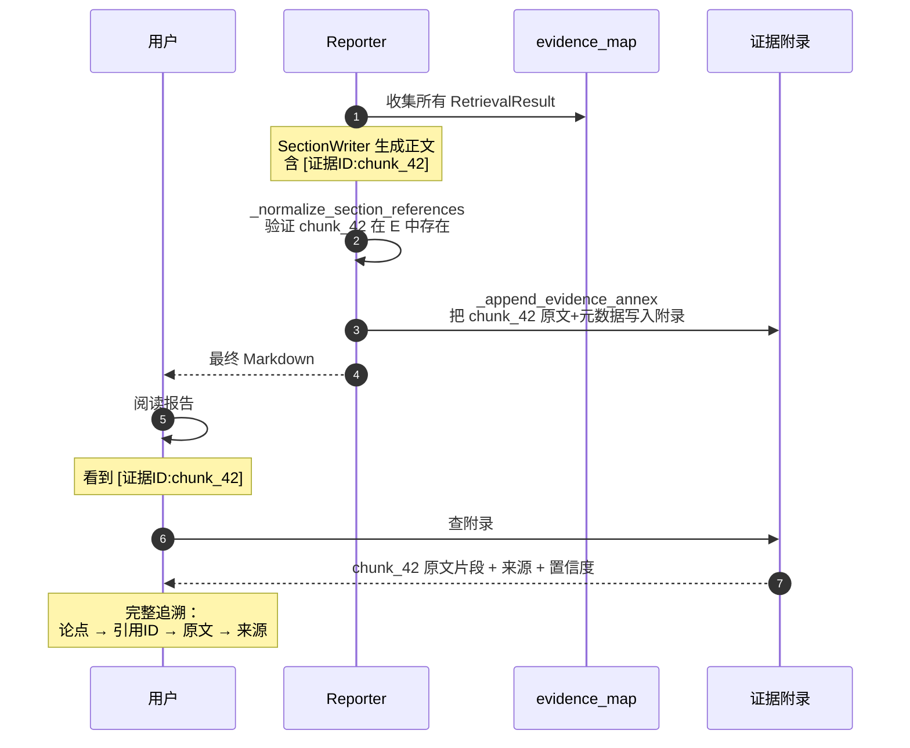

# 第 13 篇 · Reporter + Map-Reduce + 一致性 + Reporter 级缓存

> 本系列共 16 篇，本文是 **Part 4（Plan-Execute-Report 多智能体）的第 3 站**：把 Executor 产出的所有 `ExecutionRecord` 中的证据**整合成一份带引用、可校验、可缓存的长文档报告**。
>
> Reporter 是项目里**LLM 调用最密集**的一段——一份典型的长文档报告可能消耗 10-30 次 LLM 调用。理解 Reporter 的核心，就是理解**如何在 LLM 上下文窗口受限的现实下，把"证据 → 章节 → 整文"做成稳健的工程流水线**。

---

## 1. 学习目标

读完本篇你应该能：

1. 画出 `BaseReporter.generate_report` 的完整流程：证据聚合 → 缓存检查 → 纲要 → 章节 → 一致性 → 附录 → 引用 → 缓存写入。
2. 区分 **traditional 模式 vs mapreduce 模式** 的切换条件（`MA_MAPREDUCE_THRESHOLD=20` 证据数阈值）。
3. 读懂 **3 种 Reduce 策略**（`COLLAPSE / TREE / REFINE`）的实现差异和适用场景，知道为什么 `TREE` 是默认。
4. 解释 `evidence_fingerprint + section_cache` 怎么让"局部证据变化只重写受影响的章节"——节级缓存复用。
5. 看懂 `_normalize_section_references` 的引用规范化：删除无效引用、补齐章节级证据。
6. 解释 `OutlineBuilder / SectionWriter / EvidenceMapper / SectionReducer / ReportAssembler / ConsistencyChecker / CitationFormatter` 七个组件各自的职责。
7. 知道证据附录（evidence annex）如何让报告**可验证**——读者能直接看到原文片段。

---

## 2. 前置知识

- 已读 **第 11、12 篇**：知道 PlanSpec / ExecutionRecord / EvidenceTracker / RetrievalResult。
- 已读 **第 07 篇**：知道 Map-Reduce 在 Global Search 里的基本用法。
- 熟悉 Markdown 报告结构（标题层级 / 列表 / 引用）。
- 听过经典的 LangChain `MapReduceDocumentsChain` 与 `RefineDocumentsChain`。

---

## 3. 源码地图

| 文件 | 关键类 / 函数 | 行号锚点 |
|---|---|---|
| `graphrag_agent/agents/multi_agent/reporter/base_reporter.py` | `BaseReporter.generate_report`（主入口） | `reporter/base_reporter.py:136-257` |
|  | `_collect_evidence`（合并 tracker + records） | `base_reporter.py:259-286` |
|  | `_should_use_mapreduce`（模式决策） | `base_reporter.py:324-333` |
|  | `_generate_sections_traditional / _generate_sections_mapreduce` | `base_reporter.py:335-487` |
|  | `_append_evidence_annex / _format_references` | `base_reporter.py:624-747` |
|  | `_can_reuse_section / _save_report_cache`（缓存） | `base_reporter.py:789-854` |
| `graphrag_agent/agents/multi_agent/reporter/outline_builder.py` | `OutlineBuilder.build_outline` / `ReportOutline / SectionOutline` | `reporter/outline_builder.py:20-89` |
| `graphrag_agent/agents/multi_agent/reporter/section_writer.py` | `SectionWriter.write_section`（传统模式） | `reporter/section_writer.py:56-142` |
|  | `_select_evidence_ids / _split_into_batches / _sanitize_content` | `section_writer.py:144-235` |
| `graphrag_agent/agents/multi_agent/reporter/mapreduce/evidence_mapper.py` | `EvidenceMapper.map_evidence_batch / map_parallel / split_batches` | `mapreduce/evidence_mapper.py:36-211` |
| `graphrag_agent/agents/multi_agent/reporter/mapreduce/section_reducer.py` | `SectionReducer.reduce + _collapse_reduce/_tree_reduce/_refine_reduce` | `mapreduce/section_reducer.py:30-300` |
| `graphrag_agent/agents/multi_agent/reporter/mapreduce/report_assembler.py` | `ReportAssembler.assemble + _generate_introduction/_generate_conclusion` | `mapreduce/report_assembler.py:24-160` |
| `graphrag_agent/agents/multi_agent/reporter/consistency_checker.py` | `ConsistencyChecker.check` | 全文件 58 行 |
| `graphrag_agent/agents/multi_agent/reporter/formatter.py` | `CitationFormatter.format_references` | 全文件 |
| `graphrag_agent/config/prompts/reporter_prompts.py` | 12 个 reporter prompt | `reporter_prompts.py` 421 行 |
| `graphrag_agent/config/settings.py` | `MA_ENABLE_MAPREDUCE / MA_MAPREDUCE_THRESHOLD / MA_MAX_TOKENS_PER_REDUCE / MA_SECTION_*` | `settings.py:319-335` |

---

## 4. 核心机制讲解

### 4.1 Reporter 主流程全景

`BaseReporter.generate_report` (`base_reporter.py:136-257`) 是入口。**11 步处理流程**：



**`generate_report` 的关键代码** (`base_reporter.py:136-257`)：

```python
def generate_report(self, state, plan=None, execution_records=None, report_type=None):
    plan = plan or state.plan
    execution_records = execution_records or state.execution_records
    
    resolved_report_type = report_type or state.report_context.report_type or self.config.default_report_type
    
    # Step 3-4: 缓存检查
    report_id = self._resolve_report_id(plan, resolved_report_type)
    evidence_map = self._collect_evidence(state, execution_records)
    evidence_fingerprint = self._build_evidence_fingerprint(evidence_map)
    
    cached_payload = self._load_cached_payload(report_id)
    if cached_payload and cached_payload.get("evidence_fingerprint") == evidence_fingerprint:
        report_result = self._deserialize_report_result(cached_payload)
        # ... 写回 state
        return report_result
    
    # Step 5-6: 纲要生成
    plan_summary = self._build_plan_summary(plan)
    evidence_summary, limited_ids = self._build_evidence_summary(evidence_map)
    outline = self._outline_builder.build_outline(
        query=plan.problem_statement.original_query,
        plan_summary=plan_summary,
        evidence_summary=evidence_summary,
        evidence_count=len(evidence_map),
        report_type=resolved_report_type,
    )
    
    # Step 7-9: 章节生成（含节级缓存）
    section_cache_index = self._build_section_cache_index(cached_payload)
    use_mapreduce = self._should_use_mapreduce(evidence_map)
    
    if use_mapreduce:
        section_contents, used_ids = self._generate_sections_mapreduce(...)
        final_report = self._assemble_report_mapreduce(...)
    else:
        section_contents, used_ids = self._generate_sections_traditional(...)
        final_report = self._assemble_report(outline, section_contents)
    
    # Step 11: 一致性检查、附录、引用、缓存
    if self.config.enable_consistency_check and evidence_map:
        consistency_result = self._consistency_checker.check(final_report, evidence_text)
    
    final_report = self._append_evidence_annex(final_report, evidence_map, used_ids)
    references = self._format_references(evidence_map, used_ids)
    
    report_result = ReportResult(outline=outline, sections=section_contents, final_report=final_report, ...)
    self._save_report_cache(report_id, evidence_fingerprint, report_result, outline, evidence_map)
    return report_result
```

### 4.2 证据聚合：双源去重

`_collect_evidence` (`base_reporter.py:259-286`) 同时从两个源拉取证据：

```python
def _collect_evidence(self, state, execution_records):
    evidence_map: Dict[str, RetrievalResult] = {}
    
    # 源 1：EvidenceTracker（如果存在）
    tracker = _extract_tracker_from_state(state)
    if tracker is not None:
        for result in tracker.all_results():
            evidence_map[result.result_id] = result
    
    # 源 2：直接从 ExecutionRecord.evidence
    for record in execution_records:
        for item in record.evidence:
            try:
                if isinstance(item, RetrievalResult):
                    result = item
                elif isinstance(item, dict):
                    result = RetrievalResult.from_dict(item)
                else:
                    continue
                evidence_map[result.result_id] = result
            except Exception:
                continue
    
    return evidence_map
```

**为什么双源**？

- **EvidenceTracker**（第 12 篇）保留了**跨 executor 的高分覆盖结果**——是"工程意义上的最终版"。
- **ExecutionRecord.evidence**——是"每个任务自己存的副本"，可能含 tracker 之外的内容。
- 两者通过 `result_id` 自然去重（同 ID 后到的会覆盖先到的）。

`_extract_tracker_from_state` (`base_reporter.py:910-920`)：

```python
def _extract_tracker_from_state(state):
    registry = state.execution_context.evidence_registry.get("tracker", {})
    tracker = registry.get("_instance")
    if isinstance(tracker, EvidenceTracker):
        return tracker
    tracker_state = registry.get("state")
    if isinstance(tracker_state, dict):
        return EvidenceTracker(tracker_state)
    return None
```

**支持两种获取方式**：直接拿实例，或从外置状态重建——契合第 12 篇讲的"状态外置"设计。

### 4.3 报告 ID 与证据指纹

```python
# base_reporter.py:748-768
def _resolve_report_id(self, plan, report_type):
    return f"{plan.plan_id}:{plan.version}:{report_type}"

def _build_evidence_fingerprint(self, evidence_map):
    fingerprint: Dict[str, str] = {}
    for rid, result in evidence_map.items():
        payload = {
            "granularity": result.granularity,
            "source": result.source,
            "score": result.score,
            "metadata": result.metadata.model_dump(mode="json"),
        }
        fingerprint[rid] = hashlib.sha1(
            json.dumps(payload, sort_keys=True, ensure_ascii=False).encode("utf-8")
        ).hexdigest()
    return fingerprint
```

两个核心键：

- **`report_id`**：唯一标识一份报告。**包含 plan.version**——计划改版会生成新报告。
- **`evidence_fingerprint`**：**字典** `{result_id: sha1_hash}`。**注意：不哈希 evidence 内容本身**，只哈希 granularity/source/score/metadata。原因：evidence 字符串可能很长，哈希内容会增加 CPU 开销；而这几个字段已经足够区分"同一份证据是否变化"。

**整体缓存键设计**：

```
report_id ─┬─ 缓存命中决定：是否完整复用整份报告
           └─ section 级 evidence_fingerprint ─┬─ 决定：哪些章节可以复用旧版
                                              └─ 决定：哪些章节必须重写
```

### 4.4 模式决策：traditional vs mapreduce

```python
# base_reporter.py:324-333
def _should_use_mapreduce(self, evidence_map):
    if not self.config.enable_mapreduce:
        return False
    return len(evidence_map) >= self.config.mapreduce_evidence_threshold   # 默认 20
```

| 模式 | 触发条件 | 适合场景 |
|---|---|---|
| **traditional** | 证据 < 20 条 | 短答案 / 少证据 |
| **mapreduce** | 证据 ≥ 20 条 | 长文档 / 大量证据 |

#### 4.4.1 Traditional 模式：SectionWriter

```python
# base_reporter.py:335-395（精简）
def _generate_sections_traditional(self, outline, evidence_map, section_cache_index, ...):
    section_contents = []
    used_evidence_ids = []
    
    for section in outline.sections:
        # 1. 节级缓存检查
        cached_section = section_cache_index.get(section.section_id)
        if cached_section and self._can_reuse_section(section, cached_section, evidence_fingerprint):
            # 复用旧版章节
            ...
            continue
        
        # 2. 没有缓存或证据变化 → 重新调 LLM 写章节
        draft = self._section_writer.write_section(
            outline=outline,
            section=section,
            evidence_map=evidence_map,
            fallback_evidence_ids=fallback_evidence_ids,
        )
        sanitized_content, normalized_ids = self._normalize_section_references(...)
        section_contents.append(SectionContent(...))
        used_evidence_ids.extend(normalized_ids)
    
    return section_contents, used_evidence_ids
```

`SectionWriter.write_section` (`section_writer.py:69-142`) 内部还有**多批写作**逻辑：

```python
batches = self._split_into_batches(evidence_entries, self.config.max_evidence_per_call)  # 默认 8
contents = []
for batch_index, batch in enumerate(batches, start=1):
    evidence_list_text = self._format_evidence(batch)
    context_instruction = ""
    if self.config.enable_multi_pass and len(batches) > 1:
        # 多批写作时给 LLM 上下文：第 N/M 批 + 前文摘要
        context_instruction = f"""
        **写作阶段**: 第{batch_index}/{len(batches)}批，请确保与前文衔接。
        **前文摘要**: {self._extract_previous_summary(contents)}
        """
    prompt = SECTION_WRITE_PROMPT.format(
        outline=outline_context_text,
        section_id=section.section_id,
        section_title=section.title,
        ...
        evidence_list=evidence_list_text + context_instruction,
    )
    generated = self._invoke_llm(prompt)
    contents.append(generated.strip())

final_content = "\n\n".join(contents).strip()
final_content = self._sanitize_content(section.title, final_content)
```

**两个亮点**：

1. **多批写作**：单章节证据 > `max_evidence_per_call=8` 时切批，每批调一次 LLM，**用前文摘要保持连贯**。
2. **`_sanitize_content`**（`section_writer.py:212-235`）：删除与章节标题重复的 `#` 标题行——LLM 经常输出"# 章节标题"再写正文，删掉避免双重标题。

#### 4.4.2 Mapreduce 模式：EvidenceMapper + SectionReducer

```python
# base_reporter.py:397-486（精简）
def _generate_sections_mapreduce(self, outline, evidence_map, section_cache_index, ...):
    for section in outline.sections:
        if cached_section 可复用:
            ...
            continue
        
        # 1. 收集本章节相关证据
        evidence_entries = self._collect_section_evidence(section, evidence_map, fallback)
        
        # 2. Map 阶段：切批 → 每批 LLM 生成结构化摘要
        evidence_batches = self._evidence_mapper.split_batches(evidence_entries)
        evidence_summaries = self._map_evidence_batches(evidence_batches, section)  # 可并行
        
        # 3. Reduce 阶段：把摘要归约为最终章节文本
        section_text = self._section_reducer.reduce(
            evidence_summaries, section,
            max_tokens=self.config.max_tokens_per_reduce,   # 默认 4000
        )
        
        # 4. 引用规范化
        ...
```

**Map 阶段的并行实现** (`base_reporter.py:502-555`)：

```python
def _map_evidence_batches(self, evidence_batches, section):
    if self.config.enable_parallel_map and len(evidence_batches) > 1:
        max_workers = min(len(evidence_batches), 4)
        with ThreadPoolExecutor(max_workers=max_workers) as executor:
            future_map = {executor.submit(self._evidence_mapper.map_evidence_batch, batch, section, batch_index=i): i
                         for i, batch in enumerate(evidence_batches)}
            results = [None] * len(evidence_batches)
            for future in as_completed(future_map):
                idx = future_map[future]
                try:
                    results[idx] = future.result()
                except Exception:
                    results[idx] = None
            # 失败的批次串行重跑
            for idx in [i for i, r in enumerate(results) if r is None]:
                results[idx] = self._evidence_mapper.map_evidence_batch(evidence_batches[idx], section, batch_index=idx)
            return [r for r in results if r is not None]
    
    # 串行兜底
    return [self._evidence_mapper.map_evidence_batch(batch, section, batch_index=i) for i, batch in enumerate(evidence_batches)]
```

**「并行 + 失败重试 → 串行兜底」**双保险，跟第 12 篇的 ThreadPoolExecutor 思路一致。

### 4.5 3 种 Reduce 策略

`SectionReducer.reduce` (`mapreduce/section_reducer.py:52-82`)：

```python
def reduce(self, evidence_summaries, section_context, *, max_tokens=4000):
    if not evidence_summaries:
        return ""
    summaries = [summary.copy() for summary in evidence_summaries]
    
    if self._strategy == ReduceStrategy.COLLAPSE:
        return self._collapse_reduce(summaries, section_context, max_tokens=max_tokens)
    if self._strategy == ReduceStrategy.REFINE:
        return self._refine_reduce(summaries, section_context)
    return self._tree_reduce(summaries, section_context, max_tokens=max_tokens)  # 默认
```



#### 4.5.1 COLLAPSE 策略

```python
# section_reducer.py:84-125
def _collapse_reduce(self, summaries, section_context, *, max_tokens):
    total_tokens = sum(item.token_count for item in summaries)
    if total_tokens <= max_tokens:
        return self._generate_section_text(summaries, section_context)
    
    intermediate = []
    current = []
    current_tokens = 0
    
    for summary in summaries:
        if current_tokens + summary.token_count > max_tokens and current:
            intermediate.append(self._generate_intermediate_summary(current, section_context))
            current = [summary]
            current_tokens = summary.token_count
        else:
            current.append(summary)
            current_tokens += summary.token_count
    
    if current:
        intermediate.append(self._generate_intermediate_summary(current, section_context))
    
    return self._collapse_reduce(intermediate, section_context, max_tokens=max_tokens)
```

**性质**：顺序累积到阈值，超出时**先把当前组归约为单个 intermediate**，然后继续累积；最终一波归约。**LangChain `MapReduceDocumentsChain` 的默认行为**。

**LLM 调用次数**：`ceil(N / batch_per_round)` × `log(N)` 级别。

#### 4.5.2 TREE 策略（默认）

```python
# section_reducer.py:127-155
def _tree_reduce(self, summaries, section_context, *, max_tokens):
    if len(summaries) == 1:
        return self._generate_section_text(summaries, section_context)
    
    next_level = []
    for index in range(0, len(summaries), 2):
        left = summaries[index]
        right = summaries[index + 1] if index + 1 < len(summaries) else None
        if right is None:
            next_level.append(left)
            continue
        next_level.append(self._merge_two_summaries(left, right, section_context))
    
    if len(next_level) == 1 and next_level[0].token_count <= max_tokens:
        return self._generate_section_text(next_level, section_context)
    return self._tree_reduce(next_level, section_context, max_tokens=max_tokens)
```

**性质**：完美二叉树合并。**LLM 调用次数**：O(N - 1) 次 merge + 1 次最终生成。

**为什么默认 TREE**？

- **可并行**：同一层的多对合并可以并发（项目里没并发，但理论上可以）。
- **稳定**：每次合并都是 2 个等量级输入，避免后期 prompt 过长。
- **不会丢失关键论点**：两两归约比起 collapse 的"5+5"更精细。

#### 4.5.3 REFINE 策略

```python
# section_reducer.py:157-175
def _refine_reduce(self, summaries, section_context):
    initial = self._generate_section_text([summaries[0]], section_context)
    current_draft = initial
    
    for summary in summaries[1:]:
        prompt = REFINE_PROMPT.format(
            current_draft=current_draft,
            new_evidence=summary.summary_text,
            section_title=section_context.title,
        )
        current_draft = self._invoke_llm(prompt)
    return current_draft.strip()
```

**性质**：增量精修。**LLM 调用次数**：N 次（每个证据一次）。

**优势**：每一步都基于已有 draft 优化，保持文档**风格连贯**。

**劣势**：

- 顺序串行，**完全无法并行**。
- 后期 prompt 包含完整 draft，**token 消耗递增**。
- 后到的证据"权重更高"——可能淹没早期信息。

**适合场景**：需要"润色式叙事"的报告（如年度总结），不适合"列举式综述"。

#### 4.5.4 三种策略对比

| 维度 | COLLAPSE | TREE | REFINE |
|---|---|---|---|
| LLM 调用次数 | O(N×log N) | O(N) | O(N) |
| 可并行 | 部分（每层内） | ✅ 高（同层独立） | ❌ 不能 |
| 风格连贯性 | 中 | 中 | ✅ 高 |
| token 消耗稳定 | 中 | ✅ 稳定 | ❌ 递增 |
| 处理超大输入 | ✅ 适合 | ✅ 适合 | ❌ 后期溢出 |
| 默认选择 | ❌ | ✅ | ❌ |

### 4.6 节级缓存复用：`_can_reuse_section`

```python
# base_reporter.py:789-803
def _can_reuse_section(self, section, cached_section, evidence_fingerprint):
    if cached_section.get("title") != section.title:
        return False
    if cached_section.get("summary") != section.summary:
        return False
    cached_fp = cached_section.get("evidence_fingerprint", {})
    for evidence_id in cached_section.get("used_evidence_ids", []):
        if evidence_fingerprint.get(evidence_id) != cached_fp.get(evidence_id):
            return False
    return True
```

**三层判定**：

1. **标题一致** —— 大纲调整过的章节不复用。
2. **摘要一致** —— 章节目的变化的不复用。
3. **证据指纹全一致** —— 任一证据变化的不复用。

**含义**：增量更新一份报告时，**只有受证据影响的章节会被重写**。例如改了一篇文档，影响 3 个 entity，只重写涉及这 3 个 entity 的章节，**其他 7 个章节直接复用**。

**这是项目相比业界 RAG 框架的差异化优势**——能做到"局部失效"的细粒度缓存。

### 4.7 引用规范化：`_normalize_section_references`

```python
# base_reporter.py:705-727
def _normalize_section_references(self, content, candidate_ids, evidence_map):
    valid_ids = []
    
    def replacer(match):
        evidence_id = match.group(1).strip()
        if evidence_id in evidence_map:
            if evidence_id not in valid_ids:
                valid_ids.append(evidence_id)
            return match.group(0)
        return ""                                     # 删除无效引用
    
    sanitized = re.sub(r"\[证据ID[:：]\s*([A-Za-z0-9\-]+)\]", replacer, content or "")
    
    candidate_order = [eid for eid in candidate_ids if eid in evidence_map and eid not in valid_ids]
    ordered_ids = valid_ids + candidate_order
    return sanitized.strip(), ordered_ids
```

**两件事**：

1. **正则扫描 `[证据ID:xxx]`**：在 evidence_map 中存在则保留，不存在则删除——避免脏引用。
2. **重新排序 used_evidence_ids**：实际出现在内容中的优先，候选证据顺序在后——保证引用顺序与正文呼应。

**生成时的引用约定**：`SectionWriter` 的 prompt 让 LLM 在每个论点后用 `[证据ID:xxx]` 标注来源——这是项目里"AI 写报告必须可溯源"的工程约束。

### 4.8 证据附录：可验证性

`_append_evidence_annex` (`base_reporter.py:624-682`)：

```python
def _append_evidence_annex(self, report, evidence_map, used_evidence_ids, *, snippet_length=200):
    unique_ids = [eid for eid in used_evidence_ids if eid in evidence_map]
    if not unique_ids:
        return report
    
    annex_entries = []
    for eid in unique_ids:
        result = evidence_map.get(eid)
        snippet = str(result.evidence)[:snippet_length]
        entry = {
            "id": eid,
            "source": result.source,
            "source_id": result.metadata.source_id,
            "granularity": result.granularity,
            "snippet": snippet,
        }
        if result.metadata.confidence is not None:
            entry["confidence"] = round(result.metadata.confidence, 3)
        annex_entries.append(entry)
    
    annex_json = json.dumps(annex_entries, ensure_ascii=False, indent=2)
    annex_block = f"\n\n## 证据附录\n```json\n{annex_json}\n```\n"
    return report.rstrip() + annex_block
```

**生成的报告末尾会有一段 "## 证据附录"**，列出报告里**实际引用到的**每条证据的 ID、来源、粒度、置信度、原文片段（200 字符）。

**含义**：读者能看到 `[证据ID:chunk_42]` → 在附录里查到 `chunk_42` 的具体原文——**AI 写的报告变成可审计的证据链**。这是项目对"AI 幻觉"最直接的工程对策。

### 4.9 报告缓存写入

```python
# base_reporter.py:805-853（精简）
def _save_report_cache(self, report_id, evidence_fingerprint, report_result, outline, evidence_map):
    if self._cache_manager is None:
        return
    
    sections_payload = []
    for section in report_result.sections:
        outline_section = outline_lookup.get(section.section_id)
        sections_payload.append({
            "section_id": section.section_id,
            "title": section.title,
            "summary": outline_section.summary if outline_section else "",
            "content": section.content,
            "used_evidence_ids": list(section.used_evidence_ids),
            "evidence_fingerprint": {
                eid: evidence_fingerprint.get(eid)
                for eid in section.used_evidence_ids
                if eid in evidence_fingerprint
            },
        })
    
    payload = {
        "outline": report_result.outline.model_dump(mode="json"),
        "sections": sections_payload,
        "final_report": report_result.final_report,
        "references": report_result.references,
        "consistency_check": report_result.consistency_check.model_dump(mode="json") if report_result.consistency_check else None,
        "evidence_fingerprint": evidence_fingerprint,
        "evidence_ids": list(evidence_map.keys()),
    }
    self._cache_manager.set(report_id, payload)
```

**每个章节都带自己的 `evidence_fingerprint` 子集**——这是节级缓存复用的基础（4.6 节）。

### 4.10 ConsistencyChecker：事实校验

```python
# reporter/consistency_checker.py:36-45
def check(self, report_content, evidence_list):
    prompt = CONSISTENCY_CHECK_PROMPT.format(
        report_content=report_content,
        evidence_list=evidence_list,
    )
    response = self._invoke_llm(prompt)
    parsed = self._parse_response(response)
    return ConsistencyCheckResult(**parsed, raw_response=response)
```

**`ConsistencyCheckResult`** 含 `is_consistent` + `issues` + `corrections`。

**与第 11 篇的 ClarificationResult 类似**——一个简单的 "LLM 二次审视" 模式。**优点**：开销小（一次 LLM 调用）；**缺点**：LLM 自检不一定可靠，是 best-effort。

### 4.11 ReportAssembler：长文档的引言+结论

```python
# mapreduce/report_assembler.py:32-78（精简）
def assemble(self, outline, section_payload, *, global_context):
    parts = [f"# {outline.title}"]
    
    # 提取全局术语
    terminology = self._extract_global_terminology(section_payload)
    
    # 自动生成引言（如果 outline 没有"引言"节）
    if not self._has_intro_section(outline):
        intro = self._generate_introduction(outline, global_context)
        parts.append(intro)
    
    # 摘要 + 章节
    if outline.report_type == "long_document" and outline.abstract:
        parts.append("## 摘要")
        parts.append(outline.abstract.strip())
    for section in outline.sections:
        parts.append(f"## {section.title}")
        parts.append(section_payload.get(section.section_id, "").strip())
    
    # 自动生成结论
    if not self._has_conclusion_section(outline):
        conclusion = self._generate_conclusion(outline, section_payload, global_context, terminology)
        parts.append(conclusion)
    
    return "\n\n".join(parts)
```

**对比 traditional 的 `_assemble_report`**（`base_reporter.py:592-605`）只是纯拼接——mapreduce 模式的 `ReportAssembler` 额外**自动补全引言、结论、术语表**。这是因为长文档更需要"结构完整性"。

### 4.12 完整数据流：从证据到最终 Markdown



---

## 5. 重点技术点深挖

### 5.1 项目 Map-Reduce vs LangChain MapReduceDocumentsChain（A 类技术点）

| 维度 | LangChain MapReduceDocumentsChain | 本项目 Map-Reduce |
|---|---|---|
| Map 阶段 | 每个文档独立 LLM 调用 | 每批证据（默认 8 条）一次调用 |
| Reduce 策略 | 单一 collapse | **3 种可选**（COLLAPSE / TREE / REFINE） |
| 并行 | ✅ 支持 | ✅ ThreadPoolExecutor |
| 节级缓存 | ❌ 无 | ✅ evidence_fingerprint + section_cache |
| 一致性校验 | ❌ 无 | ✅ ConsistencyChecker |
| 引用规范化 | ❌ 无 | ✅ `_normalize_section_references` |

**项目的 Map-Reduce 是 LangChain 的"加强版"**——专为长文档报告场景设计。

### 5.2 「Lost in the Middle」彻底解决方案（A 类技术点）

第 05 篇讨论过 GraphRAG 用社区摘要"预压缩"信息密度。Reporter 进一步用 Map-Reduce **二次压缩**：

```
原始 chunk × 100  →  社区摘要 × 20      [第 05 篇：离线压缩]
社区摘要 × 20    →  evidence × 20-50    [第 07-12 篇：检索+研究]
evidence × 50    →  EvidenceSummary × 10 [Map 阶段]
EvidenceSummary × 10 → 章节 × 5         [Reduce 阶段]
章节 × 5         →  最终报告 × 1         [Assemble]
```

**5 层压缩**让 LLM 在每一步都不会面对超长输入。理论上比传统 RAG 的"top-k 直接喂"模式覆盖度高 5-10 倍。

### 5.3 引用追溯的完整闭环（E 类技术点）



**这是项目对"AI 可解释性"的工程实现**——不是 LLM 的 attention 权重之类的抽象指标，而是**让用户能直接看到"这句话从哪里来"**。

### 5.4 报告级缓存与"局部增量"的工程价值（E 类技术点）

当用户修改一篇文档（如更新了"国家奖学金"的条款）：

1. **重跑 Plan-Execute**：生成新的 ExecutionRecord，evidence 变化（chunk 内容变了，可能新增/删除几条 evidence）。
2. **Reporter 拿到新 evidence_map**：计算 evidence_fingerprint。
3. **加载旧报告缓存**：比对 fingerprint。
4. **大部分章节复用**：只有引用了变化 chunk 的章节被重写。
5. **总 LLM 调用次数 = 1 + 受影响章节数**（vs 完全重跑的 1 + 10 个章节 + Map-Reduce）。

**典型场景下成本下降 80-90%**——这是 Reporter 缓存设计的最大价值。

### 5.5 长文档生成的 Token 预算管理（E 类技术点）

```python
# config/settings.py:325-326
MULTI_AGENT_MAX_TOKENS_PER_REDUCE = 4000     # Reduce 单次输入上限
MULTI_AGENT_SECTION_MAX_EVIDENCE = 8         # SectionWriter 单批证据上限
MULTI_AGENT_SECTION_MAX_CONTEXT_CHARS = 800  # 多批写作时前文摘要字符数
```

**三个阈值各自的作用**：

- `MAX_TOKENS_PER_REDUCE`：防止 Reduce 阶段 prompt 溢出（适配 4k 上下文 LLM）。
- `SECTION_MAX_EVIDENCE`：控制 SectionWriter 单批 LLM 调用的复杂度。
- `SECTION_MAX_CONTEXT_CHARS`：多批写作时**带多少前文做衔接**——太多浪费 token，太少风格不连贯。

**升级到大上下文 LLM**（Gemini 2.0 / Claude 3.5）时这些阈值都可以调大——直接传 `ReporterConfig(max_tokens_per_reduce=32000, ...)`。

---

## 6. Hands-on：跑一次完整 Reporter

### 6.1 端到端跑通

```python
# tmp_reporter_e2e.py
from graphrag_agent.agents.multi_agent.planner.base_planner import BasePlanner
from graphrag_agent.agents.multi_agent.executor.worker_coordinator import WorkerCoordinator
from graphrag_agent.agents.multi_agent.reporter.base_reporter import BaseReporter
from graphrag_agent.agents.multi_agent.core.state import PlanExecuteState

planner = BasePlanner()
worker = WorkerCoordinator()
reporter = BaseReporter()

state = PlanExecuteState(input="分析学校的奖学金体系")
plan_result = planner.generate_plan(state)
worker.execute_plan(state, plan_result.executor_signal)
report = reporter.generate_report(state)

print(f"=== Outline ===")
print(f"标题: {report.outline.title}")
print(f"类型: {report.outline.report_type}")
print(f"章节数: {len(report.outline.sections)}")
for s in report.outline.sections:
    print(f"  - {s.section_id}: {s.title}")

print(f"\n=== 章节内容 ===")
for s in report.sections:
    print(f"\n--- {s.title} ---")
    print(s.content[:200] + "...")

print(f"\n=== 一致性检查 ===")
if report.consistency_check:
    print(f"is_consistent: {report.consistency_check.is_consistent}")
    print(f"issues 数: {len(report.consistency_check.issues)}")

print(f"\n=== 最终报告（前 1000 字符）===")
print(report.final_report[:1000])
```

**预期观察**：

- outline 有 3-5 个章节。
- 每个章节正文中能看到 `[证据ID:xxx]` 标记。
- 最终报告末尾有 `## 证据附录` 段。

### 6.2 看模式切换：传统 vs Map-Reduce

```python
# tmp_reporter_modes.py
from graphrag_agent.agents.multi_agent.reporter.base_reporter import BaseReporter, ReporterConfig

# 测试 1：traditional 模式（手动调低阈值）
reporter_trad = BaseReporter(config=ReporterConfig(
    enable_mapreduce=False,        # 强制 traditional
))

# 测试 2：mapreduce 模式（强制开启）
reporter_mr = BaseReporter(config=ReporterConfig(
    enable_mapreduce=True,
    mapreduce_evidence_threshold=1,  # 任何证据数都走 mapreduce
))

# 跑同一个 state（确保 plan + execution 已完成）
import time
t0 = time.time(); r1 = reporter_trad.generate_report(state); print(f"traditional: {time.time()-t0:.2f}s, {len(r1.sections)} 章节")
t0 = time.time(); r2 = reporter_mr.generate_report(state);   print(f"mapreduce:   {time.time()-t0:.2f}s, {len(r2.sections)} 章节")
```

**预期观察**：mapreduce 慢一些（Map 阶段额外的 LLM 调用），但章节内容更结构化。

### 6.3 实测节级缓存复用

```python
# tmp_reporter_cache.py
from graphrag_agent.agents.multi_agent.reporter.base_reporter import BaseReporter
from graphrag_agent.cache_manager.manager import CacheManager
import time

cache = CacheManager(memory_only=True)
reporter = BaseReporter(cache_manager=cache)

# 第 1 次：完整生成
t0 = time.time()
r1 = reporter.generate_report(state)
print(f"第 1 次: {time.time()-t0:.2f}s")

# 第 2 次：evidence 完全不变 → 应该命中整份报告缓存
t0 = time.time()
r2 = reporter.generate_report(state)
print(f"第 2 次 (整份命中): {time.time()-t0:.4f}s")   # 应该毫秒级

# 第 3 次：人为修改一条 evidence 的 score，触发部分章节重写
list(state.execution_records[0].evidence)[0].score = 0.99   # 改 score 会改变 fingerprint
t0 = time.time()
r3 = reporter.generate_report(state)
print(f"第 3 次 (部分章节重写): {time.time()-t0:.2f}s")     # 比第 1 次快但比第 2 次慢

# 看缓存指标
print("\n缓存指标:", cache.get_metrics())
```

**预期观察**：

- 第 1 次几秒到几十秒（依证据数 + LLM 速度）。
- 第 2 次毫秒级（整份命中）。
- 第 3 次中间速度——只重写受影响的章节。

### 6.4 切换三种 Reduce 策略对比

```python
# tmp_reduce_strategies.py
from graphrag_agent.agents.multi_agent.reporter.base_reporter import BaseReporter, ReporterConfig
from graphrag_agent.agents.multi_agent.reporter.mapreduce.section_reducer import ReduceStrategy

# 注意：实际 evidence 数要 >= mapreduce_evidence_threshold 才会走 mapreduce
for strategy in [ReduceStrategy.TREE, ReduceStrategy.COLLAPSE, ReduceStrategy.REFINE]:
    config = ReporterConfig(
        enable_mapreduce=True,
        mapreduce_evidence_threshold=1,
        reduce_strategy=strategy,
    )
    reporter = BaseReporter(config=config)
    
    import time
    t0 = time.time()
    r = reporter.generate_report(state)
    elapsed = time.time() - t0
    print(f"\n[{strategy.value}] {elapsed:.2f}s, 总字数 {len(r.final_report)}")
    print(f"  第 1 个章节预览: {r.sections[0].content[:150]}...")
```

**预期观察**：

- TREE 最快（可分散计算）。
- REFINE 较慢但风格连贯（每章节末尾会有"在此基础上补充..."类语句）。
- COLLAPSE 中间速度，内容相对扁平。

### 6.5 看引用规范化

```python
# tmp_reporter_references.py
# 模拟一段含无效引用的章节内容
content = """
学校实行奖学金评选制度 [证据ID:chunk_42]。
具体条件包括 GPA、综合排名等 [证据ID:fake_chunk_999]。
评选委员会负责审核 [证据ID:chunk_42] [证据ID:chunk_77]。
"""

from graphrag_agent.agents.multi_agent.reporter.base_reporter import BaseReporter

reporter = BaseReporter()
fake_evidence_map = {
    "chunk_42": None,    # 用 dict 占位即可
    "chunk_77": None,
    # fake_chunk_999 故意不存在
}

sanitized, normalized_ids = reporter._normalize_section_references(
    content,
    candidate_ids=["chunk_42", "chunk_77"],
    evidence_map=fake_evidence_map,
)

print("--- Before ---")
print(content)
print("--- After ---")
print(sanitized)
print(f"\nnormalized_ids: {normalized_ids}")
```

**预期观察**：

- `[证据ID:fake_chunk_999]` 被删除。
- `chunk_42`、`chunk_77` 保留。
- `normalized_ids` 按出现顺序排：`['chunk_42', 'chunk_77']`。

### 6.6 看证据附录的实际结构

```python
# tmp_reporter_annex.py
# 接上面 e2e 跑完的 report
final_report = report.final_report

# 找到证据附录部分
if "## 证据附录" in final_report:
    annex_start = final_report.find("## 证据附录")
    print(final_report[annex_start:annex_start+2000])
else:
    print("没有证据附录（可能 used_evidence_ids 为空）")
```

**预期观察**：能看到 `## 证据附录` + ```json``` 块，每条带 id / source / source_id / granularity / snippet / confidence。

### 6.7 Debug 提示

- **断点位置 1**：`base_reporter.py:158 evidence_map = self._collect_evidence(state, execution_records)`，看双源聚合后到底有几条证据。
- **断点位置 2**：`base_reporter.py:165 cached_payload and cached_payload.get("evidence_fingerprint") == evidence_fingerprint`，看是否命中整份缓存。
- **断点位置 3**：`section_reducer.py:78 self._tree_reduce(...)`，跟踪 next_level 长度变化看 Tree 收敛。
- **断点位置 4**：`base_reporter.py:715 evidence_id = match.group(1).strip()`，看正则提取到的引用 ID。
- **常见错误 1**：`生成报告需要 PlanSpec`——你没传 plan 也没设 state.plan。
- **常见错误 2**：报告里出现 `⚠️ 当前章节...未检索到可引用的证据`——纲要里某章节的 `evidence_ids` 不在 evidence_map 中，且 fallback 列表也为空。检查 Planner 输出。
- **常见错误 3**：`一致性检查失败`——LLM 返回不规范 JSON。这个错误**不阻塞主流程**，只是 `consistency_check=None`。

---

## 7. 思考题

1. **新 Reduce 策略：MAP-RERANK**：参考 LangChain 的 `MapRerankDocumentsChain`，每个 Map 输出带置信度，最高分胜出。**最小改造点在哪几个文件**？（提示：新加 `ReduceStrategy.MAP_RERANK` + `_map_rerank_reduce` + prompt）
2. **节级并行**：当前 `_generate_sections_*` 是串行 for 循环跑每个章节。**可以加 ThreadPoolExecutor 并行吗**？最大障碍是什么？（提示：上下文衔接、节级缓存写入、CitationFormatter 调用）
3. **结构化输出迁移**：当前 `OutlineBuilder / EvidenceMapper / ConsistencyChecker` 都用 `parse_json_text` 手解析。**改用 LangChain `with_structured_output`**，会带来什么变化？（提示：成本不变，但跨模型兼容性下降）

---

## 8. 延伸阅读

- **LangChain MapReduceDocumentsChain 源码**：[map_reduce.py](https://github.com/langchain-ai/langchain/blob/master/libs/langchain/langchain/chains/combine_documents/map_reduce.py) —— 对比项目实现。
- **LangChain RefineDocumentsChain**：[refine.py](https://github.com/langchain-ai/langchain/blob/master/libs/langchain/langchain/chains/combine_documents/refine.py) —— 项目 REFINE 策略的灵感来源。
- **「Lost in the Middle」论文**：[Liu et al. 2023, arXiv:2307.03172](https://arxiv.org/abs/2307.03172) —— 为什么需要 5 层压缩。
- **Tree of Thoughts (ToT)**：[Yao et al. 2024, arXiv:2305.10601](https://arxiv.org/abs/2305.10601) —— TREE Reduce 的思想根源。
- **微软 GraphRAG 的 Drift Search 报告生成**：[graphrag/query/structured_search/drift_search](https://github.com/microsoft/graphrag/tree/main/graphrag/query/structured_search/drift_search) —— 对照看业界实现。
- **RAG 引用与可溯源最佳实践**：[Citing sources in generative AI](https://www.deepset.ai/blog/citing-sources-in-rag) —— 项目证据附录的设计契合这些原则。

---

> ✅ 本篇结束。下一篇（**📄 14. Orchestrator + LegacyFacade + Fusion 整合**）会把 Planner / Executor / Reporter 三段串成完整的多智能体编排——以及 `FusionGraphRAGAgent` 为什么用 `_GraphShim` 绕过 LangGraph。
>
> 调参口诀：**少证据走 traditional；多证据走 mapreduce；默认用 TREE；指纹变了才重写；附录让 AI 可审计**。
