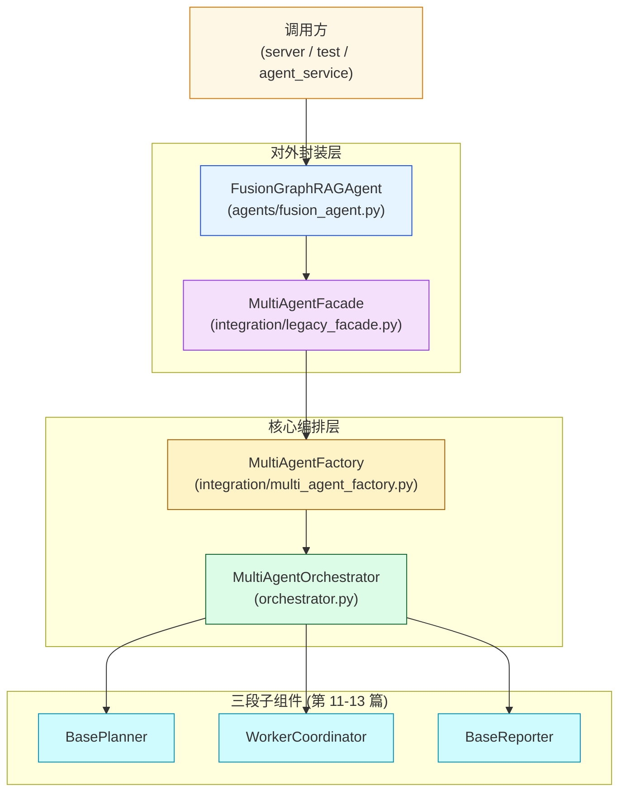
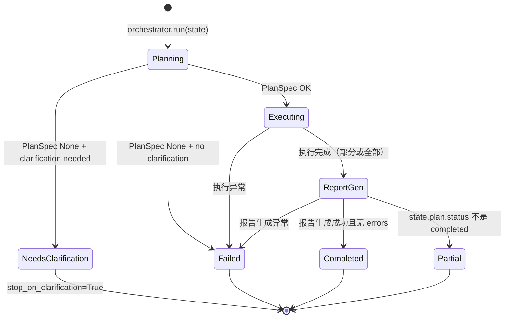
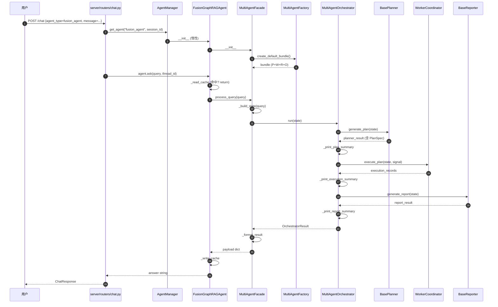

# 第 14 篇 · Orchestrator + LegacyFacade + FusionGraphRAGAgent 整合

> 本系列共 16 篇，本文是 **Part 4（Plan-Execute-Report 多智能体）的收官篇**：把 Planner / Executor / Reporter **三段串成可调用的整体**，并讲清 `FusionGraphRAGAgent` 为何**绕过 LangGraph**——这是项目里"用最简单的代码组合最复杂的能力"的范本。
>
> 这一篇代码量并不大（4 个文件 ~600 行），但**工程模式密度极高**：Pydantic 配置、阶段计时、错误传播、控制台调试输出、Factory 模式、Facade 兼容层、鸭子类型 shim——每一个都是生产 Agent 系统会复用的招式。

---

## 1. 学习目标

读完本篇你应该能：

1. 画出 `MultiAgentOrchestrator.run` 的三段流水线和状态机：plan → execute → report，4 种 status（completed / needs_clarification / failed / partial）。
2. 区分 `OrchestratorConfig` 3 个开关（`auto_generate_report` / `stop_on_clarification` / `strict_plan_signal`）的语义和应用场景。
3. 看懂 `OrchestratorResult` 与 `OrchestratorMetrics` 的设计——一个对外 API 友好的"任务收据"。
4. 读懂 `MultiAgentFactory` Factory 模式 + `MultiAgentFacade` 兼容门面的分工。
5. 解释 `FusionGraphRAGAgent` 的 `_GraphShim / _MemoryShim` 鸭子类型设计——它如何**兼容 `AgentManager` 接口但绕过 LangGraph**。
6. 知道三个 `_print_*_summary` 调试方法的工程价值——为什么把内部状态打到 stdout 是有意为之。
7. 解释错误传播策略：Planner / Executor / Reporter 任一段抛错时，Orchestrator 如何把错误聚合到 `errors` 列表而不中断流程。

---

## 2. 前置知识

- 已读 **第 11、12、13 篇**：知道 Planner、Executor、Reporter 各自的输入/输出契约。
- 已读 **第 09 篇**：知道 `BaseAgent` 用 LangGraph 编排，以及 `FusionGraphRAGAgent` 是个例外（当时埋了伏笔）。
- 听过 GoF Factory / Facade 设计模式。
- 知道 Python "鸭子类型"哲学（duck typing）。

---

## 3. 源码地图

| 文件 | 关键类 / 函数 | 行号锚点 |
|---|---|---|
| `graphrag_agent/agents/multi_agent/orchestrator.py` | `MultiAgentOrchestrator.run`（三段编排） | `orchestrator.py:90-225` |
|  | `OrchestratorConfig / OrchestratorMetrics / OrchestratorResult` | `orchestrator.py:29-88` |
|  | `_print_plan_summary / _print_execution_summary / _print_report_summary` | `orchestrator.py:227-365` |
| `graphrag_agent/agents/multi_agent/integration/multi_agent_factory.py` | `MultiAgentFactory.create_default_bundle / OrchestratorBundle` | `integration/multi_agent_factory.py:25-73` |
| `graphrag_agent/agents/multi_agent/integration/legacy_facade.py` | `MultiAgentFacade.process_query / _format_result` | `integration/legacy_facade.py:20-107` |
| `graphrag_agent/agents/fusion_agent.py` | `FusionGraphRAGAgent`（含 _GraphShim / _MemoryShim） | `fusion_agent.py:10-92` |
| `graphrag_agent/agents/multi_agent/__init__.py` | 包级入口（看实际暴露什么） | 全文件 |
| `graphrag_agent/agents/multi_agent/core/state.py` | `PlanExecuteState.to_legacy_state / from_legacy_state` | `core/state.py:244-264` |
| `graphrag_agent/config/settings.py` | `MA_AUTO_GENERATE_REPORT / MA_STOP_ON_CLARIFICATION / MA_STRICT_PLAN_SIGNAL` | `settings.py:314-316` |

---

## 4. 核心机制讲解

### 4.1 三层组合：Orchestrator → Factory → Facade → FusionAgent



**4 层各自的职责**：

| 层 | 职责 | 调用者 |
|---|---|---|
| **FusionGraphRAGAgent** | 实现 BaseAgent-like 接口（`ask / ask_stream / ask_with_trace`） | `server/services/agent_service.py` |
| **MultiAgentFacade** | 把"原始 query"包装成 `PlanExecuteState`，把 `OrchestratorResult` 还原成 dict | FusionGraphRAGAgent |
| **MultiAgentFactory** | 用默认配置组装 Planner + Worker + Reporter + Orchestrator | MultiAgentFacade |
| **MultiAgentOrchestrator** | 真正运行三段流水线 | Factory 创建后由 Facade 调用 |

**为什么要 4 层而不是直接调**？

- **`Orchestrator`** 是"纯业务"——三段编排逻辑，没有 IO / 缓存 / 接口适配。
- **`Factory`** 隔离"组件组装"——以后想换 Planner / Reporter 只需改这里。
- **`Facade`** 隔离"调用方契约"——旧的 `process_query` API 别动，内部实现可改。
- **`FusionGraphRAGAgent`** 隔离"BaseAgent 接口"——AgentManager 不知道多智能体存在，照 BaseAgent 接口调即可。

这是教科书级的**分层解耦**示范。

### 4.2 `MultiAgentOrchestrator.run`：核心三段

```python
# orchestrator.py:108-225（精简）
def run(self, state, *, assumptions=None, report_type=None):
    errors = []
    metrics = OrchestratorMetrics()
    
    # --- Plan ---
    plan_start = time.perf_counter()
    try:
        planner_result = self._planner.generate_plan(state, assumptions=...)
    except Exception as exc:
        errors.append(f"Planner执行失败: {exc}")
        metrics.planning_seconds = time.perf_counter() - plan_start
        return OrchestratorResult(status="failed", planner=None, ..., errors=errors, metrics=metrics)
    metrics.planning_seconds = time.perf_counter() - plan_start
    
    self._print_plan_summary(planner_result)
    
    if planner_result.plan_spec is None:
        status = "needs_clarification"
        if not planner_result.clarification.needs_clarification:
            errors.append("Planner未生成PlanSpec且未提供澄清指引")
            status = "failed"
        if self.config.stop_on_clarification or status == "failed":
            return OrchestratorResult(status=status, planner=planner_result, ..., errors=errors, metrics=metrics)
    
    signal = planner_result.executor_signal
    if signal is None:
        errors.append("Planner未提供执行信号，无法继续执行")
        if self.config.strict_plan_signal:
            return OrchestratorResult(status="failed", ..., errors=errors)
    
    # --- Execute ---
    execution_records = []
    if signal is not None:
        exec_start = time.perf_counter()
        try:
            execution_records = self._worker.execute_plan(state, signal)
        except Exception as exc:
            errors.append(f"执行阶段失败: {exc}")
        finally:
            metrics.execution_seconds = time.perf_counter() - exec_start
    self._print_execution_summary(execution_records, state)
    
    # --- Report ---
    report_result = None
    if self.config.auto_generate_report and not errors:
        report_start = time.perf_counter()
        try:
            report_result = self._reporter.generate_report(state, report_type=report_type)
            self._print_report_summary(report_result)
        except Exception as exc:
            errors.append(f"报告生成失败: {exc}")
        finally:
            metrics.reporting_seconds = time.perf_counter() - report_start
    
    # --- Determine final status ---
    status = "completed"
    if errors:
        status = "failed"
    elif state.plan is not None:
        if state.plan.status == "failed":
            status = "failed"
        elif state.plan.status not in ("completed", "executing"):
            status = "partial"
        elif state.plan.status == "executing":
            status = "partial"
    
    state.update_timestamp()
    return OrchestratorResult(status=status, planner=planner_result, execution_records=execution_records,
                              report=report_result, errors=errors, metrics=metrics)
```

**6 个关键设计**：

1. **每段都 try/except**：单段失败不会让整个流程崩溃，错误聚合到 `errors`。
2. **每段都 finally 计时**：即使失败也记录耗时——观测必要。
3. **3 个 print_*_summary** 打印调试信息到 stdout。
4. **status 4 态最后统一计算**：基于 errors + state.plan.status 综合判定。
5. **条件控制 3 个**：`stop_on_clarification` / `strict_plan_signal` / `auto_generate_report`——给生产更灵活的配置。
6. **state 是输入也是输出**：所有阶段都修改同一个 state 对象——保证数据通过 state 串联。

### 4.3 状态机：4 种结果状态



4 态语义对照：

| status | 含义 | 调用方应做的事 |
|---|---|---|
| `completed` | 全流程成功，有报告 | 把 `report.final_report` 返回给用户 |
| `needs_clarification` | 需要用户回答澄清问题 | 把 `planner.clarification.questions` 展示给用户 |
| `partial` | 部分任务完成（如某个 task failed 但其他成功） | 仍可以展示 report，但提示用户结果不完整 |
| `failed` | 完全失败 | 把 `errors` 列表展示给用户/运维 |

**`partial` 的存在价值**：项目接受"半成品"——即使 plan 中 5 个任务有 2 个失败，剩下 3 个任务的证据也能写成一份报告。**这是生产 Agent 容忍 LLM 不稳定的关键设计**。

### 4.4 三段调试输出：把内部状态摊在 stdout

#### 4.4.1 `_print_plan_summary` (`orchestrator.py:227-255`)

```python
def _print_plan_summary(self, planner_result):
    plan = planner_result.plan_spec
    summary = {
        "plan_id": plan.plan_id,
        "version": plan.version,
        "status": plan.status,
        "tasks": [
            {
                "task_id": node.task_id,
                "description": node.description,
                "tool": node.task_type,
                "parameters": node.parameters,
                "priority": node.priority,
                "depends_on": node.depends_on,
            }
            for node in plan.task_graph.nodes
        ],
    }
    encoded = json.dumps(summary, ensure_ascii=False, indent=2)
    print(f"[PlanSpec] 规划结果:\n{encoded}")
```

**打印格式 JSON**，所有任务信息一目了然。运维直接在日志看就能定位"Planner 拆解出了什么"。

#### 4.4.2 `_print_execution_summary` (`orchestrator.py:257-326`)

输出更复杂——按 `ExecutionRecord` 列表生成结构化 JSON：

```python
summary = []
for record in execution_records:
    env_payload = dict(record.metadata.environment or {})
    error_messages = [call.error for call in record.tool_calls if call.error]
    record_summary = {
        "task_id": record.task_id,
        "worker": record.worker_type,
        "status": task_status.get(record.task_id, "unknown"),
        "tool_calls": [call.tool_name for call in record.tool_calls],
        "evidence_count": len(record.evidence),
        "latency_seconds": round(record.metadata.latency_seconds, 3),
    }
    if error_messages:
        record_summary["errors"] = error_messages
    if env_payload.get("reason"):
        record_summary["failure_reason"] = env_payload["reason"]
    if record.reflection:
        record_summary["reflection"] = {
            "success": record.reflection.success,
            "needs_retry": record.reflection.needs_retry,
            "reasoning": record.reflection.reasoning,
        }
    summary.append(record_summary)

print("[Execute] 执行结果:")
print(json.dumps(summary, ensure_ascii=False, indent=2))
```

**4 个调试维度**：

- 每个任务的工具调用列表 + 证据数 + 延迟。
- 错误信息（如果有）+ 失败原因标签。
- 反思结果（如果是 reflection 任务）。
- 节点错误详情（`state.execution_context.errors`）。

#### 4.4.3 `_print_report_summary` (`orchestrator.py:328-365`)

```python
sections = [{"section_id": s.section_id, "title": s.title, "word_count": len(s.content)} 
           for s in report_result.sections]
payload = {
    "report_type": report_result.outline.report_type,
    "title": report_result.outline.title,
    "section_count": len(report_result.sections),
    "sections": sections,
    "has_references": bool(report_result.references),
}
if report_result.consistency_check:
    check = report_result.consistency_check
    issues = check.issues[:5]   # 控制台只显示前 5 个
    payload["consistency_check"] = {
        "is_consistent": check.is_consistent,
        "issues": issues,
        "corrections": check.corrections[:5] if check.corrections else [],
    }
print("[Report] 生成报告:")
print(json.dumps(payload, ensure_ascii=False, indent=2))
```

**这 3 个 `print_summary` 的设计哲学**：

- 不用 logger（避免依赖 log 配置）。
- JSON 输出便于运维 grep / 解析。
- 内容裁剪到关键字段——不打印完整 evidence / content，避免日志爆炸。

**这是项目"代码即文档"的体现**——日志格式直接反映核心数据模型。

### 4.5 `OrchestratorMetrics`：阶段计时

```python
# orchestrator.py:48-56
class OrchestratorMetrics(BaseModel):
    planning_seconds: float = Field(default=0.0)
    execution_seconds: float = Field(default=0.0)
    reporting_seconds: float = Field(default=0.0)
```

**只有 3 个字段，但覆盖三段全部耗时**。生产监控可以基于这 3 个数据画"三段耗时占比"图，快速识别瓶颈。

**典型耗时分布**（示例数字，依模型和数据）：

```
planning_seconds:   2.0s  (10%)   ← LLM 一次澄清 + 一次分解 + 一次审校
execution_seconds:  4.0s  (20%)   ← 5 个任务并行，每个 ~2s
reporting_seconds: 14.0s  (70%)   ← Map-Reduce 多次 LLM 调用
```

**通常 Reporter 是最大头**——这也是为什么第 13 篇花最多笔墨讲 Reporter 缓存。

### 4.6 `OrchestratorResult.requires_clarification`：用户交互信号

```python
# orchestrator.py:80-87
def requires_clarification(self) -> bool:
    if self.status != "needs_clarification":
        return False
    if self.planner is None:
        return False
    clarification = self.planner.clarification
    return clarification.needs_clarification and bool(clarification.questions)
```

调用方可以用这个方法做**条件分支**：

```python
result = orchestrator.run(state)
if result.requires_clarification():
    show_questions_to_user(result.planner.clarification.questions)
    user_answers = collect_answers()
    state.plan_context.clarification_history += [
        {"question": q, "answer": a} for q, a in zip(questions, answers)
    ]
    result = orchestrator.run(state)   # 再跑一次
```

**这种"双相调用"** 让前端可以实现"AI 反问 → 用户回答 → 继续生成"的交互。

### 4.7 `MultiAgentFactory`：标准组装

```python
# integration/multi_agent_factory.py:25-73
@dataclass
class OrchestratorBundle:
    planner: BasePlanner
    worker: WorkerCoordinator
    reporter: BaseReporter
    orchestrator: MultiAgentOrchestrator


class MultiAgentFactory:
    @staticmethod
    def create_default_bundle(*, planner=None, worker=None, reporter=None, 
                              orchestrator_config=None, reporter_config=None, cache_manager=None):
        planner = planner or BasePlanner()
        worker = worker or WorkerCoordinator()
        reporter = reporter or BaseReporter(config=reporter_config, cache_manager=cache_manager)
        
        orchestrator_config = orchestrator_config or OrchestratorConfig(
            auto_generate_report=MULTI_AGENT_AUTO_GENERATE_REPORT,
            stop_on_clarification=MULTI_AGENT_STOP_ON_CLARIFICATION,
            strict_plan_signal=MULTI_AGENT_STRICT_PLAN_SIGNAL,
        )
        orchestrator = MultiAgentOrchestrator(
            planner=planner, worker_coordinator=worker, reporter=reporter,
            config=orchestrator_config,
        )
        return OrchestratorBundle(planner=planner, worker=worker, reporter=reporter, orchestrator=orchestrator)
```

**3 个值得说**：

- **`@dataclass` 替代 Pydantic**：OrchestratorBundle 仅作传递容器，不需要校验——dataclass 更轻。
- **所有参数都有 `or` 默认值**：调用方可以"啥都不传"得到标准栈，也可以"传部分"自定义某段。
- **`cache_manager` 只传给 Reporter**：因为 Planner / Worker 不做 Reporter 级缓存（它们的缓存在 BaseSearchTool 层）。

**Factory 模式的典型场景**：要换 Planner 的实现（比如换成 LangChain 官方 plan-and-execute），改 `create_default_bundle` 即可，**Facade 和 FusionAgent 不需要动**。

### 4.8 `MultiAgentFacade`：把 query 翻译给多智能体

```python
# integration/legacy_facade.py:20-103（精简）
class MultiAgentFacade:
    def __init__(self, *, bundle=None, cache_manager=None):
        self.cache_manager = cache_manager
        self.bundle = bundle or MultiAgentFactory.create_default_bundle(cache_manager=cache_manager)
    
    def process_query(self, query, *, assumptions=None, report_type=None, extra_messages=None):
        state = self._build_state(query, extra_messages)
        result = self.bundle.orchestrator.run(state, assumptions=assumptions, report_type=report_type)
        return self._format_result(state, result)
    
    def _build_state(self, query, extra_messages):
        messages = [HumanMessage(content=query)]
        if extra_messages:
            messages.extend(extra_messages)
        return PlanExecuteState(messages=messages, input=query)
    
    def _format_result(self, state, orchestrator_result):
        report = orchestrator_result.report
        response = state.response
        if report and report.final_report:
            response = report.final_report
        
        payload = {
            "status": orchestrator_result.status,
            "response": response,
            "planner": planner.model_dump(mode="json") if planner else None,
            "execution_records": [record.model_dump(mode="json") for record in orchestrator_result.execution_records],
            "errors": orchestrator_result.errors,
            "metrics": orchestrator_result.metrics.model_dump(mode="json"),
        }
        if report:
            payload["report"] = {
                "outline": report.outline.model_dump(mode="json"),
                "sections": [s.model_dump(mode="json") for s in report.sections],
                "references": report.references,
                "consistency_check": report.consistency_check.model_dump(mode="json") if report.consistency_check else None,
            }
        if state.report_context is not None:
            payload["report_context"] = {
                "report_id": state.report_context.report_id,
                "cache_hit": state.report_context.cache_hit,
            }
        return payload
```

**Facade 干 3 件事**：

1. **构造 state**：query → `PlanExecuteState`（一行）。
2. **调编排**：`orchestrator.run(...)`。
3. **`_format_result` 把所有 Pydantic 对象 dump 成 dict**：让前端能用 JSON 序列化传输。

**最关键的 1 行**：

```python
response = report.final_report if report and report.final_report else state.response
```

**报告优先级**：报告里有最终文本就用它，否则用 state.response（reflection 失败时可能没生成报告，但有兜底答案）。

### 4.9 `FusionGraphRAGAgent`：BaseAgent 接口的"完美仿真"

```python
# agents/fusion_agent.py:10-37
class _MemoryShim:
    """兼容旧版接口的记忆占位实现，仅提供空消息列表。"""
    def get(self, _config):
        return {"channel_values": {"messages": []}}


class _GraphShim:
    """兼容 LangGraph 所需接口的空实现。"""
    def update_state(self, *_args, **_kwargs):
        return None


class FusionGraphRAGAgent:
    """Fusion GraphRAG Agent 的轻量封装版本，完全委托给多智能体编排栈。"""
    
    def __init__(self, cache_dir="./cache/fusion_graphrag"):
        self.cache_dir = cache_dir
        self.multi_agent = MultiAgentFacade()
        self.memory = _MemoryShim()
        self.graph = _GraphShim()
        self.execution_log: list = []
        ...
    
    def ask(self, query, thread_id="default", recursion_limit=None) -> str:
        return self._execute(query, thread_id)[0]
    
    def ask_with_trace(self, query, thread_id="default", recursion_limit=None) -> Dict:
        answer, payload = self._execute(query, thread_id)
        return {"answer": answer, "payload": payload}
    
    async def ask_stream(self, query, thread_id="default", recursion_limit=None):
        cached = self._read_cache(query, thread_id)
        if cached is None:
            cached, _ = await asyncio.to_thread(self._execute, query, thread_id)
        async for chunk in self._stream_chunks(cached):
            yield chunk
    
    def _execute(self, query, thread_id, *, assumptions=None, report_type=None):
        cached = self._read_cache(query, thread_id)
        if cached is not None:
            return cached, {"status": "cached"}
        payload = self.multi_agent.process_query(query.strip(), assumptions=assumptions, report_type=report_type)
        answer = self._normalize_answer(payload.get("response"))
        self._write_cache(query, thread_id, answer)
        self.execution_log = payload.get("execution_records", [])
        return answer, payload
```

**为什么用 Shim**？

**`AgentManager.clear_history`**（`server/services/agent_service.py:79-94`）有如下代码：

```python
memory_content = agent.memory.get(config)
if memory_content is None or "channel_values" not in memory_content:
    continue
messages = memory_content["channel_values"]["messages"]
...
agent.graph.update_state(config, {"messages": RemoveMessage(id=message.id)})
```

**它对所有 Agent 类型一视同仁**——必须有 `.memory.get(config)["channel_values"]["messages"]` 和 `.graph.update_state(...)`。`FusionGraphRAGAgent` 内部根本没用 LangGraph，但**必须有这两个属性**才能被 AgentManager 管理。

**`_MemoryShim` 与 `_GraphShim` 的作用**：

- 提供"看起来像 LangGraph"的 API。
- `_MemoryShim.get` 永远返回空 messages 列表——这意味着 `clear_history` 对 Fusion 不会真正清除（因为它本来就没存）。
- `_GraphShim.update_state` 是空操作——FusionAgent 不需要在 LangGraph 里删消息。

**这是 Python "Duck Typing" 的经典应用**：你不需要继承 BaseAgent，只要"长得像"就能被当 Agent 用。

**讨论：为什么不让 `FusionGraphRAGAgent` 继承 BaseAgent**？

- BaseAgent 的 `__init__` 会构造 `MemorySaver()`、`tools`、`graph` —— 这些对 Fusion 都是浪费。
- BaseAgent 的 `ask` 会走 `_check_all_caches` → `graph.stream(inputs)` —— 但 Fusion 不需要走 LangGraph。
- 继承反而要在子类**覆盖所有 BaseAgent 行为**，结果更乱。

**鸭子类型 + shim** 是更干净的方案——这是项目"不教条主义"的工程哲学体现。

### 4.10 `to_legacy_state / from_legacy_state`：跨架构桥梁

```python
# core/state.py:244-264
def to_legacy_state(self):
    return {"messages": self.messages}

@classmethod
def from_legacy_state(cls, state, input_query=""):
    messages = state.get("messages", [])
    return cls(messages=messages, input=input_query or (messages[-1].content if messages else ""))
```

**用途**（实际项目中没看到调用，但接口为后续扩展预留）：

- 如果未来想把 multi_agent 接到 BaseAgent 的 LangGraph 流程里，`from_legacy_state` 让 PlanExecuteState 能消费 BaseAgent 的 AgentState。
- 反过来，`to_legacy_state` 让多智能体输出能被旧链路消费。

**这是一个"双向桥接 API"**——项目对未来集成留的接口。

### 4.11 完整调用链：从用户 query 到最终答案



---

## 5. 重点技术点深挖

### 5.1 多 Agent 拓扑：Supervisor / Hierarchical（C 类技术点）

业界常见 4 种多 Agent 拓扑：

| 拓扑 | 特点 | 项目对应 |
|---|---|---|
| **Supervisor** | 一个总指挥分派给多个工作 Agent | MultiAgentOrchestrator 是总指挥 |
| **Hierarchical** | 多层指挥（指挥下面还有子指挥） | 项目有两层：Orchestrator → WorkerCoordinator |
| **Swarm** | 无中心，Agent 之间互相协作 | ❌ 项目没有 |
| **Network** | 任意 Agent 间互通消息 | ❌ 项目没有 |

**项目本质是 Hierarchical Supervisor**：

```
Orchestrator
├── Planner (子指挥 → Clarifier / TaskDecomposer / PlanReviewer)
├── WorkerCoordinator (子指挥 → Retrieval / Research / Reflection Executor)
└── Reporter (子指挥 → OutlineBuilder / SectionWriter / Reducer / Checker)
```

**优势**：

- 责任清晰，调试容易（每段有自己的输入/输出契约）。
- 失败隔离（一段失败不传染）。

**劣势**：

- 不灵活（Agent 之间不能"自由协商"）。
- 不适合需要多 Agent 反复迭代的场景（如辩论、谈判）。

### 5.2 何时不用 LangGraph：FusionAgent 的工程决策（B 类技术点）

LangGraph 的强项：

- 节点可循环
- 内置 checkpointer
- 内置 tools_condition 路由
- 可视化图

**当任务变成"线性三段 + 内部多层并发"时，LangGraph 反而成为束缚**：

- 三段流水线在 LangGraph 里要做 `add_edge` 三次，比直接调函数复杂。
- WorkerCoordinator 的 ThreadPoolExecutor 并发不在 LangGraph 节点层，LangGraph 看不见。
- Reporter 的节级缓存复用与 LangGraph state 模型不匹配。

**结论**：**项目的 Plan-Execute-Report 流程本质上不是 ReAct，是 ETL**。ETL 类流程**手写状态机比框架更清晰**。

### 5.3 Facade vs Adapter：模式区分（C 类技术点）

容易混淆的两种 GoF 模式：

| 模式 | 目的 | 项目对应 |
|---|---|---|
| **Facade** | 给复杂系统提供简化接口 | `MultiAgentFacade.process_query` 一行调用一切 |
| **Adapter** | 让不兼容的接口互通 | `FusionGraphRAGAgent` 用 shim 适配 BaseAgent 接口 |

**项目同时用了两种**：

- 对外简化（Facade）：`process_query(query) → dict`，调用方不需要知道 state 结构。
- 接口适配（Adapter）：`FusionGraphRAGAgent` 假装是 BaseAgent。

**两层组合**让"多智能体复杂内部"完美隐藏在"简单 BaseAgent 接口"之后。

### 5.4 错误传播策略：聚合而非抛错（E 类技术点）

```python
# Orchestrator 的核心错误处理（重复出现 3 次）
try:
    ... 跑某段 ...
except Exception as exc:
    _LOGGER.exception("xxx执行失败: %s", exc)
    errors.append(f"xxx执行失败: {exc}")
finally:
    metrics.xxx_seconds = ...
```

**3 个原则**：

1. **日志先于 errors**：用 `_LOGGER.exception` 输出完整 traceback 到日志，便于调试。
2. **errors 列表聚合**：业务调用方只看到字符串错误，不爆 stacktrace。
3. **finally 计时**：失败也计时——监控完整。

**对比"直接抛错"** 的方案：

```python
# 反例：失败就抛
try:
    ...
except Exception:
    raise   # ← 上游所有人都得 try/except
```

**项目方式的好处**：

- 上游代码不需要嵌套 try/except。
- `result.errors` 是调用方能直接消费的 List[str]。
- 失败时仍能返回 OrchestratorResult（含已完成阶段的数据）。

**生产 Agent 系统都该这样设计**——错误是数据，不是异常。

### 5.5 阶段计时 + 控制台输出 = 内置可观测性（E 类技术点）

```python
# 总耗时 = planning + execution + reporting
print("[PlanSpec] 规划结果: ...")
print("[Execute] 执行结果: ...")
print("[Report] 生成报告: ...")
```

**这 3 个 print 实际上是一种"低成本可观测性"**：

- 不依赖外部日志系统。
- JSON 格式可被 `tail -f | grep` 或 `jq` 解析。
- 同样的数据通过 `OrchestratorResult` 可以发到 LangSmith / Langfuse。

**生产建议**：把 `print` 改成 `_LOGGER.info` + JSON serializer，可以接到 ELK / Loki / Datadog。

---

## 6. Hands-on：完整调用 + 故障注入

### 6.1 最简单的调用

```python
# tmp_orch_basic.py
from graphrag_agent.agents.multi_agent.integration.legacy_facade import MultiAgentFacade

facade = MultiAgentFacade()
payload = facade.process_query("分析国家奖学金的申请流程")

print(f"=== status: {payload['status']} ===")
print(f"\n=== response (前 500 字符) ===")
print(payload['response'][:500])
print(f"\n=== metrics ===")
print(payload['metrics'])
print(f"\n=== errors ===")
print(payload['errors'])
```

**预期观察**：

- status: completed（如果一切顺利）。
- response: 长文本，含 `[证据ID:xxx]` 标记 + `## 证据附录`。
- metrics: 三段耗时秒数。
- errors: 空列表（如果没出错）。

### 6.2 自定义 OrchestratorConfig 看行为差异

```python
# tmp_orch_config.py
from graphrag_agent.agents.multi_agent.integration.multi_agent_factory import MultiAgentFactory
from graphrag_agent.agents.multi_agent.integration.legacy_facade import MultiAgentFacade
from graphrag_agent.agents.multi_agent.orchestrator import OrchestratorConfig

# 1. 默认配置
facade_default = MultiAgentFacade()

# 2. 不生成报告（只跑 Plan + Execute）
bundle = MultiAgentFactory.create_default_bundle(
    orchestrator_config=OrchestratorConfig(
        auto_generate_report=False,
        stop_on_clarification=True,
        strict_plan_signal=True,
    )
)
facade_no_report = MultiAgentFacade(bundle=bundle)

query = "学生违纪处分制度"
for name, facade in [("default", facade_default), ("no_report", facade_no_report)]:
    payload = facade.process_query(query)
    print(f"\n[{name}]")
    print(f"  status: {payload['status']}")
    print(f"  has_report: {'report' in payload}")
    print(f"  response: {payload['response'][:200] if payload['response'] else '<empty>'}")
```

**预期观察**：

- `default`: 有 report，response 是 final_report。
- `no_report`: 没有 report 字段，response 是 None 或空串。

### 6.3 看 status 状态转换：触发 needs_clarification

```python
# tmp_orch_clarify.py
from graphrag_agent.agents.multi_agent.integration.multi_agent_factory import MultiAgentFactory
from graphrag_agent.agents.multi_agent.integration.legacy_facade import MultiAgentFacade
from graphrag_agent.agents.multi_agent.orchestrator import OrchestratorConfig

# 严格模式：澄清未答必须停
bundle = MultiAgentFactory.create_default_bundle(
    orchestrator_config=OrchestratorConfig(stop_on_clarification=True)
)
facade = MultiAgentFacade(bundle=bundle)

# 但需要 Planner 端也不允许跳过澄清
import os
os.environ["MA_ALLOW_UNCLARIFIED_PLAN"] = "false"
from importlib import reload
import graphrag_agent.config.settings as cfg
reload(cfg)

# 用模糊 query
payload = facade.process_query("他什么时候被处分？")
print(f"status: {payload['status']}")
if payload['status'] == "needs_clarification":
    questions = payload['planner']['clarification']['questions']
    print(f"澄清问题: {questions}")
```

**预期观察**：status 是 needs_clarification，questions 列出 3-5 个澄清问题。

### 6.4 故障注入：让 Planner 失败

```python
# tmp_orch_failure.py
from graphrag_agent.agents.multi_agent.integration.multi_agent_factory import MultiAgentFactory
from graphrag_agent.agents.multi_agent.integration.legacy_facade import MultiAgentFacade
from graphrag_agent.agents.multi_agent.planner.base_planner import BasePlanner

class BrokenPlanner(BasePlanner):
    def generate_plan(self, state, *, assumptions=None):
        raise RuntimeError("故意失败")

broken_planner = BrokenPlanner()
bundle = MultiAgentFactory.create_default_bundle(planner=broken_planner)
facade = MultiAgentFacade(bundle=bundle)

payload = facade.process_query("test")
print(f"status: {payload['status']}")
print(f"errors: {payload['errors']}")
print(f"metrics.planning_seconds: {payload['metrics']['planning_seconds']:.4f}")
```

**预期观察**：

- status: failed
- errors: `["Planner执行失败: 故意失败"]`
- metrics.planning_seconds: 非零（即使失败也记录了耗时）

### 6.5 看 OrchestratorResult.requires_clarification 用法

```python
# tmp_orch_two_round.py
from graphrag_agent.agents.multi_agent.integration.multi_agent_factory import MultiAgentFactory
from graphrag_agent.agents.multi_agent.core.state import PlanExecuteState
from graphrag_agent.agents.multi_agent.orchestrator import OrchestratorConfig
import os
os.environ["MA_ALLOW_UNCLARIFIED_PLAN"] = "false"

bundle = MultiAgentFactory.create_default_bundle(
    orchestrator_config=OrchestratorConfig(stop_on_clarification=True)
)

# Round 1
state = PlanExecuteState(input="处分制度")
result = bundle.orchestrator.run(state)

if result.requires_clarification():
    print("=== Round 1: 收集澄清问题 ===")
    questions = result.planner.clarification.questions
    for q in questions:
        print(f"  Q: {q}")
    
    # 模拟用户回答
    answers = ["关于本科生", "学习类违纪", "包括申诉流程"]
    for q, a in zip(questions, answers):
        state.plan_context.clarification_history.append({"question": q, "answer": a})
    
    # Round 2
    print("\n=== Round 2: 用回答继续 ===")
    result2 = bundle.orchestrator.run(state)
    print(f"status: {result2.status}")
    if result2.report:
        print(f"报告标题: {result2.report.outline.title}")
```

**预期观察**：Round 1 拿到澄清问题；Round 2（带回答）顺利完成。

### 6.6 把 FusionGraphRAGAgent 当 BaseAgent 用

```python
# tmp_fusion_agent.py
from graphrag_agent.agents.fusion_agent import FusionGraphRAGAgent

agent = FusionGraphRAGAgent()
print(f"agent.memory type: {type(agent.memory).__name__}")     # _MemoryShim
print(f"agent.graph type:  {type(agent.graph).__name__}")      # _GraphShim

# 用 BaseAgent 接口调
answer = agent.ask("分析奖学金体系", thread_id="user1")
print(f"\nask 返回 (前 300 字符): {answer[:300]}")

# ask_with_trace
trace = agent.ask_with_trace("奖学金有几种", thread_id="user1")
print(f"\nask_with_trace 返回: keys={list(trace.keys())}")
print(f"  status: {trace['payload']['status']}")
print(f"  execution_records 数: {len(trace['payload'].get('execution_records', []))}")

# memory.get 不报错（duck typing）
mem = agent.memory.get({"configurable": {"thread_id": "user1"}})
print(f"\nmemory.get 返回: {mem}")    # {"channel_values": {"messages": []}}

agent.close()
```

**预期观察**：

- shim 类型正确。
- ask / ask_with_trace 接口和 BaseAgent 完全一致。
- memory.get 返回标准结构（空 messages）。

### 6.7 Debug 提示

- **断点位置 1**：`orchestrator.py:124 planner_result = self._planner.generate_plan(state)`，看 planner 输出。
- **断点位置 2**：`orchestrator.py:179 execution_records = self._worker.execute_plan(state, signal)`，看执行记录数量。
- **断点位置 3**：`orchestrator.py:191 report_result = self._reporter.generate_report(state, report_type=report_type)`，看报告生成。
- **断点位置 4**：`orchestrator.py:205-214` status 判定逻辑，看为什么最终是 completed/partial/failed。
- **常见错误 1**：`AttributeError: 'NoneType' object has no attribute 'final_report'`——`auto_generate_report=False` 但调用方期望有报告。
- **常见错误 2**：`payload['response']` 为 None——可能整个 Plan-Execute 失败导致 state.response 没设置。检查 errors。
- **常见错误 3**：FusionAgent.ask 返回 "未能生成回答"——OrchestratorFacade 的 response 是 None，触发了 `_normalize_answer` 兜底。检查日志看哪段失败。

---

## 7. 思考题

1. **加入流式中间状态广播**：当前 Orchestrator 完成后才返回结果。如何让前端**实时看到** "Planner 完成 → Executor 进行中 → Reporter 完成"？最少改造点是什么？（提示：考虑给 Orchestrator 加 `on_stage_complete` 回调；或用 SSE 流式 yield 中间事件）
2. **错误粒度细化**：当前 errors 是 List[str]。如果要区分"可恢复错误（重试可能解决）vs 不可恢复错误"，结构应该怎么改？（提示：加 ErrorEntry 类含 stage / type / retriable）
3. **多智能体协商场景**：如果要给 Reporter 加"和 Planner 协商不满意的纲要"能力（如 Reporter 觉得某章节证据不足，请 Planner 增加一个 task），怎么改造 Orchestrator 让两段循环？（提示：从线性三段改成有限循环 + max_iterations）

---

## 8. 延伸阅读

- **LangGraph Supervisor Tutorial**：[Multi-agent supervisor](https://langchain-ai.github.io/langgraph/tutorials/multi_agent/agent_supervisor/) —— 官方多 Agent 拓扑教程。
- **AutoGen GroupChat 模式**：[microsoft/autogen · GroupChat](https://microsoft.github.io/autogen/docs/Use-Cases/agent_chat) —— 对比 Swarm 拓扑实现。
- **CrewAI Hierarchical Pattern**：[CrewAI Docs](https://docs.crewai.com/concepts/processes#hierarchical-process) —— 另一种多 Agent 框架的 Hierarchical 实现。
- **GoF 设计模式：Facade vs Adapter**：[Refactoring Guru · Facade](https://refactoring.guru/design-patterns/facade) + [Adapter](https://refactoring.guru/design-patterns/adapter)
- **Python Duck Typing**：[PEP 3119 · Introducing Abstract Base Classes](https://peps.python.org/pep-3119/) —— 鸭子类型与 ABC 的关系。
- **LangSmith 多 Agent 监控**：[LangSmith · Trace multi-agent systems](https://docs.smith.langchain.com/) —— 项目可观测性的升级方向。

---

> ✅ 本篇结束。**Part 4（Plan-Execute-Report 多智能体）4 篇全部完成**——你已经能讲清从 query 到最终报告的完整多智能体编排流水线。
>
> 接下来 **Part 5（工程化与评估）** 第 15 篇会回到工程视角：FastAPI 后端 + Streamlit 前端 + SSE 流式 + 20+ 评估指标的横向对比——把这套系统"端到端跑起来"的最后一公里。
>
> 调参口诀：**Orchestrator 分四态；错误聚合不抛错；Shim 实现 Duck Typing；三段计时全埋点**。
