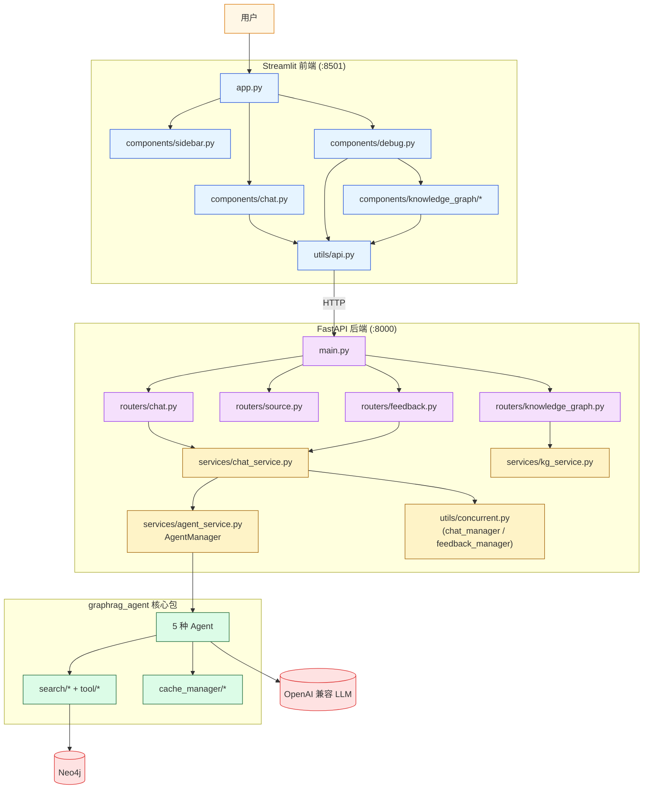
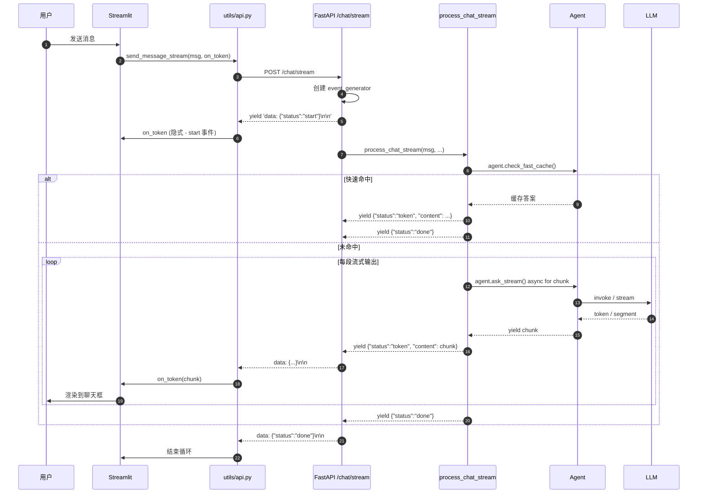

# 第 15 篇 · 服务端 + 前端 + 流式输出 + 评估系统

> 本系列共 16 篇，本文是 **Part 5（工程化与评估）的第 1 站**：把项目的"端到端落地工程"——FastAPI 后端、Streamlit 前端、SSE 流式输出、20+ 评估指标——一次性讲清楚。这是把前 14 篇所有能力**真的让人能用**的最后一公里。

---

## 1. 学习目标

读完本篇你应该能：

1. 画出"前端 → FastAPI → AgentManager → Agent → Neo4j/LLM"的完整请求链。
2. 看懂 `process_chat` 与 `process_chat_stream` 两个入口的差异——特别是流式版本如何用 SSE 把多种 event（token / thinking / execution_log）混在一个流里。
3. 解释 `chat_manager.try_acquire_lock` 的并发控制机制——为什么"同一个 session_id 同一时间只允许一个请求"。
4. 区分 4 类 evaluation metrics（Answer / Retrieval / Graph / LLM-as-Judge / DeepSearch）+ 21 个具体指标。
5. 读懂 `CompositeGraphRAGEvaluator` 如何横向对比 5 种 Agent 在同一批问题上的表现。
6. 知道 Streamlit 前端的 4 个核心组件（chat / sidebar / debug / knowledge_graph）各自负责什么。
7. 解释为什么 `frontend/utils/api.py` 在"调试模式下回退到非流式 API"——以及 debug 模式下能多看到什么。

---

## 2. 前置知识

- 已读 **第 09 篇**：知道 `AgentManager` 的会话隔离。
- 已读 **第 10 篇**：知道两级缓存的快速路径机制（`check_fast_cache`）。
- 熟悉 FastAPI 基础（routers / dependencies / `StreamingResponse`）。
- 听过 SSE（Server-Sent Events）协议：`text/event-stream` + `data: <json>\n\n`。
- 知道 Streamlit 的 `st.session_state` 与组件函数模型。

---

## 3. 源码地图

| 文件 | 关键类 / 函数 | 行号锚点 |
|---|---|---|
| `server/main.py` | FastAPI 应用入口 + shutdown_event | `server/main.py:1-33` |
| `server/routers/chat.py` | `/chat / /chat/stream / /clear` 端点 | `routers/chat.py:1-205` |
| `server/routers/source.py` | `/source / /source_info / 批量 4 个端点` | `routers/source.py:1-150` |
| `server/routers/feedback.py` | `/feedback` 点赞点踩 | `routers/feedback.py:1-50` |
| `server/routers/knowledge_graph.py` | 17 个图谱管理端点 | `routers/knowledge_graph.py:25-790` |
| `server/services/agent_service.py` | `AgentManager`（**第 09 篇**已讲）+ `format_execution_log` | `services/agent_service.py:1-211` |
| `server/services/chat_service.py` | `process_chat / process_chat_stream / process_feedback` | `services/chat_service.py:14-700` |
| `server/services/kg_service.py` | `extract_kg_from_message`（从答案抽取图谱可视化数据） | 全文件 |
| `server/utils/concurrent.py` | `chat_manager / feedback_manager`（基于 RLock 的会话锁） | 全文件 |
| `server/models/schemas.py` | 30+ Pydantic 模型 | 全文件 |
| `frontend/app.py` | Streamlit 入口 | `frontend/app.py:1-47` |
| `frontend/components/chat.py` | 聊天界面 + 流式渲染 | `chat.py:13-487` |
| `frontend/components/sidebar.py` | 侧边栏（Agent 切换、清除会话等） | 全文件 |
| `frontend/components/debug.py` | 调试面板（执行轨迹、源内容、图谱、KG 管理） | 全文件 |
| `frontend/components/knowledge_graph/` | 4 个图谱组件（display / interaction / visualization / management） | 全目录 |
| `frontend/utils/api.py` | 25 个后端 API 调用方法 | `utils/api.py:15-680` |
| `frontend/utils/state.py` | `init_session_state` | 全文件 |
| `graphrag_agent/evaluation/test/evaluate_all_agents.py` | 横向评估入口 | 全文件 |
| `graphrag_agent/evaluation/core/base_evaluator.py` | `BaseEvaluator`（评估器抽象） | `core/base_evaluator.py:10-160` |
| `graphrag_agent/evaluation/evaluators/composite_evaluator.py` | `CompositeGraphRAGEvaluator`（横向对比） | `evaluators/composite_evaluator.py:16-...` |
| `graphrag_agent/evaluation/evaluators/answer_evaluator.py` | `AnswerEvaluator` | `evaluators/answer_evaluator.py:6-...` |
| `graphrag_agent/evaluation/evaluators/retrieval_evaluator.py` | `GraphRAGRetrievalEvaluator` | `evaluators/retrieval_evaluator.py:9-509` |
| `graphrag_agent/evaluation/metrics/*.py` | 21 个指标类 | answer/retrieval/graph/llm/deep_search 五个文件 |

---

## 4. 核心机制讲解

### 4.1 整体架构：三层独立部署



**3 层完全独立**：

| 层 | 端口 | 启动命令 | 是否依赖其他层 |
|---|---|---|---|
| Streamlit 前端 | 8501 | `streamlit run frontend/app.py` | 依赖后端 8000 |
| FastAPI 后端 | 8000 | `python server/main.py` | 依赖 Neo4j + LLM |
| graphrag_agent 包 | - | `pip install -e .` | 直接 import |

**这种"独立部署"** 让前后端可以分别更新：改个 Streamlit 不重启后端、改个 routers 不动前端。

### 4.2 FastAPI 入口与路由组装

```python
# server/main.py:1-33
from fastapi import FastAPI
from routers import api_router
from server_config.database import get_db_manager
from server_config.settings import UVICORN_CONFIG
from services.agent_service import agent_manager

app = FastAPI(title="知识图谱问答系统")
app.include_router(api_router)

db_manager = get_db_manager()
driver = db_manager.driver

@app.on_event("shutdown")
def shutdown_event():
    agent_manager.close_all()
    if driver:
        driver.close()

if __name__ == "__main__":
    uvicorn.run("main:app", **UVICORN_CONFIG)
```

**4 件事**：

1. 实例化 FastAPI。
2. 注册 4 个 routers 的总集合 `api_router`。
3. 拿到 Neo4j driver（确保单例预热）。
4. 注册 shutdown 钩子，**进程退出时关掉所有 Agent + Neo4j 连接**——避免资源泄漏。

**关键设计**：**没用 `lifespan` 上下文管理器**（FastAPI 0.93+ 推荐），用的是老式 `on_event("shutdown")`。功能等价但少了 startup hook。

### 4.3 `/chat` 与 `/chat/stream`：两条平行路径

#### 4.3.1 同步版本 `/chat`

```python
# routers/chat.py:13-38
@router.post("/chat", response_model=ChatResponse)
@measure_performance("chat")
async def chat(request: ChatRequest):
    result = await process_chat(
        message=request.message,
        session_id=request.session_id,
        debug=request.debug,
        agent_type=request.agent_type,
        use_deeper_tool=request.use_deeper_tool,
        show_thinking=request.show_thinking,
    )
    if request.debug and "execution_log" in result:
        result["execution_log"] = format_execution_log(result["execution_log"])
    return ChatResponse(**result)
```

**简单直接**：调用 `process_chat` → 返回 JSON。

#### 4.3.2 流式版本 `/chat/stream`

```python
# routers/chat.py:80-189（精简）
@router.post("/chat/stream")
async def chat_stream(request: Request):
    data = await request.json()
    
    async def event_generator():
        try:
            yield "data: " + json.dumps({"status": "start"}) + "\n\n"
            execution_log = []
            
            async for chunk in process_chat_stream(...):
                if isinstance(chunk, dict):
                    # 执行日志事件
                    if "execution_log" in chunk and debug:
                        log_entry = chunk["execution_log"]
                        execution_log.append(log_entry)
                        serialized_log = serialize_log_entry(log_entry)
                        yield "data: " + json.dumps({
                            "status": "execution_log",
                            "content": serialized_log
                        }) + "\n\n"
                    elif "status" in chunk:
                        yield "data: " + json.dumps(chunk) + "\n\n"
                    else:
                        yield "data: " + json.dumps({
                            "status": "token", "content": str(chunk)
                        }) + "\n\n"
                else:
                    # 普通文本块
                    yield "data: " + json.dumps({
                        "status": "token", "content": chunk
                    }) + "\n\n"
            
            if debug and execution_log:
                yield "data: " + json.dumps({
                    "status": "execution_logs",
                    "content": [serialize_log_entry(l) for l in execution_log]
                }) + "\n\n"
            
            yield "data: " + json.dumps({"status": "done"}) + "\n\n"
        except Exception as e:
            yield "data: " + json.dumps({"status": "error", "message": str(e)}) + "\n\n"
    
    return StreamingResponse(
        event_generator(),
        media_type="text/event-stream",
        headers={"Cache-Control": "no-cache", "Connection": "keep-alive", "X-Accel-Buffering": "no"}
    )
```

**SSE 协议格式**：`data: <json>\n\n` 每条事件用空行分隔。

**事件类型**（项目自定义）：

| `status` 字段 | 含义 | 何时出现 |
|---|---|---|
| `start` | 流开始 | 流开头 |
| `token` | 一段文本 | 普通流式输出 |
| `thinking` | 思考过程片段 | DeepResearch + show_thinking 模式 |
| `answer_start` | 思考结束、答案开始 | thinking → answer 切换 |
| `execution_log` | 单条执行日志 | debug 模式 |
| `execution_logs` | 完整执行日志 | debug 模式流末 |
| `done` | 流结束 | 流末 |
| `error` | 错误 | 任何错误点 |

**`X-Accel-Buffering: no`** 是关键：阻止 Nginx 等反代缓冲流——否则前端会"卡顿后一次性收到全部内容"。

#### 4.3.3 时序图：完整流式调用



### 4.4 并发控制：`chat_manager.try_acquire_lock`

```python
# services/chat_service.py:24-32（节选）
lock_key = f"{session_id}_chat"
lock_acquired = chat_manager.try_acquire_lock(lock_key)
if not lock_acquired:
    raise HTTPException(
        status_code=429, 
        detail="当前有其他请求正在处理，请稍后再试"
    )

try:
    chat_manager.update_timestamp(lock_key)
    ...
finally:
    chat_manager.release_lock(lock_key)
    chat_manager.cleanup_expired_locks()
```

**3 个设计要点**：

1. **按 session 加锁**：同一个 session_id 同一时间只能有一个聊天请求。**避免**用户连点两次"发送"导致 Agent 串话。
2. **非阻塞 try_acquire**：第二个请求**立刻拿到 429 而不是排队**——防止后端阻塞。
3. **`cleanup_expired_locks`**：定期清理"用户切走但锁忘释放"的僵尸锁。

**与 LangGraph `thread_id` 的关系**：

- LangGraph thread_id：用来在 MemorySaver 中区分对话历史。
- chat_manager lock_key：用来防止同一会话并发请求。

**两者都用 `session_id` 作为键，但作用层面不同**。

### 4.5 debug 模式：trace + stream 的合成

`process_chat_stream` 在 debug 模式下做了一个**重要降级**（`chat_service.py:306-328`）：

```python
if agent_type in ["hybrid_agent", "graph_agent", "naive_rag_agent"]:
    if debug:
        # 先一次性跑 ask_with_trace 拿到完整答案 + 执行轨迹
        trace_result = await asyncio.to_thread(
            selected_agent.ask_with_trace,
            message,
            thread_id=session_id
        )
        
        # 把每条 log 发为 execution_log 事件
        for log_entry in trace_result["execution_log"]:
            yield {"execution_log": log_entry}
        
        # 把答案模拟流式
        answer = trace_result["answer"]
        chunk_size = 10
        for i in range(0, len(answer), chunk_size):
            chunk = answer[i:i+chunk_size]
            yield json.dumps({"status": "token", "content": chunk})
            await asyncio.sleep(0.01)
```

**含义**：

- **non-debug**：用 `ask_stream`（自然流式），无 execution_log。
- **debug**：用 `ask_with_trace`（一次性完成）+ **手动按 10 字符切分模拟流式** + 注入 execution_log。

**为什么**？debug 模式下用户期望看到完整执行轨迹——必须等到 Agent 完成才能拿到 log。所以**牺牲真流式换可视化**。

前端 `frontend/utils/api.py:78` 也有对应判断："**如果调试模式启用，直接回退到非流式 API**"——和后端的逻辑互锁。

### 4.6 `extract_kg_from_message`：从答案抽图谱

```python
# server/services/kg_service.py (简述)
def extract_kg_from_message(message: str) -> Dict[str, List]:
    # 从答案文本中找形如 [证据ID:xxx] 的引用
    # 查 Neo4j 拿到对应 chunk → entity → relations
    # 返回 {"nodes": [...], "links": [...]} 供前端 pyvis 可视化
```

**用途**：用户在前端看到 AI 答案后，**点击"查看知识图谱"按钮**触发——展示这段答案背后实际依赖的图谱片段。

**这是 GraphRAG 相对传统 RAG 的差异化卖点之一**：可视化"答案来源的图结构"。

### 4.7 `/feedback` 与 mark_quality

```python
# routers/feedback.py:12-50
@router.post("/feedback", response_model=FeedbackResponse)
async def feedback(request: FeedbackRequest):
    result = await process_feedback(
        message_id=request.message_id,
        query=request.query,
        is_positive=request.is_positive,
        thread_id=request.thread_id,
        agent_type=request.agent_type,
    )
    return FeedbackResponse(**result)
```

`process_feedback` (`chat_service.py:601`) 调用 `agent.mark_answer_quality(query, is_positive, thread_id)`——直接打到 BaseAgent 的 `cache_manager.mark_quality` → 修改 `CacheItem.quality_score`（**第 10 篇 4.5 节**）。

**含义**：用户点赞 3 次后 → `quality_score=3` → 触发 `fast_path_eligible=True` → 下次同 query 走 `check_fast_cache` 路径毫秒级返回。

**这是一条"用户反馈直通缓存"的工程闭环**。

### 4.8 Streamlit 前端 4 大组件

```python
# frontend/app.py:30-43
display_sidebar()

if st.session_state.debug_mode:
    col1, col2 = st.columns([5, 4])
    with col1:
        display_chat_interface()
    with col2:
        display_debug_panel()
else:
    display_chat_interface()
```

| 组件 | 文件 | 职责 |
|---|---|---|
| `display_sidebar` | `components/sidebar.py` | Agent 切换 / 清除会话 / 切换 debug / 设置 streaming |
| `display_chat_interface` | `components/chat.py` | 聊天主界面 + 流式渲染 + 反馈按钮 |
| `display_debug_panel` | `components/debug.py` | 4 个 tab：执行轨迹 / 源内容 / 知识图谱 / KG 管理 |
| `components/knowledge_graph/` | 4 个文件 | pyvis 图谱可视化 + 实体关系增删改查 |

**Streamlit 的 session_state 关键字段**（`utils/state.py`）：

```python
st.session_state.session_id          # 后端 thread_id
st.session_state.agent_type          # 当前 Agent
st.session_state.debug_mode          # debug 开关
st.session_state.messages            # 历史消息列表
st.session_state.use_stream          # 是否流式
st.session_state.use_deeper_tool     # DeepResearch 增强版
st.session_state.show_thinking       # 显示思考过程
st.session_state.source_content      # 源内容（debug tab）
```

**`session_state` 在用户刷新页面后会重置**——但 `session_id` 的设计让用户实际可以恢复（后端的 cache 还在）。

### 4.9 评估系统：5 类指标 21 个

```python
# graphrag_agent/evaluation/metrics/__init__.py:14-65
METRICS_PACKAGES = {
    # 答案质量（5 个）
    'exact_match':           'evaluator.metrics.answer_metrics.ExactMatch',
    'f1_score':              'evaluator.metrics.answer_metrics.F1Score',
    'response_coherence':    'evaluator.metrics.llm_metrics.ResponseCoherence',
    'factual_consistency':   'evaluator.metrics.llm_metrics.FactualConsistency',
    'comprehensive_answer':  'evaluator.metrics.llm_metrics.ComprehensiveAnswerMetric',
    
    # LLM-as-Judge（1 个）
    'llm_graphrag_eval':     'evaluator.metrics.llm_metrics.LLMGraphRagEvaluator',
    
    # 检索质量（4 个）
    'retrieval_precision':   'evaluator.metrics.retrieval_metrics.RetrievalPrecision',
    'retrieval_utilization': 'evaluator.metrics.retrieval_metrics.RetrievalUtilization',
    'retrieval_latency':     'evaluator.metrics.retrieval_metrics.RetrievalLatency',
    'chunk_utilization':     'evaluator.metrics.retrieval_metrics.ChunkUtilization',
    
    # 图谱质量（5 个）
    'community_relevance':   'evaluator.metrics.graph_metrics.CommunityRelevanceMetric',
    'subgraph_quality':      'evaluator.metrics.graph_metrics.SubgraphQualityMetric',
    'graph_coverage':        'evaluator.metrics.graph_metrics.GraphCoverageMetric',
    'entity_coverage':       'evaluator.metrics.graph_metrics.EntityCoverageMetric',
    'relationship_utilization': 'evaluator.metrics.graph_metrics.RelationshipUtilizationMetric',
    
    # 深度研究（4 个）
    'reasoning_coherence':              'evaluator.metrics.deep_search_metrics.ReasoningCoherence',
    'reasoning_depth':                  'evaluator.metrics.deep_search_metrics.ReasoningDepth',
    'iterative_improvement':            'evaluator.metrics.deep_search_metrics.IterativeImprovementMetric',
    'knowledge_graph_utilization':      'evaluator.metrics.deep_search_metrics.KnowledgeGraphUtilizationMetric',
}
```

**21 个指标按层级组织**：

```mermaid
classDiagram
    BaseMetric <|-- AnswerMetric
    BaseMetric <|-- LLMMetric
    BaseMetric <|-- RetrievalMetric
    BaseMetric <|-- GraphMetric
    BaseMetric <|-- DeepSearchMetric
    
    AnswerMetric <|-- ExactMatch
    AnswerMetric <|-- F1Score
    LLMMetric <|-- ResponseCoherence
    LLMMetric <|-- FactualConsistency
    LLMMetric <|-- ComprehensiveAnswerMetric
    LLMMetric <|-- LLMGraphRagEvaluator
    RetrievalMetric <|-- RetrievalPrecision
    RetrievalMetric <|-- RetrievalUtilization
    RetrievalMetric <|-- RetrievalLatency
    RetrievalMetric <|-- ChunkUtilization
    GraphMetric <|-- CommunityRelevanceMetric
    GraphMetric <|-- SubgraphQualityMetric
    GraphMetric <|-- GraphCoverageMetric
    GraphMetric <|-- EntityCoverageMetric
    GraphMetric <|-- RelationshipUtilizationMetric
    DeepSearchMetric <|-- ReasoningCoherence
    DeepSearchMetric <|-- ReasoningDepth
    DeepSearchMetric <|-- IterativeImprovementMetric
    DeepSearchMetric <|-- KnowledgeGraphUtilizationMetric
    
    class BaseMetric {
        +__init__(config)
        +calculate(data) float
        +name: str
    }
```



**最有意思的几个指标**：

| 指标 | 衡量 | 实现 |
|---|---|---|
| **ExactMatch** | 答案文本 == 标准答案 | 字符串相等 |
| **F1Score** | token 重叠率 | 经典 NLP 指标 |
| **ResponseCoherence** | 答案内部逻辑连贯性 | LLM 评分 1-5 |
| **FactualConsistency** | 答案与证据一致 | LLM 检查 |
| **LLMGraphRagEvaluator** | 5 维 LLM 综合评分 | 多维 LLM-as-Judge |
| **RetrievalPrecision** | 召回中相关比例 | 计算交集 |
| **CommunityRelevance** | 社区与查询相关度 | 嵌入相似度 |
| **EntityCoverage** | 黄金实体覆盖率 | 集合交集 |
| **ReasoningCoherence** | 推理链连贯性 | DeepResearch 专用 |
| **IterativeImprovement** | 迭代改进度 | 多轮推理评分 |

### 4.10 `CompositeGraphRAGEvaluator`：横向对比

`evaluate_all_agents.py`（`graphrag_agent/evaluation/test/evaluate_all_agents.py:1-280`）的核心流程：

```python
def get_common_metrics(agent_types, metric_type):
    """获取所有指定 Agent 类型共有的评估指标"""
    common_metrics = None
    for agent_type in agent_types:
        metrics = set(get_agent_metrics(agent_type, metric_type))
        common_metrics = metrics if common_metrics is None else (common_metrics & metrics)
    return list(common_metrics)

def main():
    # 1. 加载问题 + 标准答案
    questions, golden_answers = load_questions_and_answers(...)
    
    # 2. 加载每个 Agent
    agents = {name: load_agent(name, use_deeper) for name in args.agents.split(",")}
    
    # 3. 计算共指标
    common_metrics = get_common_metrics(agent_types, args.eval_type)
    
    # 4. 跑每个 Agent 对每个问题
    results = {}
    for agent_name, agent in agents.items():
        config = EvaluatorConfig(metrics=common_metrics, agent_name=agent_name)
        evaluator = CompositeGraphRAGEvaluator(config)
        results[agent_name] = evaluator.evaluate_all(questions, golden_answers, agent)
    
    # 5. 输出对比表 + 保存 JSON
    print_comparison_table(results, common_metrics)
```

**"共有指标"机制**：

- 不同 Agent 支持的指标不一样（如 ReasoningCoherence 只适用 DeepResearch）。
- **取交集**让横向对比有意义——所有 Agent 在同一组指标上比拼。

### 4.11 `evaluate_all_agents.py` CLI

```bash
python graphrag_agent/evaluation/test/evaluate_all_agents.py \
    --questions_file data/questions.json \
    --golden_answers_file data/golden.json \
    --agents naive,graph,hybrid,fusion,deep \
    --eval_type all \
    --metrics retrieval_precision,f1_score,response_coherence \
    --save_dir ./eval_results/2026-05 \
    --use_deeper
```

**关键参数**：

| 参数 | 含义 |
|---|---|
| `--questions_file` | 问题列表 JSON |
| `--golden_answers_file` | 黄金答案 JSON（可选） |
| `--agents` | 评估哪几个 Agent |
| `--eval_type` | all / answer / retrieval |
| `--metrics` | 指定指标，空 = 共指标自动 |
| `--save_dir` | 保存目录 |
| `--use_deeper` | DeepResearch 用增强版 |
| `--skip_missing` | Agent 加载失败时跳过 |

**输出 3 个文件**：

- `comparison.json`：所有 Agent 各指标分数。
- `comparison.md`：Markdown 对比表。
- `per_agent/*.json`：每个 Agent 的完整 evaluation_results。

### 4.12 评估 metric 的标准接口

```python
# graphrag_agent/evaluation/core/base_metric.py（精简）
class BaseMetric(ABC):
    name: str  # 注册名
    
    def __init__(self, config):
        self.config = config
    
    @abstractmethod
    def calculate(self, data) -> float:
        """计算指标得分，返回 0-1 浮点数"""
```

`BaseEvaluator._collect_metrics` (`core/base_evaluator.py:47-67`) 通过反射收集所有 BaseMetric 子类：

```python
def _collect_metrics(self):
    def find_descendants(base_class, subclasses=None):
        if subclasses is None:
            subclasses = set()
        for subclass in base_class.__subclasses__():
            if subclass not in subclasses:
                subclasses.add(subclass)
                find_descendants(subclass, subclasses)
        return subclasses
    
    all_metrics = find_descendants(BaseMetric)
    return {metric.name: metric for metric in all_metrics if hasattr(metric, 'name')}
```

**含义**：项目通过**子类反射**自动发现所有 Metric。**新加指标只需写一个 `BaseMetric` 子类**，自动被收录。

---

## 5. 重点技术点深挖

### 5.1 SSE vs WebSocket vs Long Polling（E 类技术点）

| 方案 | 项目用了吗 | 优点 | 缺点 |
|---|---|---|---|
| **SSE** | ✅ | 单向流（服务器→客户端），HTTP 兼容，简单 | 单向，需要长连接管理 |
| **WebSocket** | ❌ | 双向，低延迟 | 协议升级复杂，反代麻烦 |
| **Long Polling** | ❌ | 兼容性极好 | 实时性差 |
| **astream_events v2** | ❌ | LangChain 原生 token 级 | 框架耦合 |

**项目选 SSE 的合理性**：

- 聊天场景只需要**服务器主动推送**——SSE 完美匹配。
- HTTP 兼容意味着 Nginx / CDN 都支持。
- 浏览器原生 `EventSource` API（虽然项目没用，而是手写流式解析）。

### 5.2 流式输出的端到端"伪 vs 真"取舍（E 类技术点）

第 09 篇讲过 BaseAgent 的 `_stream_process` 是伪流式（先生成再切）。后端 `process_chat_stream` 在 debug 模式下又**进一步降级**为"完整答案 + 10 字符切分模拟流式"。

**两层伪流式的真相**：

```
真流式（业界）：LLM token → SSE token → 前端 token 渲染（每 token 200ms）
项目流式：     LLM 完整生成 → Agent 切句 → SSE chunk → 前端句级渲染（每句几百 ms）
debug 模式：   Agent 完整生成 → 后端 10 字符切 → SSE chunk → 前端字符级渲染（强制平滑）
```

**结论**：项目的"流式"体验主要是**视觉效果**，不是真正的"早出第一个 token"。

**升级路径**（**第 16 篇** 会展开）：用 `astream_events("v2")` + 在 SSE event_generator 里直接 yield token——能把第一个字符的出现时间从几秒降到 200ms。

### 5.3 评估系统设计：项目 vs RAGAS（A 类技术点）

| 维度 | RAGAS（业界标准） | 本项目评估 |
|---|---|---|
| 答案质量 | Faithfulness / Answer Relevancy / Answer Correctness | ResponseCoherence + FactualConsistency + ExactMatch + F1 |
| 检索质量 | Context Precision / Context Recall | RetrievalPrecision + RetrievalUtilization + ChunkUtilization |
| LLM-as-Judge | ✅ 内置 | ✅ ResponseCoherence / LLMGraphRagEvaluator |
| 图谱质量 | ❌ 无 | ✅ 5 个图谱专用指标 |
| 推理质量 | ❌ 无 | ✅ 4 个 DeepSearch 专用指标 |
| 接入框架 | LangChain 内置 | 独立模块 |

**项目的差异化**：

- 图谱指标（CommunityRelevance / EntityCoverage / SubgraphQuality / ...）是 RAGAS 缺失的——**专为 GraphRAG 设计**。
- 推理指标（ReasoningCoherence / IterativeImprovement / ...）是 RAGAS 缺失的——**专为 DeepResearch 设计**。

**RAGAS 的优势**（项目不支持）：

- Faithfulness 用 NLI 模型而非 LLM——评估更稳定。
- Context Precision 用统计学方法，不依赖标准答案。

### 5.4 测试 LLM-as-Judge 的可靠性（E 类技术点）

`LLMGraphRagEvaluator` (`metrics/llm_metrics.py:329-`) 用 LLM 给 5 个维度打 1-5 分。**问题**：

- **LLM 评分有偏好**：对自家模型生成的答案打分偏高（self-preference）。
- **评分不稳定**：同样答案多次评分可能差 1-2 分。

**项目的应对**：

- 用 deterministic LLM（temperature=0）——降低随机性。
- 用相对评分而非绝对评分——同一批数据所有 Agent 用同一 LLM 评。

**生产建议**：

- 用 fine-tuned judge 模型（如 [Prometheus](https://github.com/prometheus-eval/prometheus)）。
- 加入人工抽检（5-10%）校准。

### 5.5 调试模式的工程价值（E 类技术点）

```python
# routers/chat.py:34-38
if request.debug and "execution_log" in result:
    result["execution_log"] = format_execution_log(result["execution_log"])
return ChatResponse(**result)
```

**debug 模式让前端能看到**：

1. **execution_log**：每个 Agent 节点的 input/output。
2. **kg_data**：答案背后的图谱片段。
3. **source_content**：引用的原文 chunk。
4. **performance_metrics**：各阶段耗时。

**这是项目"可解释性"的工程承载**：

```
"AI 说 X" →（debug）"AI 用了工具 Y → 检索到 chunk Z → 综合得出 X"
```

**生产建议**：把 debug 模式所见的数据**全部接入 LangSmith / Langfuse**——做集中可观测性。

---

## 6. Hands-on：跑通完整前后端

### 6.1 启动整套系统

```bash
# Terminal 1: Neo4j
docker compose up -d neo4j

# Terminal 2: FastAPI 后端
cd /Users/sanshi/PycharmProjects/graph-rag-agent
python server/main.py

# Terminal 3: Streamlit 前端
streamlit run frontend/app.py

# 浏览器打开 http://localhost:8501
```

**验证后端 alive**：

```bash
curl http://localhost:8000/docs   # 看 OpenAPI 文档
```

### 6.2 用 curl 调 `/chat`（非流式）

```bash
curl -X POST http://localhost:8000/chat \
  -H "Content-Type: application/json" \
  -d '{
    "message": "国家奖学金的申请条件",
    "session_id": "test_user",
    "debug": false,
    "agent_type": "hybrid_agent"
  }' | jq
```

**预期返回**：`{"answer": "...", "execution_log": null, ...}`。

### 6.3 用 curl 调 `/chat/stream`（SSE）

```bash
curl -N -X POST http://localhost:8000/chat/stream \
  -H "Content-Type: application/json" \
  -d '{
    "message": "国家奖学金的申请条件",
    "session_id": "test_stream",
    "debug": false,
    "agent_type": "naive_rag_agent"
  }'
```

**预期输出**（持续滚动）：

```
data: {"status": "start"}

data: {"status": "token", "content": "申请国家奖学金..."}

data: {"status": "token", "content": "需要满足..."}

...

data: {"status": "done"}
```

`-N` 参数让 curl 不缓冲——立刻打印每条 SSE。

### 6.4 开启 debug 模式看 execution_log

```bash
curl -X POST http://localhost:8000/chat \
  -H "Content-Type: application/json" \
  -d '{
    "message": "国家奖学金",
    "session_id": "test_debug",
    "debug": true,
    "agent_type": "graph_agent"
  }' | jq '.execution_log'
```

**预期**：列表，每项含 `{"node": "agent" / "retrieve" / "generate", "input": ..., "output": ...}`。

### 6.5 点赞 → 验证 fast cache

```bash
# 1. 第一次问（冷启动）
time curl -X POST http://localhost:8000/chat \
  -H "Content-Type: application/json" \
  -d '{"message": "国奖", "session_id": "u1", "agent_type": "naive_rag_agent"}'

# 2. 三次点赞触发高质量晋升
for i in 1 2 3; do
  curl -X POST http://localhost:8000/feedback \
    -H "Content-Type: application/json" \
    -d '{"message_id": "msg_'$i'", "query": "国奖", "is_positive": true,
         "thread_id": "u1", "agent_type": "naive_rag_agent"}'
done

# 3. 再问（应走 fast cache）
time curl -X POST http://localhost:8000/chat \
  -H "Content-Type: application/json" \
  -d '{"message": "国奖", "session_id": "u1", "agent_type": "naive_rag_agent"}'
```

**预期**：第 3 次响应明显比第 1 次快（毫秒级）。

### 6.6 跑评估（需要 questions.json + golden_answers.json）

准备一个最小问题集：

```json
// data/questions.json
[
  "国家奖学金的申请条件是什么？",
  "学生违纪有哪些处分？"
]

// data/golden.json  
{
  "0": "国家奖学金要求 GPA 不低于 3.5...",
  "1": "违纪处分包括警告、记过..."
}
```

跑评估：

```bash
python graphrag_agent/evaluation/test/evaluate_all_agents.py \
  --questions_file data/questions.json \
  --golden_answers_file data/golden.json \
  --agents naive,hybrid \
  --eval_type all \
  --save_dir ./eval_results/test \
  --skip_missing \
  --verbose
```

**预期产出**：

```
./eval_results/test/
├── comparison.json
├── comparison.md
├── naive_results.json
└── hybrid_results.json
```

**`comparison.md` 内容示例**：

```
| Metric                | naive_rag | hybrid_agent |
|-----------------------|-----------|--------------|
| f1_score              | 0.65      | 0.78         |
| response_coherence    | 0.82      | 0.91         |
| retrieval_precision   | 0.55      | 0.84         |
...
```

### 6.7 Streamlit 前端实操

打开 [http://localhost:8501](http://localhost:8501)，依次：

1. **侧边栏**切换 Agent（Naive / Graph / Hybrid / DeepResearch / Fusion）。
2. **侧边栏**勾选"Debug 模式"——出现右侧调试面板。
3. **输入问题**：`国家奖学金有哪几种？`
4. 看右侧 4 个 tab：
   - **执行轨迹**：列出 agent / retrieve / generate 节点。
   - **源内容**：点击答案中"查看源内容"链接，展示原文 chunk。
   - **知识图谱**：自动渲染答案背后的实体网络。
   - **KG 管理**：可手动增删改查实体和关系。
5. 答案下方**点赞** → 同问题再问 → 看响应时间明显变快。

### 6.8 Debug 提示

- **断点位置 1**：`server/main.py:14 app.include_router(api_router)`，看实际注册的端点列表。
- **断点位置 2**：`server/services/chat_service.py:30 chat_manager.try_acquire_lock(lock_key)`，看锁的获取/释放节奏。
- **断点位置 3**：`server/routers/chat.py:96 async for chunk in process_chat_stream(...)`，看每条 SSE 事件的内容。
- **断点位置 4**：`frontend/components/chat.py:345 def handle_token(token, is_thinking=False)`，看前端如何接收并渲染流式 chunk。
- **常见错误 1**：429 Too Many Requests——同 session 并发请求。等几秒再试或换 session_id。
- **常见错误 2**：前端流式不滚动——后端没设 `X-Accel-Buffering: no`，或经过的代理缓冲了。
- **常见错误 3**：SSE 连接中断——后端某段抛异常但没 yield error 事件。检查 routers/chat.py 的 try/except。
- **常见错误 4**：评估时 `ModuleNotFoundError: graphrag_agent.evaluation.metrics`——加 `sys.path.insert(0, ...)` 或在项目根 `pip install -e .`。

---

## 7. 思考题

1. **WebSocket 改造**：当前流式用 SSE 单向。如果改成 WebSocket 双向（前端能中途打断生成），最小改造点在哪几个文件？（提示：`StreamingResponse` → `WebSocket`，前端 `EventSource` → `WebSocket` 客户端）
2. **LangSmith 接入**：项目目前只有 `local_search_tool.py:4` 一处 `@traceable`。如何**最小入侵**地给所有 Agent 调用、所有 LLM 调用都加上 LangSmith trace？（提示：用 `LANGSMITH_TRACING=true` + 在 BaseAgent.ask 加 `@traceable`）
3. **新 metric 设计**：你想加一个"引用准确率"指标（answer 中的 `[证据ID:xxx]` 引用是否都真实存在于 evidence_map）。继承哪个基类？最小改造涉及哪几个文件？（提示：新建 `CitationAccuracy(BaseMetric)` + 注册到 METRICS_PACKAGES）

---

## 8. 延伸阅读

- **FastAPI StreamingResponse 文档**：[Custom Response - HTML, Stream](https://fastapi.tiangolo.com/advanced/custom-response/#streamingresponse)
- **SSE 协议规范**：[MDN · Server-Sent Events](https://developer.mozilla.org/en-US/docs/Web/API/Server-sent_events)
- **Streamlit session_state 最佳实践**：[Streamlit Docs · Session State](https://docs.streamlit.io/library/api-reference/session-state)
- **RAGAS 评估框架**：[explodinggradients/ragas](https://github.com/explodinggradients/ragas)
- **TruLens-Eval**：[truera/trulens](https://github.com/truera/trulens) —— 另一种 RAG 评估方案。
- **LangSmith Tracing**：[LangSmith Quickstart](https://docs.smith.langchain.com/) —— 项目可接入的可观测性。
- **Prometheus Eval**：[prometheus-eval/prometheus](https://github.com/prometheus-eval/prometheus) —— Fine-tuned LLM Judge 模型。

---

> ✅ 本篇结束。下一篇（**📄 16. 生产化缺口补强建议**）是本系列**最后一篇**——把 Phase 1 侦察报告里列出的所有 ❌ 缺失能力 (BM25 / Cohere Reranker / HyDE / `astream_events` 真流式 / `with_fallbacks` / Prompt Injection 防御 / Long-term Memory / Anthropic Prompt Cache) **逐项给出最小入侵补强方案**，附最小 diff 示例。
>
> 调参口诀：**SSE 单向、debug 牺牲流式换可视化；429 防并发；点赞晋升 fast cache；评估取共指标横向比**。
